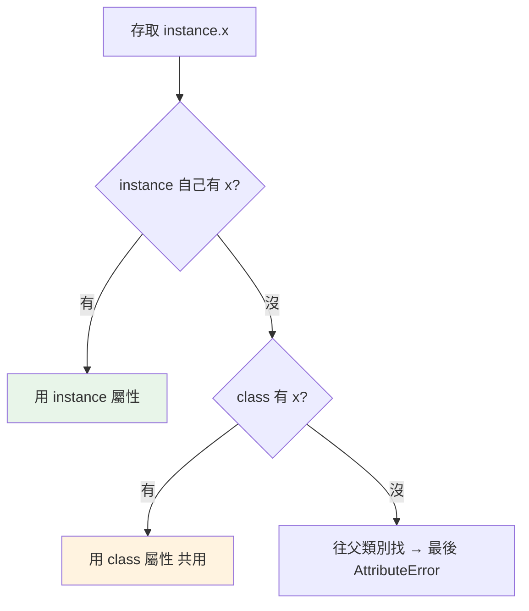

# class 與 instance

> class 是「建立物件的藍圖」，但在 Python 裡 class 本身也是物件。搞懂 `self`、`__init__` 何時被呼叫、以及「class 屬性 vs instance 屬性」的差別，是物件導向的第一步。

## 💡 白話導讀（建議先讀）

想像一個雞蛋糕模具。

模具本身不能吃——它只是決定「做出來的雞蛋糕長什麼樣」。
真正能吃的，是用模具做出來的一顆顆雞蛋糕。

class 就是模具，instance（實例）就是雞蛋糕：

- 同一個模具可以做出很多顆，每顆都獨立——你咬一口手上這顆，別顆不會缺角。
- `__init__` 是「出爐前的填餡步驟」：每做一顆都執行一次，把這一顆的內餡（屬性）填進去。
- `self` 的意思就是「**這一顆**」。方法要運作，得先知道你在說哪一顆雞蛋糕——Python 會自動把「這一顆」塞進方法的第一個參數，那個參數習慣上取名 self。

還有一個容易混淆的地方，先分清楚：

- 貼在**模具上**的公告（class 屬性）：所有雞蛋糕**共用一份**。
- 每顆蛋糕**自己的內餡**（instance 屬性）：各顆各自獨立。

把「該共用的」誤放到每顆蛋糕上、或把「該個別的」誤貼到模具上，是這章最常見的坑。

帶著「模具 vs 雞蛋糕」這個畫面往下讀，`self`、`__init__`、兩種屬性就都有位置放了。

## Why（為什麼）

當資料與操作它的行為需要綁在一起、或你要建立許多「同型別但各有狀態」的物件時，就需要 class。但 Python 的 OOP 有幾個新手必卡的點：`self` 到底是什麼、`__init__` 是不是建構子、為什麼 class 屬性有時會被所有實例共用出事。把這些一次講清楚，後面的繼承、property、魔術方法才有穩固地基。

## Theory（理論：class 是藍圖，instance 是產品）

先分清楚兩個角色：

- **class（類別）**：模具。定義「這種物件長什麼樣、能做什麼」——有哪些屬性、哪些方法。
- **instance（實例）**：用模具做出來的產品。每一個都是獨立個體，各自有自己的狀態。

```python
class Dog:               # 藍圖（模具）
    def __init__(self, name):
        self.name = name

d1 = Dog("Rex")          # 一個實例
d2 = Dog("Bud")          # 另一個實例，狀態獨立
```

`d1` 改了名字，`d2` 完全不受影響——就像咬一口手上的雞蛋糕，別顆不會缺角。

最後補一個 Python 的特別之處：**class 本身也是物件**。
`type(Dog)` 的答案是 `type`——模具自己也是「被做出來的東西」，可以被賦值、傳遞、當參數（呼應[一切皆物件](../10-cpython-internals/01-everything-is-object.md)）。
現在先知道有這回事就好，它是之後 [metaclass](13-metaclass.md) 的伏筆。

## Specification（規範：class 的組成）

```python
class BankAccount:
    """類別的 docstring。"""

    interest_rate = 0.02          # class 屬性（所有實例共用）

    def __init__(self, owner: str, balance: float = 0) -> None:
        self.owner = owner        # instance 屬性（每個實例獨立）
        self.balance = balance

    def deposit(self, amount: float) -> None:   # 實例方法，第一參數為 self
        self.balance += amount

    def __repr__(self) -> str:    # 魔術方法，控制 repr() 顯示
        return f"BankAccount({self.owner!r}, {self.balance})"


acc = BankAccount("Alice", 100)   # 建立實例 → 自動呼叫 __init__
acc.deposit(50)                   # 呼叫方法（self 自動傳入）
```

## Implementation（self、__init__ vs __new__、class vs instance 屬性）

### `self`：實例自己

方法的第一個參數 `self` 是**呼叫該方法的那個實例**。Python **自動**把實例當第一個參數傳入——`acc.deposit(50)` 實際等於 `BankAccount.deposit(acc, 50)`：

```pycon
>>> acc.deposit(50)
>>> BankAccount.deposit(acc, 50)   # 完全等價
```

`self` 不是關鍵字（只是慣例名稱，但請務必沿用），它讓方法知道「要操作哪個實例的資料」。

### `__init__` 是初始化器，不是建構子

新手常把 `__init__` 叫「建構子」，其實不精確。物件的建立分兩步（見 [__new__](12-new-and-init.md)）：

1. `__new__` **建立**空的物件（真正的建構）。
2. `__init__` **初始化**這個已建立的物件（設定屬性）。

`__init__` 收到的 `self` 是**已經建好**的物件，它的工作是「填資料」，且**不能回傳值**（回傳非 None 會 TypeError）。日常你只需寫 `__init__`；`__new__` 是進階需求。

### class 屬性 vs instance 屬性（重要陷阱）

- **class 屬性**：定義在 class 主體、所有實例**共用同一份**。
- **instance 屬性**：在 `__init__` 裡 `self.x = ...` 設定、**每個實例獨立**。

查找順序：存取 `instance.x` 時，先找 instance 自己的屬性，找不到才找 class 屬性。

**陷阱：可變的 class 屬性被所有實例共用**——和 [可變預設參數](../02-fundamentals/09-parameters-args-kwargs.md) 是同一類問題：

```python
class Team:
    members = []              # ❌ class 屬性！所有 Team 共用同一個 list
    def __init__(self, name):
        self.name = name

a = Team("A")
b = Team("B")
a.members.append("Alice")    # 透過 a 改了「共用的」list
print(b.members)             # ['Alice'] ← b 也看到了！
```

正解：可變的、每個實例該獨立的狀態，放進 `__init__`：

```python
class Team:
    def __init__(self, name):
        self.name = name
        self.members = []    # ✅ instance 屬性，各自獨立
```

class 屬性適合放「所有實例共享的常數/設定」（如 `interest_rate`）；每實例獨立的狀態一律放 `__init__`。

### 賦值會「遮蔽」class 屬性

```pycon
>>> class C:
...     x = 10               # class 屬性
>>> a = C(); b = C()
>>> a.x = 99                 # 在 a 上「新建」instance 屬性，遮蔽 class 屬性
>>> a.x, b.x, C.x
(99, 10, 10)                 # b 和 C 不受影響
```

對不可變的 class 屬性賦值（`a.x = 99`）只是在該實例上建立同名 instance 屬性，不影響其他實例——所以不可變 class 屬性不像可變的那樣「共用出事」。

## Code Example（可執行的 Python 範例）

```python
# class_demo.py
class Counter:
    """展示 class 屬性 vs instance 屬性。"""

    total_created = 0            # class 屬性：統計建了幾個（共用）

    def __init__(self, name: str) -> None:
        self.name = name         # instance 屬性
        self.count = 0           # instance 屬性（各自獨立）
        Counter.total_created += 1

    def increment(self) -> int:
        self.count += 1
        return self.count

    def __repr__(self) -> str:
        return f"Counter({self.name!r}, count={self.count})"


def demo() -> None:
    a = Counter("A")
    b = Counter("B")

    a.increment()
    a.increment()
    b.increment()

    print(a)                      # Counter('A', count=2)
    print(b)                      # Counter('B', count=1)（獨立）
    print(f"共建立: {Counter.total_created} 個")   # 2（共用的 class 屬性）

    # 方法呼叫的等價寫法
    print(f"等價呼叫: {Counter.increment(a)}")     # 3


if __name__ == "__main__":
    demo()
```

**預期輸出**：

```pycon
$ python class_demo.py
Counter('A', count=2)
Counter('B', count=1)
共建立: 2 個
等價呼叫: 3
```

## Diagram（圖解：class 屬性 vs instance 屬性查找）



## Best Practice（最佳實踐）

- **每實例獨立的狀態放 `__init__`（instance 屬性）**；**共享常數/設定放 class 屬性**。
- **絕不用可變物件當 class 屬性存每實例狀態**（`members = []`）——會被所有實例共用，和可變預設參數同類陷阱。
- **一律寫 `self` 當第一參數**（雖非關鍵字，但是鐵律慣例）。
- **實作 `__repr__`**：讓物件在除錯/log 時有意義的顯示（見 [魔術方法](08-dunder-methods.md)）。
- **加型別註記與 docstring**：`def __init__(self, ...) -> None:`。
- **簡單的「只裝資料」類別考慮 `@dataclass`**（見 [dataclass](09-dataclass.md)），省去手寫 `__init__`/`__repr__`。

## Common Mistakes（常見誤解）

- **可變 class 屬性被共用**：`members = []` 放 class 層級，所有實例共用同一 list；改放 `__init__`。
- **忘了寫 `self`**：`def deposit(amount):` 呼叫時會參數錯位（第一個位置引數變成 self）。
- **把 `__init__` 當建構子並嘗試 `return self`**：`__init__` 不能回傳非 None；真正的建構是 `__new__`。
- **在 `__init__` 外、方法裡才第一次 `self.x = ...`**：屬性到那時才存在，之前存取會 AttributeError；重要屬性應在 `__init__` 建好。
- **用 `ClassName.attr` 改 class 屬性卻預期只影響一個實例**：那會影響全部；改單一實例用 `instance.attr = ...`。
- **混淆 `instance.x = v` 與 class 屬性**：前者在實例上建/遮蔽屬性，不影響 class 與其他實例。

## Interview Notes（面試重點）

- 說得出 **class（藍圖）vs instance（實例）**，以及 **class 本身也是物件**（`type(C) is type`）。
- 解釋 **`self`**：呼叫方法的實例，Python 自動傳入；`obj.m(x)` == `Cls.m(obj, x)`。
- 知道 **`__init__` 是初始化器不是建構子**，真正建立物件的是 `__new__`；`__init__` 不能回傳值。
- **class 屬性 vs instance 屬性是高頻考題**：查找順序（instance→class）、共用陷阱（可變 class 屬性）、賦值遮蔽。
- 知道每實例狀態放 `__init__`、共享常數放 class 層級的原則。

---

➡️ 下一章：[屬性與方法](02-attributes-and-methods.md)

[⬆️ 回 Part 4 索引](README.md)
