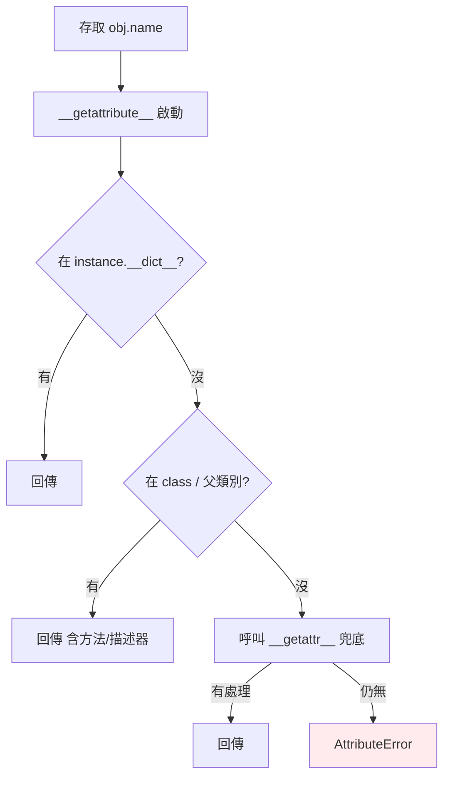

# 屬性與方法

> Python 的屬性存取背後是一套動態機制：`__dict__` 存屬性、`__getattr__` 攔截缺失、方法其實是「綁定了實例的函式」。理解它，你就能解釋動態加屬性、方法為何自帶 self。

## 💡 白話導讀（建議先讀）

每個 Python 物件，可以想成「一個背包 + 一本說明書」。

- **背包**裝這個物件自己的東西——它的屬性。背包其實是一個字典，名字叫 `__dict__`。
- **說明書**是它的類別——寫著這種物件會做的動作（方法）。

所以 `p.x` 這個動作，白話是：「打開 p 的背包，找一個叫 x 的東西」。
`p.x = 1` 則是：「往背包裡放一個叫 x 的東西」。

因為背包就是個字典，Python 可以**隨時往背包加東西、拿東西**——程式跑到一半幫物件多塞一個屬性，完全合法。這是 Python 靈活（也比較「鬆」）的原因。

這章第二個重點：**方法為什麼自帶 self？**

你寫 `d.speak()` 時，Python 偷偷幫你做了一件事：把 `d` 這個物件本人，塞進 `speak` 的第一個參數。
這個「把物件綁進函式」的動作叫**綁定（bound）**——所謂方法，就是「綁定了實例的函式」。

最後，如果背包裡找不到呢？Python 還有一位可以出面的「管家」（`__getattr__`）——找不到時攔截下來，由你決定怎麼回應。

帶著「背包、說明書、自動綁定」三個畫面往下讀。

## Why（為什麼）

「物件的屬性存在哪？」「為什麼能在執行期動態加屬性？」「方法和函式差在哪？」——這些問題的答案都指向 Python 屬性系統的底層：`__dict__`。理解它能讓你看懂動態屬性、`__slots__` 優化（見 [Part 18](../18-performance/06-memory-optimization.md)）、以及 `__getattr__` 這類攔截機制的用途。這也是通往 [property](06-property.md) 與 [描述器](11-descriptors.md) 的基礎。

## Theory（理論：屬性存在 __dict__ 裡）

大多數 Python 物件的屬性，存在一個叫 **`__dict__`** 的字典裡——就是導讀說的那個「背包」（呼應 [dict 是 Python 核心](../03-data-structures/04-dict.md)）：

```pycon
>>> class Point:
...     def __init__(self, x, y):
...         self.x = x
...         self.y = y
>>> p = Point(1, 2)
>>> p.__dict__
{'x': 1, 'y': 2}          # instance 屬性就是這個 dict 的鍵值
```

換句話說，`self.x = 1` 的本質就是 `self.__dict__['x'] = 1`——寫屬性，就是在寫這個字典。

因為屬性放在字典裡、而字典可以隨時增刪，所以 Python 能**在執行期任意加減屬性**。
這是 Python 靈活性的來源，也是它比靜態語言「鬆」的地方——好處是自由；代價是打錯屬性名不會有人擋你（`p.xx = 1` 只是默默塞進一個新鍵）。

## Specification（規範：屬性存取與方法類型）

```python
# 屬性操作
p.x                 # 讀
p.x = 10            # 寫（存進 __dict__）
del p.x             # 刪
hasattr(p, "x")     # 是否有此屬性
getattr(p, "x", default)   # 取屬性，可給預設
setattr(p, "x", 10)        # 動態設定
```

方法分三類（後兩者見 [classmethod 與 staticmethod](07-classmethod-staticmethod.md)）：

| 類型 | 第一參數 | 裝飾器 | 存取 |
|------|----------|--------|------|
| 實例方法 | `self` | 無 | 實例狀態 |
| 類別方法 | `cls` | `@classmethod` | 類別狀態 |
| 靜態方法 | 無 | `@staticmethod` | 都不存取 |

## Implementation（綁定方法、動態屬性、getattr 系列）

### 方法是「綁定了實例的函式」

class 主體裡的方法其實存在 **class 的 `__dict__`**（不是 instance 的）。當你透過實例存取方法時，Python 產生一個**綁定方法（bound method）**——把實例「綁」進去當 self：

```pycon
>>> class Dog:
...     def bark(self): return f"{self.name} says woof"
...     def __init__(self, name): self.name = name
>>> d = Dog("Rex")
>>> Dog.bark                 # 存在 class，是普通函式
<function Dog.bark at 0x...>
>>> d.bark                   # 透過實例存取 → 綁定方法
<bound method Dog.bark of <Dog object at 0x...>>
>>> d.bark()                 # 呼叫時 self 已自動綁為 d
'Rex says woof'
>>> bound = d.bark           # 可以像值一樣存起來
>>> bound()                  # 仍記得 self=d（因為是綁定方法）
'Rex says woof'
```

這解釋了「方法自帶 self」——存取 `d.bark` 時，描述器機制（見 [描述器](11-descriptors.md)）把 `d` 綁進去。方法也是一等公民，可存進變數、當回呼傳遞。

### 動態增刪屬性

```pycon
>>> p = Point(1, 2)
>>> p.color = "red"          # 執行期動態新增屬性
>>> p.__dict__
{'x': 1, 'y': 2, 'color': 'red'}
>>> del p.color              # 刪除
```

這很靈活，但也意味著**打錯屬性名不會報錯，只是默默新增**（`p.collor = "red"` 建了個新屬性）——這是動態語言的雙面刃，靠型別檢查（mypy）與 `__slots__` 可緩解。

### `__getattr__` / `__getattribute__`：攔截屬性存取

- **`__getattr__(self, name)`**：只在**正常查找失敗**時才被呼叫，用來「兜底」缺失的屬性。
- **`__getattribute__(self, name)`**：**每次**屬性存取都會經過它（很少覆寫，容易出錯）。

```python
class Config:
    def __init__(self, data: dict) -> None:
        self._data = data

    def __getattr__(self, name: str) -> object:
        # 只有正常找不到 name 時才進來
        try:
            return self._data[name]
        except KeyError:
            raise AttributeError(name) from None

cfg = Config({"host": "localhost"})
cfg.host        # 'localhost'（經 __getattr__ 從 _data 取）
```

`__getattr__` 常用來做「代理」「延遲載入」「把 dict 包成物件屬性」。注意在 `__getattr__` 裡存取自己的屬性要小心，避免無限遞迴（用 `self._data` 前 `_data` 需已存在）。

## Code Example（可執行的 Python 範例）

```python
# attributes_demo.py
class DictObject:
    """把 dict 包裝成可用屬性存取的物件（示範 __getattr__）。"""

    def __init__(self, data: dict[str, object]) -> None:
        self._data = data

    def __getattr__(self, name: str) -> object:
        try:
            return self._data[name]
        except KeyError:
            raise AttributeError(f"沒有屬性 {name!r}") from None


class Robot:
    def __init__(self, name: str) -> None:
        self.name = name

    def greet(self) -> str:
        return f"我是 {self.name}"


def demo() -> None:
    # 1. __dict__ 就是屬性
    r = Robot("R2D2")
    print(f"__dict__: {r.__dict__}")          # {'name': 'R2D2'}

    # 2. 綁定方法可當值傳遞
    action = r.greet                          # 綁定方法（記得 self=r）
    print(action())                           # 我是 R2D2

    # 3. 動態屬性
    r.color = "blue"
    print(f"動態新增後: {r.__dict__}")

    # 4. getattr 安全取值
    print(f"getattr 預設: {getattr(r, 'weight', '未知')}")   # 未知

    # 5. __getattr__ 攔截
    cfg = DictObject({"host": "localhost", "port": 8080})
    print(f"cfg.host = {cfg.host}, cfg.port = {cfg.port}")


if __name__ == "__main__":
    demo()
```

**預期輸出**：

```pycon
$ python attributes_demo.py
__dict__: {'name': 'R2D2'}
我是 R2D2
動態新增後: {'name': 'R2D2', 'color': 'blue'}
getattr 預設: 未知
cfg.host = localhost, cfg.port = 8080
```

## Diagram（圖解：屬性查找）



## Best Practice（最佳實踐）

- **重要屬性在 `__init__` 一次建好**：避免「有時有、有時沒有」的屬性造成 AttributeError。
- **用 `getattr(obj, name, default)` 安全取可能不存在的屬性**，別靠 try/except AttributeError 到處包。
- **需要控制讀寫（驗證、計算）用 `@property`**（見 [property](06-property.md)），而不是把邏輯塞進 `__getattr__`。
- **`__getattr__` 用於代理/延遲/包裝**，並小心遞迴；只在真的需要動態屬性時用。
- **方法是一等公民**：可把 `obj.method` 當回呼傳遞（是綁定方法，記得 self）。
- **需要固定屬性集合、省記憶體、防打錯 → 用 `__slots__`**（見 [Part 18](../18-performance/06-memory-optimization.md)）。

## Common Mistakes（常見誤解）

- **打錯屬性名默默新增**：`self.collor = x` 不報錯，建了新屬性；靠 mypy / `__slots__` 防範。
- **混淆 `__getattr__` 與 `__getattribute__`**：前者只在查找失敗時觸發、後者每次都觸發（且易造成遞迴/效能問題）。
- **`__getattr__` 裡不小心無限遞迴**：存取尚未設定的屬性又觸發 `__getattr__`；先確保底層屬性（如 `_data`）已存在。
- **以為方法存在 instance**：方法存在 class 的 `__dict__`，透過實例存取才綁定成 bound method。
- **把 `obj.method` 加括號傳給回呼**：`callback(obj.method)` 正確（傳綁定方法），`callback(obj.method())` 是傳呼叫結果。
- **依賴動態加屬性做核心資料**：可讀性差、易錯；結構固定的資料用明確欄位或 dataclass。

## Interview Notes（面試重點）

- 說得出**屬性存在 `__dict__`**，`self.x = v` 即 `self.__dict__['x'] = v`，因此能動態增刪屬性。
- 解釋**方法是綁定方法（bound method）**：存在 class、透過實例存取時把 self 綁入；`obj.m` 可當值傳遞。
- 知道**屬性查找順序**：instance `__dict__` → class/父類別（含方法、描述器）→ `__getattr__` 兜底 → AttributeError。
- 能區分 **`__getattr__`（查找失敗才呼叫）vs `__getattribute__`（每次呼叫）**，及各自用途與風險。
- 知道 `getattr`/`setattr`/`hasattr`/`delattr` 的用法，以及動態屬性的雙面刃（打錯不報錯）。

---

➡️ 下一章：[繼承](03-inheritance.md)

[⬆️ 回 Part 4 索引](README.md)
