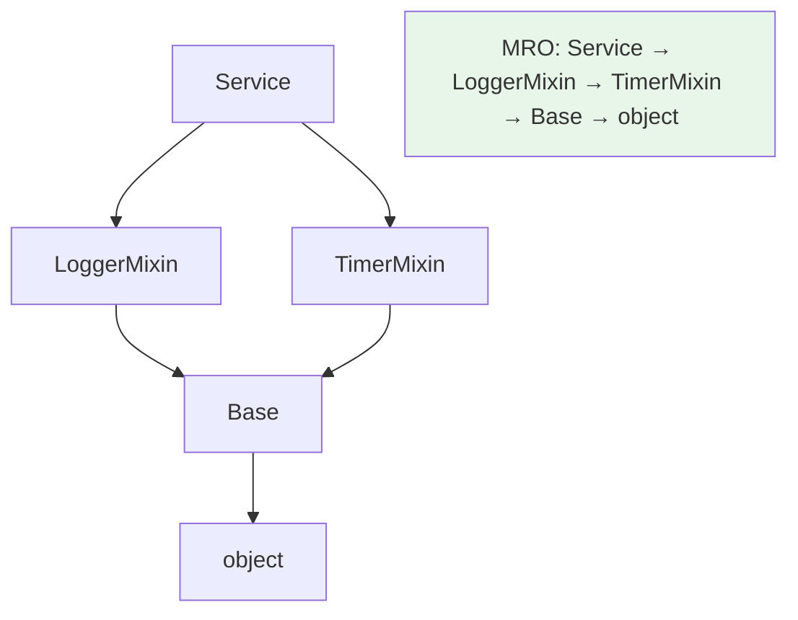

# MRO 與多重繼承

> 多重繼承下「方法到底用哪個父類別的」由 MRO 決定——Python 用 C3 線性化算出一個確定順序，而 `super()` 沿著這個順序走，不是往「字面父類別」走。這是菱形繼承問題的解法。

## Why（為什麼）

Python 支援**多重繼承**（一個類別可有多個父類別），威力強大（mixin 就靠它），但也帶來「菱形繼承」的經典難題：`D` 繼承 `B` 和 `C`，而 `B`、`C` 都繼承 `A`——那 `D` 呼叫某方法時，該走哪條路？父類別的 `__init__` 會不會被呼叫兩次？Python 用 **MRO（Method Resolution Order，方法解析順序）** 給出確定答案。搞懂它，你才能安全使用多重繼承與 mixin，也能答出 `super()` 在多重繼承下的真正行為。

## Theory（理論：MRO 與 C3 線性化）

**MRO 是「查找方法時，類別被搜尋的線性順序」**。Python 3 用 **C3 線性化演算法**計算出這個順序，保證：

1. **子類別排在父類別前面**。
2. **父類別的相對順序被保留**（若 `class D(B, C)`，則 B 在 C 前）。
3. 每個類別在 MRO 中**只出現一次**（解決菱形的重複問題）。

存取 `d.method()` 時，Python 沿 MRO 從左到右找第一個有 `method` 的類別。`super()` 則呼叫「MRO 中當前類別的**下一個**」——這是關鍵：**`super()` 走的是 MRO，不是繼承樹的字面父類別**。

## Specification（規範：查看 MRO）

```python
Cls.__mro__            # tuple 形式的 MRO
Cls.mro()              # list 形式
help(Cls)              # 也會顯示 MRO
```

```pycon
>>> class A: pass
>>> class B(A): pass
>>> class C(A): pass
>>> class D(B, C): pass
>>> [c.__name__ for c in D.__mro__]
['D', 'B', 'C', 'A', 'object']
```

D 的 MRO 是 `D → B → C → A → object`——注意 A（共同祖先）排在 B、C **之後**且只出現一次。

## Implementation（菱形繼承與協作式 super）

### 菱形繼承問題

```text
      A
     / \
    B   C
     \ /
      D
```

問題：`D()` 建立時，若 B、C 的 `__init__` 都呼叫 `super().__init__()`，A 的 `__init__` 會被呼叫幾次？在錯誤的寫法下可能被呼叫兩次或漏掉。C3 + `super()` 讓它**剛好一次**。

### 協作式多重繼承（cooperative super）

正確的多重繼承要求每個類別都用 `super()` 並「配合」MRO：

```python
class A:
    def __init__(self) -> None:
        print("A.__init__")

class B(A):
    def __init__(self) -> None:
        print("B.__init__")
        super().__init__()          # 走 MRO 下一個，不一定是 A！

class C(A):
    def __init__(self) -> None:
        print("C.__init__")
        super().__init__()

class D(B, C):
    def __init__(self) -> None:
        print("D.__init__")
        super().__init__()

D()
```

輸出：

```text
D.__init__
B.__init__
C.__init__          ← B 的 super() 走到了 C（MRO 下一個），不是 A！
A.__init__          ← A 只被呼叫一次
```

**關鍵洞察**：B 的 `super().__init__()` 呼叫的是 **C**（MRO 中 B 的下一個），而不是 B 字面上的父類別 A。正是這個機制讓 A 只執行一次。這也是為什麼「每個類別都要用 `super()`」——只要有一個類別直接寫死 `A.__init__(self)`，鏈就斷了。

### `super()` 不是「父類別」

再次強調這個高頻誤解：

```pycon
>>> D.__mro__
(D, B, C, A, object)
>>> # 在 B.__init__ 裡的 super() → 指向 C（MRO 中 B 之後），不是 A
```

`super()` 的真正意義是「**MRO 中我的下一位**」，依賴的是「當前實例的類別的 MRO」與「當前所在的類別位置」，動態決定。

### 何時會 MRO 衝突

若繼承順序無法滿足 C3 的約束（例如順序矛盾），Python 會在**定義 class 時**直接報 `TypeError: Cannot create a consistent method resolution order`：

```python
class X(A, B): ...
class Y(B, A): ...
# class Z(X, Y): ...   # ❌ X 要求 A 在 B 前、Y 要求 B 在 A 前 → 矛盾 → TypeError
```

## Code Example（可執行的 Python 範例）

```python
# mro_demo.py
class Base:
    def __init__(self) -> None:
        self.log: list[str] = []
        self.log.append("Base")


class LoggerMixin(Base):
    def __init__(self) -> None:
        super().__init__()
        self.log.append("Logger")


class TimerMixin(Base):
    def __init__(self) -> None:
        super().__init__()
        self.log.append("Timer")


class Service(LoggerMixin, TimerMixin):
    def __init__(self) -> None:
        super().__init__()
        self.log.append("Service")


def demo() -> None:
    print("MRO:", [c.__name__ for c in Service.__mro__])

    s = Service()
    # 因協作式 super，Base 只執行一次，順序符合 MRO 反向建構
    print("初始化順序:", s.log)


if __name__ == "__main__":
    demo()
```

**預期輸出**：

```pycon
$ python mro_demo.py
MRO: ['Service', 'LoggerMixin', 'TimerMixin', 'Base', 'object']
初始化順序: ['Base', 'Logger', 'Timer', 'Service']
```

解說：MRO 是 `Service→LoggerMixin→TimerMixin→Base→object`。呼叫 `Service()` 時，`super()` 鏈一路走到 Base（先執行、append "Base"），再回溯 Timer、Logger、Service——`Base` 只執行一次，證明 C3 + 協作式 super 解決了菱形問題。

## Diagram（圖解：菱形繼承的 MRO）



## Best Practice（最佳實踐）

- **多重繼承時，每個類別的 `__init__`（及協作方法）都用 `super()`**，不要寫死 `ParentName.method(self)`——否則 MRO 鏈會斷。
- **設計協作式方法時，簽章要相容**：多重繼承鏈上的同名方法應能接受一致的參數（常用 `*args, **kwargs` 轉發）。
- **用 mixin 提供「附加能力」**：mixin 放在繼承列表前面（見 [mixin](15-mixin.md)），主類別在後。
- **需要理解行為時查 `Cls.__mro__`**：不要靠猜，直接看順序。
- **保持繼承簡單**：多重繼承強大但易複雜；能用組合就用組合。
- **遇到 MRO TypeError**：檢查繼承順序是否自相矛盾，調整 base 類別的順序。

## Common Mistakes（常見誤解）

- **以為 `super()` 呼叫「字面父類別」**：它呼叫 **MRO 的下一個**，多重繼承下可能是「兄弟」類別。
- **混用 `super()` 與寫死 `Parent.__init__(self)`**：破壞協作鏈，導致某些父類別被呼叫兩次或漏掉。
- **以為菱形繼承下共同祖先會被呼叫多次**：C3 + 協作 super 保證只一次（前提是全程用 super）。
- **多重繼承 `__init__` 參數不一致**：協作鏈傳參對不上；需設計相容簽章或用 `**kwargs`。
- **繼承順序矛盾**：定義時 `TypeError: cannot create a consistent MRO`；調整順序。
- **不查 MRO 就推理行為**：多重繼承的行為難憑直覺，應查 `__mro__`。

## Interview Notes（面試重點）

- 能定義 **MRO** 並說出 Python 3 用 **C3 線性化**，保證子類別在前、父類別順序保留、每類別只出現一次。
- **「`super()` 走 MRO 而非字面父類別」是高頻考點**：能用菱形繼承例子說明 B 的 `super()` 為何走到 C。
- 能解釋**協作式多重繼承**如何讓共同祖先的 `__init__` 只執行一次，以及「全程用 super」的必要性。
- 會用 **`Cls.__mro__` / `Cls.mro()`** 查看順序。
- 知道 **MRO 衝突會在定義時 TypeError**，以及多重繼承 `__init__` 簽章相容（`**kwargs` 轉發）的實務。

---

➡️ 下一章：[封裝與命名慣例](05-encapsulation.md)

[⬆️ 回 Part 4 索引](README.md)
