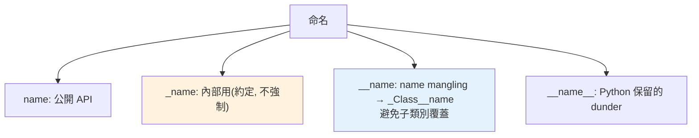

# 封裝與命名慣例

> Python 沒有 `private` 關鍵字——那要怎麼防止一個屬性被外部亂改？答案是一套「君子協定」（單底線）外加一個叫 name mangling 的小把戲（雙底線）。這章講清楚：哪個只是約定、哪個才真的擋得住，以及為什麼 Python 選擇相信你。

## 💡 白話導讀（建議先讀）

走進一家便利商店。

- **貨架上的商品**：隨便拿——這是給客人用的（public，公開屬性）。
- **「員工專用」的門**：門上貼了告示，但**沒有上鎖**。你推得開，只是你不該進去（`_name`，單底線）。
- **倉庫的門**：裝了一個「會自動改名」的特殊門牌（`__name`，雙底線）。但它的目的不是防小偷，而是防「分店裝修時不小心打通了同名的門」——避免子類別意外撞名。

這就是 Python 封裝的全部哲學：**沒有真正的鎖**。

Java 有 `private` 這種強制的鐵欄杆；Python 沒有——它選擇用「告示」溝通。
這個文化有個名字：「我們都是大人（consenting adults）」——我用底線告訴你這是內部的東西，相信你不會亂碰；真要碰，後果自負。

讀這章記住兩句話就夠：

- 單底線 `_name` 是**禮貌提示**：請勿依賴。純約定、零強制。
- 雙底線 `__name` 是**改名機制**（name mangling）：有實際作用但仍可繞過，防的是「撞名」，不是「偷看」。

## Why（為什麼）

從 Java/C++ 來的人會找 `private`、`protected` 關鍵字，卻發現 Python 沒有。Python 的封裝哲學不同：「**我們都是成年人（we're all consenting adults）**」——用命名約定表達意圖，而非用語言強制阻擋。理解單底線、雙底線各代表什麼、name mangling 實際做了什麼，你才能寫出符合社群慣例的類別，也不會誤以為 `__x` 是「真正的 private」。

## Theory（理論：約定 vs 強制）

Python 的封裝靠**命名約定**傳達「這東西是不是給外部用的」，但大多**不強制**——就是導讀說的「告示，不是鎖」：

| 命名 | 意義 | 強制程度 |
|------|------|----------|
| `name` | 公開（public），API 的一部分 | 無限制 |
| `_name` | 「內部用」，請勿依賴（protected 慣例） | **純約定**，不強制 |
| `__name` | 觸發 name mangling（避免子類別意外覆蓋） | 有機制，但非真 private |
| `__name__` | 特殊方法/屬性（dunder），Python 保留 | 保留給語言用 |

一句話總結核心精神：

> **單底線是「請不要碰」的禮貌提示，雙底線是「避免命名衝突」的機制**——兩者都不是 Java 那種強制存取控制。

## Specification（規範：三種命名）

```python
class Account:
    def __init__(self, balance: float) -> None:
        self.owner = "public"       # 公開
        self._balance = balance     # 內部用（約定）
        self.__secret = "hidden"    # name mangling

    def _internal_helper(self) -> None:   # 內部方法（約定）
        ...
```

## Implementation（單底線、雙底線 mangling、property）

### 單底線 `_name`：純約定

`_balance` 只是告訴使用者「這是內部實作，別直接碰」。但**技術上完全能存取**：

```pycon
>>> acc = Account(100)
>>> acc._balance          # 能存取，只是「你不該這麼做」
100
```

它也影響 `from module import *`（單底線名稱預設不被 `*` 匯入）。這是最常用的「protected」表達方式。

### 雙底線 `__name`：name mangling（名稱改編）

以雙底線開頭（且結尾**最多一個**底線）的屬性，會觸發 **name mangling**：Python 在編譯時把 `__name` 改寫成 `_ClassName__name`：

```pycon
>>> acc = Account(100)
>>> acc.__secret
AttributeError: 'Account' object has no attribute '__secret'
>>> acc._Account__secret     # 實際存在這個「改編後」的名字
'hidden'
>>> acc.__dict__
{'owner': 'public', '_balance': 100, '_Account__secret': 'hidden'}
```

**這不是為了「保密」，而是為了避免子類別意外覆蓋父類別的屬性**。因為改編帶了類別名，子類別的 `__secret` 會變成 `_Sub__secret`，不會撞到父類別的 `_Base__secret`：

```python
class Base:
    def __init__(self):
        self.__id = "base"       # → _Base__id

class Sub(Base):
    def __init__(self):
        super().__init__()
        self.__id = "sub"        # → _Sub__id（不會蓋掉 _Base__id）
```

所以雙底線的正確用途是「**在會被繼承的類別裡，保護不想被子類別意外覆蓋的屬性**」，不是拿來當 private。

### `__dunder__`：留給 Python

前後都雙底線的名稱（`__init__`、`__repr__`…）是 Python 保留的特殊方法，**不會被 mangling**。別自己發明 `__myname__`，避免與未來語言功能衝突。

### 控制存取用 property，不是靠隱藏

真正要「控制讀寫、加驗證」時，Python 的做法是 **`@property`**（見 [property](06-property.md)）——公開一個屬性介面，但底層用方法攔截：

```python
class Account:
    def __init__(self, balance: float) -> None:
        self._balance = balance

    @property
    def balance(self) -> float:
        return self._balance

    @balance.setter
    def balance(self, value: float) -> None:
        if value < 0:
            raise ValueError("餘額不能為負")
        self._balance = value
```

使用者寫 `acc.balance = 100`（像存取屬性），但實際觸發驗證。這才是 Python 式的封裝：**用約定表達意圖、用 property 控制存取**，而非靠語言強制隱藏。

## Code Example（可執行的 Python 範例）

```python
# encapsulation_demo.py
class Temperature:
    def __init__(self, celsius: float) -> None:
        self._celsius = celsius        # 內部用（約定）

    @property
    def celsius(self) -> float:
        return self._celsius

    @celsius.setter
    def celsius(self, value: float) -> None:
        if value < -273.15:
            raise ValueError("低於絕對零度")
        self._celsius = value

    @property
    def fahrenheit(self) -> float:      # 唯讀的計算屬性
        return self._celsius * 9 / 5 + 32


class Base:
    def __init__(self) -> None:
        self.__token = "base-token"     # name mangling → _Base__token

    def base_token(self) -> str:
        return self.__token


class Sub(Base):
    def __init__(self) -> None:
        super().__init__()
        self.__token = "sub-token"      # → _Sub__token，不會蓋掉父類別的


def demo() -> None:
    t = Temperature(25)
    print(f"攝氏 {t.celsius}, 華氏 {t.fahrenheit}")   # 25, 77.0
    t.celsius = 30                                    # 觸發 setter 驗證
    print(f"更新後華氏: {t.fahrenheit}")               # 86.0

    s = Sub()
    # name mangling 讓父子的 __token 不衝突
    print(f"父的 token: {s.base_token()}")            # base-token
    print(f"改編後的名字: {[k for k in s.__dict__]}")  # ['_Base__token', '_Sub__token']


if __name__ == "__main__":
    demo()
```

**預期輸出**：

```pycon
$ python encapsulation_demo.py
攝氏 25, 華氏 77.0
更新後華氏: 86.0
父的 token: base-token
改編後的名字: ['_Base__token', '_Sub__token']
```

## Diagram（圖解：三種命名的意圖）



## Best Practice（最佳實踐）

- **公開 API 用一般命名；內部實作用單底線 `_name`** 表達「請勿依賴」。
- **需要控制讀寫/驗證/計算 → 用 `@property`**，別靠隱藏屬性（見 [property](06-property.md)）。
- **雙底線 `__name` 只在「會被繼承、且不想被子類別意外覆蓋」時用**，不是拿來當 private。
- **絕不自創 `__dunder__` 名稱**：留給 Python。
- **尊重單底線約定**：別去碰別人的 `_internal`，即使技術上做得到。
- **公開屬性直接用 public**：不需要無腦替每個屬性寫 getter/setter（那是 Java 習慣，Python 用 property 只在需要時）。

## Common Mistakes（常見誤解）

- **以為 `__name` 是真 private**：它只是 name mangling，`_Class__name` 照樣能存取；不是安全機制。
- **用 `__name` 想「藏資料」**：目的錯了，它是為了避免繼承時的命名衝突。
- **無腦給每個屬性寫 getter/setter**：非 Python 風格；公開屬性直接用 public，需要控制時才上 property。
- **碰別人的 `_internal` 屬性/方法**：技術可行但違反約定，未來對方改動會害到你。
- **自創 `__foo__` dunder 名稱**：可能與 Python 未來功能衝突。
- **雙底線結尾也雙底線**：`__x__` 不會 mangling（被當 dunder）；mangling 只作用於「雙底線開頭、至多一個底線結尾」。

## Interview Notes（面試重點）

- 說得出 Python 的封裝是**「約定優於強制」**（we're all consenting adults），沒有真正的 private/protected 關鍵字。
- 清楚三種命名：`_name`（內部用，純約定、影響 `import *`）、`__name`（**name mangling → `_Class__name`**）、`__dunder__`（保留）。
- **「`__name` 的真正目的是避免子類別覆蓋，不是保密」是高頻考點**：能解釋改編機制與繼承場景。
- 知道**控制存取用 `@property`** 而非隱藏，且不需無腦寫 getter/setter。
- 知道 name mangling 只作用於「雙底線開頭、至多一底線結尾」的名稱。

---

➡️ 下一章：[property 與描述器入門](06-property.md)

[⬆️ 回 Part 4 索引](README.md)
