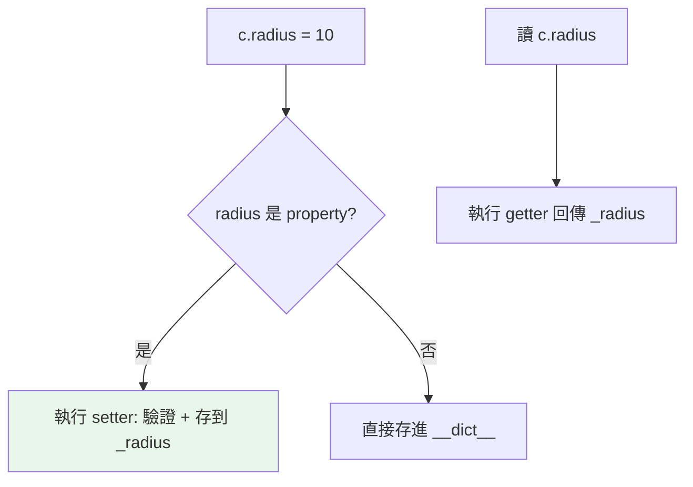

# property 與描述器入門

> 怎麼讓 `account.balance` 用起來像個普通欄位，底層卻能擋掉「被設成負數」這種非法值？`@property` 讓方法偽裝成屬性。這章講 Python 封裝的正解——也是你第一次不知不覺用到「描述器」。

## 💡 白話導讀（建議先讀）

看一眼汽車的油表。

對你來說，「看油量」就是瞄一眼指針——像讀一個簡單的數字。
但油表背後其實有感測器在即時計算。**外表是屬性，內部是方法**。

`@property` 做的就是這件事：讓一個方法**偽裝成屬性**。

為什麼需要偽裝？看一個常見劇情：

1. 一開始 `user.age` 是普通屬性，大家直接讀、直接改，很方便。
2. 半年後需求來了：「age 不可以是負數」。
3. 慘了——如果改成 `user.set_age(x)`，全專案用到這個欄位的程式都要跟著改。

`@property` 的解法：把 `age` 升級成 property，**加上驗證邏輯，但用法完全不變**——大家照樣寫 `user.age = 30`，只是賦值的瞬間會自動跑你的檢查。

這就是 Python 的答案：**不必像 Java 一開始就寫 getter/setter 防未來**。
先用最簡單的公開屬性；等真的需要控制，再無痛升級成 property。

另外記住一個好用的特例：**只定義「讀」、不定義「寫」，就是唯讀屬性**——別人一賦值就報錯。

## 🔗 前端對照

`@property` 對應 JavaScript class 的 **getter / setter**——都是「用起來像屬性,底層卻是方法」:

| | Python | JavaScript |
|---|--------|-----------|
| 讀取器 | `@property` | `get x() {}` |
| 設定器 | `@x.setter` | `set x(v) {}` |
| 呼叫端 | `obj.x`（不加括號） | `obj.x`（不加括號） |

一句話:**用途和外觀幾乎一樣**——外部把它當普通屬性存取,內部其實跑一段邏輯（驗證、計算、唯讀）。
只是語法不同（Python 用 decorator、JS 用 `get` / `set` 關鍵字）,心智模型一致。

## Why（為什麼）

需求：一開始 `account.balance` 是普通屬性，後來想「設定時檢查不能為負」。在 Java 你得一開始就寫 `getBalance()`/`setBalance()`；在 Python，你可以**先用公開屬性、之後需要時無痛升級成 property**——外部程式碼完全不用改（還是寫 `account.balance`）。這就是 `@property` 的威力：把方法包裝成屬性介面。它也是理解描述器（descriptor）的入門。

## Theory（理論：把方法偽裝成屬性）

`@property` 讓你定義「存取時看起來像屬性、實際上執行方法」的東西。

它解決的問題就是導讀的劇情：**你不需要為了「未來可能要加邏輯」而預先把所有欄位寫成 getter/setter**。
先用公開屬性；哪天需要驗證或計算，再改成 property——**介面不變，用的人無感**。

property 有三個部分，對應「讀、寫、刪」三種動作：

- **getter**：讀取時執行（`@property`）。
- **setter**：賦值時執行（`@x.setter`），最常拿來加驗證。
- **deleter**：刪除時執行（`@x.deleter`，很少用）。

只定義 getter、不定義 setter，就是**唯讀屬性**——賦值會直接報錯。

## Specification（規範：property 語法）

```python
class Circle:
    def __init__(self, radius: float) -> None:
        self._radius = radius          # 底層真正存資料的地方

    @property
    def radius(self) -> float:         # getter
        return self._radius

    @radius.setter
    def radius(self, value: float) -> None:   # setter（加驗證）
        if value <= 0:
            raise ValueError("半徑必須為正")
        self._radius = value

    @property
    def area(self) -> float:           # 唯讀計算屬性（只有 getter）
        return 3.14159 * self._radius ** 2
```

使用時像普通屬性：

```pycon
>>> c = Circle(5)
>>> c.radius            # 觸發 getter
5
>>> c.radius = 10       # 觸發 setter（含驗證）
>>> c.area              # 觸發計算，唯讀
314.159
>>> c.area = 100        # ❌ AttributeError: 沒有 setter → 唯讀
```

## Implementation（無痛升級、唯讀、計算屬性、property 是描述器）

### 無痛升級：從公開屬性到 property

這是 property 最實用的價值：

```python
# 第一版：公開屬性
class Account:
    def __init__(self, balance):
        self.balance = balance

# 需求變更後：升級成 property，加驗證
class Account:
    def __init__(self, balance):
        self.balance = balance         # 這行會觸發下面的 setter！

    @property
    def balance(self):
        return self._balance

    @balance.setter
    def balance(self, value):
        if value < 0:
            raise ValueError("餘額不能為負")
        self._balance = value
```

**外部程式碼 `acc.balance = 100` 完全不用改**，卻自動獲得驗證。注意 `__init__` 裡的 `self.balance = balance` 也會走 setter（所以驗證從一開始就生效）。

### 唯讀屬性與計算屬性

只定義 getter → 唯讀。常用於「由其他欄位算出來、不該直接設定」的值：

```python
class Rectangle:
    def __init__(self, w: float, h: float) -> None:
        self.width = w
        self.height = h

    @property
    def area(self) -> float:        # 每次存取都重算
        return self.width * self.height
```

`rect.area` 用起來像屬性，但總是反映當前的 width/height。若計算昂貴且值不常變，可用 `functools.cached_property` 快取（見下）。

### `cached_property`：算一次後快取

`functools.cached_property` 讓計算屬性**只算一次**，之後存取直接回快取值（存進 instance `__dict__`）：

```python
from functools import cached_property

class Dataset:
    def __init__(self, data: list[int]) -> None:
        self.data = data

    @cached_property
    def stats(self) -> dict[str, float]:
        print("計算中...")               # 只會印一次
        return {"sum": sum(self.data), "avg": sum(self.data) / len(self.data)}
```

適合「昂貴、且物件生命週期內不變」的計算。注意：若底層資料會變，快取值不會自動更新（可 `del obj.stats` 清除）。

### property 是描述器的實例

`property` 其實是一個內建的**描述器（descriptor）**——一種定義了 `__get__`/`__set__` 的物件，能攔截屬性存取（詳見 [描述器](11-descriptors.md)）。你現在只需知道：**property 就是「把描述器協定包裝好、方便使用」的工具**。理解 property，就理解了描述器的第一個應用。

## Code Example（可執行的 Python 範例）

```python
# property_demo.py
from functools import cached_property


class Temperature:
    def __init__(self, celsius: float) -> None:
        self.celsius = celsius         # 觸發 setter 驗證

    @property
    def celsius(self) -> float:
        return self._celsius

    @celsius.setter
    def celsius(self, value: float) -> None:
        if value < -273.15:
            raise ValueError("低於絕對零度")
        self._celsius = value

    @property
    def fahrenheit(self) -> float:     # 唯讀計算屬性
        return self._celsius * 9 / 5 + 32


class Report:
    def __init__(self, numbers: list[int]) -> None:
        self.numbers = numbers

    @cached_property
    def total(self) -> int:
        print("  (計算 total...)")
        return sum(self.numbers)


def demo() -> None:
    t = Temperature(25)
    print(f"攝氏 {t.celsius} = 華氏 {t.fahrenheit}")   # 25 = 77.0
    t.celsius = 100
    print(f"更新後華氏: {t.fahrenheit}")                # 212.0

    try:
        t.celsius = -300                               # 觸發驗證
    except ValueError as e:
        print(f"驗證擋下: {e}")

    try:
        t.fahrenheit = 100                             # 唯讀
    except AttributeError:
        print("fahrenheit 是唯讀的")

    # cached_property：只算一次
    r = Report([1, 2, 3])
    print(f"total = {r.total}")     # 印「計算中」
    print(f"total = {r.total}")     # 不再印，用快取


if __name__ == "__main__":
    demo()
```

**預期輸出**：

```pycon
$ python property_demo.py
攝氏 25 = 華氏 77.0
更新後華氏: 212.0
驗證擋下: 低於絕對零度
fahrenheit 是唯讀的
  (計算 total...)
total = 6
total = 6
```

## Diagram（圖解：property 攔截存取）



## Best Practice（最佳實踐）

- **先用公開屬性，需要控制時再升級成 property**：不必預先寫一堆 getter/setter（那是 Java 習慣）。
- **setter 用來驗證/正規化輸入**；唯讀計算值用「只有 getter」的 property。
- **昂貴且不變的計算用 `cached_property`**；會變的用普通 `@property`（每次重算）。
- **property 底層用 `_name` 存實際資料**，避免與 property 同名造成無限遞迴（`self.radius = x` 在 getter 裡會再觸發自己）。
- **property 邏輯要輕**：存取屬性看起來很廉價，別在 getter 裡藏昂貴或有副作用的操作（違反使用者預期）。
- **多個屬性有相同存取邏輯 → 考慮自訂描述器**（見 [描述器](11-descriptors.md)）。

## Common Mistakes（常見誤解）

- **property 裡存取自己造成無限遞迴**：getter 寫 `return self.radius`（而非 `self._radius`）→ 一直觸發自己 → RecursionError。底層要用不同名字 `_radius`。
- **忘了 setter 導致唯讀**：只寫 `@property` 沒寫 `@x.setter`，賦值時 AttributeError（有時正是你要的唯讀，但別意外）。
- **`cached_property` 用在會變的資料**：資料變了快取不更新，得手動 `del obj.attr`。
- **無腦把每個屬性都寫成 property**：多餘；沒有邏輯需求的欄位直接用公開屬性。
- **在 getter 裡放昂貴/有副作用操作**：使用者以為只是讀屬性，卻觸發慢操作或狀態改變。
- **忘了 `__init__` 裡 `self.x = v` 也走 setter**：有時導致初始化時就觸發驗證（通常是好事，但要知道）。

## Interview Notes（面試重點）

- 說得出 `@property` 的價值：**把方法偽裝成屬性**，讓「公開屬性 → 加控制」的升級**不改變外部介面**。
- 會寫 **getter / setter（驗證）/ 唯讀計算屬性**，並知道只有 getter = 唯讀。
- 知道 **property 底層要用不同名的屬性存資料**（`_x`），否則無限遞迴。
- 知道 **`functools.cached_property`** 適合昂貴且不變的計算，以及它的快取失效問題。
- 知道 **property 是內建的描述器**，是描述器協定的應用（連結 [描述器](11-descriptors.md)）。
- 知道 Python 不需要無腦寫 getter/setter（與 Java 對比）。

---

➡️ 下一章：[classmethod 與 staticmethod](07-classmethod-staticmethod.md)

[⬆️ 回 Part 4 索引](README.md)
