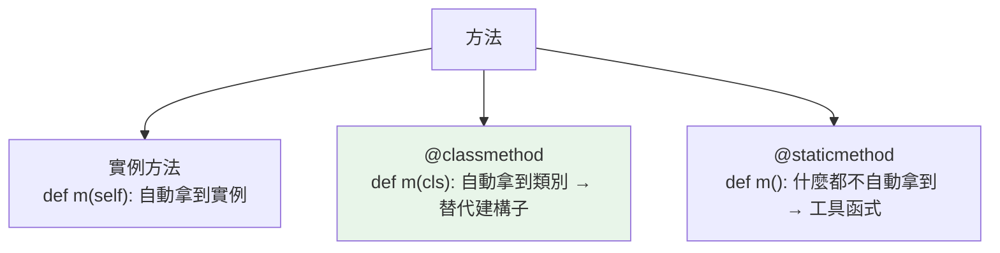

# classmethod 與 staticmethod

> 當你想寫 `User.from_json(...)` 這種「另一種建立 User 的方式」，為什麼該用 `@classmethod` 而不是塞進 `__init__`？三種方法——收 `self`、收 `cls`、什麼都不收——差在哪、各自何時用，這章講給你聽。

## 💡 白話導讀（建議先讀）

一個類別裡可以放三種方法。用「連鎖飲料品牌」來分：

1. **這一家分店的事**——查「本店」今天的營業額。
   做這件事必須知道「是哪一家店」→ 這是**實例方法**：Python 自動把「這家店」（`self`）遞給你。

2. **整個品牌的事**——照品牌標準開一家新分店。
   跟哪家店無關，但跟「品牌本身」有關 → 這是**類別方法**（`@classmethod`）：Python 自動把「品牌」（`cls`）遞給你。
   最經典的用途是**替代建構子**——`Store.from_config(...)`：「用另一種方式生出一家店」。

3. **跟誰都無關的順手工具**——計算含稅價。
   放在店裡只因為主題相關，不需要知道店或品牌 → 這是**靜態方法**（`@staticmethod`）：Python 什麼都不自動遞。

所以三者的差別就一句話：**呼叫時，Python 自動塞給你什麼？**

- 實例方法 → 塞「這個實例」（self）
- 類別方法 → 塞「這個類別」（cls）
- 靜態方法 → 什麼都不塞

帶著這個判準往下讀，表格一看就懂。

## 🎯 什麼時候會用到

- **`@classmethod` — 需要「替代建構子」時(最常見的正當用途)。** 當一個類別有多種建立方式,
  用類別方法當工廠:`datetime.fromtimestamp(...)`、`dict.fromkeys(...)` 就是這樣。
  你自己的:`User.from_json(data)`、`Config.from_file(path)`。
  關鍵好處是它回傳 `cls(...)`——**子類別繼承後,工廠會自動產生子類別的實例**,寫死類別名就沒這效果。
  ORM 的 `User.get(id)`、pydantic 的 `Model.model_validate(...)` 都是類別方法。
- **`@staticmethod` — 邏輯上「屬於這個類別、但不碰 self/cls」的小工具。** 用得其實不多;
  看到它先問自己一句:**「這是不是根本該放模組層級的普通函式?」**——很多時候是。
  它的價值主要是**歸類**(把和這個類別強相關的純函式收在一起,方便命名空間)。
- **實例方法(收 `self`)— 要讀或改實例狀態時**,也就是絕大多數情況。

一句話決策:**要 `self` → 實例方法;不要 `self` 但要 `cls`(通常是工廠)→ classmethod;
兩者都不要 → 先想想是不是該當普通函式,真要掛在類別上才用 staticmethod。**

## 🔗 前端對照

`@staticmethod` / `@classmethod` 對應 JavaScript class 的 `static`,但 Python 分得更細:

| | Python | JavaScript |
|---|--------|-----------|
| 靜態方法（不碰實例 / 類別） | `@staticmethod` | `static method() {}` |
| 綁定類別（拿得到 `cls`） | `@classmethod`（收 `cls`） | 無直接對應（`static` 裡用類別名或 `this`） |
| 呼叫 | `Foo.bar()` | `Foo.bar()` |

一句話:JS 只有一種 `static`;**Python 分兩種**——`@staticmethod`（純工具函式,不碰類別）
和 `@classmethod`（收到 `cls`,常拿來做替代建構子如 `Foo.from_json(...)`）。後者在 JS 要用 `static` + 類別名模擬。

## Why（為什麼）

不是所有「屬於類別的函式」都需要操作某個實例。有些操作是針對**整個類別**（如「用不同方式建立實例」），有些只是**邏輯上歸屬這個類別、但不需要任何 self/cls**（工具函式）。`@classmethod` 與 `@staticmethod` 讓你表達這些意圖。其中 `@classmethod` 當「替代建構子」（如 `dict.fromkeys`、`datetime.fromtimestamp`）是極常見且優雅的模式，面試也常考三者差異。

## Theory（理論：三種方法收什麼）

三種方法的差別，濃縮成一個問題：**呼叫時，Python 自動傳入什麼？**

| 方法 | 裝飾器 | 第一參數 | 能存取 | 典型用途 |
|------|--------|----------|--------|----------|
| 實例方法 | 無 | `self`（實例） | 實例 + 類別狀態 | 操作單一物件 |
| 類別方法 | `@classmethod` | `cls`（類別） | 類別狀態 | 替代建構子、操作類別層級 |
| 靜態方法 | `@staticmethod` | 無 | 都不自動拿到 | 邏輯歸屬類別的工具函式 |

- 實例方法自動拿到**實例**（self）——「這家分店」。
- 類別方法自動拿到**類別**（cls）——「這個品牌」。
- 靜態方法**什麼都不自動拿**——它就是一個放在類別命名空間裡的普通函式，只是主題上屬於這裡。

## Specification（規範：三者語法）

```python
class Pizza:
    def __init__(self, toppings: list[str]) -> None:
        self.toppings = toppings

    def add(self, topping: str) -> None:      # 實例方法
        self.toppings.append(topping)

    @classmethod
    def margherita(cls) -> "Pizza":           # 類別方法（替代建構子）
        return cls(["cheese", "tomato"])

    @staticmethod
    def is_vegetarian(topping: str) -> bool:  # 靜態方法（工具）
        return topping not in {"pepperoni", "ham"}
```

呼叫：

```python
p = Pizza.margherita()          # 類別方法：透過類別呼叫
p.add("basil")                  # 實例方法
Pizza.is_vegetarian("cheese")   # 靜態方法：不需實例
p.is_vegetarian("ham")          # 也能透過實例呼叫（但語意上屬於類別）
```

## Implementation（classmethod 當替代建構子 + cls 的多型好處）

### `@classmethod` 最重要的用途：替代建構子

`__init__` 只有一種簽章，但你常想「用不同來源建立物件」。classmethod 提供**具名的替代建構子**——標準庫大量使用（`dict.fromkeys`、`datetime.fromisoformat`、`int.from_bytes`）：

```python
from datetime import date

class Date:
    def __init__(self, year: int, month: int, day: int) -> None:
        self.year, self.month, self.day = year, month, day

    @classmethod
    def from_string(cls, s: str) -> "Date":       # "2026-07-02" → Date
        year, month, day = map(int, s.split("-"))
        return cls(year, month, day)

    @classmethod
    def today(cls) -> "Date":
        t = date.today()
        return cls(t.year, t.month, t.day)

d1 = Date(2026, 7, 2)
d2 = Date.from_string("2026-07-02")   # 具名、清楚
d3 = Date.today()
```

比「在 `__init__` 塞一堆 if 判斷輸入型別」清楚得多——每種建立方式一個具名 classmethod。

### 為什麼用 `cls` 而不是直接寫類別名

classmethod 用 `cls`（而非寫死 `Date(...)`）的關鍵好處是**繼承時的多型**：子類別呼叫時，`cls` 會是子類別，於是回傳正確型別的物件：

```python
class SpecialDate(Date):
    pass

sd = SpecialDate.from_string("2026-07-02")
print(type(sd))        # <class 'SpecialDate'>，不是 Date！
```

因為 `from_string` 裡是 `cls(...)`，`cls` 動態綁定為 `SpecialDate`。若寫死 `Date(...)`，子類別呼叫也只會得到 `Date`——破壞繼承。**這是 classmethod 用 `cls` 的核心理由。**

### `@staticmethod`：邏輯歸屬、不需狀態

當一個函式「概念上屬於這個類別、但不需要 self 或 cls」，用 staticmethod 把它放進類別命名空間（提升內聚、方便查找）：

```python
class TempConverter:
    @staticmethod
    def c_to_f(c: float) -> float:      # 純函式，不碰實例/類別
        return c * 9 / 5 + 32
```

它其實等同一個普通函式，只是**命名空間上歸屬類別**。若它完全不需要和類別關聯，其實放模組層級的普通函式也可以——staticmethod 的價值在「表達歸屬」與「可被子類別繼承/覆寫」。

## Code Example（可執行的 Python 範例）

```python
# methods_demo.py
from __future__ import annotations


class User:
    total_users = 0                        # 類別狀態

    def __init__(self, name: str, email: str) -> None:
        self.name = name
        self.email = email
        User.total_users += 1

    # 實例方法
    def greet(self) -> str:
        return f"Hi, I'm {self.name}"

    # 類別方法：替代建構子（用 cls 支援繼承）
    @classmethod
    def from_email(cls, email: str) -> User:
        name = email.split("@")[0]
        return cls(name, email)

    # 類別方法：操作類別狀態
    @classmethod
    def count(cls) -> int:
        return cls.total_users

    # 靜態方法：工具函式
    @staticmethod
    def is_valid_email(email: str) -> bool:
        return "@" in email and "." in email.split("@")[-1]


class Admin(User):
    pass


def demo() -> None:
    u = User.from_email("alice@example.com")     # 替代建構子
    print(f"{u.name} / {u.email}")               # alice / alice@example.com

    a = Admin.from_email("bob@corp.com")         # 子類別呼叫
    print(f"型別是 Admin? {type(a).__name__}")    # Admin（cls 的多型！）

    print(f"總人數: {User.count()}")              # 2
    print(f"email 合法? {User.is_valid_email('x@y.com')}")  # True


if __name__ == "__main__":
    demo()
```

**預期輸出**：

```pycon
$ python methods_demo.py
alice / alice@example.com
型別是 Admin? Admin
總人數: 2
email 合法? True
```

## Diagram（圖解：三種方法收什麼）



## Best Practice（最佳實踐）

- **替代建構子用 `@classmethod` + `cls`**：`from_xxx`、`create_xxx`，比在 `__init__` 塞多型輸入清楚，且 `cls` 支援繼承。
- **需要操作類別層級狀態/設定用 classmethod**（如計數、註冊表）。
- **不需 self/cls 的工具函式用 `@staticmethod`**，表達「歸屬此類別」；若與類別無關則放模組層級。
- **classmethod 內用 `cls(...)` 而非寫死類別名**：保住繼承多型。
- **回傳型別註記用 `Self`（3.11+）或字串**：`def from_x(cls) -> Self`（見 [進階泛型](../05-typing/10-advanced-generics.md)）。
- **不確定用哪個？** 需要實例狀態→實例方法；需要類別→classmethod；都不需要→staticmethod 或乾脆模組函式。

## Common Mistakes（常見誤解）

- **classmethod 裡寫死類別名**：`return Date(...)` 而非 `cls(...)`，子類別呼叫也只得到父類別型別，破壞繼承。
- **忘了裝飾器**：把該是 classmethod/staticmethod 的方法寫成一般方法，呼叫時第一參數錯位。
- **staticmethod 想存取 self/cls**：它不會自動拿到；需要就改成實例/類別方法。
- **混淆 classmethod 與 staticmethod**：classmethod 收 `cls`（能建實例、讀類別狀態）、staticmethod 什麼都不收。
- **把所有工具都塞成 staticmethod**：若與類別無關，模組層級普通函式更簡單。
- **用實例呼叫 classmethod 期待拿到實例**：classmethod 拿到的永遠是類別（cls），不是實例。

## Interview Notes（面試重點）

- 說得出三者差異：**實例方法（self）、classmethod（cls）、staticmethod（無）**，以及各自能存取什麼。
- **classmethod 當「替代建構子」是高頻考點**：舉得出 `dict.fromkeys`、`datetime.from*` 等例子，會自己寫 `from_string`。
- **能解釋為何 classmethod 要用 `cls(...)` 而非寫死類別名**：繼承時 `cls` 綁為子類別，回傳正確型別（多型）。
- 知道 **staticmethod 幾乎等同普通函式**，價值在命名空間歸屬與可被繼承/覆寫。
- 能判斷情境該用哪一種（要不要實例狀態 / 類別 / 都不要）。

---

➡️ 下一章：[魔術方法 dunder methods](08-dunder-methods.md)

[⬆️ 回 Part 4 索引](README.md)
