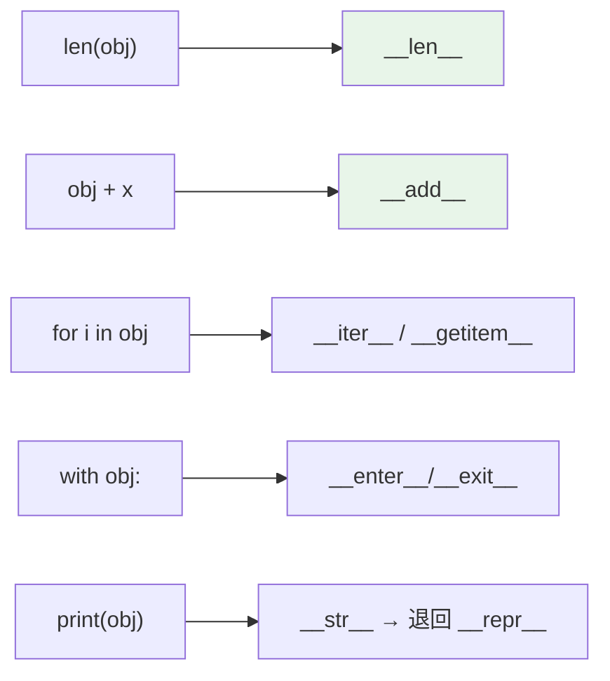

# 魔術方法 dunder methods

> `__init__`、`__repr__`、`__eq__`、`__len__`、`__add__`…這些前後雙底線的方法是 Python 的「協定」——實作它們，你的物件就能用內建語法（`len()`、`+`、`for`、`with`）自然操作。這就是 Python 多型的實現方式。

## Why（為什麼）

為什麼 `len([1,2,3])` 能用、`a + b` 對數字和字串都行、`for x in obj` 能遍歷？因為這些內建操作背後都是呼叫物件的**魔術方法（dunder methods，double underscore）**。實作對應的 dunder，你的自訂物件就能無縫融入 Python 的語法——像內建型別一樣被 `len`、`+`、`==`、`in`、`for`、`with` 操作。這是 Python「鴨子型別 + 協定導向」設計的核心，也是寫出好用類別的關鍵。

## Theory（理論：dunder 是 Python 的協定）

Python 的內建函式與運算子，實際上是**委派給物件的 dunder 方法**（呼應 [運算子是方法呼叫](../02-fundamentals/05-operators.md)）：

| 你寫的 | Python 實際呼叫 |
|--------|-----------------|
| `len(obj)` | `obj.__len__()` |
| `obj[key]` | `obj.__getitem__(key)` |
| `a + b` | `a.__add__(b)` |
| `a == b` | `a.__eq__(b)` |
| `str(obj)` / `print(obj)` | `obj.__str__()` |
| `repr(obj)` | `obj.__repr__()` |
| `for x in obj` | `obj.__iter__()` |
| `x in obj` | `obj.__contains__(x)` |
| `with obj:` | `obj.__enter__()` / `__exit__()` |
| `obj()` | `obj.__call__()` |

這叫**協定（protocol）**：只要實作對應的 dunder，物件就「支援」那個操作——不需要繼承特定基底類別（鴨子型別）。這是 Python 多型的實現方式。

## Specification（規範：常用 dunder 分類）

```python
# 物件表示
__repr__(self)      # 開發者看的、明確的表示（除錯、REPL）
__str__(self)       # 使用者看的、友善的表示（print, str()）

# 比較
__eq__, __ne__, __lt__, __le__, __gt__, __ge__

# 雜湊（見 hashable 章）
__hash__(self)

# 容器協定
__len__(self)              # len()
__getitem__(self, key)     # obj[key]
__setitem__(self, key, v)  # obj[key] = v
__contains__(self, x)      # x in obj
__iter__(self)             # for x in obj

# 數值運算子
__add__, __sub__, __mul__, __truediv__, ...

# 可呼叫、上下文管理
__call__(self, ...)        # obj()
__enter__, __exit__        # with obj:
```

## Implementation（重點 dunder 詳解）

### `__repr__` vs `__str__`

兩者都控制物件的字串表示，但目的不同：

- **`__repr__`**：給**開發者**看，應**明確、最好能重建物件**（`eval(repr(obj))` 理想上能還原）。REPL、除錯、log、容器內元素顯示都用它。
- **`__str__`**：給**使用者**看，友善可讀。`print()`、`str()` 用它；**沒定義 `__str__` 時退回 `__repr__`**。

```python
class Point:
    def __init__(self, x: int, y: int) -> None:
        self.x, self.y = x, y

    def __repr__(self) -> str:
        return f"Point(x={self.x}, y={self.y})"   # 明確、可重建

    def __str__(self) -> str:
        return f"({self.x}, {self.y})"            # 友善
```

**至少實作 `__repr__`**——它是除錯的基本禮貌，且容器（list of objects）顯示時用的是 `__repr__`。

### `__eq__`（與 `__hash__` 的連動）

定義 `__eq__` 讓 `==` 比較「值」而非「身分」。注意：**一旦定義 `__eq__`，`__hash__` 會被設為 None**（物件變不可 hash，見 [hashable](07-hashable.md)）——要放 set/dict 就得一併定義 `__hash__`，或用 `@dataclass`（見 [dataclass](09-dataclass.md)）。

```python
def __eq__(self, other: object) -> bool:
    if not isinstance(other, Point):
        return NotImplemented          # 讓 Python 試對方的 __eq__
    return (self.x, self.y) == (other.x, other.y)
```

比較不同型別時回 `NotImplemented`（不是 `False`），讓 Python 有機會嘗試對方的比較。

### 容器協定：`__len__` / `__getitem__` / `__iter__` / `__contains__`

實作它們，讓自訂物件像內建容器：

```python
class Deck:
    def __init__(self, cards: list[str]) -> None:
        self._cards = cards

    def __len__(self) -> int:
        return len(self._cards)

    def __getitem__(self, i: int) -> str:
        return self._cards[i]           # 支援 deck[0]、切片、甚至 for/in！
```

有趣的是：**只要有 `__getitem__`（配合整數索引），物件就自動支援 `for` 迭代與 `in`**（Python 的老協定），即使沒寫 `__iter__`。但明確的 `__iter__` 更清楚（見 [iterable](../07-iterators-generators/01-iterable-iterator.md)）。

### 運算子多載與 `__call__`

```python
class Vector:
    def __init__(self, x: float, y: float) -> None:
        self.x, self.y = x, y

    def __add__(self, other: "Vector") -> "Vector":
        return Vector(self.x + other.x, self.y + other.y)   # 支援 v1 + v2

    def __call__(self, scale: float) -> "Vector":
        return Vector(self.x * scale, self.y * scale)       # 讓實例可像函式呼叫

v = Vector(1, 2) + Vector(3, 4)     # __add__ → Vector(4, 6)
scaled = v(2)                        # __call__ → Vector(8, 12)
```

`__call__` 讓實例「可呼叫」（callable），常用於「有狀態的函式物件」或裝飾器類別。

## Code Example（可執行的 Python 範例）

```python
# dunder_demo.py
from __future__ import annotations


class Money:
    def __init__(self, cents: int) -> None:
        self.cents = cents

    def __repr__(self) -> str:
        return f"Money(cents={self.cents})"

    def __str__(self) -> str:
        return f"${self.cents / 100:.2f}"

    def __eq__(self, other: object) -> bool:
        if not isinstance(other, Money):
            return NotImplemented
        return self.cents == other.cents

    def __hash__(self) -> int:
        return hash(self.cents)

    def __add__(self, other: Money) -> Money:
        return Money(self.cents + other.cents)

    def __lt__(self, other: Money) -> bool:
        return self.cents < other.cents


def demo() -> None:
    a = Money(150)
    b = Money(250)

    print(f"repr: {a!r}")            # Money(cents=150)
    print(f"str : {a}")             # $1.50
    print(f"相加: {a + b}")          # $4.00（__add__）
    print(f"相等: {a == Money(150)}")  # True
    print(f"排序: {sorted([b, a])}")   # [Money(cents=150), Money(cents=250)]（__lt__）
    print(f"可放 set: {len({a, Money(150)})}")  # 1（__eq__ + __hash__ 去重）


if __name__ == "__main__":
    demo()
```

**預期輸出**：

```pycon
$ python dunder_demo.py
repr: Money(cents=150)
str : $1.50
相加: $4.00
相等: True
排序: [Money(cents=150), Money(cents=250)]
可放 set: 1
```

## Diagram（圖解：內建操作委派給 dunder）



## Best Practice（最佳實踐）

- **每個類別至少實作 `__repr__`**：除錯、log、REPL 的基本禮貌；理想上明確到能看出物件內容。
- **需要值相等就實作 `__eq__`，並記得一併處理 `__hash__`**（或直接用 `@dataclass`）。
- **實作容器/迭代/運算子協定，讓物件融入 Python 語法**，而非發明 `obj.get_item(0)` 這種非慣用 API。
- **比較不同型別時回 `NotImplemented`**（不是 `False`），讓 Python 嘗試對方的實作。
- **多個比較運算子用 `functools.total_ordering`** 自動補齊（只需寫 `__eq__` + 一個 `__lt__`，見 [functools](../08-functional-decorators/05-functools.md)）。
- **能用 `@dataclass` 就用**：它自動產生 `__init__`/`__repr__`/`__eq__`，省去手寫樣板（見 [dataclass](09-dataclass.md)）。

## Common Mistakes（常見誤解）

- **只實作 `__str__` 沒實作 `__repr__`**：REPL/容器/log 顯示醜（`<obj at 0x...>`）。至少寫 `__repr__`。
- **定義 `__eq__` 忘了 `__hash__`**：物件變不可 hash，放進 set/dict 時 TypeError（見 [hashable](07-hashable.md)）。
- **`__eq__` 對不同型別回 `False` 而非 `NotImplemented`**：阻止了對方的比較機會，可能導致不對稱比較。
- **違反契約**：定義 `__eq__` 卻讓相等物件 hash 不同（見 [hashable](07-hashable.md)）。
- **`__repr__` 不夠明確**：回傳看不出物件狀態的字串，除錯時沒幫助。
- **手寫一堆比較運算子**：用 `@total_ordering` 或 dataclass 的 `order=True`。
- **濫用運算子多載**：讓 `+` 做不直覺的事會害人；只在語意自然時多載。

## Interview Notes（面試重點）

- 說得出 **dunder 是 Python 的協定**：內建操作（`len`/`+`/`==`/`for`/`with`/`print`）委派給對應 dunder，這是 Python 多型與鴨子型別的實現。
- **`__repr__` vs `__str__` 是高頻考點**：repr 給開發者（明確、可重建、容器/REPL 用）、str 給使用者（友善、print 用）、str 缺省退回 repr。
- 知道 **`__eq__` 與 `__hash__` 的連動**（定義 eq 使 hash 變 None）與 `NotImplemented` 的用途。
- 知道**容器協定**（`__len__`/`__getitem__`/`__iter__`/`__contains__`）能讓物件像內建容器，且 `__getitem__` 可讓物件自動可迭代。
- 知道 `__call__` 讓實例可呼叫，以及用 `@total_ordering` / `@dataclass` 省樣板。

---

➡️ 下一章：[dataclass](09-dataclass.md)

[⬆️ 回 Part 4 索引](README.md)
