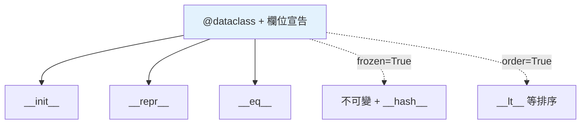

# dataclass

> `@dataclass` 自動幫你產生 `__init__`、`__repr__`、`__eq__` 等樣板方法，讓「只是裝資料的類別」從十幾行縮成三行。它是現代 Python 寫資料容器的首選。

## Why（為什麼）

太多類別的本質只是「一組帶名字的欄位」——但要它好用，你得手寫 `__init__`（把每個參數存到 self）、`__repr__`（除錯顯示）、`__eq__`（值比較）……重複又易錯。`@dataclass`（Python 3.7，PEP 557）自動產生這些方法，你只要宣告欄位。它讓資料類別簡潔、正確、可維護，是現代 Python 的標準做法。

## Theory（理論：自動產生樣板方法）

`@dataclass` 是一個**類別裝飾器**，讀取你用型別註記宣告的欄位，自動生成：

- `__init__`：依欄位順序接收參數並賦值。
- `__repr__`：`ClassName(field1=..., field2=...)`。
- `__eq__`：依欄位逐一比較（值相等）。
- （可選）`__lt__` 等排序方法、`__hash__`、frozen 唯讀等。

你專注在「有哪些欄位」，樣板交給它。

## Specification（規範：宣告與參數）

```python
from dataclasses import dataclass, field


@dataclass
class Product:
    name: str                      # 必填欄位
    price: float
    quantity: int = 0              # 有預設值
    tags: list[str] = field(default_factory=list)   # 可變預設！用 field
```

`@dataclass` 的常用參數：

```python
@dataclass(
    frozen=True,      # 唯讀（不可變）+ 自動 __hash__
    order=True,       # 產生 __lt__ 等排序方法
    kw_only=True,     # 所有欄位強制用關鍵字（3.10+）
    slots=True,       # 用 __slots__ 省記憶體（3.10+）
)
class Point:
    x: int
    y: int
```

## Implementation（可變預設、frozen、order、post_init）

### 可變預設值必須用 `field(default_factory=...)`

dataclass 沿用「可變預設參數陷阱」的防範（見 [參數](../02-fundamentals/09-parameters-args-kwargs.md)）。直接寫 `tags: list = []` 會**直接報錯**（dataclass 貼心地禁止），必須用 `field(default_factory=list)`：

```python
@dataclass
class Cart:
    # items: list = []                          # ❌ ValueError: mutable default
    items: list[str] = field(default_factory=list)   # ✅ 每個實例獨立的新 list
```

`default_factory` 是「每次建立實例時呼叫一次」的工廠，確保每個實例有獨立的可變物件。

### `frozen=True`：不可變 + 可 hash

```python
@dataclass(frozen=True)
class Point:
    x: int
    y: int

p = Point(1, 2)
# p.x = 10          # ❌ FrozenInstanceError（唯讀）
{p, Point(1, 2)}    # ✅ 可放 set（frozen 自動產生 __hash__）
```

`frozen=True` 讓實例不可變，並自動實作 `__hash__`（滿足 hash/eq 契約，見 [hashable](08-dunder-methods.md)）——所以能當 dict key、放 set。非 frozen 的 dataclass 預設 `__hash__` 為 None（不可 hash）。

### `order=True`：自動排序

```python
@dataclass(order=True)
class Version:
    major: int
    minor: int
    patch: int

sorted([Version(1, 2, 0), Version(1, 0, 5)])   # 依欄位 tuple 順序比較
```

`order=True` 產生 `__lt__`/`__le__`/`__gt__`/`__ge__`，依**欄位宣告順序**組成 tuple 來比較。想控制排序鍵可用 `field(compare=False)` 排除某些欄位。

### `__post_init__`：初始化後的加工

需要在自動 `__init__` 後做驗證或衍生欄位，用 `__post_init__`：

```python
@dataclass
class Rectangle:
    width: float
    height: float
    area: float = field(init=False)     # 不進 __init__ 參數，由計算得出

    def __post_init__(self) -> None:
        if self.width <= 0:
            raise ValueError("寬必須為正")
        self.area = self.width * self.height
```

`field(init=False)` 讓欄位不出現在 `__init__` 參數，改由 `__post_init__` 計算。

### dataclass vs NamedTuple vs 普通 class

| 需求 | 選擇 |
|------|------|
| 可變資料容器、要方法 | `@dataclass` |
| 不可變、可 hash、輕量 | `@dataclass(frozen=True)` 或 `NamedTuple` |
| 需要是 tuple（可解構、相容 tuple API） | `typing.NamedTuple` |
| 純設定 / 驗證重 | `@dataclass` 或 pydantic（見 [Part 14](../14-web/06-pydantic-validation.md)） |
| 複雜行為、繼承階層 | 普通 class |

## Code Example（可執行的 Python 範例）

```python
# dataclass_demo.py
from __future__ import annotations

from dataclasses import dataclass, field


@dataclass(order=True)
class Version:
    major: int
    minor: int
    patch: int = 0

    def __str__(self) -> str:
        return f"{self.major}.{self.minor}.{self.patch}"


@dataclass
class ShoppingCart:
    owner: str
    items: list[str] = field(default_factory=list)   # 可變預設用 factory

    def add(self, item: str) -> None:
        self.items.append(item)


@dataclass(frozen=True)
class Point:
    x: int
    y: int


def demo() -> None:
    # 1. 自動 __init__ / __repr__ / __eq__
    v1 = Version(1, 2, 3)
    print(f"repr: {v1!r}")                     # Version(major=1, minor=2, patch=3)
    print(f"相等: {v1 == Version(1, 2, 3)}")    # True

    # 2. order=True 自動排序
    versions = [Version(1, 2), Version(1, 0, 5), Version(2, 0)]
    print("排序:", [str(v) for v in sorted(versions)])

    # 3. 可變預設各自獨立
    a = ShoppingCart("Alice")
    b = ShoppingCart("Bob")
    a.add("apple")
    print(f"a.items={a.items}, b.items={b.items}")   # a 有 apple, b 空的

    # 4. frozen 可放 set / 當 key
    pts = {Point(1, 2), Point(1, 2), Point(3, 4)}
    print(f"去重後點數: {len(pts)}")             # 2


if __name__ == "__main__":
    demo()
```

**預期輸出**：

```pycon
$ python dataclass_demo.py
repr: Version(major=1, minor=2, patch=3)
相等: True
排序: ['1.0.5', '1.2.0', '2.0.0']
a.items=['apple'], b.items=[]
去重後點數: 2
```

## Diagram（圖解：dataclass 自動生成什麼）



## Best Practice（最佳實踐）

- **資料容器類別優先用 `@dataclass`**：省下手寫 `__init__`/`__repr__`/`__eq__` 的樣板與錯誤。
- **可變預設一律用 `field(default_factory=...)`**：`list`/`dict`/`set` 預設都要這樣寫（直接寫會報錯，這是好事）。
- **要當 key / 放 set / 值不該變 → `frozen=True`**（同時獲得 `__hash__`）。
- **要排序 → `order=True`**；控制比較鍵用 `field(compare=False)`。
- **驗證/衍生欄位用 `__post_init__`** + `field(init=False)`。
- **省記憶體、欄位固定 → `slots=True`（3.10+）**（見 [Part 18](../18-performance/06-memory-optimization.md)）。
- **需要強驗證/序列化（如 API）→ 考慮 pydantic**（見 [pydantic](../14-web/06-pydantic-validation.md)）。

## Common Mistakes（常見誤解）

- **可變預設直接寫 `items: list = []`**：dataclass 會 `ValueError`；用 `field(default_factory=list)`。
- **以為 dataclass 預設可 hash**：非 frozen 時 `__hash__` 為 None（不可 hash）；要 hash 用 `frozen=True`。
- **有預設值的欄位放在無預設欄位之前**：`x: int = 0` 後面接 `y: int` 會報錯（和函式參數規則一樣，無預設不能在有預設之後）。
- **在 `__init__` 做的事忘了改放 `__post_init__`**：dataclass 自動生成 `__init__`，額外初始化邏輯要放 `__post_init__`。
- **忘了型別註記**：dataclass 靠**型別註記**辨識欄位；`x = 5`（無註記）不會被當成 dataclass 欄位。
- **frozen 裡想改欄位**：`FrozenInstanceError`；frozen 就是不可變，需要衍生新值用 `dataclasses.replace`。

## Interview Notes（面試重點）

- 說得出 `@dataclass` **自動產生 `__init__`/`__repr__`/`__eq__`**（3.7+），減少樣板。
- **可變預設用 `field(default_factory=...)`** 是必考點（連結可變預設參數陷阱）。
- 知道 **`frozen=True` → 不可變 + 自動 `__hash__`**（能當 key/放 set），非 frozen 預設不可 hash。
- 知道 **`order=True` 依欄位順序產生比較方法**、`__post_init__` 做驗證/衍生、`field(init=False)`。
- 能比較 **dataclass / NamedTuple / 普通 class / pydantic** 的適用場景。
- 知道 dataclass **靠型別註記辨識欄位**，且有預設欄位不能排在無預設之前。

---

➡️ 下一章：[抽象基底類別 ABC](10-abc.md)

[⬆️ 回 Part 4 索引](README.md)
