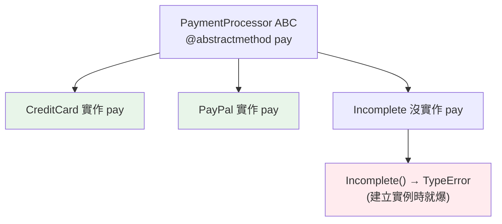

# 抽象基底類別 ABC

> 鴨子型別很自由，但代價是：子類別忘了實作某個方法，要拖到執行期真的呼叫到才炸。ABC 讓你把這個錯誤**提前到「建立物件那一刻」**就攔下。這章講「介面契約」怎麼在 Python 裡落地。

## 💡 白話導讀（建議先讀）

想開一家「合法的支付服務」，主管機關會給你一張檢查表：**必須會收款、必須會退款**。
缺一項，就不發執照、不准開業。

ABC（抽象基底類別）就是那張檢查表：

- 你定義一個 ABC，用 `@abstractmethod` 列出「當這種東西，必須會哪些方法」。
- 子類別如果**沒有全部實作**，想建立實例的瞬間就直接被擋下（`TypeError`）——不發執照。

為什麼需要它？Python 平常是「鴨子型別」——會游會叫就當你是鴨子，很自由。
但自由的代價是：忘了實作某個方法，**要等到它被呼叫的那一刻才爆炸**——可能是上線後。
ABC 把檢查提前到「建立物件」的瞬間——缺什麼，第一時間就知道。

最後一個對比，先有印象就好：

- **ABC**：要「正式掛名」——必須明確繼承它才算它的一員（術語：名義子型別）。
- **Protocol**（[另一章](../05-typing/06-protocol.md)）：「長得像就算」——不用掛名（結構子型別）。

兩者是互補的工具，這章先講 ABC。

## 🎯 什麼時候會用到

- **定義「一組實作必須遵守的介面契約」,而且要在忘記實作時「一建立就報錯」。**
  典型場景:同一件事有**多種後端/供應商**,你想強制它們長一樣——
  儲存後端(本機/S3/GCS)、金流供應商(綠界/Stripe)、通知管道(email/SMS/推播)。
  定義一個 `abstractmethod`,漏實作的子類別**無法實例化**(而不是跑到一半才 `AttributeError`)。
- **你提供 base class 給別人繼承**(框架、外掛系統):用 ABC 把「你必須實作這幾個方法」講清楚。
- **自訂容器**:繼承 `collections.abc` 的 `Sequence`/`Mapping`,實作幾個核心方法,
  就**免費得到一堆 mixin 方法**(`__contains__`、`index`、`count`…)。

**ABC vs Protocol 的分界**(常考):

- 你**掌控子類別、想強制它們繼承** → **ABC**。
- 你想對**不受你控制的既有型別**做「長得像就算數」的結構化型別 → **Protocol**(見 [Protocol](../05-typing/06-protocol.md))。
- **能單純鴨子型別解決的,別急著上 ABC**——ABC 是「需要強制契約」時才划算的正式化。

## Why（為什麼）

鴨子型別很自由：「只要有 `.area()` 方法就當它是形狀」。但自由的代價是「忘了實作某方法，要到執行到那一行才發現 AttributeError」。**抽象基底類別（ABC，Abstract Base Class）** 讓你明確定義一份契約：「任何 Shape 都必須實作 `area()`」——沒實作的子類別**連建立實例都會失敗**，把錯誤從執行期提前到「一建立物件」。這對設計框架、外掛系統、團隊協作的介面約定很有價值。

## Theory（理論：介面契約與名義子型別）

ABC 提供兩件事，正好對應導讀的「檢查表」和「不發執照」：

1. **定義抽象方法**：用 `@abstractmethod` 標記「子類別必須實作」的方法——檢查表上的項目。
2. **阻止不完整的實例化**：若子類別沒實作全部抽象方法，`SubClass()` 直接 `TypeError`——缺項就不准開業。

ABC 屬於**名義子型別（nominal subtyping）**：你必須「明確繼承」那個 ABC 才算數——正式掛名。
這和 [`Protocol`](../05-typing/06-protocol.md)（結構子型別：「長得像就算」，不用掛名）是兩種互補的介面表達方式。

## Specification（規範：定義 ABC）

```python
from abc import ABC, abstractmethod


class Shape(ABC):                      # 繼承 ABC
    @abstractmethod
    def area(self) -> float:           # 抽象方法：子類別必須實作
        ...

    @abstractmethod
    def perimeter(self) -> float:
        ...

    def describe(self) -> str:         # 具體方法：可提供共用實作
        return f"面積 {self.area():.2f}, 周長 {self.perimeter():.2f}"


class Circle(Shape):
    def __init__(self, r: float) -> None:
        self.r = r

    def area(self) -> float:           # 必須實作
        return 3.14159 * self.r ** 2

    def perimeter(self) -> float:      # 必須實作
        return 2 * 3.14159 * self.r
```

## Implementation（強制契約、混用具體方法、其他抽象成員）

### 不實作抽象方法 → 無法實例化

```pycon
>>> Shape()                    # ABC 本身不能實例化
TypeError: Can't instantiate abstract class Shape with abstract methods area, perimeter
>>> class Square(Shape):
...     def area(self): return 1     # 只實作了 area，漏了 perimeter
>>> Square()
TypeError: Can't instantiate abstract class Square with abstract method perimeter
```

**錯誤在「建立實例」時就爆**，而不是「呼叫 perimeter」時——這就是 ABC 的價值：契約在物件誕生時就被檢查。

### ABC 可同時有抽象方法與具體方法

ABC 不只定義「必須實作什麼」，也能提供**共用的具體實作**（如上面的 `describe`，它呼叫抽象的 `area`/`perimeter`）。這是「模板方法模式」——父類別定流程、子類別填細節。

### 抽象 property / classmethod / staticmethod

`@abstractmethod` 可疊加在 property、classmethod 上（`@abstractmethod` 要放最靠近函式）：

```python
class Base(ABC):
    @property
    @abstractmethod
    def name(self) -> str: ...

    @classmethod
    @abstractmethod
    def create(cls) -> "Base": ...
```

### ABC vs Protocol：名義 vs 結構

| | ABC | Protocol（見 [Protocol](../05-typing/06-protocol.md)） |
|--|-----|----------|
| 子型別方式 | 名義（要明確繼承） | 結構（長得像就算） |
| 執行期強制 | ✅ 沒實作無法實例化 | ❌（預設只給型別檢查器用） |
| 適合 | 你控制的類別階層、框架基底 | 為既有/第三方類別定介面、鴨子型別的型別化 |

想「執行期強制契約 + 明確階層」用 ABC；想「不強迫繼承、只描述結構」用 Protocol。

### `collections.abc`：內建的 ABC 家族

標準庫的 `collections.abc` 提供一堆現成 ABC（`Iterable`、`Sequence`、`Mapping`、`Hashable`…），可用來 `isinstance` 檢查或當基底（見 [collections.abc](../11-stdlib/16-collections-abc.md)）：

```pycon
>>> from collections.abc import Iterable
>>> isinstance([1, 2], Iterable)      # True
>>> isinstance("abc", Iterable)       # True
```

## Code Example（可執行的 Python 範例）

```python
# abc_demo.py
from abc import ABC, abstractmethod


class PaymentProcessor(ABC):
    """付款處理器的介面契約。"""

    @abstractmethod
    def pay(self, amount: float) -> str:
        """執行付款，回傳交易描述。"""
        ...

    def receipt(self, amount: float) -> str:    # 共用具體方法
        return f"收據：{self.pay(amount)}"


class CreditCard(PaymentProcessor):
    def pay(self, amount: float) -> str:
        return f"信用卡付款 ${amount:.2f}"


class PayPal(PaymentProcessor):
    def pay(self, amount: float) -> str:
        return f"PayPal 付款 ${amount:.2f}"


def checkout(processor: PaymentProcessor, amount: float) -> str:
    """接受任何 PaymentProcessor（多型）。"""
    return processor.receipt(amount)


def demo() -> None:
    print(checkout(CreditCard(), 100))     # 收據：信用卡付款 $100.00
    print(checkout(PayPal(), 50))          # 收據：PayPal 付款 $50.00

    # 不完整的實作無法實例化
    try:
        PaymentProcessor()                 # 抽象類別
    except TypeError as e:
        print(f"擋下抽象類別: {type(e).__name__}")


if __name__ == "__main__":
    demo()
```

**預期輸出**：

```pycon
$ python abc_demo.py
收據：信用卡付款 $100.00
收據：PayPal 付款 $50.00
擋下抽象類別: TypeError
```

## Diagram（圖解：ABC 強制契約）



## Best Practice（最佳實踐）

- **用 ABC 定義「你控制的類別階層」的介面契約**：框架基底、外掛介面、策略模式的抽象角色。
- **抽象方法標 `@abstractmethod`**，讓「漏實作」在建立實例時就被抓到，而非執行到才炸。
- **在 ABC 提供共用具體方法**（模板方法）：把重複流程放父類別，變動點留給子類別。
- **為第三方/既有類別描述介面、或偏好鴨子型別 → 用 `Protocol`**（結構化，不需繼承）。
- **用 `collections.abc` 的現成 ABC** 做 `isinstance` 檢查（如判斷是否 `Iterable`/`Sequence`）。
- **ABC 搭配型別註記**：函式參數標成 ABC 型別，表達「我要一個滿足此契約的物件」。

## Common Mistakes（常見誤解）

- **以為 ABC 只是文件**：它會**強制**——不實作全部抽象方法就無法實例化。
- **`@abstractmethod` 裝飾器順序錯**：與 property/classmethod 疊加時，`@abstractmethod` 要放**最靠近函式**（最下面）。
- **忘了繼承 `ABC`（或用 `metaclass=ABCMeta`）**：只寫 `@abstractmethod` 但類別沒繼承 ABC，抽象檢查不會生效。
- **抽象方法寫了實作卻期待子類別「不能不覆寫」**：子類別可用 `super()` 呼叫父類別實作，但仍**必須覆寫**才能實例化。
- **該用 Protocol 卻硬用 ABC**：為第三方類別（你改不了原始碼）定介面時，Protocol 更合適（不需對方繼承）。
- **過度抽象**：只有一個實作就不需要 ABC；抽象是為了「多個實作 + 契約保證」。

## Interview Notes（面試重點）

- 說得出 ABC 的作用：**定義介面契約 + 強制子類別實作**（沒實作抽象方法就**無法實例化**，錯誤提前到建立物件時）。
- 會用 **`abc.ABC` + `@abstractmethod`**，知道 ABC 可同時有抽象與具體方法（模板方法模式）。
- **能對比 ABC（名義子型別、執行期強制、要繼承）vs Protocol（結構化子型別、鴨子型別、不需繼承）**，並說出各自適用場景。
- 知道 **`collections.abc`** 提供內建 ABC（`Iterable`/`Sequence`/`Mapping`…）可供 isinstance 與繼承。
- 知道 `@abstractmethod` 與 property/classmethod 疊加的順序。

---

➡️ 下一章：[描述器 descriptor](11-descriptors.md)

[⬆️ 回 Part 4 索引](README.md)
