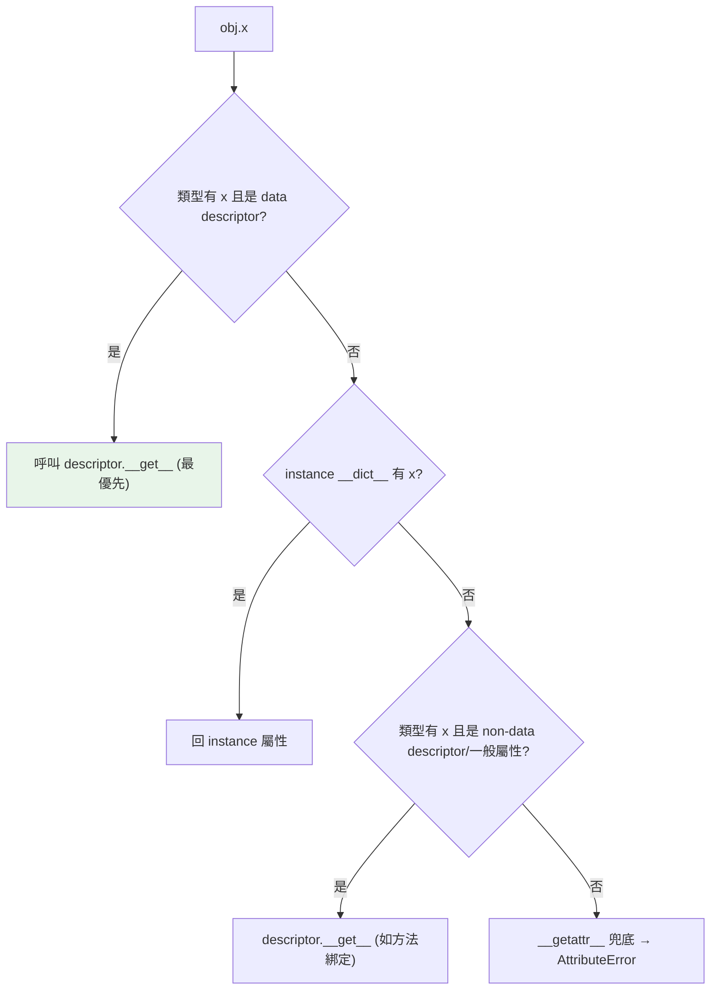

# 描述器 descriptor

> 描述器是「把屬性存取邏輯抽成可重用物件」的協定——`property`、`classmethod`、方法本身全都是描述器。理解它，你就看懂了 Python 屬性系統的底層引擎。

## 💡 白話導讀（建議先讀）

平常拿物件的屬性，就像自己開抽屜拿東西——直接到背包（`__dict__`）裡取。

**描述器（descriptor）** 改變了這件事：你在類別裡安排了一位「管家」。
從此之後，每次有人要「拿、放、丟」那個屬性，**都得經過管家的手**：

- 有人要**讀** → 管家的 `__get__` 出面
- 有人要**寫** → 管家的 `__set__` 出面
- 有人要**刪** → 管家的 `__delete__` 出面

管家能做什麼？驗證、記錄、換算、快取——所有「存取時要順便做的事」都能寫在管家身上。
而且**同一位管家可以被很多類別重複雇用**——這正是它比 property 強的地方：存取邏輯變成可重用的元件。

為什麼值得學？因為你早就在用它——**`property`、`classmethod`、甚至「方法自帶 self」的綁定，底層全是描述器**。
學會它，等於看懂 Python 屬性系統的引擎室。

最後有一個位階規則先記著（章內會展開）：

- 會管「寫」的管家（data descriptor）**權力大於**自己的抽屜。
- 只管「讀」的管家（non-data descriptor）**權力小於**抽屜。

這個位階解釋了很多看似神祕的行為。

## 🎯 什麼時候會用到

- **其實你天天在用它,只是沒察覺**:`@property`、`@classmethod`、`@staticmethod`、
  `functools.cached_property`、甚至「方法」本身——**全都是描述器**。
  這章的價值,一半是讓你看懂這些天天用的東西底層是同一個協定。
- **該「自己動手寫」描述器的時機,只有一個訊號:同一套「屬性存取邏輯」要在很多屬性、
  很多類別上重複套用。** 這時把邏輯抽成一個描述器,一次寫好、到處掛。經典場景:
  - **ORM 欄位**:`name = Column(String)`(SQLAlchemy)、Django model 的欄位——
    欄位物件就是描述器,攔截讀寫來做型別轉換、追蹤「哪些欄位被改過」(dirty tracking)。
  - **可重用的驗證器**:`age = PositiveInt()`、`email = EmailField()`——
    把「範圍檢查、格式檢查」寫成描述器,套在任何類別的任何屬性上。
  - 惰性計算、型別強制、單位轉換等**橫切多個屬性**的存取邏輯。

一句話:**只有一個屬性要這種邏輯 → 用 `@property` 就好;同樣邏輯要重複很多次 → 才抽成描述器。**
框架/函式庫作者常寫描述器,一般應用開發者偶爾用——但**看懂它,你才真懂 Python 的屬性存取**。

## Why（為什麼）

[property](06-property.md) 讓你為**單一屬性**加驗證，但如果十個屬性都要「非負驗證」，難道寫十次 property？描述器（descriptor）讓你把屬性存取的邏輯**抽成一個可重用的類別**，套用到任意多個屬性。更重要的是：描述器是 Python 屬性系統的**底層引擎**——property、方法綁定（bound method）、classmethod、`__slots__` 全都建立在它之上。這是「從會用 OOP 到理解 OOP 如何運作」的關鍵一章，也是資深面試常考的深水區。

## Theory（理論：描述器協定）

**描述器**就是那位「管家」——一個實作了下列任一方法的類別。
把它放到**另一個類別的類別屬性**位置上，它就開始攔截對那個屬性的存取：

| 方法 | 何時觸發 |
|------|----------|
| `__get__(self, obj, objtype)` | 讀取屬性 |
| `__set__(self, obj, value)` | 賦值屬性 |
| `__delete__(self, obj)` | 刪除屬性 |
| `__set_name__(self, owner, name)` | 描述器被指派給類別屬性時（自動取得屬性名，3.6+） |

管家分兩種等級，差別在「管不管寫入」：

- **data descriptor（資料描述器）**：有 `__set__` 或 `__delete__`——會管「寫」。**優先於** instance 的 `__dict__`（權力大於抽屜）。
- **non-data descriptor（非資料描述器）**：只有 `__get__`——只管「讀」。**低於** instance 的 `__dict__`（抽屜裡有就用抽屜的）。

這個優先順序不是冷知識——它解釋了「為什麼 property 蓋不掉、方法卻能被實例屬性遮蔽」等一連串行為（見下）。

## Specification（規範：一個可重用的驗證描述器）

```python
class Positive:
    """可重用的「必須為正數」描述器。"""

    def __set_name__(self, owner: type, name: str) -> None:
        self._name = f"_{name}"          # 自動記住屬性名，決定存哪

    def __get__(self, obj: object, objtype: type | None = None) -> float:
        if obj is None:
            return self                  # 透過類別存取時回描述器本身
        return getattr(obj, self._name)

    def __set__(self, obj: object, value: float) -> None:
        if value <= 0:
            raise ValueError(f"{self._name[1:]} 必須為正，得到 {value}")
        setattr(obj, self._name, value)


class Product:
    price = Positive()                   # 套用描述器
    quantity = Positive()                # 重用！同一份驗證邏輯

    def __init__(self, price: float, quantity: float) -> None:
        self.price = price               # 觸發 Positive.__set__（驗證）
        self.quantity = quantity
```

## Implementation（重用、優先順序、property/方法都是描述器）

### 一份邏輯、多個屬性

上面的 `Positive` 展示了描述器勝過 property 的地方：**寫一次驗證，套用到 `price`、`quantity` 及未來任意欄位**。property 得每個屬性各寫一次。

```pycon
>>> p = Product(100, 5)
>>> p.price
100
>>> p.price = -10               # 觸發 __set__ 的驗證
ValueError: price 必須為正，得到 -10
```

`__set_name__` 自動讓描述器知道自己叫什麼名字（`price`/`quantity`），從而把值存到對應的 `_price`/`_quantity`，不必手動指定。

### data vs non-data descriptor 的優先順序

屬性查找的完整順序（比 [屬性與方法](02-attributes-and-methods.md) 講的更精確）：

```text
1. 型別的 data descriptor（有 __set__/__delete__）  ← 最優先
2. instance __dict__
3. 型別的 non-data descriptor（只有 __get__）與其他類別屬性
4. __getattr__ 兜底
```

**data descriptor 優先於 instance `__dict__`**——這就是為什麼 property（是 data descriptor）能穩定攔截存取，即使實例 `__dict__` 有同名 key 也不會被繞過。而**方法是 non-data descriptor**，所以你能用 instance 屬性「遮蔽」方法（`obj.method = something`）。

### property、方法、classmethod 都是描述器

這是本章的「啊哈」時刻——你早就在用描述器了：

- **`property`** 是內建的 data descriptor：它的 `__get__`/`__set__` 呼叫你給的 getter/setter。
- **函式（方法）** 是 non-data descriptor：`func.__get__` 產生**綁定方法**（把 self 綁進去）——這就是 [屬性與方法](02-attributes-and-methods.md) 說的「方法自帶 self」的真正機制。
- **`classmethod`/`staticmethod`** 也是描述器：它們的 `__get__` 決定第一參數是 cls / 什麼都不綁。

```pycon
>>> class C:
...     def method(self): pass
>>> C.method.__get__            # 函式有 __get__ → 是描述器
<method-wrapper '__get__' ...>
>>> c = C()
>>> c.method                    # 透過描述器協定產生綁定方法
<bound method C.method of ...>
```

所以「方法為何自帶 self」「property 為何能攔截」的答案，統一是**描述器協定**。

## Code Example（可執行的 Python 範例）

```python
# descriptor_demo.py
from __future__ import annotations


class Typed:
    """可重用描述器：驗證型別。"""

    def __init__(self, expected: type) -> None:
        self.expected = expected

    def __set_name__(self, owner: type, name: str) -> None:
        self.private = f"_{name}"

    def __get__(self, obj: object, objtype: type | None = None) -> object:
        if obj is None:
            return self
        return getattr(obj, self.private)

    def __set__(self, obj: object, value: object) -> None:
        if not isinstance(value, self.expected):
            raise TypeError(f"{self.private[1:]} 必須是 {self.expected.__name__}")
        setattr(obj, self.private, value)


class Person:
    name = Typed(str)               # 重用同一描述器
    age = Typed(int)

    def __init__(self, name: str, age: int) -> None:
        self.name = name            # 觸發 Typed.__set__ 驗證
        self.age = age


def demo() -> None:
    p = Person("Alice", 30)
    print(f"{p.name}, {p.age}")             # Alice, 30

    try:
        p.age = "old"                       # 型別驗證擋下
    except TypeError as e:
        print(f"擋下: {e}")

    # 證明方法也是描述器（產生綁定方法）
    print(f"綁定方法: {type(p.__init__).__name__}")   # method


if __name__ == "__main__":
    demo()
```

**預期輸出**：

```pycon
$ python descriptor_demo.py
Alice, 30
擋下: age 必須是 int
綁定方法: method
```

## Diagram（圖解：屬性查找的完整優先順序）



## Best Practice（最佳實踐）

- **同一存取邏輯要套用到多個屬性 → 用描述器**（型別驗證、範圍檢查、單位換算、記錄存取）。單一屬性用 property 就夠。
- **用 `__set_name__` 自動取得屬性名**（3.6+），別硬編碼儲存名稱。
- **把實際資料存在 instance（如 `_name`）而非描述器實例**：描述器是**類別屬性、所有實例共用一份**——若把每實例狀態存在描述器自己身上，會被所有實例共用（經典陷阱）。
- **需要攔截「寫」→ 實作 `__set__`（成為 data descriptor）**，才能穩定優先於 instance `__dict__`。
- **多數情況用現成工具**：property、dataclass、pydantic 已覆蓋大部分需求；手寫描述器是為了「跨多屬性重用」或做框架。
- **描述器是理解機制的鑰匙**：即使少手寫，懂它能解釋 property/方法/classmethod 的行為。

## Common Mistakes（常見誤解）

- **把每實例狀態存在描述器實例上**：描述器是類別屬性、單一共用；`self.value = x`（存在描述器自己）會讓所有實例共用同一份。應存到 `obj` 上（如 `_name`）。
- **只寫 `__get__` 卻期待攔截賦值**：那是 non-data descriptor，賦值會直接寫進 instance `__dict__` 繞過它；要攔截寫入需 `__set__`。
- **不懂 data vs non-data 的優先順序**：導致「為什麼我的描述器有時被 instance 屬性蓋過」的困惑。
- **手動硬編碼儲存名稱**：用 `__set_name__` 更穩健。
- **為單一屬性寫描述器**：殺雞用牛刀，用 property。
- **不知道方法/property 就是描述器**：於是無法解釋「方法為何自帶 self」。

## Interview Notes（面試重點）

- 說得出**描述器協定**：`__get__`/`__set__`/`__delete__`/`__set_name__`，以及它讓「屬性存取邏輯可重用」。
- **能區分 data descriptor（有 `__set__`/`__delete__`，優先於 instance `__dict__`）vs non-data descriptor（只有 `__get__`，低於 instance `__dict__`）**，並說出屬性查找完整順序。
- **關鍵洞察**：`property`、**方法（產生 bound method）**、`classmethod`/`staticmethod` 全是描述器——這解釋了「方法為何自帶 self」與「property 為何能攔截」。
- 知道 **`__set_name__`** 自動取得屬性名（3.6+）。
- 知道**描述器是類別屬性、共用一份**，故每實例狀態要存到 obj 上，別存描述器自己（經典陷阱）。

---

➡️ 下一章：[__new__ 與物件建立流程](12-new-and-init.md)

[⬆️ 回 Part 4 索引](README.md)
