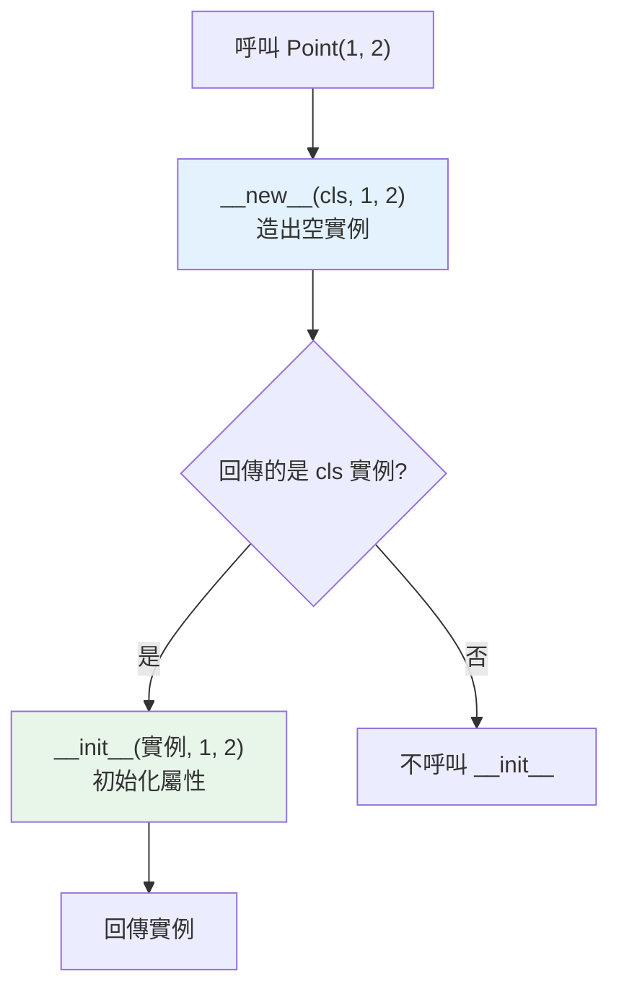

# __new__ 與物件建立流程

> 建立一個物件其實分兩步：`__new__` 負責「造出」實例、`__init__` 負責「初始化」它。多數時候你只碰 `__init__`，但理解 `__new__` 能解釋單例、不可變型別子類化、與 metaclass 的關聯。

## 💡 白話導讀（建議先讀）

`Point(1, 2)` 這一行，看起來一步到位——其實是**蓋房子的兩個步驟**：

1. **`__new__`：蓋毛胚屋**。把房子本體「生出來」——配置空間、造出一個空蕩蕩的實例。
2. **`__init__`：裝潢**。拿到毛胚屋（也就是 `self`），把家具搬進去——設定屬性。

日常寫類別，你只需要找裝潢師傅（寫 `__init__`）——毛胚屋 Python 會自動幫你蓋好。

那什麼時候需要親自動工到毛胚階段（覆寫 `__new__`）？兩個經典場景：

- **單例（singleton）**：規定「這個地址永遠只有一棟房子」——不管建立幾次，都回傳同一個實例。
  裝潢師傅辦不到這件事，因為他登場時房子已經蓋好了。
- **子類化不可變型別**（tuple、str、int）：這些型別「出生即定型」，等 `__init__` 想改已經來不及——必須在 `__new__` 出生的瞬間就把值定好。

一句話記住分工：**`__new__` 管「生出來」，`__init__` 管「佈置好」**。

## Why（為什麼）

新手常把 `__init__` 叫「建構子」，但它其實是「初始化器」——收到的 `self` 是**已經被造好**的物件。真正「造出物件」的是 `__new__`。99% 的情況你只需寫 `__init__`；但當你要**子類化不可變型別（int/str/tuple）**、實作**單例模式**、或做**物件快取/池化**時，就必須理解 `__new__`。它也是通往 metaclass（見 [metaclass](13-metaclass.md)）的前置概念。

## Theory（理論：建立物件的兩步）

`SomeClass(args)` 這個「呼叫類別」的動作，背後是兩步——先蓋毛胚、再裝潢：

1. **`__new__(cls, *args)`**：**建立並回傳**一個新的（尚未初始化的）實例。第一參數是 `cls`（要蓋「哪一種」房子），負責配置記憶體、造出物件。
2. **`__init__(self, *args)`**：拿到 `__new__` 回傳的實例（就是 `self`），**設定它的屬性**。不回傳值。

```text
Point(1, 2)
  → Point.__new__(Point, 1, 2)   # 造出空的 Point 實例（毛胚）
  → Point.__init__(實例, 1, 2)   # 初始化它（裝潢）
  → 回傳實例
```

一個重要細節：只有當 `__new__` 回傳的**確實是 `cls` 的實例**時，`__init__` 才會被自動呼叫。
（回傳了別種東西？Python 認定你另有打算，裝潢師傅就不進場了。）

## Specification（規範：__new__ 的簽章）

```python
class MyClass:
    def __new__(cls, *args, **kwargs):
        instance = super().__new__(cls)   # 通常委派給 object.__new__ 造物件
        return instance                   # 必須回傳實例！

    def __init__(self, *args, **kwargs):
        ...                               # 初始化，不回傳
```

- `__new__` 是隱含的 static method，第一參數 `cls`。
- **必須回傳一個實例**（通常 `super().__new__(cls)`）；若回傳的不是 `cls` 實例，`__init__` 不會被呼叫。
- `__init__` **不能回傳非 None**（會 TypeError）。

## Implementation（何時需要 __new__）

### 情境一：子類化不可變型別

不可變型別（int/str/tuple）的值在 `__new__` 就固定了——`__init__` 太晚，改不了。所以子類化它們必須覆寫 `__new__`：

```python
class PositiveInt(int):
    def __new__(cls, value: int) -> "PositiveInt":
        if value <= 0:
            raise ValueError("必須為正")
        return super().__new__(cls, value)    # 在造物件時就決定值

p = PositiveInt(5)
print(p + 10)          # 15（是個 int）
# PositiveInt(-1)      # ValueError
```

因為 int 的值不可變，必須在 `__new__`（建立時）就設定，`__init__` 無能為力。

### 情境二：單例模式（Singleton）

讓一個類別「永遠只有一個實例」，用 `__new__` 快取：

```python
class Singleton:
    _instance = None

    def __new__(cls) -> "Singleton":
        if cls._instance is None:
            cls._instance = super().__new__(cls)
        return cls._instance      # 每次都回同一個

a = Singleton()
b = Singleton()
print(a is b)          # True（同一個實例）
```

⚠️ 注意：這樣寫時 `__init__` **每次呼叫都會執行**（因為回傳的是 cls 實例），可能重複初始化——需小心處理。實務上單例常用模組層級變數或 metaclass 更乾淨。

### 情境三：物件池 / 快取（如小整數快取）

CPython 對小整數 `-5..256` 做快取（見 [interning](../10-cpython-internals/09-interning.md)），本質就是在 `__new__` 層級回傳已存在的物件。你也能用類似手法做物件池。

### __new__ vs __init__ 對照

| | `__new__` | `__init__` |
|--|-----------|------------|
| 角色 | 建立實例（建構） | 初始化實例 |
| 第一參數 | `cls`（類別） | `self`（實例） |
| 回傳 | **必須回傳實例** | 必須是 None |
| 何時覆寫 | 子類化不可變型別、單例、池化 | 幾乎總是（設定屬性） |
| 呼叫頻率 | 每次建立 | 若 `__new__` 回 cls 實例才呼叫 |

**日常結論：只寫 `__init__`；只有上述特殊需求才碰 `__new__`。**

## Code Example（可執行的 Python 範例）

```python
# new_init_demo.py
from __future__ import annotations


class UpperStr(str):
    """子類化不可變的 str：值必須在 __new__ 決定。"""

    def __new__(cls, value: str) -> UpperStr:
        return super().__new__(cls, value.upper())


class Config:
    """單例：全域唯一設定物件。"""

    _instance: Config | None = None

    def __new__(cls) -> Config:
        if cls._instance is None:
            cls._instance = super().__new__(cls)
        return cls._instance

    def __init__(self) -> None:
        # 防止重複初始化
        if not hasattr(self, "_ready"):
            self.settings: dict[str, str] = {}
            self._ready = True


def demo() -> None:
    # 1. 子類化不可變型別
    s = UpperStr("hello")
    print(f"UpperStr: {s}, 是 str? {isinstance(s, str)}")   # HELLO, True

    # 2. 單例
    a = Config()
    b = Config()
    a.settings["key"] = "value"
    print(f"a is b: {a is b}")                # True
    print(f"b 也看到: {b.settings}")           # {'key': 'value'}


if __name__ == "__main__":
    demo()
```

**預期輸出**：

```pycon
$ python new_init_demo.py
UpperStr: HELLO, 是 str? True
a is b: True
b 也看到: {'key': 'value'}
```

## Diagram（圖解：物件建立兩步）



## Best Practice（最佳實踐）

- **日常只寫 `__init__`**：設定屬性用它，別碰 `__new__`。
- **子類化 int/str/tuple/frozenset 等不可變型別時，覆寫 `__new__`**（值必須在建立時決定）。
- **`__new__` 一定要回傳實例**（通常 `super().__new__(cls)`），否則 `__init__` 不被呼叫、或得到 None。
- **單例優先考慮更簡單的方案**：模組層級物件（Python 模組天生單例）、或 metaclass；`__new__` 單例要小心 `__init__` 重複執行。
- **`__init__` 不要 `return` 值**（除了隱含的 None）。
- **理解 `__new__` 是為了讀懂框架與特殊型別**，不是日常常用。

## Common Mistakes（常見誤解）

- **把 `__init__` 當「建構子」**：它是初始化器；真正建構是 `__new__`，`self` 是已造好的物件。
- **`__new__` 忘了回傳實例**：回傳 None → 建立出來是 None，或 `__init__` 不被呼叫。
- **單例的 `__init__` 重複執行**：每次 `Singleton()` 都會呼叫 `__init__`（因回傳 cls 實例），可能覆蓋狀態；要加防護（如 `hasattr` 檢查）。
- **想在 `__init__` 改不可變型別的值**：太晚了，值在 `__new__` 已定；必須覆寫 `__new__`。
- **`__init__` 回傳非 None**：`TypeError: __init__() should return None`。
- **濫用 `__new__`**：大部分需求 `__init__` / dataclass / 工廠 classmethod 就能解決，`__new__` 只在特定場景需要。

## Interview Notes（面試重點）

- 說得出**物件建立兩步**：`__new__`（建立/建構、回傳實例、第一參數 cls）→ `__init__`（初始化、不回傳、第一參數 self），並知道 `__init__` 只在 `__new__` 回 cls 實例時被呼叫。
- 知道 **`__init__` 是初始化器不是建構子**。
- 舉得出**需要 `__new__` 的場景**：**子類化不可變型別**（值須在建立時定）、**單例**、物件池/快取。
- 知道**單例用 `__new__` 時 `__init__` 會重複執行**的陷阱與防護。
- 知道 `__new__` 是通往 metaclass 的概念橋樑（連結 [metaclass](13-metaclass.md)）。

---

➡️ 下一章：[metaclass 元類別](13-metaclass.md)

[⬆️ 回 Part 4 索引](README.md)
