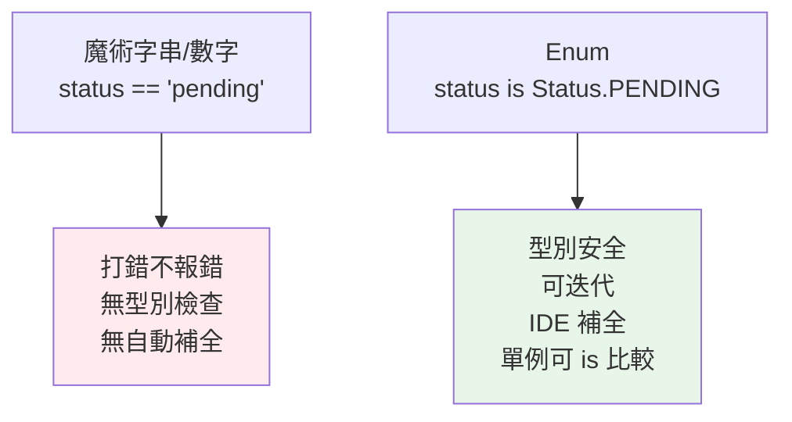

# Enum 列舉

> 當一個變數只該是「幾個固定選項之一」（狀態、顏色、星期），別用魔術字串或魔術數字——用 `Enum` 給它們具名、型別安全、可比較的常數。

## 💡 白話導讀（建議先讀）

點飲料時，甜度是「選單」：無糖、微糖、半糖、全糖——四選一，沒有「有點甜」這種自由發揮。

程式裡也常有這種「只該是固定幾個選項之一」的值：星期、狀態、顏色、方向。

菜鳥寫法是用**魔術數字或魔術字串**：`if status == 2:`——三個月後沒人記得 2 是什麼；字串打成 `"pendign"` 也不會有任何人報錯。

`Enum` 就是把「自由填空」換成「選單」：

```python
class Status(Enum):
    PENDING = 1
    PAID = 2
```

從此寫 `Status.PAID`——有名字、可讀、打錯字立刻報錯。

每個選項（成員）有兩個面向：**name**（名字，`'PAID'`）和 **value**（值，`2`）。
還有一個好性質：每個選項**全世界只有一份**（單例）——所以可以放心用 `is` 比較。

一句話：**值只該是固定選項之一時，用 Enum，不用魔術數字**。

## 🔗 前端對照

Python 的 `Enum` 對應 TypeScript 的 `enum`——都是「一組具名常數」。有趣的是,這是 TS 少數會**留到執行期**的型別特性:

| | Python `Enum` | TypeScript `enum` |
|---|---------------|-------------------|
| 定義 | `class Color(Enum): RED = 1` | `enum Color { RED = 1 }` |
| 取成員 | `Color.RED` | `Color.RED` |
| 執行期存在 | ✅ 是真的物件 | ✅（少數不被擦除的 TS 特性） |
| 走訪所有成員 | `for c in Color:` | `Object.values(Color)` |

一句話:概念與用法幾乎一樣。Python 的 `Enum` 成員是**功能完整的物件**（有 `.name` / `.value`、可自訂方法）;
TS 的 `enum` 較陽春,社群近年也常改用 `as const` 物件或 union 字面值取代。

## Why（為什麼）

程式裡到處是「魔術值」：`status == "pending"`、`if color == 1`。這些字串/數字散落各處，打錯 `"pendign"` 不會報錯、`1` 到底代表什麼要翻文件、IDE 也無法自動補全。**Enum（列舉）** 把「一組相關的具名常數」聚在一起，帶來：型別安全、可讀性、可迭代、IDE 支援。這是任何有「固定選項」的場景該用的工具，卻常被初學者忽略。

## Theory（理論：一組具名常數）

`Enum` 定義一組**具名的、唯一的常數成員**——程式裡的「選單」。每個成員有兩個面向：

- **name**：成員名稱（`Color.RED.name` → `'RED'`）。
- **value**：對應的值（`Color.RED.value` → `1`）。

Enum 成員是**單例**——`Color.RED is Color.RED` 永遠成立，所以能安全用 `is` 比較。

它那些特殊行為（不能實例化出新成員、成員唯一、可迭代）不是魔法：Enum 底層由 [metaclass](13-metaclass.md) 實作——正是上一章「在模具製造的瞬間動手腳」的實際應用。

## Specification（規範：定義各種 Enum）

```python
from enum import Enum, IntEnum, StrEnum, Flag, auto


class Color(Enum):
    RED = 1
    GREEN = 2
    BLUE = 3

class Priority(IntEnum):        # 成員「是」int，可與整數比較/運算
    LOW = 1
    HIGH = 10

class Status(StrEnum):          # 成員「是」str（3.11+）
    ACTIVE = "active"
    CLOSED = "closed"

class Weekday(Enum):
    MON = auto()                # auto() 自動賦值 1, 2, 3...
    TUE = auto()

class Permission(Flag):         # 可用位元運算組合的旗標
    READ = auto()
    WRITE = auto()
    EXECUTE = auto()
```

## Implementation（存取、比較、迭代、進階種類）

### 存取與比較

```pycon
>>> Color.RED
<Color.RED: 1>
>>> Color.RED.name, Color.RED.value
('RED', 1)
>>> Color(1)                 # 用 value 反查成員
<Color.RED: 1>
>>> Color["RED"]             # 用 name 反查
<Color.RED: 1>
>>> Color.RED is Color.RED   # 單例，用 is 比較
True
>>> Color.RED == Color.GREEN
False
```

用 `is` 或 `==` 比較 Enum 成員都可（成員是單例）。**別用成員的 value 做比較**（`if color.value == 1`）——那就失去 Enum 的意義了，直接 `if color is Color.RED`。

### 迭代與成員查詢

```pycon
>>> list(Color)              # 可迭代所有成員
[<Color.RED: 1>, <Color.GREEN: 2>, <Color.BLUE: 3>]
>>> [c.name for c in Color]
['RED', 'GREEN', 'BLUE']
>>> Color.RED in Color
True
```

「可迭代所有選項」對建下拉選單、驗證輸入很方便。

### IntEnum / StrEnum：與原生型別相容

普通 `Enum` 成員**不等於**它的原始值（`Color.RED != 1`）——這是好事（型別安全）。但有時你需要「它就是個 int/str」（如與資料庫、JSON、既有 API 相容）：

```pycon
>>> from enum import IntEnum
>>> class Priority(IntEnum):
...     LOW = 1
...     HIGH = 10
>>> Priority.HIGH > Priority.LOW      # 可比大小
True
>>> Priority.HIGH == 10               # 「是」int
True
>>> Priority.HIGH + 5                 # 可算術
15
```

`StrEnum`（3.11+）同理讓成員「是」str。取捨：`IntEnum`/`StrEnum` 方便相容，但少了型別隔離（可能與外部整數/字串意外相等）。純狀態選項優先用 `Enum`；需與外部數值/字串互通才用 Int/StrEnum。

### Flag：位元旗標組合

`Flag` 讓成員能用位元運算組合（權限、選項集合）：

```pycon
>>> from enum import Flag, auto
>>> class Perm(Flag):
...     READ = auto()
...     WRITE = auto()
...     EXECUTE = auto()
>>> access = Perm.READ | Perm.WRITE       # 組合
>>> Perm.READ in access                   # 檢查
True
>>> access
<Perm.READ|WRITE: 3>
```

### `auto()` 與唯一性保證

`auto()` 自動給值（省得手動編號）。`@enum.unique` 裝飾器確保沒有重複值的別名：

```python
from enum import Enum, unique

@unique
class Status(Enum):
    ACTIVE = 1
    CLOSED = 2
    # DONE = 1     # 有了 @unique 這會報錯（重複值）
```

## Code Example（可執行的 Python 範例）

```python
# enum_demo.py
from enum import Enum, IntEnum, auto, unique


@unique
class Status(Enum):
    PENDING = auto()
    ACTIVE = auto()
    CLOSED = auto()


class Priority(IntEnum):
    LOW = 1
    MEDIUM = 5
    HIGH = 10


def can_edit(status: Status) -> bool:
    """用 Enum 取代魔術字串，型別安全。"""
    return status is Status.ACTIVE


def demo() -> None:
    # 1. 具名、單例、可比較
    s = Status.ACTIVE
    print(f"name={s.name}, value={s.value}, 可編輯={can_edit(s)}")

    # 2. 反查與迭代
    print(f"由 name 反查: {Status['PENDING']}")
    print(f"所有狀態: {[st.name for st in Status]}")

    # 3. IntEnum 可比大小、與 int 相容
    print(f"HIGH > LOW: {Priority.HIGH > Priority.LOW}")   # True
    print(f"HIGH == 10: {Priority.HIGH == 10}")            # True

    # 4. 排序（IntEnum 可直接排）
    print(f"排序: {[p.name for p in sorted(Priority)]}")   # LOW, MEDIUM, HIGH


if __name__ == "__main__":
    demo()
```

**預期輸出**：

```pycon
$ python enum_demo.py
name=ACTIVE, value=2, 可編輯=True
由 name 反查: Status.PENDING
所有狀態: ['PENDING', 'ACTIVE', 'CLOSED']
HIGH > LOW: True
HIGH == 10: True
排序: ['LOW', 'MEDIUM', 'HIGH']
```

## Diagram（圖解：Enum 取代魔術值）



## Best Practice（最佳實踐）

- **有「固定選項集合」就用 Enum**：狀態、類型、模式、星期、顏色——取代魔術字串/數字。
- **用 `is` 或 `==` 比較成員**（成員是單例）；別比 `.value`（`if x is Status.ACTIVE`，不是 `x.value == 2`）。
- **純狀態選項用 `Enum`**（型別隔離）；**需與 DB/JSON/API 的整數或字串互通用 `IntEnum`/`StrEnum`**。
- **用 `auto()` 自動編號**，避免手動維護數字；用 `@unique` 防重複值。
- **成員名用 UPPER_CASE**（它們是常數）。
- **搭配型別註記**：`def f(s: Status)`，讓 mypy 檢查只傳合法成員（比 `str` 精確）。
- **需要位元組合（權限）用 `Flag`/`IntFlag`**。

## Common Mistakes（常見誤解）

- **繼續用魔術字串/數字**：散落、易打錯、無補全；Enum 正是解方。
- **比較 `.value` 而非成員**：`if color.value == 1` 失去 Enum 意義且脆弱；用 `if color is Color.RED`。
- **以為普通 `Enum` 成員等於其值**：`Color.RED == 1` 是 **False**（型別安全）；要相等需 `IntEnum`/`StrEnum`。
- **在 Enum 裡放可變預設或重複值當別名而不自知**：相同 value 的第二個成員會變成第一個的**別名**（除非 `@unique` 擋下）。
- **想動態新增成員**：Enum 定義後成員固定，不能實例化新成員。
- **用 `IntEnum` 卻忘了它會與任意 int 相等**：可能與外部數值意外相等，失去隔離；不需相容時用純 `Enum`。

## Interview Notes（面試重點）

- 說得出 Enum 的價值：**具名常數取代魔術值**，帶來型別安全、可讀、可迭代、IDE 支援；成員是**單例**（可用 `is` 比較）。
- 知道成員有 **name / value**，可用 `Color(value)` / `Color[name]` 反查、可迭代全部成員。
- **能區分 `Enum`（型別隔離，成員 ≠ 原值）vs `IntEnum`/`StrEnum`（成員「是」int/str，可與原生型別比較/運算，用於相容）**。
- 知道 **`auto()`（自動賦值）、`@unique`（防重複）、`Flag`（位元組合）**。
- 知道相同 value 的成員會變**別名**、Enum 底層由 metaclass 實作。

---

➡️ 下一章：[mixin 與組合優於繼承](15-mixin.md)

[⬆️ 回 Part 4 索引](README.md)
