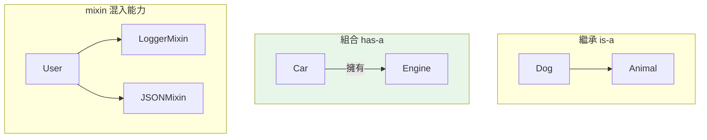

# mixin 與組合優於繼承

> mixin 是「只提供一小塊功能、不獨立使用」的類別，透過多重繼承「拌」進主類別。但更重要的原則是：能用組合就別用繼承——繼承綁定實作、組合保持彈性。

## 💡 白話導讀（建議先讀）

回到飲料店。奶茶是主體；珍珠、椰果、仙草是**配料**。

配料有兩個特徵：

- 每包只提供**一種小功能**（Q 彈口感、清爽嚼感）。
- **自己不能當一杯飲料**——沒有人單點一杯「珍珠」。

**mixin** 就是類別世界的配料：一個只提供一小塊功能的類別（「可序列化」「可比較」「有日誌」），不打算獨立使用，透過多重繼承「拌」進主類別——奶茶 + 珍珠 + 仙草，能力疊加，主體不變。

那**組合（composition）** 呢？它是另一種思路：
店裡「**有一台**」封口機——需要封口時，請機器代勞（術語叫「委派」）。
機器不是奶茶的一種，是奶茶店**擁有**的協作者。

兩者都能重用程式碼，差別在關係：

- mixin（繼承家族）：「我**是**（帶有這種能力的）一種東西」——is-a 的變體。
- 組合：「我**擁有**一個幫手」——has-a。

本章的最終原則，也是資深工程師的口頭禪：**能用組合就別用繼承**。
繼承把你和對方的實作綁死；組合只依賴對方的介面，保持彈性。

## Why（為什麼）

繼承很誘人（「重用父類別的程式碼」），但過度使用會造成**脆弱、緊耦合、難改**的深層階層。資深工程師的共識是「**組合優於繼承（composition over inheritance）**」。同時，Python 的多重繼承支援一種輕量的重用方式——**mixin**：把「可重用的一小塊能力」做成類別，需要時拌進去。這章講清楚 mixin 怎麼用、以及更根本的「何時該用繼承、何時該用組合」的判斷——這是設計良好 OOP 的核心能力。

## Theory（理論：mixin 與組合）

**mixin** 是一種特殊用途的類別——類別世界的「配料包」：

- 只提供**一小塊、聚焦的功能**（如「可序列化」「可比較」「有日誌」）。
- **不打算獨立實例化**，也不代表一個完整的「is-a」概念（沒有人單點一杯珍珠）。
- 透過**多重繼承**「混入」主類別（順序與查找規則見 [MRO](04-mro.md)）。

**組合（composition）** 則是另一條路：物件把其他物件**當屬性擁有**，需要時透過**委派（delegation）** 請它代勞——表達 **has-a** 關係（店裡有一台封口機）。

兩者都是「不重複程式碼」的手段，分野在關係的本質：

> 繼承說「我**是**一種父類別」；組合說「我**擁有**一個協作者」。

## Specification（規範：mixin 與組合的樣子）

```python
# --- mixin：混入能力 ---
class JSONSerializableMixin:
    def to_json(self) -> str:
        import json
        return json.dumps(self.__dict__)

class ReprMixin:
    def __repr__(self) -> str:
        return f"{type(self).__name__}({self.__dict__})"

class User(ReprMixin, JSONSerializableMixin):   # mixin 放前面，主類別在後
    def __init__(self, name: str) -> None:
        self.name = name


# --- 組合：擁有協作者 ---
class Engine:
    def start(self) -> str:
        return "引擎啟動"

class Car:
    def __init__(self) -> None:
        self.engine = Engine()          # has-a
    def start(self) -> str:
        return self.engine.start()      # 委派
```

## Implementation（mixin 慣例、組合的優勢、如何選）

### mixin 的慣例

- **命名以 `Mixin` 結尾**（`LoggerMixin`），表達「這是混入用的、不獨立使用」。
- **放在繼承列表的前面**：`class Service(LoggerMixin, BaseService)`——因 MRO 由左到右，mixin 在前才能覆寫/補強主類別的行為。
- **聚焦單一能力**：一個 mixin 做一件事，可自由組合多個。
- **常依賴主類別提供某些屬性/方法**：mixin 常「假設」宿主有某些東西（如上例假設有 `__dict__`），這是它的隱性契約。

### 「繼承綁定實作」的問題

繼承讓子類別**緊緊依賴父類別的內部**：父類別改了，子類別可能壞（脆弱基底類別問題）。而且繼承是「靜態」的——一個類別的父類別在定義時就固定。深層階層更是難以推理（要追好幾層才知道某方法從哪來）。

### 組合的優勢

```python
# 繼承：Stack is-a list？——但這樣 Stack 意外暴露了 list 的所有方法（如 insert）
class Stack(list):
    def push(self, x): self.append(x)
    def pop(self): return super().pop()
# stack.insert(0, x)  ← 不該有的操作也能用！

# 組合：Stack has-a list——只暴露該有的介面
class Stack:
    def __init__(self) -> None:
        self._items: list = []
    def push(self, x: object) -> None:
        self._items.append(x)
    def pop(self) -> object:
        return self._items.pop()
```

組合的好處：**只暴露你想要的介面**（封裝）、**可在執行期抽換協作者**（彈性）、**降低耦合**（改 list 實作不影響 Stack 的使用者）。

### 如何選：is-a vs has-a

| 問句 | 用 |
|------|-----|
| A **是一種** B 嗎？（Dog is-a Animal） | 繼承 |
| A **擁有/使用** B 嗎？（Car has-a Engine） | 組合 |
| 想混入「一塊可重用能力」而非完整概念 | mixin |
| 想在執行期抽換行為 | 組合（+ 策略模式） |

**準則**：預設傾向組合；繼承只用於清楚的 is-a 且真的需要多型替換時。mixin 是繼承的「輕量、聚焦」用法，適合橫切能力（日誌、序列化、比較）。

## Code Example（可執行的 Python 範例）

```python
# mixin_composition_demo.py
from __future__ import annotations

import json


# --- mixin：可重用的橫切能力 ---
class DictReprMixin:
    def __repr__(self) -> str:
        return f"{type(self).__name__}({self.__dict__})"


class JSONMixin:
    def to_json(self) -> str:
        return json.dumps(self.__dict__, ensure_ascii=False)


class User(DictReprMixin, JSONMixin):     # 混入兩種能力
    def __init__(self, name: str, age: int) -> None:
        self.name = name
        self.age = age


# --- 組合：只暴露該有的介面 ---
class Stack:
    def __init__(self) -> None:
        self._items: list[object] = []      # has-a list

    def push(self, item: object) -> None:
        self._items.append(item)

    def pop(self) -> object:
        return self._items.pop()

    def __len__(self) -> int:
        return len(self._items)


def demo() -> None:
    # mixin 提供的能力
    u = User("Alice", 30)
    print(f"repr: {u!r}")                   # User({'name': 'Alice', 'age': 30})
    print(f"json: {u.to_json()}")

    # 組合：Stack 只暴露 push/pop，不像繼承 list 那樣洩漏 insert 等
    s = Stack()
    s.push(1)
    s.push(2)
    print(f"pop: {s.pop()}, 剩下: {len(s)}")  # pop: 2, 剩下: 1
    print(f"Stack 有 insert 嗎? {hasattr(s, 'insert')}")   # False（封裝良好）


if __name__ == "__main__":
    demo()
```

**預期輸出**：

```pycon
$ python mixin_composition_demo.py
repr: User({'name': 'Alice', 'age': 30})
json: {"name": "Alice", "age": 30}
pop: 2, 剩下: 1
Stack 有 insert 嗎? False
```

## Diagram（圖解：繼承 vs 組合 vs mixin）



## Best Practice（最佳實踐）

- **預設傾向組合**：問「is-a 還是 has-a」；has-a 用組合，降低耦合、保持彈性、只暴露需要的介面。
- **繼承只用於清楚的 is-a + 需要多型替換**：且保持階層淺。
- **橫切能力做成 mixin**：日誌、序列化、比較、快取等「拌」進多個類別的功能；命名 `XxxMixin`、放繼承列表前面。
- **mixin 保持聚焦單一**：一個 mixin 一件事，方便自由組合；並文件化它對宿主的隱性依賴。
- **別繼承內建容器來「加方法」**（`class MyList(list)`）：會洩漏所有原方法；用組合包一層只暴露想要的。
- **需要執行期抽換行為 → 組合 + 策略模式**（把行為做成可注入的物件，見 [依賴注入](../16-architecture/03-dependency-injection.md)）。

## Common Mistakes（常見誤解）

- **凡重用就繼承**：造成緊耦合、脆弱基底、深層難懂的階層；很多情況組合更好。
- **繼承內建型別加功能**：`class Stack(list)` 讓 Stack 意外擁有 `insert`/`sort` 等不該有的操作；用組合封裝。
- **mixin 放在繼承列表後面**：MRO 由左到右，mixin 該在**前面**才能正確覆寫主類別行為。
- **mixin 做太多事 / 可獨立實例化**：那就不是 mixin 了，是普通類別；mixin 應聚焦且不獨立使用。
- **忽略 mixin 的隱性契約**：mixin 常假設宿主有某些屬性/方法，忘了提供會出錯。
- **深繼承階層**：五六層繼承難以維護；扁平化 + 組合更清楚。

## Interview Notes（面試重點）

- 能講「**組合優於繼承**」的理由：繼承綁定實作、緊耦合、脆弱基底、階層難懂；組合封裝好、彈性、可執行期抽換。
- 用 **is-a（繼承）vs has-a（組合）** 判斷該用哪個。
- 說得出 **mixin** 是什麼：聚焦單一能力、不獨立使用、透過多重繼承混入；命名 `XxxMixin`、**放繼承列表前面**（MRO 順序）。
- 能舉「**繼承 list 加方法** 的壞處」（洩漏原方法）與組合的修正。
- 知道**需要執行期抽換行為時用組合 + 策略模式**，連結依賴注入。

---

你已掌握 Python 的物件模型：class/instance、屬性系統與 `__dict__`、繼承與 MRO、封裝、property 與描述器、三種方法、魔術方法、dataclass、ABC、`__new__`、metaclass、Enum，以及「組合優於繼承」的設計判斷。
接下來 [Part 5 型別系統](../05-typing/README.md) 將進入 type hints、泛型、Protocol 與 mypy。


➡️ 下一章：[Part 4 統整：物件導向全貌](16-summary.md)

[⬆️ 回 Part 4 索引](README.md)
