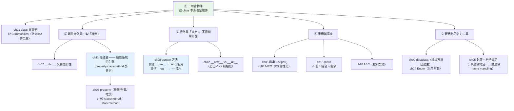

# Part 4 統整：物件導向全貌

> 把這 15 章串成一張圖——Python 的 OOP 不是「照抄 Java」，它建立在兩件事上：**一切皆物件**，以及**協定驅動**。

## 🗺️ 知識地圖（這 15 章怎麼串起來）

如果你帶著 Java/C++ 的 OOP 觀念來讀 Part 4，會覺得 Python「少了很多東西」
（沒有 `private`、沒有 `interface`、沒有型別宣告）。
但那不是「缺陷」——**Python 用另一套哲學做同一件事**：



**一句話串起來**：

Python 的 OOP 有**兩根支柱**：

1. **一切皆物件**——連 `class` 都是物件（由 metaclass 造出來，ch13）。
   所以 class 可以被賦值、傳遞、動態建立。
2. **協定（protocol）驅動**——你的物件能不能用 `len()`、能不能用 `+`、能不能放進 `set`，
   **取決於你有沒有實作對應的 dunder 方法**（ch08），而不是「有沒有繼承某個介面」。

而 [ch11 描述器](11-descriptors.md) 是這一切底下的**引擎**——
`@property`、`@classmethod`、甚至「方法」本身，**全都是描述器**。
搞懂它，你就看懂了 Python 屬性系統的底層。

至於「封裝」，Python 選了**君子協定**（`_private` 只是約定，ch05）而非強制。
「介面」則有兩種做法：**鴨子型別**（長得像就算數）或 **ABC**（強制契約，ch10）。

## ⚡ 速查表（什麼情境用什麼）

| 情境 | 用什麼 | 章節 |
|------|--------|------|
| 只是「一包資料」的類別 | **`@dataclass`**（自動生 `__init__`/`__repr__`/`__eq__`） | [ch09](09-dataclass.md) |
| 想讓資料類別**不可變、可當 key** | `@dataclass(frozen=True)` → hashable（呼應 [Part 3](../03-data-structures/07-hashable.md)） | [ch09](09-dataclass.md) |
| 一個變數只能是「幾個固定選項之一」 | **`Enum`**（別用魔術字串／數字） | [ch14](14-enum.md) |
| 屬性要驗證／要計算／要唯讀 | **`@property`** | [ch06](06-property.md) |
| **同一套屬性邏輯要重複用在很多屬性上** | **描述器**（寫一次，到處掛） | [ch11](11-descriptors.md) |
| 類別有多種建立方式（從 JSON、從字串…） | **`@classmethod` 當替代建構子**（回傳 `cls(...)`，子類別也適用） | [ch07](07-classmethod-staticmethod.md) |
| 想讓物件支援 `len()` / `+` / `==` / `in` / `with` | 實作對應的 **dunder 方法** | [ch08](08-dunder-methods.md) |
| 想讓物件能被 `print` 出有用的資訊 | 實作 `__repr__`（**永遠先做這個**） | [ch08](08-dunder-methods.md) |
| 想強制子類別「必須實作某些方法」 | **ABC + `@abstractmethod`**（漏實作 → 無法實例化） | [ch10](10-abc.md) |
| 只想標「這是內部用的」 | 單底線 `_name`（**君子協定**，不是強制） | [ch05](05-encapsulation.md) |
| 子類別要擴充父類別的行為 | **`super().method()`**（別寫死 `Base.method(self)`——多重繼承會出事） | [ch03](03-inheritance.md) |
| 多重繼承下搞不清方法從哪來 | 看 **`Cls.__mro__`**；`super()` 沿 MRO 走 | [ch04](04-mro.md) |
| 想「拌」一小塊功能進類別 | mixin——但**先問：能不能改用組合？** | [ch15](15-mixin.md) |
| 想控制「實例怎麼被造出來」（單例、快取實例） | `__new__`（多數時候你只需要 `__init__`） | [ch12](12-new-and-init.md) |
| 想在「class 被建立時」動手腳 | 先試 `__init_subclass__` 或類別裝飾器——**metaclass 是最後手段** | [ch13](13-metaclass.md) |

## 🔑 核心心智模型（帶得走的幾句話）

- **一切皆物件，連 class 也是。** class 由 metaclass 造出來（預設是 `type`），
  所以 class 能被賦值、傳參、動態產生——這是 Django ORM、pydantic 這類框架的魔法來源。
- **Python 靠「協定」而非「介面繼承」。** 你的物件想被 `len()` 呼叫？實作 `__len__` 就好，
  **不必繼承任何東西**。這就是「鴨子型別」的正式版：**長得像，就算數**。
- **描述器是屬性系統的引擎。** `@property`、`@classmethod`、`@staticmethod`、
  `functools.cached_property`、甚至**方法本身**——全都是描述器。
  它們不是特例，是同一套協定的不同應用。
- **`super()` 不是「呼叫父類別」，是「沿著 MRO 走下一個」。**
  在多重繼承（菱形）下，`Left` 的 `super()` 可能跑到 **`Right`** 而不是 `Base`——
  下面的小實作會讓你親眼看到。
- **封裝在 Python 是君子協定。** `_x` 只是「請別碰」的約定；`__x` 是 name mangling
  （改名成 `_Cls__x`，防的是**意外覆蓋**，不是惡意存取）。**Python 相信你是成年人。**
- **能用組合，就別用繼承。** 繼承把子類別**綁死在父類別的實作**上；組合保持彈性。
  這是 [Part 16 架構](../16-architecture/05-solid.md) 會反覆出現的原則。

## 🛠️ 小實作：一支腳本走完 Part 4 的四根支柱

```python
# oop_demo.py —— Part 4 主線：協定驅動 + 一切皆物件
from __future__ import annotations

from dataclasses import dataclass


# ── ch11 描述器：把「驗證邏輯」抽成可重用物件（property 的通用版）──
class Positive:
    """一個可重用的『必須為正數』驗證器——寫一次，掛在任何屬性上。"""

    def __set_name__(self, owner: type, name: str) -> None:
        self._name = f"_{name}"          # 記住自己被掛在哪個屬性名上

    def __get__(self, obj: object, objtype: type | None = None) -> float:
        return getattr(obj, self._name)

    def __set__(self, obj: object, value: float) -> None:
        if value <= 0:
            raise ValueError(f"必須為正數，收到 {value}")
        setattr(obj, self._name, value)


class Product:
    price = Positive()      # 同一個描述器…
    weight = Positive()     # …掛在兩個屬性上，驗證邏輯只寫一次

    def __init__(self, name: str, price: float, weight: float) -> None:
        self.name = name
        self.price = price      # 這一行會走 Positive.__set__
        self.weight = weight


# ── ch09 dataclass + ch08 dunder 協定 + ch07 classmethod ──
@dataclass(frozen=True)     # frozen → 不可變 → hashable（呼應 Part 3 的主線！）
class Money:
    amount: int
    currency: str = "TWD"

    def __add__(self, other: Money) -> Money:
        """ch08：實作 __add__，你的物件就能用 + 運算子。"""
        if self.currency != other.currency:
            raise ValueError("幣別不同")
        return Money(self.amount + other.amount, self.currency)

    @classmethod
    def from_string(cls, text: str) -> Money:
        """ch07：替代建構子——回傳 cls(...)，子類別繼承後也適用。"""
        amount, currency = text.split()
        return cls(int(amount), currency)


# ── ch03 / ch04：菱形繼承下，super() 沿 MRO 走 ──
class Base:
    def greet(self) -> str:
        return "Base"


class Left(Base):
    def greet(self) -> str:
        return f"Left → {super().greet()}"      # 這個 super() 會跑去哪？


class Right(Base):
    def greet(self) -> str:
        return f"Right → {super().greet()}"


class Diamond(Left, Right):
    pass


def demo() -> None:
    print("【ch11 描述器】同一個驗證器，掛在兩個屬性上")
    product = Product("滑鼠", price=590, weight=0.1)
    print(f"  建立成功: {product.name} 價格={product.price}")
    try:
        Product("壞商品", price=-1, weight=1)
    except ValueError as exc:
        print(f"  price=-1 → ValueError: {exc}")

    print("\n【ch09 dataclass + ch08 dunder + ch07 classmethod】")
    a = Money.from_string("100 TWD")
    b = Money(50)
    print(f"  Money.from_string('100 TWD') → {a}")      # __repr__ 免費得到
    print(f"  a + b  → {a + b}")                         # __add__ 讓 + 能用
    print(f"  a == Money(100) → {a == Money(100)}")      # __eq__ 免費得到
    orders = {a: "訂單#1"}                                # frozen → hashable → 能當 key
    print(f"  frozen → 不可變 → hashable → 能當 key: orders[a] = {orders[a]}")

    print("\n【ch03/ch04 MRO】菱形繼承：super() 沿 MRO 走，不是往「字面父類別」走")
    print(f"  Diamond().greet() → {Diamond().greet()}")
    print(f"  MRO: {' → '.join(cls.__name__ for cls in Diamond.__mro__[:-1])}")


if __name__ == "__main__":
    demo()
```

**預期輸出**：

```pycon
$ python oop_demo.py
【ch11 描述器】同一個驗證器，掛在兩個屬性上
  建立成功: 滑鼠 價格=590
  price=-1 → ValueError: 必須為正數，收到 -1

【ch09 dataclass + ch08 dunder + ch07 classmethod】
  Money.from_string('100 TWD') → Money(amount=100, currency='TWD')
  a + b  → Money(amount=150, currency='TWD')
  a == Money(100) → True
  frozen → 不可變 → hashable → 能當 key: orders[a] = 訂單#1

【ch03/ch04 MRO】菱形繼承：super() 沿 MRO 走，不是往「字面父類別」走
  Diamond().greet() → Left → Right → Base
  MRO: Diamond → Left → Right → Base
```

**最值得停下來看的是最後一段**：

`Left.greet()` 裡的 `super()`，跑去的是 **`Right`**——**不是它的字面父類別 `Base`**！

這證明了 [ch04](04-mro.md) 的核心論點：
**`super()` 的意思是「MRO 上的下一個」，而不是「我的父類別」**。
`Diamond` 的 MRO 是 `Diamond → Left → Right → Base`，
所以 `Left` 的下一站就是 `Right`。
**這正是菱形繼承不會把 `Base` 執行兩次的原因**——也是為什麼多重繼承時，
每個類別都該乖乖呼叫 `super()`（而不是寫死 `Base.greet(self)`）。

## ✅ 自測清單（答不出來就回去讀）

- [ ] `self` 到底是什麼？為什麼方法的第一個參數要寫它？（[ch01](01-class-and-instance.md)）
- [ ] class 屬性和 instance 屬性差在哪？寫錯會出什麼事？（[ch01](01-class-and-instance.md)）
- [ ] 「方法」其實是什麼？為什麼 `obj.method` 拿到的是「綁定了實例的函式」？（[ch02](02-attributes-and-methods.md)）
- [ ] `super()` 該怎麼用？為什麼不該寫死 `Base.method(self)`？（[ch03](03-inheritance.md)）
- [ ] 菱形繼承下，`super()` 會走到哪？為什麼不是字面父類別？（[ch04](04-mro.md)）
- [ ] Python 的 `__private` 真的私有嗎？它實際做了什麼？（[ch05](05-encapsulation.md)）
- [ ] `@property` 解決什麼問題？和「直接開放屬性」比有什麼好處？（[ch06](06-property.md)）
- [ ] `@classmethod` 和 `@staticmethod` 何時各用哪個？（[ch07](07-classmethod-staticmethod.md)）
- [ ] 實作 `__eq__` 之後，為什麼「必須」也實作 `__hash__`？（[ch08](08-dunder-methods.md)、[Part 3 ch07](../03-data-structures/07-hashable.md)）
- [ ] `@dataclass` 幫你自動生了哪些方法？`frozen=True` 有什麼副作用（好的那種）？（[ch09](09-dataclass.md)）
- [ ] ABC 和 Protocol 差在哪？什麼時候該用哪個？（[ch10](10-abc.md)、[Part 5 ch06](../05-typing/06-protocol.md)）
- [ ] 描述器是什麼？`@property` 和它是什麼關係？（[ch11](11-descriptors.md)）
- [ ] `__new__` 和 `__init__` 的分工？什麼時候你才需要碰 `__new__`？（[ch12](12-new-and-init.md)）
- [ ] 什麼時候該用 metaclass？（陷阱題——[ch13](13-metaclass.md)）
- [ ] 為什麼說「能用組合就別用繼承」？（[ch15](15-mixin.md)）

## 🎯 面試速查

| 考點 | 面試官想聽到什麼 | 章節 |
|------|------------------|------|
| **`super()` 是在呼叫父類別嗎？** | 「**不是**。`super()` 是『沿著 **MRO** 走下一個』。單一繼承下剛好等於父類別，但**多重繼承（菱形）下不是**——`Left` 的 `super()` 可能跑到 `Right`。這正是 C3 線性化保證『每個類別只被執行一次』的機制。」 | [ch04](04-mro.md) |
| **MRO 怎麼算的？** | 「**C3 線性化**。保證：子類別先於父類別、多個父類別維持宣告順序、且**每個類別只出現一次**。用 `Cls.__mro__` 可以直接看。」 | [ch04](04-mro.md) |
| **Python 有 private 嗎？** | 「**沒有強制的**。單底線 `_x` 是**君子協定**；雙底線 `__x` 是 **name mangling**（改名成 `_Cls__x`），目的是**防止子類別意外覆蓋**，不是防惡意存取——外面照樣拿得到。Python 的哲學是『我們都是成年人』。」 | [ch05](05-encapsulation.md) |
| **`@property` 為什麼比 getter/setter 好？** | 「因為**呼叫端不用改**。一開始開放屬性 `obj.x`，之後要加驗證，改成 `@property` 即可——**外部程式碼一行都不用動**。Java 要先寫 getter 是因為它沒有這個機制。」 | [ch06](06-property.md) |
| **實作 `__eq__` 後為什麼要實作 `__hash__`？** | 「因為 Python 會把 `__hash__` 設成 `None`（讓物件變 unhashable）——避免『相等的物件卻有不同雜湊值』破壞 dict/set 的正確性。契約是：**`a == b` ⟹ `hash(a) == hash(b)`**。」 | [ch08](08-dunder-methods.md) |
| **描述器是什麼？** | 「一個實作了 `__get__`／`__set__`／`__delete__` 的物件，用來**接管屬性存取**。`@property`、`@classmethod`、`@staticmethod`、甚至**方法本身**全是描述器——它是 Python 屬性系統的**底層引擎**。」 | [ch11](11-descriptors.md) |
| **`__new__` vs `__init__`？** | 「`__new__` **造出**實例（回傳物件），`__init__` **初始化**它（回傳 `None`）。99% 只需要 `__init__`。要碰 `__new__` 的場合：單例、實例快取、繼承不可變型別（`int`/`str`/`tuple`）。」 | [ch12](12-new-and-init.md) |
| **什麼時候用 metaclass？** | 「**幾乎永遠不用**。有句話：『如果你在猶豫要不要用 metaclass，你就不需要。』先試 `__init_subclass__`、類別裝飾器、描述器。真正用它的是**框架內部**（Django ORM、早期 pydantic）——在 class 建立時掃描欄位、註冊映射。」 | [ch13](13-metaclass.md) |

---

🎉 **恭喜完成 Part 4！** 你已經看穿 Python 物件模型的底層——
**協定驅動、描述器當引擎、連 class 都是物件**。

接下來 [Part 5 型別系統](../05-typing/README.md) 要處理一個矛盾：
Python 是動態型別的，那**型別註記（type hints）** 到底在幹嘛？
你會發現它不改變執行期行為，卻能在**上線前**就抓出一整類 bug——
而本 Part 的 ABC，將在那裡遇到它的靜態版對手：**Protocol**。

➡️ 下一 Part：[型別系統 Typing](../05-typing/README.md)

[⬆️ 回 Part 4 索引](README.md)
