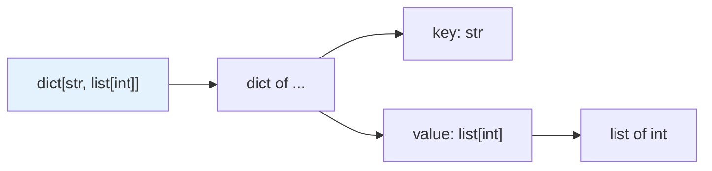

# 基本型別註記

> 為什麼有些教學寫 `List[int]`（大寫、要 import），有些寫 `list[int]`（小寫、免 import）？從 Python 3.9 起，後者才是正解。這章講內建容器泛型、可呼叫型別，以及 `from __future__ import annotations` 那個延遲評估的開關。

## 💡 白話導讀（建議先讀）

上一章說型別註記是「箱子上的標籤」。這一章教你**標籤的寫法**。

單一值很直觀：`x: int` 就是「x 是一個 int」。

容器稍微多一步——光說「這是一個箱子」不夠，要說**「這是一個裝什麼的箱子」**：

- `list[int]`——裝 int 的 list
- `dict[str, int]`——鍵是 str、值是 int 的 dict
- `tuple[int, str]`——第一格 int、第二格 str 的 tuple

方括號讀作「裝著⋯⋯的」，這個念法可以帶你走完全章。

一個歷史包袱要先知道，免得看舊程式碼困惑：
**Python 3.9 之前**，這些標籤要用「進口版」——`from typing import List` 然後寫 `List[int]`（大寫 L）。
**3.9 之後直接用內建的小寫 `list[int]` 就好**——舊的大寫版已經是過時寫法，看到它知道是老程式碼即可，自己別再寫。

這章還會教兩個常用標籤：函式本身怎麼標（`Callable`）、以及「什麼都可能」的萬用標籤 `Any`（和為什麼要少用它）。

## Why（為什麼）

型別註記的「詞彙」就是各種型別的寫法。寫錯或用了過時語法（`List[int]` vs `list[int]`）會讓程式看起來老舊、或在舊版出錯。這章把最常用的註記語法一次講清楚：基本型別、容器泛型、巢狀、可呼叫、以及現代簡化語法，讓你之後的每一個註記都寫得對、寫得現代。

## Theory（理論：型別即註記）

Python 的型別註記直接**用型別本身**當標籤：`x: int` 裡的 `int`，就是那個內建的 int 型別——不是字串、不是別的符號。

容器則用**下標語法**表達「裝什麼的容器」：`list[int]` 讀作「裝 int 的 list」。

兩個版本分水嶺：

- **Python 3.9（PEP 585）** 起：內建容器（`list`/`dict`/`set`/`tuple`）可**直接下標**當泛型——不必再從 `typing` import 大寫版本（`List`、`Dict` 已過時）。
- **Python 3.10（PEP 604）** 起：聯集可寫 `X | Y`（見 [Optional 與 Union](04-optional-union.md)）。

一句話：**現代寫法用小寫內建 + `|`，大寫 typing 容器是歷史**。

## Specification（規範：常用註記速覽）

```python
# 基本型別
x: int
y: float
s: str
b: bool
n: None                       # 通常用於回傳：-> None

# 容器泛型（3.9+ 直接用內建，不需 typing.List）
nums: list[int]
names: dict[str, int]         # key: str, value: int
tags: set[str]
pair: tuple[int, str]         # 固定長度、各位置型別
row: tuple[int, ...]          # 不定長度、全 int

# 巢狀
matrix: list[list[float]]
config: dict[str, list[int]]

# 可呼叫
from collections.abc import Callable
handler: Callable[[int, str], bool]   # 接收 (int, str)，回傳 bool
factory: Callable[[], int]            # 無參數，回傳 int

# 可能是 None（3.10+）
maybe: str | None
```

## Implementation（內建泛型、Callable、Any、延遲評估）

### 內建容器泛型（3.9+）：別再用 `typing.List`

```python
# ❌ 舊寫法（3.8 以前才需要，現在過時）
from typing import List, Dict, Tuple
def f(x: List[int]) -> Dict[str, int]: ...

# ✅ 現代寫法（3.9+）
def f(x: list[int]) -> dict[str, int]: ...
```

新程式一律用小寫內建（`list`/`dict`/`set`/`tuple`）；`typing.List` 等已被棄用（雖仍可用）。這是最常見的「新舊差異」考點。

### tuple 的兩種寫法

```python
point: tuple[int, int]          # 剛好兩個元素：(x, y)
rgb: tuple[int, int, int]       # 剛好三個
row: tuple[int, ...]            # 任意數量、都是 int（... 表示可變長度）
```

固定結構用「逐位置」寫法、同質不定長用 `...`。

### Callable：函式型別

`Callable[[參數型別...], 回傳型別]` 描述「可呼叫物件」：

```python
from collections.abc import Callable

def apply(func: Callable[[int], int], value: int) -> int:
    return func(value)

apply(lambda x: x * 2, 5)      # OK
```

`Callable[..., int]`（`...` 表示「參數不限」）用於不在意參數簽章時。更精確的參數關聯用 `ParamSpec`（見 [進階泛型](10-advanced-generics.md)）。從 `collections.abc` import `Callable`（`typing.Callable` 已是別名）。

### `Any`：關閉檢查的逃生艙

`Any` 相容任何型別、也被任何型別接受——等於「這裡不檢查」：

```python
from typing import Any

def parse(data: Any) -> Any:    # mypy 對 Any 不做檢查
    return data
```

`Any` 是漸進式型別的逃生艙，用於「真的無法或不想標型別」的地方。但**濫用 Any 等於放棄型別檢查**——它會像病毒一樣讓經過的值都變成不檢查。優先用更精確的型別（如 `object`、Protocol、泛型）。

### `Any` vs `object`

- **`Any`**：關閉檢查，可對它做任何操作（mypy 不管）。
- **`object`**：所有型別的共同基底，但**只能做 object 有的操作**（mypy 會限制）。想「接受任何東西但仍要安全」用 `object`（配合 `isinstance` 窄化，見 [型別窄化](11-overload-cast-narrowing.md)）。

### `from __future__ import annotations`：延遲評估

放在檔案頂端，讓所有註記**變成字串、不在定義時求值**（PEP 563）。好處：

- 可用「尚未定義」的型別（如類別方法回傳自己、前向參照），不必寫引號。
- 避免某些 import 循環與執行期開銷。

```python
from __future__ import annotations

class Node:
    def add_child(self, node: Node) -> Node:   # 不需寫 "Node"（延遲評估）
        ...
```

沒有這行時，引用「還沒定義完的類別」要用字串 `-> "Node"`。現代程式常直接加這行，一勞永逸。

## Code Example（可執行的 Python 範例）

```python
# annotations_demo.py
from __future__ import annotations

from collections.abc import Callable


def process_scores(scores: dict[str, list[int]]) -> dict[str, float]:
    """巢狀容器註記：名字 → 分數列表，回傳名字 → 平均。"""
    return {name: sum(vals) / len(vals) for name, vals in scores.items()}


def transform(items: list[int], fn: Callable[[int], int]) -> list[int]:
    """Callable 註記：接受一個 int→int 的函式。"""
    return [fn(x) for x in items]


def make_point() -> tuple[int, int]:
    """固定長度 tuple。"""
    return (3, 4)


class LinkedNode:
    """延遲評估讓方法能引用自己的類別（不需引號）。"""

    def __init__(self, value: int) -> None:
        self.value = value
        self.next: LinkedNode | None = None

    def append(self, node: LinkedNode) -> LinkedNode:
        self.next = node
        return node


def demo() -> None:
    avg = process_scores({"Alice": [90, 85], "Bob": [70, 80]})
    print(f"平均: {avg}")

    doubled = transform([1, 2, 3], lambda x: x * 2)
    print(f"轉換: {doubled}")

    print(f"座標: {make_point()}")

    head = LinkedNode(1)
    head.append(LinkedNode(2))
    print(f"鏈結: {head.value} -> {head.next.value if head.next else None}")


if __name__ == "__main__":
    demo()
```

**預期輸出**：

```pycon
$ python annotations_demo.py
平均: {'Alice': 87.5, 'Bob': 75.0}
轉換: [2, 4, 6]
座標: (3, 4)
鏈結: 1 -> 2
```

## Diagram（圖解：容器泛型的讀法）



## Best Practice（最佳實踐）

- **用內建小寫容器泛型**（`list[int]`、`dict[str, int]`）——3.9+ 的標準；別再用 `typing.List`。
- **檔案頂端加 `from __future__ import annotations`**：支援前向參照、避免引號、減少 import 問題。
- **`Callable` 從 `collections.abc` import**，精確標出參數與回傳。
- **盡量避免 `Any`**：它關閉檢查、會擴散；用 `object`（配 isinstance 窄化）、Protocol 或泛型替代。
- **tuple 依用途選寫法**：固定結構逐位置、同質不定長用 `tuple[T, ...]`。
- **重點註記在函式邊界**：參數、回傳、類別屬性；區域變數多半可省。

## Common Mistakes（常見誤解）

- **還在用 `typing.List`/`Dict`**：3.9+ 用內建小寫；大寫版已棄用。
- **`tuple[int]` 以為是「int 的 tuple」**：那是「剛好一個 int 的 tuple」；不定長要 `tuple[int, ...]`。
- **前向參照沒加 `from __future__ import annotations` 也沒加引號**：`NameError`；加那行或寫 `"ClassName"`。
- **濫用 `Any`**：讓型別檢查形同虛設，錯誤悄悄溜過。
- **混淆 `Any` 與 `object`**：Any 不檢查、可任意操作；object 安全但只能做 object 的操作。
- **`Callable` 參數寫錯**：`Callable[int, str]`（漏了內層方括號）是錯的；要 `Callable[[int], str]`。

## Interview Notes（面試重點）

- 知道 **3.9+ 用內建小寫容器泛型**（`list[int]`），`typing.List` 已過時（PEP 585）。
- 會寫**巢狀容器、`tuple` 的固定/不定長兩種寫法、`Callable[[...], R]`**。
- 說得出 **`Any`（關閉檢查、會擴散）vs `object`（安全、受限）** 的差別，並知道該少用 Any。
- 知道 **`from __future__ import annotations`（PEP 563）** 讓註記延遲評估，支援前向參照。
- 知道 `Callable` 應從 `collections.abc` import。

---

➡️ 下一章：[typing 模組](03-typing-module.md)

[⬆️ 回 Part 5 索引](README.md)
