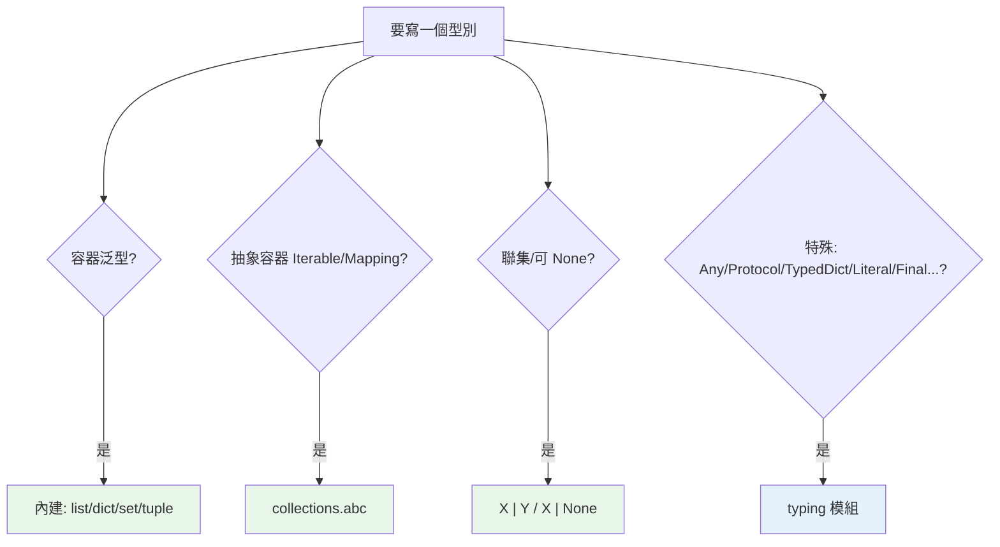

# typing 模組

> 內建型別能表達大部分註記，但 `typing` 模組提供了更豐富的詞彙：`Any`、`Optional`、`Callable`、`Iterator`、`TypeAlias` 等。知道哪些已被內建取代、哪些仍需 typing，是寫現代註記的關鍵。

## Why（為什麼）

`typing` 模組是型別註記的「進階詞彙庫」。但它經歷了多次演進——很多曾經只能從 `typing` import 的東西（`List`、`Dict`），現在被內建取代了；有些搬去了 `collections.abc`。不搞清楚「現在該從哪 import 什麼」，你會寫出過時或混亂的註記。這章釐清 typing 模組的現況：哪些還要用、哪些已淘汰、以及型別別名的用法。

## Theory（理論：typing 的定位與演進）

`typing` 模組提供「內建型別表達不了」的型別構造：特殊型別（`Any`、`Never`）、型別運算子（`Union`、`Optional`）、泛型工具（`TypeVar`、`Generic`）、型別別名等。

但隨著語言演進，很多東西「畢業」到更自然的位置：

- **容器泛型** → 用內建（`list[int]`，3.9+），`typing.List` 已棄用。
- **抽象容器型別**（`Iterable`、`Iterator`、`Mapping`…）→ 從 `collections.abc` import，`typing` 版是別名。
- **聯集** → 用 `X | Y`（3.10+），比 `Union[X, Y]` 簡潔。

所以現代用法是「**能用內建/運算子就用，剩下的才找 typing**」。

## Specification（規範：現況對照表）

| 你要的 | 現代寫法（推薦） | 舊/過時 |
|--------|------------------|---------|
| list of int | `list[int]` | `typing.List[int]` |
| dict | `dict[str, int]` | `typing.Dict` |
| 聯集 | `X \| Y` (3.10+) | `typing.Union[X, Y]` |
| 可能 None | `X \| None` | `typing.Optional[X]` |
| 可呼叫 | `collections.abc.Callable` | `typing.Callable` |
| 可迭代 | `collections.abc.Iterable` | `typing.Iterable` |
| 任意型別 | `typing.Any` | （仍在 typing） |
| 型別別名 | `typing.TypeAlias` / `type X =`(3.12) | 直接賦值 |

**仍需從 `typing` import 的常客**：`Any`、`TypeVar`（3.12 前）、`Generic`、`Protocol`、`TypedDict`、`Literal`、`Final`、`Annotated`、`ClassVar`、`cast`、`overload`、`NamedTuple`、`Never`/`NoReturn`。

## Implementation（型別別名、常用 typing 成員）

### 型別別名（Type Alias）：給複雜型別取名字

當一個型別註記又長又重複，取個別名：

```python
# 直接賦值（傳統）
Vector = list[float]
Matrix = list[list[float]]

def scale(v: Vector, factor: float) -> Vector: ...

# 明確標註是別名（typing.TypeAlias，3.10+）
from typing import TypeAlias
UserId: TypeAlias = int
JsonDict: TypeAlias = dict[str, "JsonValue"]

# 3.12 新語法（PEP 695）
type Vector = list[float]
type UserId = int
```

別名讓複雜型別可讀、可重用、可集中維護。3.12 的 `type X = ...` 語法最清楚（見 [進階泛型](10-advanced-generics.md)）。

### 常用 typing 成員速覽

```python
from typing import Any, ClassVar, Final, Literal, NoReturn

# Any：關閉檢查（見基本註記）
data: Any

# ClassVar：標記「這是 class 屬性，不是 instance 屬性」
class Config:
    version: ClassVar[str] = "1.0"    # 屬於類別
    name: str                          # 屬於實例

# Final：不可重新賦值的常數
MAX_SIZE: Final = 100                  # 重新賦值 mypy 報錯

# Literal：限定為特定字面值（見第 9 章）
mode: Literal["r", "w", "a"]

# NoReturn / Never：函式永不正常回傳（拋例外或無限迴圈）
def fail(msg: str) -> NoReturn:
    raise RuntimeError(msg)
```

### `ClassVar`：區分 class 屬性

`ClassVar` 告訴型別檢查器「這個屬性屬於類別、不是實例」——避免把共用的 class 屬性誤當 instance 屬性（連結 [class 屬性陷阱](../04-oop/01-class-and-instance.md)）：

```python
from typing import ClassVar
from dataclasses import dataclass

@dataclass
class Player:
    total_players: ClassVar[int] = 0   # dataclass 不會把它當欄位
    name: str                           # 這才是實例欄位
```

在 dataclass 中，`ClassVar` 標記的屬性**不會**被當成 dataclass 欄位——這是它在 dataclass 裡的重要用途。

## Code Example（可執行的 Python 範例）

```python
# typing_module_demo.py
from __future__ import annotations

from typing import Final, Literal, NoReturn

# 型別別名
type Celsius = float
type Fahrenheit = float
type Mode = Literal["heat", "cool", "off"]

MAX_TEMP: Final = 40.0        # 常數，不該被重新賦值


def c_to_f(c: Celsius) -> Fahrenheit:
    return c * 9 / 5 + 32


def set_mode(mode: Mode) -> str:
    """只接受三種模式之一（Literal）。"""
    return f"設定為 {mode}"


def abort(reason: str) -> NoReturn:
    """永不正常回傳。"""
    raise SystemExit(reason)


def demo() -> None:
    print(f"25°C = {c_to_f(25)}°F")
    print(set_mode("heat"))
    print(f"上限常數: {MAX_TEMP}")
    # set_mode("warm")   # mypy 會報錯：不是合法的 Mode


if __name__ == "__main__":
    demo()
```

**預期輸出**：

```pycon
$ python typing_module_demo.py
25°C = 77.0°F
設定為 heat
上限常數: 40.0
```

## Diagram（圖解：型別詞彙從哪來）



## Best Practice（最佳實踐）

- **優先用內建與運算子**（`list[int]`、`X | Y`、`X | None`），只有 typing 獨有的才 import typing。
- **抽象容器型別從 `collections.abc` import**（`Iterable`、`Iterator`、`Mapping`、`Sequence`、`Callable`）。
- **複雜/重複型別取別名**：3.12 用 `type X = ...`，之前用 `X: TypeAlias = ...` 或直接賦值。
- **用 `Final` 標常數、`ClassVar` 標類別屬性**（尤其 dataclass），表達意圖並讓工具檢查。
- **用 `Literal` 限定字面值選項**（見 [第 9 章](09-typeddict-literal-final.md)），比 `str` 精確。
- **避免混用新舊風格**：整個專案統一（別一半 `List` 一半 `list`）。

## Common Mistakes（常見誤解）

- **還從 `typing` import `List`/`Dict`/`Tuple`**：過時；用內建小寫。
- **從 `typing` import `Iterable`/`Callable`**：雖可用，但現代慣例從 `collections.abc` import。
- **在 dataclass 忘了用 `ClassVar` 標類別屬性**：會被誤當成 dataclass 欄位。
- **以為 `Final` 執行期會阻止重新賦值**：不會（和所有註記一樣），只有 mypy 檢查；它是「意圖 + 靜態檢查」。
- **型別別名和變數混淆**：`Vector = list[float]` 是型別別名；用 `TypeAlias` 或 `type` 語法讓意圖明確。
- **NoReturn 用錯**：它是「永不正常回傳」（拋例外/退出），不是「回傳 None」（那是 `-> None`）。

## Interview Notes（面試重點）

- 說得出 typing 模組的**演進**：容器泛型改用內建（3.9）、聯集改用 `|`（3.10）、抽象容器從 `collections.abc`——知道「現在該從哪 import」。
- 列得出**仍需 typing 的常客**：`Any`、`Protocol`、`TypedDict`、`Literal`、`Final`、`Annotated`、`ClassVar`、`cast`、`overload`、`NoReturn`/`Never`。
- 會用**型別別名**（含 3.12 的 `type X = ...`）。
- 知道 **`ClassVar`** 區分類別屬性（尤其 dataclass 不當欄位）、**`Final`** 標常數、**`NoReturn`** 標永不回傳。
- 知道這些都是**靜態檢查**、執行期不強制。

---

➡️ 下一章：[Optional 與 Union](04-optional-union.md)

[⬆️ 回 Part 5 索引](README.md)
