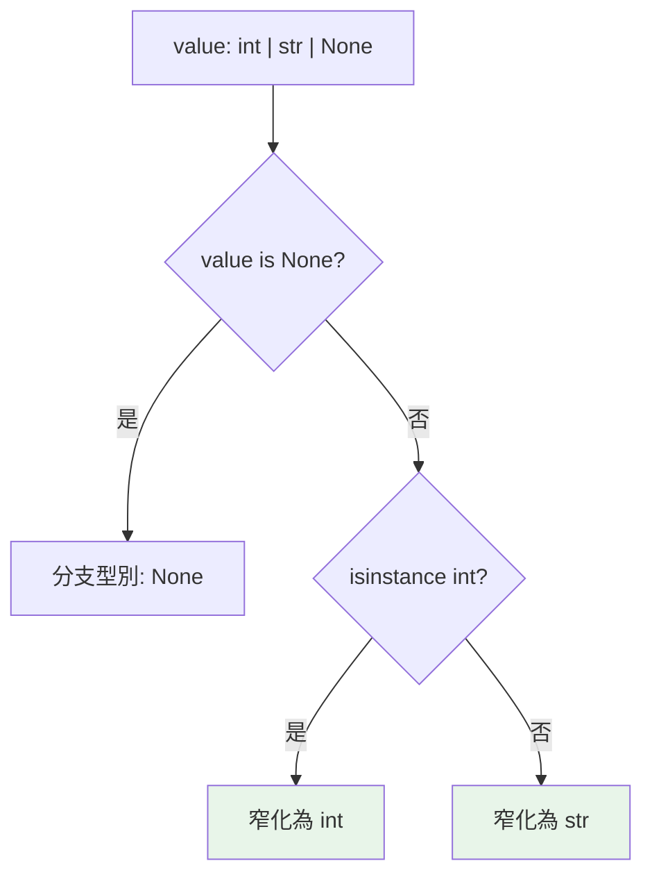

# Optional 與 Union

> `X | None` 是 Python 型別系統最有價值的一環——它強迫你面對「這裡可能是 None」，把最常見的 `AttributeError: 'NoneType'` 消滅在執行前。而型別窄化讓檢查後的分支型別自動收斂。

## Why（為什麼）

`None` 相關的錯誤（`'NoneType' object has no attribute ...`）是 Python 最常見的執行期崩潰之一。原因是「一個值可能有、可能沒有」的情況無所不在（查無資料、可選參數、找不到的 key）。**`Optional` / `Union`** 讓你在型別上明確標出「這裡可能是 None / 可能是好幾種型別」，於是 mypy 會**強迫你在使用前檢查**——把 None 錯誤提前到執行前。這是型別註記最能立即回本的地方。

## Theory（理論：Union 與 Optional）

- **Union（聯集）**：「這個值是 A 或 B」。寫法 `A | B`（3.10+）或 `Union[A, B]`（舊）。
- **Optional**：「A 或 None」的特例。`Optional[X]` **完全等於** `X | None`——它不是「可省略」的意思，而是「可能是 None」。

關鍵機制：**型別窄化（type narrowing）**。當你對一個 Union 型別做檢查（`if x is None`、`isinstance`），mypy 會在各分支**自動收斂**型別——檢查過 `is not None` 後，那個分支裡 mypy 就知道它不是 None，可安全使用。

## Specification（規範：寫法）

```python
# 現代（3.10+）
def find(id: int) -> str | None: ...
x: int | str | None                    # 三選一

# 舊寫法（等價）
from typing import Optional, Union
def find(id: int) -> Optional[str]: ...     # = str | None
x: Union[int, str, None]

# Optional[X] 就是 X | None，別誤會成「參數可省略」
def greet(name: str | None = None) -> str: ...
```

## Implementation（型別窄化、Optional 誤解、None 慣例）

### 型別窄化：檢查後型別自動收斂

```python
def get_length(text: str | None) -> int:
    # 此處 text 是 str | None，直接 text.upper() → mypy 報錯
    if text is None:
        return 0
    # 這個分支 mypy 已窄化為 str，可安全用
    return len(text)


def process(value: int | str) -> str:
    if isinstance(value, int):
        return str(value * 2)     # 這裡 value 窄化為 int
    return value.upper()          # 這裡 value 窄化為 str
```

窄化的觸發方式：`is None` / `is not None`、`isinstance()`、`assert`、真值檢查（對某些型別）、`==` 比較字面值等（詳見 [型別窄化](11-overload-cast-narrowing.md)）。**這是 Union 好用的核心**——你不必手動 cast，檢查後型別自己收斂。

### 未檢查就使用 → mypy 抓到

```python
def bad(text: str | None) -> int:
    return len(text)      # ❌ mypy: Argument 1 to "len" has incompatible type "str | None"
```

這正是價值所在：**忘了處理 None 的情況，執行前就被抓到**，而不是上線後 `TypeError`。

### `Optional` 的最大誤解

`Optional[X]` 常被誤以為是「這個參數可以不傳」——**錯**。它純粹是 `X | None` 的別名，表達「值可能是 None」。「參數可省略」是靠**預設值**表達的：

```python
# Optional 表達「可能是 None」，不是「可省略」
def f(x: Optional[int]) -> None: ...       # x 必填，但可傳 None
f()          # ❌ 錯：x 是必填的
f(None)      # ✅

# 「可省略」是靠預設值
def g(x: int | None = None) -> None: ...   # 可不傳（用預設 None）
g()          # ✅
```

慣例上兩者常一起出現（`x: int | None = None`），但它們是**兩件事**：型別說「可能是 None」，預設值說「可省略」。

### 為什麼用 `None` 當「沒有值」的哨兵

Python 慣例用 `None` 表示「無值/缺失」（見 [bool、None](../02-fundamentals/03-booleans-and-none.md)）。配合 `X | None` 型別，形成安全模式：

```python
def find_user(users: dict[int, str], uid: int) -> str | None:
    return users.get(uid)      # 找不到回 None

name = find_user(db, 1)
if name is not None:           # 強制處理「找不到」
    print(name.upper())
```

比「找不到就拋例外」或「回傳空字串」更明確——型別上就寫著「可能沒有」。

## Code Example（可執行的 Python 範例）

```python
# optional_union_demo.py
from __future__ import annotations


def parse_int(text: str) -> int | None:
    """解析失敗回 None（而非拋例外）。"""
    try:
        return int(text)
    except ValueError:
        return None


def describe(value: int | str | None) -> str:
    """Union + 型別窄化：每個分支型別自動收斂。"""
    if value is None:
        return "沒有值"
    if isinstance(value, int):
        return f"整數 {value}，兩倍是 {value * 2}"    # 窄化為 int
    return f"字串 '{value}'，長度 {len(value)}"        # 窄化為 str


def safe_upper(text: str | None) -> str:
    """處理 None 後才使用。"""
    if text is None:
        return ""
    return text.upper()            # 窄化為 str，安全


def demo() -> None:
    print(parse_int("42"))          # 42
    print(parse_int("abc"))         # None

    print(describe(10))             # 整數 10，兩倍是 20
    print(describe("hi"))           # 字串 'hi'，長度 2
    print(describe(None))           # 沒有值

    print(f"safe_upper: {safe_upper(None)!r}, {safe_upper('ok')!r}")


if __name__ == "__main__":
    demo()
```

**預期輸出**：

```pycon
$ python optional_union_demo.py
42
None
整數 10，兩倍是 20
字串 'hi'，長度 2
沒有值
safe_upper: '', 'OK'
```

## Diagram（圖解：型別窄化）



## Best Practice（最佳實踐）

- **可能沒有值就標 `X | None`**：查詢、可選、找不到的情況，讓 mypy 強迫呼叫端處理。
- **用 `is None` / `is not None` 窄化**（不是 `== None`），檢查後分支型別自動收斂，不必手動 cast。
- **現代用 `X | None`**（3.10+），比 `Optional[X]` 直觀；同一專案風格統一。
- **分清「可能是 None」與「可省略」**：前者用型別 `X | None`，後者用預設值 `= None`；常一起用但概念不同。
- **Union 別太多型別**：`int | str | bytes | None | ...` 太雜通常是設計信號；考慮拆分或用共同介面（Protocol）。
- **儘早處理 None**：函式開頭就檢查/提早 return，避免整個函式都在 `X | None` 狀態下小心翼翼。

## Common Mistakes（常見誤解）

- **以為 `Optional[X]` 表示「參數可省略」**：它是 `X | None`（可能是 None）；可省略靠預設值。
- **未檢查 None 就使用**：mypy 會報錯，且執行期會 `AttributeError`；先窄化。
- **用 `== None` 而非 `is None`**：雖然多半能用，但 `is None` 是慣例、更快、且某些情況下窄化更可靠。
- **對 `X | None` 用真值檢查 `if x:` 窄化**：對可能為 falsy 的合法值（`0`、`""`）會誤判——`if x:` 把 `0`/`""` 也當「沒有」；要精確用 `if x is not None:`。
- **Union 型別過多**：難維護、難窄化；重新設計。
- **回傳 `X | None` 卻讓呼叫端無從得知**：好的做法是型別誠實標出，逼呼叫端面對。

## Interview Notes（面試重點）

- 說得出 **`Optional[X]` 完全等於 `X | None`**，且**不是「可省略」**（可省略靠預設值）——這是高頻誤解考點。
- 解釋**型別窄化**：`is None`/`isinstance`/`assert` 等檢查後，mypy 在各分支自動收斂型別，不需手動 cast。
- 知道 **`X | None` 的價值**：強迫處理 None，消滅一大類執行期錯誤。
- 知道現代用 `X | Y`（3.10+）優於 `Union`/`Optional`。
- 知道 **`if x:` 對可能 falsy 的值窄化會誤判**，該用 `is not None`。

---

➡️ 下一章：[泛型與 TypeVar](05-generics-typevar.md)

[⬆️ 回 Part 5 索引](README.md)
