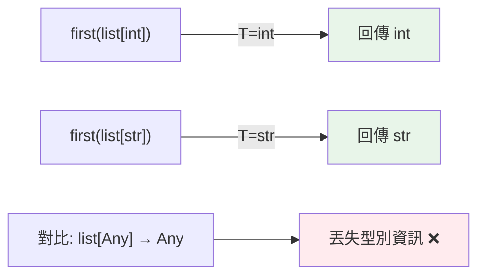

# 泛型與 TypeVar

> 泛型讓你寫「型別無關但保留型別關聯」的程式——`first(list[int])` 回 `int`、`first(list[str])` 回 `str`。`TypeVar` 是表達「同一個未知型別」的關鍵，避免用 `Any` 丟失型別資訊。

## 💡 白話導讀（建議先讀）

車站的寄物櫃有一個天經地義的性質：**你寄什麼，取回來就是什麼**。
寄雨傘取回雨傘，寄背包取回背包——不會寄雨傘取回一顆球。

現在看一個函式：「取 list 的第一個元素」。

- 丟進 `list[int]`，拿回來的該是 `int`。
- 丟進 `list[str]`，拿回來的該是 `str`。

問題來了：這個函式的標籤怎麼寫？寫死 `int` 太窄；寫 `Any`（什麼都行）呢？

`Any` 就像一個**失憶的寄物櫃**：東西存得進去，但取件時櫃子只會說「這是⋯⋯某個不明物品」——你寄的明明是雨傘，取回卻得自己猜。型別資訊全丟了。

**泛型**的解法是引入一個佔位符 `T`，意思是「某個型別——現在不知道是啥，但**前後是同一個**」：

```text
def first(items: list[T]) -> T:    # 進來裝 T 的 list，出去就是 T
```

呼叫 `first([1, 2, 3])` 時，mypy 自動推斷「哦，這次 T = int」——所以回傳是 int。
下次傳字串 list，T 就是 str。**寄什麼、取什麼，關聯被保留了。**

這一章就是在教你怎麼宣告這個佔位符（`TypeVar`）、怎麼用在函式和類別上。
記住一個口訣：**同一個 T 出現幾次，那幾個位置就必須是同一型別**——這就是泛型的全部。

## 🎯 什麼時候會用到

- **你「用」泛型遠比「寫」泛型多**:`list[int]`、`dict[str, User]` 就是在用標準庫寫好的泛型。
  這章教的「自己寫泛型」,在純業務邏輯裡用得少,但這幾種時候值得:
  - **寫容器/包裝類別**:自訂 stack、快取、`Result`/`Option`、repository——
    你想讓 `Stack[int]().pop()` 回 `int` 而不是 `Any`(否則自動補全與檢查全失效)。
  - **寫「型別無關但要保留關聯」的工具函式**:`first(seq: list[T]) -> T`、`def identity(x: T) -> T`——
    傳什麼型別進去,回對應型別出來。
  - 函式庫/公用模組作者最常寫;業務碼偶爾寫。
- 一句話訊號:**當「回傳型別取決於傳入型別」時,就該用泛型**——
  不然型別檢查器只能給你 `Any`,等於放棄型別安全。

## 🔗 前端對照

泛型（generics）在 Python 與 TypeScript 是同一個概念——**讓型別當參數**,寫一次適用多型別:

| | Python | TypeScript |
|---|--------|-----------|
| 泛型函式 | `def first[T](xs: list[T]) -> T:`（3.12+） | `function first<T>(xs: T[]): T` |
| 泛型類別 | `class Box[T]:`（3.12+） | `class Box<T> {}` |
| 舊寫法 | `T = TypeVar("T")` + `Generic[T]` | — |

一句話:概念一模一樣（`<T>` ≈ `[T]`）。Python **3.12 起**才有 `[T]` 這種簡潔語法,
之前要先 `T = TypeVar("T")` 再用——看到舊碼的 `TypeVar` 別驚訝,它就是 TS 的 `<T>`。

## Why（為什麼）

想寫一個 `first(items)` 回傳列表第一個元素的函式。若標成 `list[Any] -> Any`，型別資訊就丟了——`first([1,2,3])` 的結果 mypy 只當 `Any`，不知道是 int。若標死 `list[int] -> int`，又不能用在 str 列表。**泛型（generics）** 解決這個矛盾：用**型別變數 `TypeVar`** 表達「輸入是某型別 T 的列表、輸出就是那個 T」——保留了「輸入輸出型別的關聯」。這是寫可重用、型別安全的容器與工具函式的基礎。

## Theory（理論：型別變數 TypeVar）

**`TypeVar`** 是「型別的變數」——一個佔位符，代表「某個尚未確定、但**前後一致**的型別」。
它讓你在簽章裡表達型別之間的**關聯**（寄物櫃的「寄什麼取什麼」）：

```python
from typing import TypeVar

T = TypeVar("T")               # 宣告一個型別變數 T

def first(items: list[T]) -> T:    # 輸入 list[T]，輸出 T
    return items[0]
```

呼叫 `first([1, 2, 3])` 時，mypy **推斷** T = int，於是回傳型別是 int；`first(["a"])` 則 T = str。

核心規則：**同一個 T 在簽章中出現多次，代表那些位置必須是同一型別**——這就是泛型保留的關聯。

對比 `Any`（失憶寄物櫃）：

- `list[Any] -> Any`：關聯完全丟失——回傳是「不明物品」，之後 mypy 都幫不了你。
- `list[T] -> T`：保留了「回傳型別 = 元素型別」。

## Specification（規範：TypeVar 與 Generic）

```python
from typing import TypeVar, Generic

T = TypeVar("T")                          # 無限制
N = TypeVar("N", int, float)              # 受限：只能是 int 或 float
C = TypeVar("C", bound=Comparable)        # 有界：必須是 Comparable 的子型別

# 泛型函式
def first(items: list[T]) -> T: ...

# 泛型類別（繼承 Generic[T]）
class Box(Generic[T]):
    def __init__(self, item: T) -> None:
        self._item = item
    def get(self) -> T:
        return self._item
```

## Implementation（泛型函式、泛型類別、bound、constrained）

### 泛型函式：保留型別關聯

```python
from typing import TypeVar

T = TypeVar("T")

def first(items: list[T]) -> T:
    return items[0]

def last(items: list[T]) -> T:
    return items[-1]
```

```pycon
>>> reveal_type(first([1, 2, 3]))     # mypy: int（不是 Any！）
>>> reveal_type(first(["a", "b"]))    # mypy: str
```

`reveal_type`（mypy 專用，執行期不存在）能看出 mypy 推斷的型別——證明關聯被保留。

### 泛型類別：型別化的容器

繼承 `Generic[T]` 讓類別「裝什麼型別」被追蹤：

```python
class Stack(Generic[T]):
    def __init__(self) -> None:
        self._items: list[T] = []
    def push(self, item: T) -> None:
        self._items.append(item)
    def pop(self) -> T:
        return self._items.pop()

s: Stack[int] = Stack()
s.push(1)          # OK
s.push("x")        # mypy 報錯：期待 int
value = s.pop()    # mypy 知道是 int
```

`Stack[int]` 讓 mypy 知道這個 stack 裝 int，push/pop 都受檢查。

### `bound`：有界型別變數

`bound=X` 限制「T 必須是 X 或其子型別」，讓你能在泛型內**使用 X 的方法**：

```python
from typing import TypeVar

class Comparable:
    def __lt__(self, other: object) -> bool: ...

CT = TypeVar("CT", bound="Comparable")

def maximum(items: list[CT]) -> CT:
    result = items[0]
    for item in items[1:]:
        if result < item:      # 因為 bound=Comparable，可用 <
            result = item
    return result
```

沒有 `bound`，mypy 不知道 T 有 `<` 方法。實務常用 `bound=` 配合 Protocol（見 [Protocol](06-protocol.md)）表達「T 必須支援某些操作」。

### constrained：限定幾種具體型別

`TypeVar("N", int, float)` 限制 T **只能是列出的型別之一**（不是它們的聯集，而是「這幾種其中一種」）：

```python
from typing import TypeVar

Num = TypeVar("Num", int, float)

def add(a: Num, b: Num) -> Num:    # a、b 必須同型（都 int 或都 float）
    return a + b

add(1, 2)        # T = int → int
add(1.0, 2.0)    # T = float → float
# add(1, 2.0)    # mypy 可能警告（型別不一致的細節依版本）
```

`bound`（有界，接受子型別）與 constrained（限定清單，必須是其中一種）是兩種不同的限制方式。

### PEP 695 新語法（3.12+）預告

3.12 引入更簡潔的泛型語法，不必先宣告 `TypeVar`（見 [進階泛型](10-advanced-generics.md)）：

```python
def first[T](items: list[T]) -> T:      # 直接在函式名後宣告 [T]
    return items[0]

class Stack[T]:                          # 類別泛型
    ...
```

## Code Example（可執行的 Python 範例）

```python
# generics_demo.py
from __future__ import annotations

from typing import Generic, TypeVar

T = TypeVar("T")
Num = TypeVar("Num", int, float)


def first(items: list[T]) -> T:
    """保留型別關聯：輸入 list[T] → 輸出 T。"""
    return items[0]


def total(nums: list[Num]) -> Num:
    """constrained：只接受 int 或 float 的列表。"""
    result = nums[0]
    for n in nums[1:]:
        result = result + n
    return result


class Box(Generic[T]):
    """泛型容器。"""

    def __init__(self, item: T) -> None:
        self._item = item

    def get(self) -> T:
        return self._item

    def replace(self, item: T) -> None:
        self._item = item


def demo() -> None:
    # 泛型函式保留型別
    print(f"first([1,2,3]) = {first([1, 2, 3])}")        # 3 → int
    print(f"first(['a','b']) = {first(['a', 'b'])}")     # a → str

    print(f"total ints = {total([1, 2, 3])}")            # 6
    print(f"total floats = {total([1.5, 2.5])}")         # 4.0

    # 泛型類別
    int_box: Box[int] = Box(42)
    str_box: Box[str] = Box("hello")
    print(f"int_box: {int_box.get()}, str_box: {str_box.get()}")


if __name__ == "__main__":
    demo()
```

**預期輸出**：

```pycon
$ python generics_demo.py
first([1,2,3]) = 3
first(['a','b']) = a
total ints = 6
total floats = 4.0
int_box: 42, str_box: hello
```

## Diagram（圖解：泛型保留型別關聯）



## Best Practice（最佳實踐）

- **需要「保留輸入輸出型別關聯」的函式/容器用泛型**（`TypeVar`），而非 `Any`（後者丟失型別）。
- **同一 TypeVar 多次出現表達「同型別」**：`def pair(a: T, b: T) -> tuple[T, T]` 要求 a、b 同型。
- **需要在泛型內用某些方法 → 用 `bound=`**（常配 Protocol），讓 mypy 知道 T 支援那些操作。
- **限定為特定幾種型別用 constrained** `TypeVar("N", int, float)`；接受子型別用 `bound=`。
- **3.12+ 用 PEP 695 新語法** `def f[T](...)`，更簡潔（見 [進階泛型](10-advanced-generics.md)）。
- **命名慣例**：`T`（一般）、`K`/`V`（key/value）、`T_co`/`T_contra`（協變/逆變，進階）。

## Common Mistakes（常見誤解）

- **用 `Any` 取代泛型**：`list[Any] -> Any` 丟失型別關聯，呼叫端拿到 Any 就不再被檢查；用 `TypeVar` 保留。
- **以為 `TypeVar` 執行期有作用**：它是給型別檢查器的；執行期就是個普通物件，不做任何強制。
- **忘了泛型類別要繼承 `Generic[T]`**（3.12 前）：否則 `Box[int]` 的型別追蹤不生效。
- **混淆 bound 與 constrained**：`bound=X`（子型別皆可）vs `TypeVar("T", A, B)`（只能是 A 或 B 其一）。
- **同一 TypeVar 誤用於不相關的型別**：`def f(a: T, b: T)` 會要求 a、b 同型，若本意是各自獨立要用兩個 TypeVar。
- **在需要 `bound` 時不加**：mypy 不知道 T 有某方法（如 `<`），報「T has no attribute」。

## Interview Notes（面試重點）

- 說得出泛型的目的：**保留型別關聯**（輸入輸出型別連動），避免 `Any` 丟失資訊。
- 會用 **`TypeVar`** 寫泛型函式、用 **`Generic[T]`** 寫泛型類別（3.12 前）。
- 能區分 **`bound=X`（有界，接受子型別，可用 X 的方法）vs constrained `TypeVar("T", A, B)`（限定為列出型別之一）**。
- 知道**同一 TypeVar 多次出現代表同型別**。
- 知道 **PEP 695（3.12）新泛型語法** `def f[T](...)` / `class C[T]`。
- 知道 TypeVar 是靜態檢查工具、執行期不強制。

---

➡️ 下一章：[Protocol 與結構化子型別](06-protocol.md)

[⬆️ 回 Part 5 索引](README.md)
