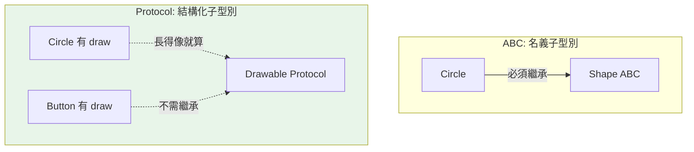

# Protocol 與結構化子型別

> Protocol 把 Python 的鴨子型別「型別化」——不需要繼承，只要「長得像」（有對的方法）就算符合。這讓你能為第三方類別、或純粹靠行為定義的介面加上靜態檢查。

## Why（為什麼）

Python 的鴨子型別說「只要會 `.quack()` 就當它是鴨子」，很自由。但 [ABC](../04-oop/10-abc.md) 要求「明確繼承」才算子型別（名義子型別）——這對你無法修改的第三方類別行不通（總不能叫別人的類別繼承你的 ABC）。**Protocol（PEP 544，3.8+）** 解決這個：定義「一個型別要有哪些方法/屬性」，任何**結構上符合**的類別**自動**算數，不需繼承。這讓鴨子型別能被 mypy 靜態檢查，是型別化「靠行為而非血緣」介面的正解。

## Theory（理論：結構化 vs 名義子型別）

兩種「A 是不是 B 的子型別」的判定方式：

- **名義子型別（nominal）**：A 必須**明確宣告繼承** B（ABC、一般繼承）。「血緣」決定。
- **結構化子型別（structural）**：A 只要**結構符合**（有 B 要求的方法/屬性），就算 B 的子型別。「長相」決定——這就是鴨子型別。

`Protocol` 實作結構化子型別：你定義一個 Protocol「需要哪些方法」，任何有這些方法的類別**自動符合**，完全不需要 import 或繼承那個 Protocol。

## Specification（規範：定義 Protocol）

```python
from typing import Protocol, runtime_checkable


class Drawable(Protocol):
    def draw(self) -> str: ...        # 只描述「需要有 draw() 方法」


# 任何有 draw() 的類別都自動符合 Drawable，不需繼承！
class Circle:
    def draw(self) -> str:
        return "○"

def render(shape: Drawable) -> str:   # 接受任何「有 draw()」的東西
    return shape.draw()

render(Circle())                       # OK！Circle 沒繼承 Drawable，但結構符合
```

## Implementation（結構符合、runtime_checkable、與 ABC 對比）

### 結構符合就算數——不需繼承

```python
from typing import Protocol

class SupportsClose(Protocol):
    def close(self) -> None: ...

def cleanup(resource: SupportsClose) -> None:
    resource.close()

# 這些都符合，即使它們毫無關係、也沒繼承 SupportsClose：
class File:
    def close(self) -> None: print("關檔案")

class Connection:
    def close(self) -> None: print("關連線")

cleanup(File())          # OK
cleanup(Connection())    # OK
```

`File` 和 `Connection` 沒有共同基底、沒 import Protocol，但都「有 `close()`」→ mypy 認為它們符合 `SupportsClose`。這對「為既有/第三方類別定介面」極有價值。

### `@runtime_checkable`：讓 isinstance 也能用

Protocol 預設**只用於靜態檢查**，執行期 `isinstance(x, MyProtocol)` 會報錯。加 `@runtime_checkable` 才能在執行期用 `isinstance`（但只檢查「方法存在」，不檢查簽章）：

```python
from typing import Protocol, runtime_checkable

@runtime_checkable
class Sized(Protocol):
    def __len__(self) -> int: ...

isinstance([1, 2, 3], Sized)     # True（有 __len__）
isinstance(42, Sized)            # False
```

### 標準庫的 Protocol：`SupportsXxx`

typing 提供一堆現成 Protocol：`SupportsInt`、`SupportsFloat`、`SupportsIndex`、`SupportsAbs` 等，描述「支援某個 dunder」。`collections.abc` 的 `Iterable`/`Sized`/`Container` 等也是結構化檢查的常見對象。

### Protocol + TypeVar bound：表達「T 要支援某操作」

Protocol 常配泛型的 `bound=` 使用，表達「這個泛型型別必須支援某些操作」（見 [泛型](05-generics-typevar.md)）：

```python
from typing import Protocol, TypeVar

class Comparable(Protocol):
    def __lt__(self, other: object) -> bool: ...

CT = TypeVar("CT", bound=Comparable)

def maximum(items: list[CT]) -> CT:      # T 必須可比較
    ...
```

### Protocol vs ABC 對照

| | Protocol | ABC |
|--|----------|-----|
| 子型別方式 | 結構化（長得像就算） | 名義（要明確繼承） |
| 需要繼承 | ❌ | ✅ |
| 適合第三方類別 | ✅ | ❌（改不了對方原始碼） |
| 執行期強制實作 | ❌（除非 runtime_checkable，且只查存在） | ✅（沒實作無法實例化） |
| 適合 | 鴨子型別的型別化、為既有類別定介面 | 你控制的類別階層、框架基底 |

**選擇**：想「不強迫繼承、只描述行為」（尤其第三方）用 Protocol；想「強制契約 + 明確階層」用 ABC。

## Code Example（可執行的 Python 範例）

```python
# protocol_demo.py
from __future__ import annotations

from typing import Protocol, runtime_checkable


@runtime_checkable
class Renderable(Protocol):
    def render(self) -> str: ...


# 這三個類別互不相關、都沒繼承 Renderable，但結構符合
class Button:
    def render(self) -> str:
        return "[按鈕]"


class Text:
    def __init__(self, content: str) -> None:
        self.content = content

    def render(self) -> str:
        return self.content


class NotRenderable:
    pass


def render_all(items: list[Renderable]) -> str:
    """接受任何「有 render()」的物件。"""
    return " ".join(item.render() for item in items)


def demo() -> None:
    # 結構符合，即使沒繼承 Renderable
    ui = render_all([Button(), Text("Hello")])
    print(f"UI: {ui}")

    # runtime_checkable 讓 isinstance 可用
    print(f"Button 符合? {isinstance(Button(), Renderable)}")          # True
    print(f"NotRenderable 符合? {isinstance(NotRenderable(), Renderable)}")  # False


if __name__ == "__main__":
    demo()
```

**預期輸出**：

```pycon
$ python protocol_demo.py
UI: [按鈕] Hello
Button 符合? True
NotRenderable 符合? False
```

## Diagram（圖解：結構化 vs 名義）



## Best Practice（最佳實踐）

- **為「靠行為定義的介面」用 Protocol**：尤其是要涵蓋你**無法修改**的第三方/內建類別時。
- **Protocol 只描述「需要的方法/屬性」**，保持小而聚焦（`SupportsClose`、`Renderable`）——這就是「介面隔離原則」的體現。
- **需要執行期 `isinstance` 才加 `@runtime_checkable`**，並知道它只檢查「方法存在」、不檢查簽章。
- **配 `TypeVar(bound=SomeProtocol)`** 表達「泛型型別要支援某操作」。
- **你控制的類別階層 + 想強制契約 → 用 ABC**；不想強迫繼承、鴨子型別 → 用 Protocol。
- **善用標準庫現成 Protocol**（`SupportsInt` 等）與 `collections.abc`。

## Common Mistakes（常見誤解）

- **以為用 Protocol 要繼承它**：不用！結構符合就自動算數，繼承反而多餘（雖然也可繼承來明確表達）。
- **對非 runtime_checkable 的 Protocol 用 `isinstance`**：`TypeError`；要加 `@runtime_checkable`。
- **以為 `@runtime_checkable` 會檢查方法簽章**：不會，只檢查「方法名存在」；型別是否對還是靠靜態檢查。
- **該用 Protocol 卻用 ABC 逼第三方繼承**：改不了對方原始碼時 ABC 行不通；Protocol 才對。
- **Protocol 定太大**：包山包海的 Protocol 難符合；小而專注更好。
- **忘了 Protocol 預設純靜態**：執行期不強制、不阻止實例化（與 ABC 不同）。

## Interview Notes（面試重點）

- 說得出 **Protocol = 結構化子型別（PEP 544）**：「長得像就算」，**不需繼承**，是鴨子型別的型別化。
- **能對比結構化（Protocol）vs 名義（ABC/繼承）子型別**，並說出各自適用場景（Protocol 尤其適合第三方/既有類別）。
- 知道 **`@runtime_checkable`** 讓 `isinstance` 可用，但**只檢查方法存在、不檢查簽章**。
- 知道 Protocol 常配 **`TypeVar(bound=Protocol)`** 表達「支援某操作」。
- 知道標準庫的 `SupportsXxx` Protocol 與 `collections.abc`。
- 知道 Protocol 預設純靜態、不強制實例化（與 ABC 的執行期強制不同）。

---

➡️ 下一章：[mypy 型別檢查](07-mypy.md)

[⬆️ 回 Part 5 索引](README.md)
