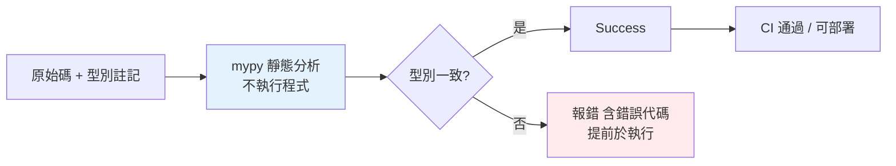

# mypy 型別檢查

> 型別註記沒有檢查器就只是註解。mypy 是最主流的靜態型別檢查器——它讀你的註記、不執行程式，就能抓出型別錯誤。搞懂它的設定與漸進採用策略，才能讓型別真正發揮價值。

## Why（為什麼）

前面幾章寫的所有型別註記，價值都要靠**型別檢查器**兌現——沒有它，`double("x")` 照跑、錯誤照樣溜過。**mypy** 是 Python 型別檢查的事實標準：它做**靜態分析**（不執行程式），根據註記推斷並驗證型別，在 CI 或編輯期就抓出 bug。這章講怎麼設定、怎麼漸進導入到既有專案、以及讀懂它的錯誤訊息——把型別註記從「裝飾」變成「保障」。

## Theory（理論：靜態分析）

mypy 做的是**靜態分析（static analysis）**：不執行你的程式，而是「讀」原始碼與註記，模擬型別如何流動，找出矛盾：

- 傳錯型別的參數、回傳型別不符。
- 對 `X | None` 沒檢查就使用。
- 存取不存在的屬性、呼叫不存在的方法。
- 型別不相容的運算。

它靠**型別推斷（inference）**——即使你沒標註記，mypy 也能從賦值推出很多型別（`x = 5` → x 是 int）。註記則補上它推不出來的地方（尤其函式邊界）。

替代品：**pyright**（微軟，VS Code 的 Pylance 基於它，快且嚴格）、**pyre**（Meta）。原理相同，mypy 最通用。

## Specification（規範：安裝、執行、設定）

```bash
pip install mypy
mypy myfile.py            # 檢查單一檔案
mypy src/                 # 檢查目錄
mypy .                    # 檢查整個專案
```

在 `pyproject.toml` 設定（見 [pyproject.toml](../13-tooling-packaging/04-pyproject-toml.md)）：

```toml
[tool.mypy]
python_version = "3.12"
strict = true                    # 開啟所有嚴格檢查（推薦新專案）

# 漸進導入：對特定模組放寬
[[tool.mypy.overrides]]
module = "legacy.*"
ignore_errors = true

# 第三方套件沒有型別資訊時忽略
[[tool.mypy.overrides]]
module = "some_untyped_lib.*"
ignore_missing_imports = true
```

## Implementation（strict、漸進導入、常見錯誤、忽略）

### `strict = true`：一次開啟所有嚴格檢查

`strict` 等同開啟一組嚴格選項，最重要的幾個：

- `disallow_untyped_defs`：函式**必須**有型別註記（沒標會報錯）。
- `warn_return_any`：回傳 `Any` 時警告。
- `no_implicit_optional`：`def f(x: int = None)` 不再自動變成 `int | None`（必須明寫）。
- `warn_unused_ignores`：沒用到的 `# type: ignore` 會被指出。

**新專案直接 `strict = true`**，逼自己從一開始就寫好註記。

### 漸進導入到既有專案

大型舊專案不可能一次補完註記。策略：

1. 先 `mypy .` 看有多少錯，`ignore_errors` 掉還沒處理的模組。
2. 從核心/新模組開始，逐個開啟嚴格檢查。
3. 用 `# type: ignore[錯誤代碼]` 暫時壓下特定錯誤（並註明原因），之後再修。
4. 逐步縮小 `ignore_errors` 的範圍，直到全專案 strict。

這就是漸進式型別的實務——不必全有或全無。

### 讀懂常見錯誤訊息

```text
error: Argument 1 to "f" has incompatible type "str"; expected "int"  [arg-type]
→ 傳錯型別的參數

error: Item "None" of "str | None" has no attribute "upper"  [union-attr]
→ 對 X | None 沒檢查就用（漏了 None 處理）

error: Function is missing a return type annotation  [no-untyped-def]
→ strict 下函式缺回傳註記

error: Incompatible return value type (got "None", expected "int")  [return-value]
→ 回傳型別不符
```

方括號裡的 `[錯誤代碼]` 可用來精準忽略。

### `# type: ignore` 與 `reveal_type`

```python
result = risky_call()  # type: ignore[no-any-return]  # 註明為何忽略

x = some_value
reveal_type(x)         # mypy 會印出它推斷的型別（除錯用，執行期不存在此函式）
```

`reveal_type(x)` 是除錯型別的利器——讓 mypy 告訴你它認為 x 是什麼型別。**但別把它留在程式裡**（執行會 NameError）。`# type: ignore` 要**加錯誤代碼並註明原因**，別無差別忽略。

### 第三方套件沒型別怎麼辦

有些套件沒有型別資訊（沒有 `py.typed` 標記或 stub）。mypy 會報 `import-untyped`。處理：

- 裝官方/社群的 **type stub**（`pip install types-requests`）。
- 設 `ignore_missing_imports` 對該模組放行。

## Code Example（可執行的 Python 範例）

```python
# mypy_demo.py — 這支程式 mypy strict 通過；註解標出「若這樣寫會被抓到」
from __future__ import annotations


def divide(a: float, b: float) -> float:
    if b == 0:
        raise ValueError("除以零")
    return a / b


def get_config(data: dict[str, str], key: str) -> str:
    value = data.get(key)          # value: str | None
    if value is None:              # 必須先窄化，否則 mypy 報 union-attr
        return "default"
    return value.upper()           # 這裡 value 已窄化為 str


def demo() -> None:
    print(divide(10, 2))                         # 5.0
    print(get_config({"env": "prod"}, "env"))    # PROD
    print(get_config({}, "missing"))             # default

    # 以下若取消註解，mypy 會在執行前報錯：
    # divide("10", 2)          # [arg-type] str 不是 float
    # get_config({}, "x").foo  # [attr-defined] str 沒有 foo


if __name__ == "__main__":
    demo()
```

**驗證**（需先 `pip install mypy`）：

```pycon
$ mypy --strict mypy_demo.py
Success: no issues found in 1 source file
$ python mypy_demo.py
5.0
PROD
default
```

## Diagram（圖解：mypy 在流程中的位置）



## Best Practice（最佳實踐）

- **把 mypy 納入 CI**：型別檢查沒有 CI 把關就會逐漸腐爛；讓它像測試一樣擋 PR。
- **新專案直接 `strict = true`**；既有專案**漸進導入**（先忽略舊模組，逐步收緊）。
- **設定集中在 `pyproject.toml`**，團隊與 CI 用同一套規則（見 [pyproject.toml](../13-tooling-packaging/04-pyproject-toml.md)）。
- **`# type: ignore` 要帶錯誤代碼 + 註明原因**，別無差別忽略；開 `warn_unused_ignores` 清掉過時的忽略。
- **用 `reveal_type` 除錯型別**，但別留在程式裡。
- **第三方套件裝 type stub**（`types-xxx`）或 `ignore_missing_imports`。
- **搭配 pre-commit**：commit 前自動跑 mypy（見 [pre-commit](../13-tooling-packaging/08-pre-commit.md)）。

## Common Mistakes（常見誤解）

- **寫了註記卻不跑 mypy**：等於沒有型別保障；一定要有檢查器 + CI。
- **以為 mypy 會執行程式**：它是**靜態**分析，不執行；執行期驗證要用 pydantic。
- **無差別 `# type: ignore`**：壓下所有錯（含真正的 bug）；要帶 `[code]` 且註明。
- **一次要求舊專案全 strict**：錯誤爆量、難以推進；漸進導入。
- **忽略 `X | None` 的 union-attr 錯誤**：那正是 mypy 幫你抓的 None bug，該修不是該忽略。
- **第三方 import 報錯就全域關檢查**：只需對該模組 `ignore_missing_imports`，別關掉整個專案的檢查。
- **把 mypy 錯誤代碼當雜訊**：`[arg-type]`/`[union-attr]` 等能幫你精準理解與忽略。

## Interview Notes（面試重點）

- 說得出 **mypy 是靜態型別檢查器**（不執行程式），透過**型別推斷 + 註記**驗證型別，把錯誤提前到執行前。
- 知道 **`strict = true`** 的意義（一組嚴格選項，尤其 `disallow_untyped_defs`、`no_implicit_optional`）。
- 能講**漸進導入**策略（overrides/ignore_errors 逐步收緊），呼應漸進式型別。
- 知道 **`# type: ignore[code]`（帶代碼+原因）** 與 **`reveal_type`（除錯用、執行期不存在）**。
- 知道第三方無型別時用 **type stub / `ignore_missing_imports`**。
- 知道 mypy 該進 **CI / pre-commit**，並能認得常見錯誤代碼（`arg-type`、`union-attr`、`return-value`）。

---

➡️ 下一章：[型別註記最佳實踐](08-typing-best-practices.md)

[⬆️ 回 Part 5 索引](README.md)
