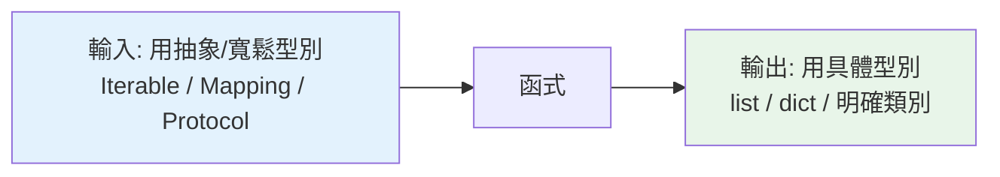

# 型別註記最佳實踐

> 型別註記寫太少沒保障、寫太多變噪音。這章把前面的觀念收斂成可操作的準則：標什麼、不標什麼、參數該用哪種型別、如何避免最常見的反模式。

## 💡 白話導讀（建議先讀）

標籤學會了，新問題來了：**要貼多少？**

全不貼，沒保障；每個變數都貼，程式碼變成標籤海——比沒貼更難讀。

這章把答案收斂成兩條原則：

**原則一：重點貼在「邊界」。**

想像家裡收納 vs 對外出貨：

- **對外出貨的包裹**（函式參數與回傳、公開 API、類別屬性）——**一定貼**。因為別人要依賴它，錯了影響跨模組。
- **自己抽屜裡的東西**（函式內部的區域變數）——多半不用貼。mypy 自己推得出來，貼了只是噪音。

**原則二：收禮不挑，送禮講究（參數寬、回傳窄）。**

- **接受**參數時，用最寬鬆的型別：要一個「可以逐一讀取的東西」就標 `Iterable`，別硬要求 `list`——讓呼叫端傳 list、tuple、generator 都行。
- **回傳**時，用最具體的型別：明明回傳 list 就標 `list[int]`，別標模糊的 `Iterable`——讓呼叫端知道能對它做什麼。

這對應一句網路工程的老話（Postel's law）：「對別人寬容，對自己嚴格」。

這章其餘的內容，就是把這兩條原則落到一個個具體場景（含最常見的反模式清單）。

## Why（為什麼）

學會了各種型別語法後，真正的功力在「拿捏」——哪裡該標、哪裡不必標、參數用寬還是窄的型別。標得好，型別是文件 + 保障；標不好，變成雜訊或誤導。這章整理實務準則，讓你的註記精準有用，而非為標而標。

## Theory（理論：兩個核心原則）

好的型別註記圍繞兩個原則——「貼在邊界」與「收禮不挑、送禮講究」：

1. **重點在邊界**：函式的參數與回傳、公開 API、類別屬性——這些是「別人依賴、跨越模組」的地方，最值得標（對外出貨的包裹）。
   函式內部的區域變數多半能推斷，不必標（自己的抽屜）。

2. **參數寬、回傳窄（前鬆後緊）**：
   - **接受**時用最寬鬆的型別——能吃越多越好（`Iterable` 而非硬性 `list`）。
   - **回傳**時用最具體的型別——讓呼叫端知道越多越好。

   這對應軟體設計的穩健原則（Postel's law）：對輸入寬容，對輸出嚴格。

## Specification（規範：準則清單）

```python
# ✅ 標函式邊界
def process(items: list[str], limit: int = 10) -> dict[str, int]: ...

# ✅ 參數用抽象/寬鬆型別（Iterable 而非 list）
from collections.abc import Iterable, Sequence, Mapping
def total(nums: Iterable[int]) -> int:        # 接受 list/tuple/generator/...
    return sum(nums)

# ✅ 回傳用具體型別
def get_names() -> list[str]:                 # 而非 Iterable[str]
    return ["a", "b"]

# ❌ 不必標顯而易見的區域變數
count = 0                                     # 不需 count: int = 0

# ✅ 可能沒有值 → X | None
def find(id: int) -> User | None: ...
```

## Implementation（參數用抽象型別、避免 Any、其他準則）

### 參數用抽象容器型別（Iterable/Sequence/Mapping）

函式**參數**若只是要「遍歷」或「讀取」，用 `collections.abc` 的抽象型別，接受更多種輸入：

```python
from collections.abc import Iterable, Mapping

# ❌ 太窄：只收 list
def total(nums: list[int]) -> int:
    return sum(nums)
# total((1, 2, 3))       # tuple 不符（雖然執行期能跑，mypy 抱怨）

# ✅ 寬鬆：任何可迭代的 int
def total(nums: Iterable[int]) -> int:
    return sum(nums)
# total([1,2]), total((1,2)), total(x for x in ...)  # 都 OK
```

準則：**只讀取/遍歷用 `Iterable`；需索引/長度用 `Sequence`；dict 類唯讀用 `Mapping`**。這讓函式更通用。但**回傳**則相反——回傳具體的 `list`，讓呼叫端能用 list 的全部能力。

### 避免 `Any`，優先精確型別

```python
from typing import Any

# ❌ Any 關閉檢查、會擴散
def parse(data: Any) -> Any: ...

# ✅ 用具體型別 / object / Protocol / 泛型
def parse(data: str) -> dict[str, int]: ...
```

真的無型別可標時，`object`（安全、受限）通常比 `Any`（不檢查、擴散）好。

### 其他實用準則

```python
# 可變預設參數用 None（型別 + 預設分開）
def append(item: int, target: list[int] | None = None) -> list[int]:
    if target is None:
        target = []
    ...

# 常數用 Final
from typing import Final
MAX: Final = 100

# 複雜/重複型別取別名
type UserId = int
type Handler = Callable[[Request], Response]

# 回傳自己的類別（3.11+ 用 Self）
from typing import Self
class Builder:
    def add(self, x: int) -> Self:      # 支援鏈式呼叫且子類別正確
        ...
        return self
```

### 不要對抗型別檢查器

若你不斷寫 `# type: ignore` 或 `cast` 來壓錯誤，通常是**設計或型別建模有問題**的信號，不是「型別系統太煩」。停下來想想：是不是該用 Protocol、泛型、或重構？型別檢查器的抱怨常常指向真正的設計缺陷。

## Code Example（可執行的 Python 範例）

```python
# best_practices_demo.py
from __future__ import annotations

from collections.abc import Iterable
from typing import Final

MAX_ITEMS: Final = 100

type Score = int
type ScoreBoard = dict[str, Score]


def average(scores: Iterable[Score]) -> float:
    """參數用 Iterable（寬鬆），接受任何可迭代的分數。"""
    scores_list = list(scores)          # 需要多次用，先具體化
    return sum(scores_list) / len(scores_list) if scores_list else 0.0


def top_scorers(board: ScoreBoard, n: int = 3) -> list[str]:
    """回傳具體的 list（呼叫端能用 list 全部能力）。"""
    return sorted(board, key=lambda name: board[name], reverse=True)[:n]


def add_score(
    board: ScoreBoard,
    name: str,
    score: Score,
) -> ScoreBoard:
    """回傳新 board，不改原本（不可變風格）。"""
    return {**board, name: score}


def demo() -> None:
    # Iterable 參數接受多種輸入
    print(f"list 平均: {average([80, 90, 100])}")
    print(f"tuple 平均: {average((70, 80))}")
    print(f"generator 平均: {average(x * 10 for x in range(1, 4))}")

    board: ScoreBoard = {"Alice": 95, "Bob": 80, "Cara": 88}
    print(f"前二名: {top_scorers(board, 2)}")


if __name__ == "__main__":
    demo()
```

**預期輸出**：

```pycon
$ python best_practices_demo.py
list 平均: 90.0
tuple 平均: 75.0
generator 平均: 20.0
前二名: ['Alice', 'Cara']
```

## Diagram（圖解：參數寬、回傳窄）



## Best Practice（最佳實踐）

- **標函式邊界（參數、回傳）與公開 API、類別屬性**；別過度標顯而易見的區域變數。
- **參數用抽象/寬鬆型別**（`Iterable`/`Sequence`/`Mapping`），**回傳用具體型別**（`list`/`dict`）。
- **避免 `Any`**：用具體型別、`object`、Protocol、泛型替代；Any 只在真的沒辦法時當逃生艙。
- **可能沒值標 `X | None`**、可變預設用 `None` 哨兵、常數用 `Final`。
- **複雜/重複型別取別名**（`type X = ...`）；回傳自己用 `Self`。
- **開 mypy `strict` + CI**：註記要有檢查器才有價值（見 [mypy](07-mypy.md)）。
- **型別檢查器一直抱怨 → 檢視設計**，別狂 `# type: ignore` 硬壓。

## Common Mistakes（常見誤解）

- **參數標太窄**：`def f(x: list[int])` 卻只是要遍歷，拒絕了 tuple/generator；用 `Iterable[int]`。
- **回傳標太抽象**：回傳 `Iterable[str]` 讓呼叫端不能索引/取長度；回傳具體 `list[str]`。
- **濫用 `Any`**：型別檢查形同虛設。
- **只標一半**：有標沒標混雜、或標了不跑 mypy，白費工。
- **過度註記**：每個區域變數都標，雜訊蓋過重點。
- **用 cast/ignore 對抗檢查器**：常是設計問題的信號，該重構或改用 Protocol/泛型。
- **註記與實作不符**：誤導人與工具，比不標更糟。

## Interview Notes（面試重點）

- 說得出兩大原則：**重點在函式邊界**、**參數寬回傳窄**（輸入用 `Iterable`/`Mapping` 等抽象型別、輸出用具體型別）。
- 知道**避免 `Any`**、優先具體型別/`object`/Protocol/泛型。
- 知道實務準則：可變預設用 None、常數用 `Final`、複雜型別取別名、回傳自己用 `Self`。
- 知道**型別檢查器持續抱怨常反映設計問題**，而非硬壓（cast/ignore）。
- 知道註記要配 **mypy strict + CI** 才有價值，且不該過度或不誠實。

---

➡️ 下一章：[TypedDict、Literal、Final、Annotated](09-typeddict-literal-final.md)

[⬆️ 回 Part 5 索引](README.md)
