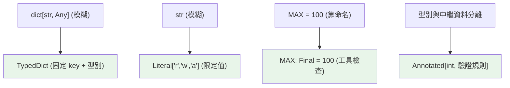

# TypedDict、Literal、Final、Annotated

> 這四個工具讓你精確表達現實中常見的型別：「有固定 key 的 dict」（TypedDict）、「只能是這幾個值」（Literal）、「不可重新賦值」（Final）、「型別 + 額外中繼資料」（Annotated）。

## 💡 白話導讀（建議先讀）

到目前為止的標籤還是有點粗。看四個日常的「標不準」時刻：

1. 一個 dict 裝著使用者資料——標 `dict[str, Any]`？那 mypy 只知道「是一張便條紙，上面有些字」。
   **`TypedDict`** 把便條紙升級成**表單**：明確規定有 name（str）、age（int）這些欄位——拼錯 key、放錯型別，當場抓到。

2. 一個參數只能是 `"r"` 或 `"w"`——標 `str`？那傳 `"banana"` 也合法。
   **`Literal`** 把自由填空換成**下拉選單**：`Literal["r", "w"]`——只准選這幾個。

3. 一個常數不該被改——以前只能靠全大寫命名互相提醒。
   **`Final`** 把它**護貝**起來：誰重新賦值，mypy 就報錯。

4. 想在型別上**多附一張便利貼**（單位、驗證規則⋯⋯給框架看的中繼資料）。
   **`Annotated`** 就是那張便利貼——FastAPI、pydantic 的漂亮用法都靠它。

四個工具一句話總結：**表單、選單、護貝、便利貼**——都是讓標籤從「大概」變「精確」。
和其他註記一樣，它們只在檢查期生效，執行期不強制。

## Why（為什麼）

基本型別涵蓋大部分情況，但現實有些常見模式基本型別表達不精確：JSON 回應是「有 `name`、`age` 這些特定 key 的 dict」（不是任意 `dict[str, Any]`）；`mode` 參數只能是 `"r"`/`"w"`/`"a"`（不是任意 str）；某個值是常數不該被改；某個型別要附帶驗證規則。這四個 typing 工具正是為這些場景設計，能大幅提升型別的精確度與可讀性。

## Theory（理論：四個精確化工具）

| 工具 | 表達什麼 | 白話 | 取代什麼 |
|------|----------|------|----------|
| `TypedDict` | 有固定 key 與各自型別的 dict | 表單 | 模糊的 `dict[str, Any]`（便條紙） |
| `Literal` | 值只能是特定字面值之一 | 下拉選單 | 模糊的 `str` / `int`（自由填空） |
| `Final` | 名稱不可重新賦值（常數） | 護貝 | 靠全大寫命名的君子協定 |
| `Annotated` | 型別 + 額外中繼資料 | 便利貼 | 型別與中繼資料分離兩處 |

共同性質：都是**靜態檢查**（執行期不強制），但讓 mypy 能抓到更精細的錯誤。

## Specification（規範：四者語法）

```python
from typing import TypedDict, Literal, Final, Annotated

# TypedDict：固定 key 的 dict 結構
class User(TypedDict):
    name: str
    age: int
    email: str

class PartialUser(TypedDict, total=False):    # 所有 key 可選
    name: str
    age: int

# Literal：限定字面值
Mode = Literal["r", "w", "a"]
Direction = Literal["N", "S", "E", "W"]

# Final：常數
MAX_SIZE: Final = 100
API_URL: Final[str] = "https://api.example.com"

# Annotated：型別 + 中繼資料
from annotated_types import Gt      # 第三方；或框架自訂
Age = Annotated[int, Gt(0)]         # int，且附帶「> 0」的中繼資料
```

## Implementation（各工具詳解）

### TypedDict：型別化的字典結構

處理 JSON、設定、API 回應時，資料常是「有特定 key 的 dict」。`dict[str, Any]` 太模糊——存取 `d["nmae"]`（打錯）不會被抓。`TypedDict` 精確描述結構：

```python
from typing import TypedDict

class Movie(TypedDict):
    title: str
    year: int
    rating: float

def describe(m: Movie) -> str:
    return f"{m['title']} ({m['year']})"

movie: Movie = {"title": "Inception", "year": 2010, "rating": 8.8}
describe(movie)                # OK
# describe({"title": "X"})     # mypy 報錯：缺 year, rating
# movie["yer"]                 # mypy 報錯：yer 不是合法 key
```

TypedDict **仍是普通 dict**（執行期就是 dict，無額外開銷），但 mypy 會檢查 key 的存在與型別。`total=False` 讓所有 key 變可選；也能用 `NotRequired`/`Required`（3.11+）逐 key 控制。

**TypedDict vs dataclass**：資料本來就是 dict（JSON、外部 API）用 TypedDict；要方法、封裝、驗證用 dataclass/pydantic。

### Literal：限定為特定值

`Literal` 把型別縮到「只能是這幾個字面值」，比 `str` 精確太多：

```python
from typing import Literal

def open_file(path: str, mode: Literal["r", "w", "a"]) -> None: ...

open_file("x.txt", "r")        # OK
# open_file("x.txt", "rw")     # mypy 報錯：不是合法 mode
```

好處：打錯 `"rw"`、`"read"` 立刻被抓，且 IDE 能補全合法值。常用於模式、旗標、狀態、方向等「有限選項」——比 `str` 精確，但比 `Enum`（見 [Enum](../04-oop/14-enum.md)）輕量（適合值就是那些字串、不需要具名成員時）。Literal 也能配合窄化（見 [型別窄化](11-overload-cast-narrowing.md)）。

### Final：不可重新賦值

`Final` 標記「這個名稱是常數，別重新賦值」：

```python
from typing import Final

MAX_RETRIES: Final = 3
MAX_RETRIES = 5          # mypy 報錯：Cannot assign to final name

class Config:
    VERSION: Final = "1.0"      # 類別常數，子類別也不能覆寫
```

和所有註記一樣**執行期不強制**（`MAX_RETRIES = 5` 執行照跑），但 mypy 會抓。它比「全大寫命名」多了工具檢查的保障，表達「這真的是常數」。

### Annotated：型別 + 中繼資料

`Annotated[T, metadata...]` 讓你在型別上附加**額外資訊**，供框架讀取——型別檢查器只看第一個（T），其餘中繼資料由框架（如 pydantic、FastAPI）解讀：

```python
from typing import Annotated

# 型別是 int，但附帶「必須 > 0」的驗證中繼資料
Age = Annotated[int, "must be positive"]

# FastAPI 用它表達「這個參數從 query 來、有驗證規則」
# def endpoint(q: Annotated[str, Query(max_length=50)]): ...
```

`Annotated` 是「把驗證/文件/依賴等中繼資料綁到型別上」的機制，pydantic v2 與 FastAPI 大量使用（見 [pydantic](../14-web/06-pydantic-validation.md)）。對 mypy 而言 `Annotated[int, ...]` 就是 `int`；中繼資料是給其他工具的。

## Code Example（可執行的 Python 範例）

```python
# precise_types_demo.py
from __future__ import annotations

from typing import Final, Literal, TypedDict

MAX_SCORE: Final = 100

Grade = Literal["A", "B", "C", "D", "F"]


class Student(TypedDict):
    name: str
    score: int


def to_grade(score: int) -> Grade:
    """回傳型別限定為 Grade（五個字面值之一）。"""
    if score >= 90:
        return "A"
    if score >= 80:
        return "B"
    if score >= 70:
        return "C"
    if score >= 60:
        return "D"
    return "F"


def report(student: Student) -> str:
    """TypedDict 確保 student 有 name 與 score。"""
    grade = to_grade(student["score"])
    return f"{student['name']}: {student['score']}/{MAX_SCORE} → {grade}"


def demo() -> None:
    alice: Student = {"name": "Alice", "score": 92}
    bob: Student = {"name": "Bob", "score": 58}
    print(report(alice))       # Alice: 92/100 → A
    print(report(bob))         # Bob: 58/100 → F

    # to_grade 回傳型別是 Grade，mypy 知道只會是那 5 個值
    grades: list[Grade] = [to_grade(s) for s in [95, 85, 55]]
    print(f"等第: {grades}")


if __name__ == "__main__":
    demo()
```

**預期輸出**：

```pycon
$ python precise_types_demo.py
Alice: 92/100 → A
Bob: 58/100 → F
等第: ['A', 'B', 'F']
```

## Diagram（圖解：四個精確化工具）



## Best Practice（最佳實踐）

- **處理 JSON/設定/API 的字典用 `TypedDict`**：精確描述結構、抓 key 打錯與型別錯；資料本來是 dict 時比 dataclass 自然。
- **有限選項的字串/數字用 `Literal`**：模式、旗標、狀態；比 `str` 精確、IDE 可補全。值需要具名成員或方法時才用 `Enum`。
- **常數用 `Final`**：多一層工具檢查，勝過只靠命名慣例。
- **需要「型別 + 驗證/中繼資料」用 `Annotated`**：尤其配 pydantic/FastAPI。
- **`total=False` / `NotRequired` 表達可選 key**（TypedDict）。
- **記得都是靜態檢查**：執行期要強制驗證用 pydantic（它能把 TypedDict/Annotated 的意圖真正執行）。

## Common Mistakes（常見誤解）

- **用 `dict[str, Any]` 表達固定結構**：失去 key 與型別檢查；用 TypedDict。
- **用 `str` 表達有限選項**：打錯不被抓；用 `Literal` 或 `Enum`。
- **以為 `Final` 執行期會阻止賦值**：不會，只有 mypy 抓；它是意圖 + 靜態檢查。
- **以為 TypedDict 是特殊型別**：它執行期就是普通 dict，沒有額外行為/驗證。
- **Literal 值寫成變數**：`Literal[SOME_VAR]` 不行；Literal 只接受字面值（字串、數字、bool、Enum 成員、None）。
- **以為 mypy 會處理 Annotated 的中繼資料**：mypy 只看型別部分；中繼資料靠框架（pydantic 等）解讀。
- **Literal vs Enum 混用不分**：值就是那些字面且不需具名成員 → Literal；需要具名/迭代/方法 → Enum。

## Interview Notes（面試重點）

- 說得出四者用途：**TypedDict（固定 key 的 dict 結構）、Literal（限定字面值）、Final（不可重新賦值常數）、Annotated（型別 + 中繼資料）**。
- 知道 **TypedDict 執行期就是普通 dict**、`total=False`/`NotRequired` 控制可選；何時用它 vs dataclass。
- 能對比 **Literal vs Enum**（Literal 輕量、值即字面；Enum 具名成員、可迭代/方法）。
- 知道 **`Annotated[T, ...]` 對 mypy 就是 T**，中繼資料給框架（pydantic/FastAPI）讀。
- 知道全部都是**靜態檢查、執行期不強制**，要執行期驗證用 pydantic。

---

➡️ 下一章：[進階泛型：PEP 695 新語法、ParamSpec、Self](10-advanced-generics.md)

[⬆️ 回 Part 5 索引](README.md)
