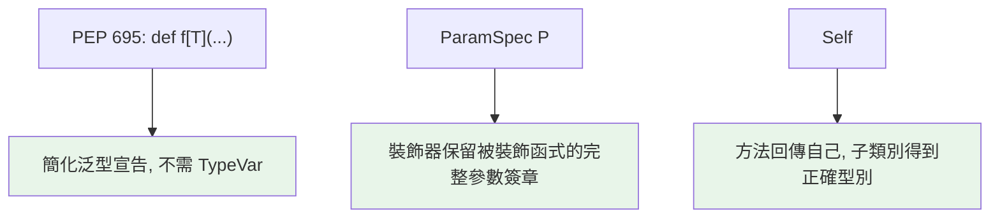

# 進階泛型：PEP 695 新語法、ParamSpec、Self

> Python 3.12 讓泛型語法脫胎換骨——`def f[T](...)` 不再需要 `TypeVar`。加上 `ParamSpec`（保留參數簽章）與 `Self`（回傳自己），現代型別註記的表達力大幅提升。

## 💡 白話導讀（建議先讀）

這章是泛型的三個現代升級。都不難，各自解決一個具體的痛。

**1. PEP 695（3.12）：泛型不用再「先登記」。**

以前用泛型，得先去「戶政事務所」登記一個型別變數：

```python
T = TypeVar("T")          # 先登記
def first(items: list[T]) -> T: ...
```

3.12 之後，直接在函式名後面宣告就好：

```python
def first[T](items: list[T]) -> T: ...   # 一行搞定
```

意思完全一樣，只是不用再隔空宣告——也更像其他語言的泛型長相。

**2. `ParamSpec`：裝飾器的「萬用轉接頭」。**

寫裝飾器最痛的一刻：包裝之後，原函式的參數簽章不見了——IDE 不再提示參數、mypy 不再檢查引數。
`ParamSpec` 像一個**忠實轉發所有插腳的轉接頭**：把原函式的完整參數簽章（位置＋關鍵字）原封不動帶到包裝函式上。

**3. `Self`：「回傳我自己這一型」。**

方法回傳 `self` 時標什麼？寫死類別名，子類別呼叫後就「降級」回父類別、鏈式呼叫斷掉。
`Self` 這個特殊型別的意思是「**呼叫者是誰，就回傳誰**」——子類別呼叫就回傳子類別型別。

## 🎯 什麼時候會用到

這些進階工具平時碰不到,遇到**特定難題**才登場——認得「哪種問題該找哪個」就夠:

- **`ParamSpec` / `Concatenate`**:寫**裝飾器**又想**完整保留被裝飾函式的參數簽章**
  (別讓 `*args, **kwargs` 把型別資訊吃掉)——這是 typed decorator 的標準解。
- **`TypeVar` 的 `bound` / 約束**:泛型要限制「`T` 必須是某類別的子類」或「只能是這幾種型別之一」時。
- **`Self` 型別**:方法回傳 `self`(鏈式呼叫、builder 模式、`.copy()`),
  想讓**子類別也回傳正確的子類別型別**。
- **Python 3.12 的 `def f[T](...)` / `class C[T]` 新語法**:純粹讓上面這些更好寫、不必再宣告 `TypeVar`。

一句話:**這些是「寫要被型別檢查的函式庫/框架」時的工具**;寫應用程式看得懂即可,鮮少自己動用。

## Why（為什麼）

[泛型章](05-generics-typevar.md) 用的 `TypeVar` 語法有點笨重（要先宣告、與使用分離）。Python **3.12（PEP 695）** 引入全新的泛型語法，簡潔許多。同時，兩個進階工具解決常見難題：**`ParamSpec`** 讓裝飾器能「保留被裝飾函式的完整參數簽章」（裝飾器型別化的關鍵）、**`Self`** 讓方法能正確標註「回傳自己這個類別」（鏈式呼叫、替代建構子）。這些是寫現代、精確型別註記的進階武器。

## Theory（理論：三個進階特性）

- **PEP 695（3.12）**：在函式/類別/型別別名處**直接宣告型別參數** `[T]`——`def f[T](...)`——不必先 `TypeVar("T")`「登記」。語意與舊寫法相同，語法更接近其他語言的泛型。

- **`ParamSpec`（3.10）**：「參數規格變數」——捕捉一個函式的**完整參數簽章**（位置 + 關鍵字），讓包裝函式（裝飾器）能原樣轉發並保留型別。就是那個「忠實轉接頭」。

- **`Self`（3.11）**：代表「當前類別」的特殊型別。方法回傳 `Self`，子類別呼叫時就正確回傳子類別型別——比寫死類別名或手動 TypeVar 繞圈都簡單。

## Specification（規範：三者語法）

```python
# --- PEP 695 新語法（3.12+）---
def first[T](items: list[T]) -> T:          # 直接 [T]，不需 TypeVar
    return items[0]

class Stack[T]:                              # 泛型類別
    def push(self, item: T) -> None: ...

def maximum[T: Comparable](items: list[T]) -> T:   # 有界：[T: Bound]
    ...

type ListOrSet[T] = list[T] | set[T]         # 泛型型別別名

# --- 舊語法（3.11 以前，仍廣泛使用）---
from typing import TypeVar, Generic
T = TypeVar("T")
def first(items: list[T]) -> T: ...
class Stack(Generic[T]): ...

# --- ParamSpec（裝飾器保留簽章）---
from typing import ParamSpec, TypeVar
from collections.abc import Callable
P = ParamSpec("P")
R = TypeVar("R")

def logged(func: Callable[P, R]) -> Callable[P, R]: ...

# --- Self（回傳自己）---
from typing import Self
class Builder:
    def add(self, x: int) -> Self: ...
```

## Implementation（PEP 695、ParamSpec、Self 詳解）

### PEP 695：新舊對照

```python
# 舊（3.11 以前）：先宣告，再用
from typing import TypeVar, Generic
T = TypeVar("T")

class Box(Generic[T]):
    def __init__(self, item: T) -> None:
        self.item = item

# 新（3.12+）：一體成形
class Box[T]:
    def __init__(self, item: T) -> None:
        self.item = item
```

新語法優點：不必分開宣告 TypeVar、作用域更清楚（型別參數屬於該函式/類別）、更易讀。有界寫 `[T: Bound]`、多個寫 `[T, U]`。**3.12+ 專案優先用新語法**；相容舊版仍用 `TypeVar`。

### ParamSpec：裝飾器保留參數簽章

裝飾器（見 [裝飾器](../08-functional-decorators/03-decorator-basics.md)）的經典型別難題：包裝函式用 `*args, **kwargs`，型別資訊就丟了——被裝飾函式的參數簽章消失，IDE 不再提示參數。`ParamSpec` 捕捉並保留完整簽章：

```python
from collections.abc import Callable
from functools import wraps
from typing import ParamSpec, TypeVar

P = ParamSpec("P")          # 捕捉參數規格
R = TypeVar("R")            # 捕捉回傳型別

def timed(func: Callable[P, R]) -> Callable[P, R]:
    @wraps(func)
    def wrapper(*args: P.args, **kwargs: P.kwargs) -> R:   # P.args / P.kwargs
        return func(*args, **kwargs)
    return wrapper

@timed
def greet(name: str, times: int) -> str:
    return f"Hi {name} " * times

greet("Alice", 2)          # IDE 仍知道要 (name: str, times: int)！
# greet("Alice")           # mypy 報錯：缺 times（簽章被保留）
```

沒有 ParamSpec，裝飾後的 `greet` 會變成 `(*args, **kwargs)`，失去型別檢查。`P.args`/`P.kwargs` 是 ParamSpec 的特殊用法，代表「原函式的位置與關鍵字參數」。

### Self：正確標註「回傳自己」

方法回傳 `self`（鏈式呼叫）或建立自己類別的實例時，用 `Self` 讓子類別得到正確型別：

```python
from typing import Self

class QueryBuilder:
    def __init__(self) -> None:
        self._parts: list[str] = []

    def where(self, cond: str) -> Self:      # 回傳 Self，支援鏈式
        self._parts.append(cond)
        return self

    def limit(self, n: int) -> Self:
        self._parts.append(f"LIMIT {n}")
        return self


class AdvancedQuery(QueryBuilder):
    def order_by(self, col: str) -> Self: ...

# 鏈式呼叫：因為 Self，子類別的鏈也保持子類別型別
q = AdvancedQuery().where("x=1").limit(10)   # 型別仍是 AdvancedQuery！
```

若把回傳標成 `-> QueryBuilder`（寫死），`AdvancedQuery().where(...)` 會被當成 `QueryBuilder`，就不能再接 `.order_by()`。`Self` 解決這個——它動態代表「呼叫時的實際類別」。這也適用 classmethod 替代建構子（見 [classmethod](../04-oop/07-classmethod-staticmethod.md)）：`def create(cls) -> Self`。

## Code Example（可執行的 Python 範例，相容 3.11+）

```python
# advanced_generics_demo.py
from __future__ import annotations

from collections.abc import Callable
from functools import wraps
from typing import ParamSpec, Self, TypeVar

P = ParamSpec("P")
R = TypeVar("R")


def call_twice(func: Callable[P, R]) -> Callable[P, list[R]]:
    """裝飾器：呼叫兩次，用 ParamSpec 保留原簽章。"""

    @wraps(func)
    def wrapper(*args: P.args, **kwargs: P.kwargs) -> list[R]:
        return [func(*args, **kwargs), func(*args, **kwargs)]

    return wrapper


@call_twice
def add(a: int, b: int) -> int:
    return a + b


class FluentList:
    """用 Self 支援鏈式呼叫且子類別正確。"""

    def __init__(self) -> None:
        self._items: list[int] = []

    def add(self, x: int) -> Self:
        self._items.append(x)
        return self

    def build(self) -> list[int]:
        return self._items


def demo() -> None:
    # ParamSpec 保留簽章：add 仍需 (a, b)
    print(f"call_twice: {add(2, 3)}")        # [5, 5]

    # Self 支援鏈式
    result = FluentList().add(1).add(2).add(3).build()
    print(f"鏈式: {result}")                  # [1, 2, 3]


if __name__ == "__main__":
    demo()
```

**預期輸出**：

```pycon
$ python advanced_generics_demo.py
call_twice: [5, 5]
鏈式: [1, 2, 3]
```

## Diagram（圖解：三個進階特性解決的問題）



## Best Practice（最佳實踐）

- **3.12+ 專案用 PEP 695 新語法** `def f[T](...)` / `class C[T]` / `type X[T] = ...`；需相容舊版才用 `TypeVar`。
- **寫「保留簽章的裝飾器」用 `ParamSpec`**：讓被裝飾函式的參數型別不丟失（IDE 提示、mypy 檢查都保留）。
- **方法回傳 `self` 或建立自己類別的實例 → 用 `Self`**：支援鏈式、替代建構子，且子類別正確。
- **有界泛型新語法 `[T: Bound]`** 取代 `TypeVar("T", bound=...)`。
- **裝飾器一律配 `functools.wraps`**（見 [functools](../08-functional-decorators/05-functools.md)）保留 metadata，再加 ParamSpec 保留型別。
- **漸進採用**：新特性需要對應的 Python / mypy 版本；團隊統一版本後再用。

## Common Mistakes（常見誤解）

- **在 3.11 以前用 PEP 695 語法** `def f[T]`：SyntaxError；舊版用 `TypeVar`。
- **裝飾器不用 ParamSpec**：被裝飾函式的參數簽章變 `(*args, **kwargs)`，失去型別檢查與 IDE 提示。
- **方法回傳寫死類別名而非 `Self`**：子類別鏈式呼叫時型別被降級成父類別，接不到子類別方法。
- **混淆 `Self` 與 `TypeVar` 綁 self**：舊做法用 `TypeVar("T", bound="Cls")` 很囉嗦；`Self`（3.11+）更簡單。
- **`P.args`/`P.kwargs` 寫錯位置**：它們必須用在 `*args: P.args, **kwargs: P.kwargs`，不能拆開或混用。
- **忘了新舊語法背後是同一概念**：PEP 695 只是語法糖，語意與 `TypeVar` 相同。

## Interview Notes（面試重點）

- 知道 **PEP 695（3.12）新泛型語法** `def f[T](...)` / `class C[T]` / `type X = ...`，是 `TypeVar` 的語法糖與簡化。
- 說得出 **`ParamSpec` 解決的問題**：讓裝飾器/包裝函式**保留被包裝函式的完整參數簽章**（`P.args`/`P.kwargs`），否則型別丟失。
- 說得出 **`Self`（3.11）**：方法回傳自己時用它，讓**子類別得到正確型別**（鏈式呼叫、替代建構子），勝過寫死類別名。
- 知道這些特性各自需要的最低 Python 版本（ParamSpec 3.10、Self 3.11、PEP 695 3.12）。
- 知道裝飾器要配 `functools.wraps` + `ParamSpec` 才完整（metadata + 型別）。

---

➡️ 下一章：[overload、cast 與型別窄化](11-overload-cast-narrowing.md)

[⬆️ 回 Part 5 索引](README.md)
