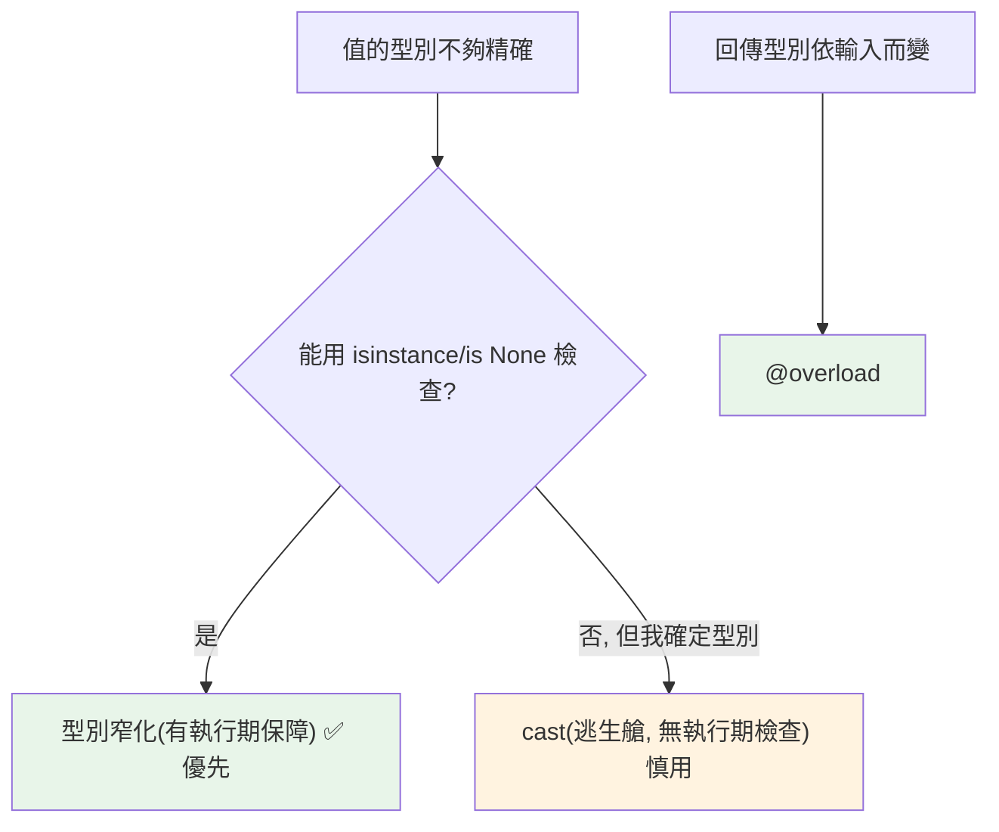

# overload、cast 與型別窄化

> 當函式「不同輸入對應不同輸出型別」用 `@overload`；當你比型別檢查器更懂型別時用 `cast`；而型別窄化則是讓 mypy 在條件分支中自動收斂型別的核心機制。

## 💡 白話導讀（建議先讀）

最後一章是三個收尾工具。用三個畫面記住它們：

**1. 窄化（narrowing）＝偵探的排除法。**

「這個值是 User 或 None。我已確認它不是 None——那剩下的，必然是 User。」
mypy 就是這位偵探：你寫的每個 `if x is None`、`isinstance(x, str)`，它都看在眼裡，並在對應分支**自動縮小**型別範圍。
[第 4 章](04-optional-union.md)已經用過它——這章補齊完整的排除手法清單。

**2. `@overload`＝菜單上的套餐對應表。**

有些函式「點什麼、附什麼」是成對的：點 A 餐附湯、點 B 餐附沙拉。
比如一個函式：傳入單一 id 回傳單一 User；傳入 id 列表回傳 User 列表。
只寫 `int | list[int] -> User | list[User]` 太糊——傳單一 id 也可能拿到「或 list」的型別。
`@overload` 讓你把**每一組對應各自寫清楚**，mypy 依你實際怎麼呼叫，推斷出精準的回傳型別。

**3. `cast`＝「相信我」切結書。**

偶爾你確實比檢查器懂：某個值你**知道**是 str，但 mypy 推不出來。
`cast(str, value)` 是對 mypy 說「相信我，這是 str」——**它不做任何執行期檢查或轉換**，純粹蓋過檢查器的判斷。
簽切結書的意思是：你錯了，後果自負。所以它是逃生艙——偶爾救命，常用就是隱患。

## 🎯 什麼時候會用到

- **`@overload` — 同一個函式「不同輸入對應不同輸出型別」時。**
  例:`config.get(key)` 有給 default 就回 `T`、沒給可能回 `None`;`open()` 依 text/binary 模式回不同型別。
  你想讓呼叫端**依傳入的參數**拿到精確回傳型別,而不是籠統的 `T | None`。
- **`cast` — 你比型別檢查器更清楚,而它推不出來時。**
  例:從 `dict[str, Any]`(剛 parse 的 JSON)取出一個值,你確定它是 `User`;動態載入、反序列化的結果。
  ⚠️ **`cast` 只是「說服檢查器」,不做任何執行期轉換或驗證**——用錯等於把 bug 藏起來,
  少用、只在你**真的確定**時用(能用 `isinstance` 驗證就別用 cast)。
- **型別窄化(narrowing)— 其實你天天在做,只是不知道它有名字。**
  `if x is not None:`、`isinstance(x, str)`、`assert x` 之後,檢查器就知道**這個分支裡** `x` 是更窄的型別。
  想把「自訂的判斷邏輯」也教給檢查器,就寫 `TypeGuard`/`TypeIs`。

## 🔗 前端對照

型別的多載、轉換、縮小,Python 與 TypeScript 一一對應:

| 概念 | Python | TypeScript |
|------|--------|-----------|
| 多載簽章 | `@overload` | 函式多載簽章 |
| 強制轉型 | `cast(T, x)`（純標註,不轉值） | `x as T` |
| 型別縮小 | `isinstance(x, C)` / `if x is None` | `typeof` / `instanceof` / `in` |
| 「相信我這不是 None」 | `assert x is not None` | `x!`（non-null assertion） |

一句話:對應得很整齊。要注意 `cast()` 和 TS 的 `as` 一樣——**只是騙型別檢查器,執行期不會真的轉換或驗證**;
用錯了 runtime 照樣爆,別拿它當資料驗證。

## Why（為什麼）

三個進階但實用的場景：`@overload` 讓你精確描述「傳 int 回 int、傳 str 回 str」這種依輸入而變的回傳型別；`cast` 讓你在「你知道型別、但 mypy 推不出來」時明確告訴它（逃生艙）；**型別窄化（narrowing）** 則是整個 Union 型別能好用的關鍵——它讓 mypy 在 `if`/`isinstance` 分支裡自動知道更精確的型別。掌握這三者，你就能處理型別註記的疑難場景。

## Theory（理論：三個工具的定位）

- **型別窄化（narrowing）**：mypy 根據控制流（`if`、`isinstance`、`assert`⋯⋯）在特定分支「縮小」變數的型別——偵探的排除法。
  這是**自動**的，也是 Union/Optional 之所以好用的基礎。

- **`@overload`**：對**同一個函式**宣告多組「輸入型別 → 輸出型別」的對應（套餐對應表），讓型別檢查器依實際引數推斷出精準的回傳型別。

- **`cast(T, value)`**：**告訴** mypy「把這個值當成 T」——「相信我」切結書。
  不做任何執行期轉換或檢查，純粹覆寫檢查器的判斷。逃生艙，慎用。

## Specification（規範：三者語法）

```python
from typing import overload, cast

# --- 型別窄化（自動，靠控制流）---
def f(x: int | str) -> None:
    if isinstance(x, int):
        ...          # 此處 x: int
    else:
        ...          # 此處 x: str

# --- @overload ---
@overload
def double(x: int) -> int: ...
@overload
def double(x: str) -> str: ...
def double(x: int | str) -> int | str:      # 實作（不加 @overload）
    return x * 2

# --- cast ---
value = cast(list[int], get_data())          # 告訴 mypy 這是 list[int]
```

## Implementation（窄化的觸發、overload、cast、TypeGuard）

### 型別窄化的各種觸發方式

mypy 在這些情況會自動窄化型別：

```python
def process(x: int | str | None) -> str:
    # 1. is None / is not None
    if x is None:
        return ""                    # x: None
    # 2. isinstance
    if isinstance(x, int):
        return str(x * 2)            # x: int
    # 3. 到這裡靠「排除法」窄化
    return x.upper()                 # x: str（排除 None 和 int 後）

def g(x: int | str) -> int:
    # 4. assert 窄化
    assert isinstance(x, int)
    return x + 1                     # x: int

def h(x: str | None) -> int:
    # 5. 真值檢查（小心 falsy 陷阱！）
    if not x:                        # x 是 None 或 ""（falsy）
        return 0
    return len(x)                    # x: str（非空）
```

**注意真值窄化的陷阱**：`if x:` 對 `str | None`，會把 `""`（合法空字串）和 `None` 一起當成「沒有」——若空字串是合法值，要用 `if x is not None:` 精確窄化（見 [Optional 與 Union](04-optional-union.md)）。

### `@overload`：輸入型別決定輸出型別

當回傳型別**依輸入型別而變**，單一簽章表達不了。`@overload` 宣告多組對應：

```python
from typing import overload

@overload
def get(key: str) -> str: ...           # 傳 str 回 str
@overload
def get(key: int) -> list[str]: ...     # 傳 int 回 list[str]

def get(key: str | int) -> str | list[str]:    # 實際實作
    if isinstance(key, str):
        return key.upper()
    return ["item"] * key

reveal_type(get("x"))       # mypy: str
reveal_type(get(3))         # mypy: list[str]
```

規則：**多個 `@overload` 宣告只有簽章（`...`），最後一個是不帶 `@overload` 的實作**。呼叫端會依實際引數型別得到精確的回傳型別——比回傳 `str | list[str]`（讓呼叫端自己猜）好得多。標準庫大量用它（如 `dict.get` 的兩種簽章）。

### `cast`：覆寫型別檢查器（逃生艙）

`cast(T, x)` 對執行期**完全無作用**（不轉換、不檢查），只是告訴 mypy「相信我，這是 T」：

```python
from typing import cast

data: object = load_json()           # mypy 只知道是 object
users = cast(list[dict], data)       # 我知道它是 list[dict]，告訴 mypy
users[0]["name"]                     # 現在 mypy 不抱怨
```

**慎用**：cast 是「關掉這一處的檢查」，若你猜錯了，執行期照樣爆（因為 cast 不做實際檢查）。**優先用窄化（isinstance）**——那是有執行期保障的；只有在「確實比 mypy 懂、且無法用窄化表達」時才用 cast。

### `TypeGuard`：自訂窄化函式（3.10+）

想把「窄化邏輯」抽成可重用函式，用 `TypeGuard`——讓 mypy 知道「這個函式回 True 時，參數是某型別」：

```python
from typing import TypeGuard

def is_str_list(val: list[object]) -> TypeGuard[list[str]]:
    return all(isinstance(x, str) for x in val)

def process(items: list[object]) -> None:
    if is_str_list(items):
        # 這裡 mypy 知道 items: list[str]
        print(" ".join(items))
```

`TypeGuard[T]` 讓自訂的「檢查函式」也能觸發窄化（3.13 有更精確的 `TypeIs`）。

## Code Example（可執行的 Python 範例）

```python
# overload_cast_demo.py
from __future__ import annotations

from typing import TypeGuard, overload


@overload
def parse(value: str) -> str: ...
@overload
def parse(value: int) -> list[int]: ...
def parse(value: str | int) -> str | list[int]:
    """依輸入型別回不同型別。"""
    if isinstance(value, str):
        return value.strip()
    return list(range(value))


def is_int_list(val: list[object]) -> TypeGuard[list[int]]:
    """自訂窄化：全是 int 才回 True。"""
    return all(isinstance(x, int) for x in val)


def sum_if_ints(items: list[object]) -> int:
    if is_int_list(items):
        return sum(items)          # mypy 知道 items: list[int]
    return 0


def classify(x: int | str | None) -> str:
    """型別窄化：靠控制流收斂。"""
    if x is None:
        return "空"
    if isinstance(x, int):
        return f"整數{x}"
    return f"字串{x}"


def demo() -> None:
    print(f"parse('  hi '): {parse('  hi ')!r}")   # 'hi'
    print(f"parse(3): {parse(3)}")                 # [0, 1, 2]
    print(f"sum ints: {sum_if_ints([1, 2, 3])}")   # 6
    print(f"sum mixed: {sum_if_ints([1, 'x'])}")   # 0
    print(f"classify: {[classify(v) for v in (None, 5, 'hi')]}")


if __name__ == "__main__":
    demo()
```

**預期輸出**：

```pycon
$ python overload_cast_demo.py
parse('  hi '): 'hi'
parse(3): [0, 1, 2]
sum ints: 6
sum mixed: 0
classify: ['空', '整數5', '字串hi']
```

## Diagram（圖解：窄化 vs cast）



## Best Practice（最佳實踐）

- **優先用型別窄化**（`isinstance`/`is None`/`assert`）：它有執行期保障，是處理 Union 的正道。
- **回傳型別依輸入而變 → `@overload`**：讓呼叫端得到精確回傳型別，勝過回一個大 Union。
- **`cast` 是最後手段**：只在「確實比 mypy 懂、又無法用窄化表達」時用；記得它**不做執行期檢查**，猜錯照樣爆。
- **可重用的窄化邏輯 → `TypeGuard`**（3.10+）/ `TypeIs`（3.13+）。
- **真值窄化小心 falsy 陷阱**：`if x:` 會把 `0`/`""` 當「沒有」；合法 falsy 值要用 `is not None`。
- **overload 的實作簽章要涵蓋所有多載**：實作那個（不帶 `@overload`）的型別要能容納所有多載情況。

## Common Mistakes（常見誤解）

- **濫用 `cast` 壓錯誤**：cast 不檢查，只是騙過 mypy；猜錯了執行期照樣崩。優先窄化。
- **以為 `cast` 會做型別轉換**：完全不會——它是純型別標註，`cast(int, "5")` 不會變成 5。
- **`@overload` 忘了寫實作**：只有多個 `@overload` 宣告、沒有實際實作 → 執行期 NotImplementedError/錯誤。
- **overload 順序錯**：較specific 的多載要放前面，否則可能匹配到較寬鬆的。
- **真值窄化誤判 falsy 合法值**：`if x:` 對 `int | None` 把 `0` 也排除了；用 `is not None`。
- **該用 overload 卻回傳大 Union**：讓呼叫端每次都要窄化，不如 overload 直接給精確型別。
- **TypeGuard 函式邏輯與宣告不符**：宣告 `TypeGuard[list[str]]` 但實際沒檢查全部是 str，導致誤窄化。

## Interview Notes（面試重點）

- 說得出**型別窄化**的觸發方式（`isinstance`、`is None`、`assert`、真值檢查、排除法）與**真值窄化的 falsy 陷阱**。
- 知道 **`@overload`** 用於「輸入型別決定輸出型別」，規則是「多個 `@overload` 簽章 + 一個實作」。
- 知道 **`cast(T, x)` 對執行期無作用**（不轉換不檢查），是覆寫 mypy 的逃生艙，應**優先用窄化**（有執行期保障）。
- 知道 **`TypeGuard`（3.10+）** 讓自訂函式觸發窄化。
- 能說出「該用 overload 而非回傳大 Union」「該用窄化而非 cast」的判斷。

---

你已掌握 Python 的型別系統：為何用型別註記、基本與進階語法、typing 模組、Optional/Union 與窄化、泛型與 TypeVar、Protocol 結構化子型別、mypy、TypedDict/Literal/Final/Annotated、PEP 695/ParamSpec/Self、overload/cast。
接下來 [Part 6 錯誤處理](../06-error-handling/README.md) 將進入 exception、try/except、context manager 與 EAFP。


➡️ 下一章：[Part 5 統整：型別系統全貌](12-summary.md)

[⬆️ 回 Part 5 索引](README.md)
