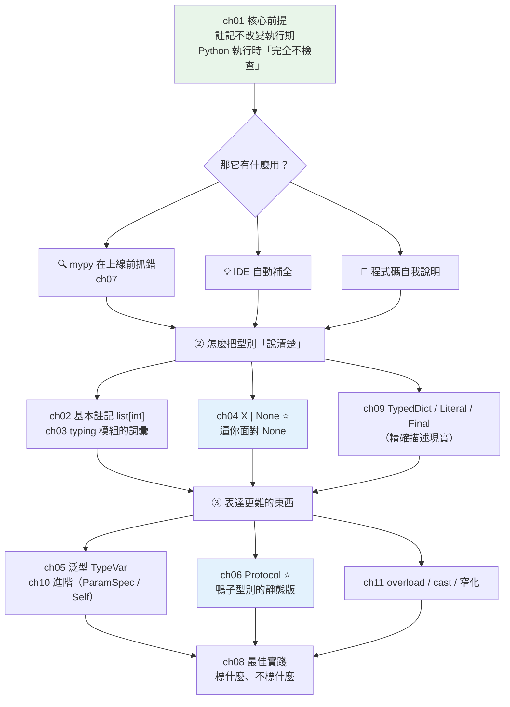

# Part 5 統整：型別系統全貌

> 把這 11 章串成一張圖——型別註記**不改變程式怎麼跑**，它的價值全在「**跑之前**」。

## 🗺️ 知識地圖（這 11 章怎麼串起來）

Part 5 從頭到尾在回答一個看似矛盾的問題：
**Python 是動態型別的，那型別註記到底在幹嘛？**

答案是——**它不是給 Python 看的，是給「工具」看的**：



**一句話串起來**：

**註記是寫給工具看的，不是寫給 Python 看的**（ch01）——
執行期 Python **完全不檢查**，你把 `int` 參數傳字串進去，它照跑不誤。
真正的把關者是 **mypy**（ch07），它**不執行你的程式**，光讀註記就能抓出一整類 bug。

有了這個前提，其餘各章就是在建立「**怎麼把型別說清楚**」的詞彙：
基本註記（ch02）→ typing 模組（ch03）→ 泛型（ch05、ch10）→ 精確型別（ch09）。

其中兩章值得特別記住：

- **[ch04 `X | None`](04-optional-union.md)**——它**逼你面對 None**，
  把 Python 最常見的 `AttributeError: 'NoneType' has no attribute ...` 消滅在上線前。
- **[ch06 Protocol](06-protocol.md)**——它是**鴨子型別的靜態版**：
  不必繼承，「**長得像就算數**」。這讓你能為**改不了的第三方型別**定契約
  （對照 [Part 4 的 ABC](../04-oop/10-abc.md)，那是「強制繼承」的路線）。

## ⚡ 速查表（什麼情境用什麼）

| 情境 | 怎麼寫 | 章節 |
|------|--------|------|
| 一般容器 | `list[int]`、`dict[str, int]`（3.9+ **不必再 import `List`/`Dict`**） | [ch02](02-basic-annotations.md) |
| 「可能沒有值」 | **`X \| None`**（等同 `Optional[X]`，3.10+ 建議用 `\|`） | [ch04](04-optional-union.md) |
| 「可能是這幾種型別之一」 | `int \| str`（Union） | [ch04](04-optional-union.md) |
| 收一個函式當參數 | `Callable[[int, str], bool]` | [ch03](03-typing-module.md) |
| 「有固定 key 的 dict」（如 API 回應） | **`TypedDict`** | [ch09](09-typeddict-literal-final.md) |
| 「只能是這幾個值之一」 | **`Literal["admin", "guest"]`** | [ch09](09-typeddict-literal-final.md) |
| 常數不可重新賦值 | `Final` | [ch09](09-typeddict-literal-final.md) |
| **回傳型別「取決於傳入型別」** | **泛型 `TypeVar`**（3.12+ 可寫 `def f[T](...)`） | [ch05](05-generics-typevar.md)、[ch10](10-advanced-generics.md) |
| 「只要有這個方法就接受」（含第三方型別） | **`Protocol`** | [ch06](06-protocol.md) |
| 裝飾器要**保留原函式的參數簽章** | `ParamSpec` | [ch10](10-advanced-generics.md) |
| 方法回傳 `self`（鏈式呼叫、builder） | `Self` | [ch10](10-advanced-generics.md) |
| 同一函式「不同輸入 → 不同輸出型別」 | `@overload` | [ch11](11-overload-cast-narrowing.md) |
| 你比 mypy 更確定型別（如 parse 完的 JSON） | `cast`（⚠️ **只騙檢查器，不做執行期驗證**，少用） | [ch11](11-overload-cast-narrowing.md) |
| 想「教會」mypy 你的自訂判斷 | `TypeGuard` / `TypeIs` | [ch11](11-overload-cast-narrowing.md) |
| 真的沒辦法標型別 | `Any`（**逃生門，用一次少一分保障**） | [ch03](03-typing-module.md) |
| 舊專案想開始導入型別 | mypy **漸進式**採用：先開寬鬆、逐模組收緊 | [ch07](07-mypy.md) |

## 🔑 核心心智模型（帶得走的幾句話）

- **註記不是強制，是文件 + 工具的燃料。** Python 執行期**完全不看**它——
  你把 `str` 傳給標了 `int` 的參數，程式照跑。真正把關的是 **mypy**，
  它在「**執行之前**」抓錯。（下面的小實作會讓你親眼看到這個矛盾。）
- **`X | None` 是最划算的一個註記。** 它強迫你在**每個使用點**先處理 `None`，
  把 Python 最常見的執行期崩潰（`NoneType has no attribute`）擋在上線前。
- **Protocol ＝ 鴨子型別的靜態版。** 「長得像就算數」——不必繼承。
  這是 Python 的哲學（[鴨子型別](../04-oop/10-abc.md)）**終於能被靜態檢查**的關鍵。
  對照 ABC：**你能改對方 → ABC 強制繼承；改不了對方 → Protocol。**
- **`Any` 是逃生門，不是預設值。** 每寫一個 `Any`，型別安全就破一個洞。
  真的不知道就先用 `object`（至少還有基本保障）。
- **型別註記的價值 ∝ 檢查器的嚴格度。** 光寫註記不跑 mypy，等於寫了一堆**沒人驗證的註解**。

## 🛠️ 小實作：親眼看見「註記不改變執行期」

這支腳本示範 Part 5 的核心矛盾——**Python 不檢查、mypy 才檢查**——
順便走過 Protocol、TypedDict、Literal。

```python
# typing_demo.py —— Part 5 主線：註記不改變執行期，價值在「執行之前」
from __future__ import annotations

from typing import Literal, Protocol, TypedDict, get_type_hints


def add(a: int, b: int) -> int:
    return a + b


# ── ch06 Protocol：不必繼承，「長得像」就算符合（鴨子型別的靜態版）──
class Speaker(Protocol):
    def speak(self) -> str: ...


class Dog:                      # 注意：完全沒有繼承 Speaker！
    def speak(self) -> str:
        return "汪"


class Robot:                    # 也沒有繼承——但它「長得像」
    def speak(self) -> str:
        return "嗶"


def make_it_speak(thing: Speaker) -> str:
    """參數標成 Protocol：任何「有 speak() 的東西」都能傳進來。"""
    return thing.speak()


# ── ch09 TypedDict + Literal：精確描述現實中的資料 ──
class User(TypedDict):
    name: str
    role: Literal["admin", "guest"]     # 只能是這兩個值之一


def describe(user: User) -> str:
    return f"{user['name']}（{user['role']}）"


def demo() -> None:
    print("【ch01 註記不改變執行期行為】")
    print(f"  add(1, 2)      → {add(1, 2)}")
    print(f'  add("a", "b")  → {add("a", "b")!r}   ← 型別錯了，Python 照跑不誤！')
    print('  mypy 會在「執行之前」就攔下: Argument 1 to "add" has incompatible type "str"')

    print("\n【註記只是 metadata】")
    print(f"  get_type_hints(add) → {get_type_hints(add)}")

    print("\n【ch06 Protocol】兩個類別都「沒有繼承」Speaker，但長得像就算符合")
    for thing in (Dog(), Robot()):
        print(f"  {type(thing).__name__:6s} → {make_it_speak(thing)}")

    print("\n【ch09 TypedDict + Literal】")
    user: User = {"name": "Alice", "role": "admin"}
    print(f"  describe(user) → {describe(user)}")
    print('  role 若寫 "boss" → mypy 擋下（不在 Literal["admin","guest"] 裡）')


if __name__ == "__main__":
    demo()
```

**預期輸出**：

```pycon
$ python typing_demo.py
【ch01 註記不改變執行期行為】
  add(1, 2)      → 3
  add("a", "b")  → 'ab'   ← 型別錯了，Python 照跑不誤！
  mypy 會在「執行之前」就攔下: Argument 1 to "add" has incompatible type "str"

【註記只是 metadata】
  get_type_hints(add) → {'a': <class 'int'>, 'b': <class 'int'>, 'return': <class 'int'>}

【ch06 Protocol】兩個類別都「沒有繼承」Speaker，但長得像就算符合
  Dog    → 汪
  Robot  → 嗶

【ch09 TypedDict + Literal】
  describe(user) → Alice（admin）
  role 若寫 "boss" → mypy 擋下（不在 Literal["admin","guest"] 裡）
```

**最關鍵的一行是第二行**：

`add("a", "b")` 明明違反了 `a: int`，**Python 卻回傳了 `'ab'`**（字串相加）。

這就是 Part 5 的整個前提：**註記對 Python 而言只是一段 metadata**
（你可以在 `get_type_hints()` 把它印出來看）。
**它一點約束力都沒有——除非你跑 mypy。**

所以：**寫了註記卻不跑 mypy，等於寫了一堆沒人驗證的註解。**

## ✅ 自測清單（答不出來就回去讀）

- [ ] 型別註記會不會改變程式的執行結果？那它的價值在哪？（[ch01](01-why-type-hints.md)）
- [ ] `list[int]` 和 `List[int]` 差在哪？現在該用哪個？（[ch02](02-basic-annotations.md)）
- [ ] `X | None` 為什麼是「最划算的註記」？它擋掉了什麼 bug？（[ch04](04-optional-union.md)）
- [ ] 什麼時候需要泛型（`TypeVar`）？給一個非泛型寫不出來的例子。（[ch05](05-generics-typevar.md)）
- [ ] Protocol 和 ABC 差在哪？各自什麼時候用？（[ch06](06-protocol.md)、[Part 4 ch10](../04-oop/10-abc.md)）
- [ ] 舊專案要導入 mypy，該怎麼漸進採用？（[ch07](07-mypy.md)）
- [ ] `Any` 有什麼代價？不知道型別時該用什麼？（[ch03](03-typing-module.md)、[ch08](08-typing-best-practices.md)）
- [ ] `TypedDict` 和 `Literal` 各解決什麼問題？（[ch09](09-typeddict-literal-final.md)）
- [ ] `cast` 做了什麼？為什麼說它危險？（[ch11](11-overload-cast-narrowing.md)）
- [ ] 寫一個裝飾器但想保留原函式的參數簽章，用什麼？（[ch10](10-advanced-generics.md)）

## 🎯 面試速查

| 考點 | 面試官想聽到什麼 | 章節 |
|------|------------------|------|
| **型別註記會影響執行期嗎？** | 「**完全不會**。Python 執行期不檢查註記——傳錯型別照跑。註記只是存在 `__annotations__` 裡的 metadata，是給 **mypy／IDE** 用的。價值在『**執行之前**』就抓到錯。」 | [ch01](01-why-type-hints.md) |
| **`Optional[X]` 是什麼意思？** | 「= `X \| None`，代表『**可能沒有值**』。注意它**不是**『可選參數』的意思——那是預設值的事。它的價值是**逼你在使用前先處理 None**，消滅最常見的 `NoneType` 崩潰。」 | [ch04](04-optional-union.md) |
| **Protocol vs ABC？** | 「**ABC 是名義子型別**（必須**繼承**才算數）；**Protocol 是結構子型別**（**長得像就算數**，不必繼承）。你**能改對方** → ABC 強制契約；對方是**第三方／內建型別、改不了** → Protocol。Protocol 是鴨子型別的靜態版。」 | [ch06](06-protocol.md) |
| **什麼時候需要泛型？** | 「當**回傳型別取決於傳入型別**時。`def first(xs: list[T]) -> T` —— 傳 `list[int]` 就回 `int`。不用泛型，型別檢查器只能給你 `Any`，等於放棄了型別安全。」 | [ch05](05-generics-typevar.md) |
| **`Any` 有什麼問題？** | 「它是**逃生門**——一旦標了 `Any`，mypy 對它**完全放行**，型別安全破了一個洞，而且會**傳染**（`Any` 的運算結果還是 `Any`）。不確定時用 `object` 比 `Any` 安全。」 | [ch08](08-typing-best-practices.md) |
| **`cast` 危險在哪？** | 「它**只說服型別檢查器，不做任何執行期轉換或驗證**——你說是 `User`，mypy 就信了，但實際上可能不是。用錯等於**把 bug 藏起來**。能用 `isinstance` 驗證就別用 cast。」 | [ch11](11-overload-cast-narrowing.md) |

---

🎉 **恭喜完成 Part 5！** 你替 Python 這個動態語言，**補回了靜態語言的安全網**——
而且沒有犧牲它的彈性（Protocol 讓鴨子型別依然成立）。

接下來 [Part 6 錯誤處理](../06-error-handling/README.md) 處理另一半的安全：
**當事情真的出錯時，程式該怎麼辦？**
你會發現 Python 的哲學是「**先試了再說**」（EAFP）——
這和你剛學的「事前檢查」是完全相反的思路，但兩者其實各有主場。

➡️ 下一 Part：[錯誤處理 Error Handling](../06-error-handling/README.md)

[⬆️ 回 Part 5 索引](README.md)
