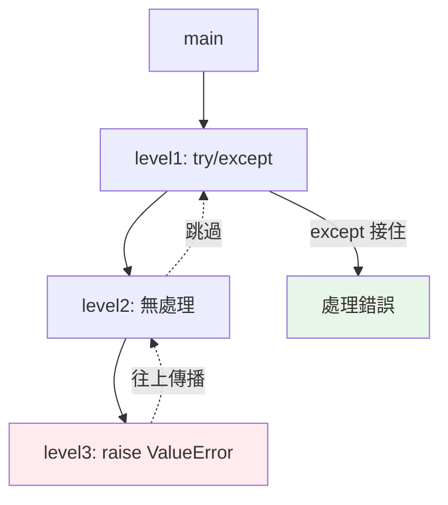

# 例外 exception 概論

> 例外是 Python 處理「錯誤」的核心機制——它不是回傳錯誤碼，而是「拋出」一個物件、沿著呼叫堆疊往上冒，直到被接住或讓程式終止。理解它，才能寫出健壯的程式。

## 💡 白話導讀（建議先讀）

程式出錯時該怎麼通知？兩種制度：

**制度一：紙條回報（錯誤碼）。** 函式出錯就回傳一個特殊值（-1、null），像塞一張紙條給呼叫的人。
致命缺點：**紙條可以被無視**——呼叫端忘了看，錯誤就靜靜消失，程式帶病續跑，在很遠的地方才莫名爆炸。

**制度二：拉火警警報（例外）。** Python 選這個。出錯就 **raise（拉警報）**——警報一響：

1. **當場停止手邊的事**（正常流程立即中斷）。
2. **逐層上報**：這個函式沒人處理？通報呼叫它的函式；再沒有？繼續往上——這叫**傳播**，路線就是呼叫堆疊。
3. **兩種結局**：某一層有人用 `try/except` **接住**警報，在那裡處置；或一路傳到頂都沒人理，程式**終止**，並印出完整的事發經過（**traceback**——從哪裡開始、經過哪些函式、最後在哪爆）。

警報制度的精髓在：**錯誤不可能被默默忽略**——你要嘛處理它，要嘛程式停給你看。這是強迫誠實。

還有一件事先知道：警報本身是一個**物件**（`ValueError("bad")` 是個實例）——所以它能攜帶訊息、能分類（[第 10 章](10-exception-hierarchy.md)的家族樹）、能被精準地接。

## Why（為什麼）

程式總會遇到意外：檔案不存在、網路斷線、除以零、key 不存在。不同語言處理方式不同——C 靠回傳錯誤碼（容易被忽略）、Go 靠多回傳值。**Python 選擇例外（exception）**：出錯時「拋出」一個例外物件，中斷正常流程、沿呼叫鏈往上傳播，直到有人處理它或程式崩潰。理解例外的傳播機制與 Python「例外是常態」的哲學（EAFP，見 [EAFP vs LBYL](09-eafp-vs-lbyl.md)），是寫出健壯程式的基礎。

## Theory（理論：例外是物件，會傳播）

Python 的例外機制，四個要點（對應警報制度）：

- **例外是物件**：每個例外都是某個例外類別的實例（`ValueError("bad")` 是一個物件），繼承自 `BaseException`（見[例外階層](10-exception-hierarchy.md)）。
- **拋出（raise）**：出錯時「拉警報」——**立即中斷當前的正常執行流程**。
- **傳播（propagate）**：警報沿著**呼叫堆疊往上冒**——當前函式沒處理，就傳給呼叫它的函式，一路往上。
- **處理或終止**：若某層用 `try/except` 接住，就在那裡處理；一路冒到頂都沒人接，程式**終止**並印出 traceback。

和「回傳錯誤碼」的根本差異：

> 例外**不會被默默忽略**——不處理就崩潰，強迫你正視錯誤。（紙條可以被丟掉，警報不行。）

## Specification（規範：例外的生命週期）

```python
def divide(a: int, b: int) -> float:
    return a / b            # b=0 時，這裡拋出 ZeroDivisionError

def calculate() -> None:
    result = divide(10, 0)  # 例外從 divide 傳播上來
    print(result)           # 不會執行（例外中斷了）

# 呼叫鏈：main → calculate → divide → 拋 ZeroDivisionError
#         ← ← ← 往上傳播，沒人接 → 程式終止 + traceback
```

未處理的例外會印出 **traceback（回溯）**，顯示例外從哪裡拋出、經過哪些呼叫：

```text
Traceback (most recent call last):
  File "x.py", line 6, in calculate
    result = divide(10, 0)
  File "x.py", line 2, in divide
    return a / b
ZeroDivisionError: division by zero
```

## Implementation（傳播機制、常見內建例外）

### 傳播：沿呼叫堆疊往上冒

```python
def level3() -> None:
    raise ValueError("出錯了")     # 在最深層拋出

def level2() -> None:
    level3()                       # 沒有 try → 例外往上傳

def level1() -> None:
    try:
        level2()                   # 在這裡接住（例外冒到這層）
    except ValueError as e:
        print(f"在 level1 接住: {e}")
```

例外在 `level3` 拋出，`level3`、`level2` 都沒處理，於是往上冒到 `level1` 被接住。**例外會跳過中間所有沒處理它的層**——這讓你能「在合適的層級集中處理錯誤」，而不必每層都檢查。

### 常見內建例外

| 例外 | 何時發生 |
|------|----------|
| `ValueError` | 型別對但值不合法（`int("abc")`） |
| `TypeError` | 型別不對（`"1" + 1`） |
| `KeyError` | dict 中 key 不存在（`d["missing"]`） |
| `IndexError` | 序列索引超出範圍（`[1,2][5]`） |
| `AttributeError` | 物件沒有該屬性（`None.foo`） |
| `FileNotFoundError` | 檔案不存在 |
| `ZeroDivisionError` | 除以零 |
| `StopIteration` | 迭代器耗盡（見 [迭代器](../07-iterators-generators/01-iterable-iterator.md)） |

這些都繼承自 `Exception`（見 [例外階層](10-exception-hierarchy.md)）。

### 例外物件帶有資訊

```pycon
>>> try:
...     int("abc")
... except ValueError as e:
...     print(type(e).__name__)     # ValueError
...     print(e.args)               # ("invalid literal for int() with base 10: 'abc'",)
...     print(str(e))               # invalid literal...
```

例外物件的 `args`、`str(e)` 帶有錯誤訊息，可用來記錄或決定如何處理。

## Code Example（可執行的 Python 範例）

```python
# exceptions_demo.py
def parse_age(text: str) -> int:
    """可能拋出 ValueError（int 解析失敗）。"""
    return int(text)


def process_ages(raw: list[str]) -> list[int]:
    """在合適層級集中處理例外。"""
    results = []
    for item in raw:
        try:
            results.append(parse_age(item))
        except ValueError as e:
            print(f"跳過無效輸入 {item!r}: {e}")
    return results


def demo() -> None:
    # 1. 例外傳播與接住
    ages = process_ages(["25", "abc", "30", "xx"])
    print(f"有效年齡: {ages}")

    # 2. 例外物件帶資訊
    try:
        {"a": 1}["missing"]
    except KeyError as e:
        print(f"KeyError, 缺少的 key: {e.args[0]!r}")

    # 3. 不同例外
    for op in [lambda: 1 / 0, lambda: [1][5], lambda: int("x")]:
        try:
            op()
        except Exception as e:      # 概論示範；實務應接更精確的型別
            print(f"{type(e).__name__}: {e}")


if __name__ == "__main__":
    demo()
```

**預期輸出**：

```pycon
$ python exceptions_demo.py
跳過無效輸入 'abc': invalid literal for int() with base 10: 'abc'
跳過無效輸入 'xx': invalid literal for int() with base 10: 'xx'
有效年齡: [25, 30]
KeyError, 缺少的 key: 'missing'
ZeroDivisionError: division by zero
IndexError: list index out of range
ValueError: invalid literal for int() with base 10: 'x'
```

## Diagram（圖解：例外沿呼叫堆疊傳播）



## Best Practice（最佳實踐）

- **在「能有意義處理錯誤」的層級接例外**：不是每層都 try，而是在能決定「怎麼辦」的地方集中處理（傳播機制讓你能這樣做）。
- **接精確的例外型別**（`except ValueError`），別用裸 `except:` 或過寬的 `except Exception`（見 [最佳實踐](08-error-handling-best-practices.md)）。
- **善用例外物件的資訊**：`e.args`、`str(e)`、型別，用於記錄與決策。
- **讓不該發生的錯誤崩潰**：不是所有例外都要接；程式邏輯 bug 讓它崩、印 traceback 幫你除錯，比默默吞掉好。
- **理解 traceback 由下往上讀**：最底下是例外型別與訊息，往上是呼叫鏈（見 [traceback](12-assert-warnings-traceback.md)）。

## Common Mistakes（常見誤解）

- **以為例外會被默默忽略**：不處理就崩潰——這是特性，強迫正視錯誤。
- **每一層都 try/except**：過度防禦，程式難讀；在合適層級集中處理即可。
- **用裸 `except:`**：會連 `KeyboardInterrupt`、`SystemExit` 都接住，害你 Ctrl-C 都停不了（見 [例外階層](10-exception-hierarchy.md)）。
- **吞掉例外什麼都不做**（`except: pass`）：錯誤消失無蹤，最難除錯的反模式。
- **把例外當一般流程控制濫用**：例外用於「異常」情況；但 Python 的 EAFP 風格確實會用例外做流程（見 [EAFP](09-eafp-vs-lbyl.md)），拿捏在「預期內的失敗」。
- **不看 traceback 就猜錯誤**：traceback 精確告訴你哪裡、什麼錯。

## Interview Notes（面試重點）

- 說得出 Python 用**例外**（而非錯誤碼）處理錯誤：拋出 → **沿呼叫堆疊往上傳播** → 被 `try/except` 接住或**終止程式並印 traceback**。
- 知道**例外是物件**、繼承自 `BaseException`/`Exception`，帶有 `args`/訊息。
- 認得常見內建例外（`ValueError`/`TypeError`/`KeyError`/`IndexError`/`AttributeError`/`FileNotFoundError`）及觸發情境。
- 知道傳播機制的好處：**在合適層級集中處理**，不必每層檢查。
- 知道「不處理就崩潰」是特性（強迫正視），以及不該用裸 `except`/吞例外。

---

➡️ 下一章：[try / except / else / finally](02-try-except.md)

[⬆️ 回 Part 6 索引](README.md)
