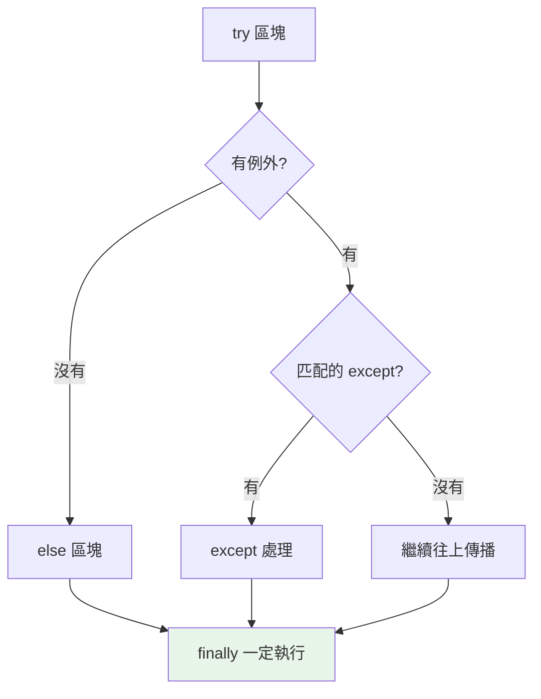

# try / except / else / finally

> `try` 底下能接 `except`、`else`、`finally`——它們差在哪、什麼該放哪一塊？放錯地方，你的清理可能不會執行、或錯誤被默默吞掉。這章把四個區塊的分工講清楚，讓錯誤處理精準。

## 💡 白話導讀（建議先讀）

`try` 語句最完整有四個區塊。用「做一場實驗」分工，一人一句：

```text
try:        # ① 進行實驗 —— 可能出事的步驟放這
except:     # ② 應變預案 —— 出了「這種」事故就這樣處置
else:       # ③ 慶功動作 —— 實驗「順利」才做的後續
finally:    # ④ 收拾實驗台 —— 無論成敗，一定要做的清理
```

兩條流程走一遍就記住了：

- **順利**：try 做完 → else 執行 → finally 收台。
- **出事**：try 中斷 → 找到對的 except 處置（else 跳過）→ finally 照樣收台。

**finally 的「無論如何」是玩真的**——連 try 裡 `return` 了、或例外沒被接住往上冒，它都會先執行完再走。所以關檔、解鎖、釋放連線放這裡最保險。

兩個新手常疏忽的點：

1. **except 要接「具體的」例外**（`except ValueError:`），別寫光禿禿的 `except:`——那會連 Ctrl-C 都吞掉（[第 8 章](08-error-handling-best-practices.md)的鐵律）。
2. **else 的存在意義**:把「只有成功才該做的事」移出 try——try 裡放越少行,你越清楚在防的是哪一步出錯。

## 🔗 前端對照

例外處理兩邊結構一致,但 Python 多了兩個前端沒有的好東西:

| | Python | JavaScript |
|---|--------|-----------|
| 捕捉 | `try: ... except SomeError:` | `try { } catch (e) { }` |
| 依型別分段捕捉 | `except ValueError` / `except KeyError`（可多段） | 只有一個 `catch`,得自己 `if (e instanceof ...)` |
| 一定會跑 | `finally:` | `finally { }` |
| **沒出錯才跑** | `else:`（try 成功才執行） | 無對應 |
| 拿到例外物件 | `except E as e:` | `catch (e)` |

一句話:結構相同,但 Python 能**依例外型別分多段 `except`**（JS 只有一個 `catch`,要自己判斷型別）,
還多一個 JS 沒有的 `else`（「try 沒出錯才跑」）。

## Why（為什麼）

`try/except` 是接住例外的語法，但很多人只用 `try/except` 兩塊，不知道 `else` 和 `finally` 的存在與價值。結果：把「沒出錯才該做的事」也放進 try（可能誤接到不相關的例外）、或忘了在出錯時也釋放資源。搞懂四個區塊的分工，能寫出更精準、更安全的錯誤處理。

## Theory（理論：四個區塊的分工）

```text
try:
    # ① 可能拋出例外的程式碼（進行實驗）
except SomeError as e:
    # ② 若 try 拋出 SomeError → 在這處理（應變預案）
else:
    # ③ 若 try「沒有」拋出任何例外 → 執行這裡（慶功動作）
finally:
    # ④ 無論有沒有例外、有沒有 return → 「一定」執行（收拾實驗台）
```

兩條執行路線：

- `try` 成功（無例外）→ 執行 `else`（若有）→ 執行 `finally`。
- `try` 出錯 → 找到匹配的 `except` 處理 →（**不執行 `else`**）→ 執行 `finally`。

無論哪條路，`finally` **總是**執行——連 `return`、未接住的例外都攔不住它先跑完。

## Specification（規範：語法變化）

```python
# 多個 except（由上而下匹配第一個符合的）
try:
    risky()
except ValueError:
    ...
except (KeyError, IndexError):     # 一個 except 接多種
    ...
except Exception as e:             # 兜底（放最後）
    ...

# except 的順序：具體 → 一般（子類別在前）
try:
    ...
except FileNotFoundError:          # 具體（是 OSError 的子類）
    ...
except OSError:                    # 一般（放後面）
    ...
```

## Implementation（各區塊的正確用法）

### `except` 的匹配規則：由上而下、子類別在前

`except` 從上到下檢查，**匹配第一個符合的**（包含子類別，見 [例外階層](10-exception-hierarchy.md)）。所以**具體的例外要放前面、一般的放後面**：

```python
# ❌ 順序錯：OSError 在前會先接走 FileNotFoundError
try:
    open("x")
except OSError:          # FileNotFoundError 是 OSError 子類 → 被這裡接走
    print("一般 IO 錯誤")
except FileNotFoundError:  # 永遠到不了！
    print("檔案不存在")

# ✅ 具體在前
try:
    open("x")
except FileNotFoundError:
    print("檔案不存在")
except OSError:
    print("其他 IO 錯誤")
```

### `else`：只在「沒出錯」時執行

`else` 的價值：把「try 成功後才該做的事」與「可能出錯的事」**分開**，避免誤接：

```python
# ❌ 把後續處理也塞進 try：若 process() 也拋 ValueError 會被誤接
try:
    data = parse(raw)
    process(data)            # 這行的 ValueError 會被下面誤當成 parse 的錯
except ValueError:
    print("解析失敗")

# ✅ 用 else：只有 parse 成功才 process，且 process 的錯不會被誤接
try:
    data = parse(raw)
except ValueError:
    print("解析失敗")
else:
    process(data)            # 只有 try 沒出錯才執行；此處的例外不被上面接
```

`else` 讓 try 區塊**只包住真正可能出錯、且你想處理的那一行**，範圍最小、最精準。

### `finally`：一定執行的清理

`finally` 無論成功、失敗、甚至 `return`/`break` 都會執行，用於**釋放資源**（關檔案、關連線、解鎖）：

```python
f = open("data.txt")
try:
    process(f)
except OSError:
    print("讀取失敗")
finally:
    f.close()            # 無論如何都關檔（但更好的做法是用 with，見下）
```

⚠️ `finally` 的陷阱：若 `finally` 裡有 `return`，它會**覆蓋** try/except 的 return 或例外——通常不是你要的，避免在 finally 裡 return。

### 更好的資源管理：用 `with`

`try/finally` 做資源清理很常見，但 Python 提供更優雅的 **context manager（`with`）**（見 [context manager](06-context-manager.md)）：

```python
# try/finally 手動清理
f = open("data.txt")
try:
    process(f)
finally:
    f.close()

# ✅ with 自動清理（等價但更簡潔、更安全）
with open("data.txt") as f:
    process(f)               # 離開 with 時自動 close，即使出錯
```

清理資源優先用 `with`；`finally` 用於 `with` 涵蓋不了的清理邏輯。

## Code Example（可執行的 Python 範例）

```python
# try_except_demo.py
def safe_divide(a: float, b: float) -> float | None:
    """完整示範四區塊。"""
    try:
        result = a / b
    except ZeroDivisionError:
        print("  除以零，回傳 None")
        return None
    else:
        print("  計算成功")     # 只有沒出錯才執行
        return result
    finally:
        print("  finally 一定執行")   # 無論如何都執行


def read_config(text: str) -> dict[str, str]:
    """多個 except，具體在前。"""
    try:
        key, value = text.split("=", 1)
    except ValueError:
        return {}
    else:
        return {key.strip(): value.strip()}


def demo() -> None:
    print("10 / 2:")
    print(f"  → {safe_divide(10, 2)}")
    print("10 / 0:")
    print(f"  → {safe_divide(10, 0)}")
    print(f"解析 'a = 1': {read_config('a = 1')}")
    print(f"解析 'invalid': {read_config('invalid')}")


if __name__ == "__main__":
    demo()
```

**預期輸出**：

```pycon
$ python try_except_demo.py
10 / 2:
  計算成功
  finally 一定執行
  → 5.0
10 / 0:
  除以零，回傳 None
  finally 一定執行
  → None
解析 'a = 1': {'a': '1'}
解析 'invalid': {}
```

注意 `finally` 在兩種情況下都執行（成功、失敗），而「計算成功」（else）只在沒出錯時出現。

## Diagram（圖解：四區塊執行流程）



## Best Practice（最佳實踐）

- **try 區塊越小越好**：只包住「真正可能出錯、且你想處理」的那幾行；後續處理放 `else`。
- **except 由具體到一般**：子類別例外放前面，兜底的 `except Exception` 放最後（若真的需要）。
- **用 `else` 分離「成功後的邏輯」**：避免把不相關的例外誤接進來。
- **`finally` 用於必須執行的清理**；但**資源管理優先用 `with`**（見 [context manager](06-context-manager.md)）。
- **別在 `finally` 裡 `return`/`raise`**：會覆蓋 try 的結果或吞掉例外。
- **一個 except 接多種相關例外用 tuple**：`except (KeyError, IndexError):`。

## Common Mistakes（常見誤解）

- **except 順序錯**：一般例外（`OSError`）放在具體例外（`FileNotFoundError`）前面，具體的永遠匹配不到。
- **try 包太多**：把後續處理也塞進 try，導致不相關的例外被誤接；用 `else` 分離。
- **忘了 `else` 的存在**：把「成功才做的事」硬塞 try 或 except 後面。
- **`finally` 裡 return**：`try` 要回的值被 finally 的 return 覆蓋，例外也被吞掉。
- **用 `try/finally` 手動關資源而不用 `with`**：`with` 更簡潔安全。
- **`except Exception` 當萬用**：接太寬會吞掉不該處理的錯（見 [最佳實踐](08-error-handling-best-practices.md)）。

## Interview Notes（面試重點）

- 說得出**四區塊分工**：`try`（可能出錯）、`except`（處理特定例外）、`else`（沒出錯才執行）、`finally`（一定執行、清理）。
- 知道 **except 由上而下匹配、子類別要放前面**（否則被父類別接走）。
- **能講 `else` 的價值**：把「成功後邏輯」與「可能出錯的程式」分離，避免誤接不相關例外、縮小 try 範圍。
- 知道 **`finally` 總是執行**（含 return/break/例外時），以及「別在 finally 裡 return」的陷阱。
- 知道**資源清理優先用 `with`** 而非 `try/finally`。

---

➡️ 下一章：[raise 與例外傳遞](03-raise.md)

[⬆️ 回 Part 6 索引](README.md)
