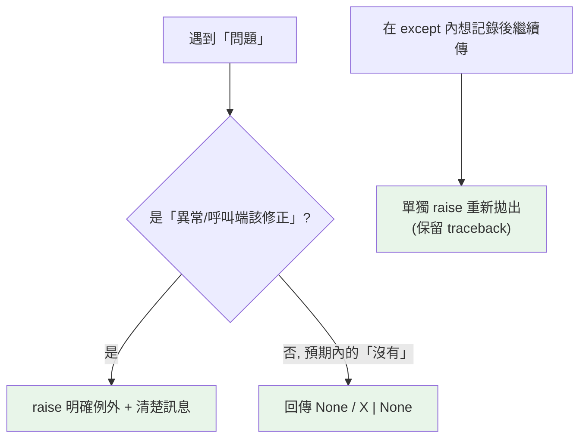

# raise 與例外傳遞

> `raise` 主動拋出例外，是「這裡出了不該繼續的錯」的宣告。搞懂 `raise`、`raise ...`（重新拋出）、以及「該拋還是該回傳」的判斷，是設計函式錯誤介面的關鍵。

## 💡 白話導讀（建議先讀）

[第 1 章](01-exceptions.md)講了警報怎麼傳；這章講**你自己什麼時候拉警報**。

`raise` 的三種姿勢，各對應一個場景：

**1. `raise ValueError("金額不能為負")`——拉一個新警報。**
你的函式收到不該收的東西、或走到不該走的狀態——宣告「這裡出了不該繼續的錯」，立即中斷。

**2. `raise`（單獨一個字，在 except 裡）——把接到的警報原樣往上傳。**
場景：你想「看一眼」錯誤（記個 log），但處置不了——看完原樣上報，**原始的事發經過（traceback）完整保留**。

**3. `raise PaymentError(...) from e`——換個說法上報，但附上原始肇因。**
場景：底層拋了技術性的錯（`ConnectionTimeout`），你想轉成呼叫端聽得懂的語言（`PaymentError`）——`from` 把兩者串成因果鏈（[第 5 章](05-exception-chaining.md)專講）。

最後是設計判斷「**該拋，還是該回傳 None？**」，給個直覺：

- 「查無此人」是**正常會發生**的結果 → 回 `None` 讓呼叫端判斷,別動不動拉警報。
- 「餘額被扣成負的」是**不該發生**的異常 → `raise`,這種事不准默默繼續。

一句話:**警報留給「真的錯了」,別當作日常溝通工具。**

## Why（為什麼）

前面學的是「接住」例外，這章學「拋出」。什麼時候該主動 `raise`？當函式遇到「無法或不該繼續」的情況——收到不合法的參數、前置條件不滿足、資料損毀。用 `raise` 拋出明確的例外，比回傳特殊值（`None`、`-1`）更清楚、更難被忽略。搞懂 `raise` 的各種形式與「拋 vs 回傳」的取捨，你的函式介面才會健壯。

## Theory（理論：主動拋出與傳遞）

`raise` 主動觸發例外，中斷正常流程並開始傳播（見[例外概論](01-exceptions.md)）。三種用法：

- **`raise SomeError("msg")`**：拋出一個新例外——拉新警報。
- **`raise`**（單獨、在 except 內）：**重新拋出**當前正在處理的例外——原樣上傳，**保留原始 traceback**。
- **`raise NewError from original`**：拋出新例外並串接原因——換個說法上報、附上肇因（見[例外鏈](05-exception-chaining.md)）。

「該拋例外還是回傳錯誤值」是設計問題：

> **例外適合「異常、不該正常繼續」的情況**；正常會發生的「找不到」，有時回 `None` 更合適（見取捨）。

## Specification（規範：raise 的形式）

```python
raise ValueError("年齡不能為負")       # 拋出帶訊息的例外
raise ValueError                       # 拋出（自動實例化，等於 ValueError()）
raise                                  # 在 except 內：重新拋出當前例外

# 條件檢查後拋出（guard clause）
def set_age(age: int) -> None:
    if age < 0:
        raise ValueError(f"年齡不能為負: {age}")
    ...
```

## Implementation（拋出、重新拋出、拋vs回傳）

### 拋出明確的例外（含訊息）

好的例外要**型別正確 + 訊息清楚**：

```python
def withdraw(balance: float, amount: float) -> float:
    if amount <= 0:
        raise ValueError(f"提款金額必須為正，得到 {amount}")
    if amount > balance:
        raise ValueError(f"餘額不足：餘額 {balance}，欲提 {amount}")
    return balance - amount
```

型別選對（見 [例外階層](10-exception-hierarchy.md)）：值不合法用 `ValueError`、型別不對用 `TypeError`、狀態不對用自訂或 `RuntimeError`。訊息要含**足以除錯的上下文**（哪個值、期望什麼）。

### 重新拋出：`raise`（保留 traceback）

有時你想「記錄一下錯誤，但仍讓它繼續往上傳」——用單獨的 `raise` 重新拋出**當前**例外，保留原始 traceback：

```python
def process(data: str) -> int:
    try:
        return int(data)
    except ValueError:
        log.error(f"處理失敗: {data!r}")     # 記錄
        raise                                # 重新拋出，保留原始 traceback
```

⚠️ 別寫成 `raise e` 或 `raise ValueError(e)`——那會產生新的 traceback、遺失原始資訊。單獨 `raise` 才是「原樣往上傳」。

### 拋出 vs 回傳錯誤值：怎麼選

| 情況 | 建議 |
|------|------|
| 前置條件違反、參數不合法 | `raise`（呼叫端寫錯了，該明確報錯） |
| 不該發生的內部狀態 | `raise`（bug，讓它崩潰暴露問題） |
| 「查無資料」等預期內的「沒有」 | 回傳 `None`（`X \| None`，見 [Optional](../05-typing/04-optional-union.md)） |
| 需要附帶多種結果 | 考慮回傳結果物件或用例外 |

原則：**「異常、呼叫端該修正」的用例外；「預期內、正常的沒有結果」用回傳值**。例如 `dict[key]` 缺 key 拋 `KeyError`（你不該存取不存在的 key），但 `dict.get(key)` 回 `None`（預期可能沒有）——同一件事、兩種介面，看語意。

### 不要用例外做一般流程控制（過度）

例外雖然是 Python 的常態（EAFP，見 [EAFP](09-eafp-vs-lbyl.md)），但別濫用來做「正常的迴圈跳出」等——那該用 `return`/`break`。例外用於「異常/預期外的失敗」與 EAFP 的「嘗試操作、預期可能失敗」。

## Code Example（可執行的 Python 範例）

```python
# raise_demo.py
import logging

logging.basicConfig(level=logging.INFO, format="%(levelname)s: %(message)s")
log = logging.getLogger(__name__)


def validate_age(age: int) -> int:
    """前置條件檢查：不合法就 raise（guard clause）。"""
    if not isinstance(age, int):
        raise TypeError(f"age 必須是 int，得到 {type(age).__name__}")
    if age < 0 or age > 150:
        raise ValueError(f"age 超出合理範圍: {age}")
    return age


def parse_and_log(data: str) -> int:
    """重新拋出：記錄後保留原始 traceback 往上傳。"""
    try:
        return int(data)
    except ValueError:
        log.error("解析失敗: %r", data)
        raise                    # 重新拋出，保留原始例外


def find_user(users: dict[int, str], uid: int) -> str | None:
    """預期內的『沒有』→ 回傳 None（不 raise）。"""
    return users.get(uid)


def demo() -> None:
    print(f"合法年齡: {validate_age(30)}")

    for bad in [(-5,), ("x",)]:
        try:
            validate_age(bad[0])  # type: ignore[arg-type]
        except (ValueError, TypeError) as e:
            print(f"擋下: {type(e).__name__}: {e}")

    # 找不到回 None（不是例外）
    print(f"查無使用者: {find_user({1: 'Alice'}, 99)}")


if __name__ == "__main__":
    demo()
```

**預期輸出**：

```pycon
$ python raise_demo.py
合法年齡: 30
擋下: ValueError: age 超出合理範圍: -5
擋下: TypeError: age 必須是 int，得到 str
查無使用者: None
```

## Diagram（圖解：拋出 vs 回傳的選擇）



## Best Practice（最佳實踐）

- **用 guard clause 在函式開頭檢查前置條件並 `raise`**：不合法輸入儘早明確報錯，勝過讓錯誤在深處以奇怪形式爆出。
- **拋對的例外型別 + 清楚訊息**：訊息含除錯上下文（哪個值、期望什麼）。
- **重新拋出用單獨 `raise`**（保留原始 traceback），別 `raise e`（會重設 traceback）。
- **分清「拋 vs 回傳」**：異常/該修正用例外、預期內的沒有用 `None`。
- **需要串接原因用 `raise ... from`**（見 [例外鏈](05-exception-chaining.md)）。
- **別用例外做正常流程控制**：正常跳出用 `return`/`break`。

## Common Mistakes（常見誤解）

- **`raise e` 而非單獨 `raise` 重新拋出**：重設了 traceback，遺失「原本從哪拋的」資訊。
- **拋出過於籠統的例外**：`raise Exception("錯了")` 讓呼叫端無法精確處理；用具體型別或自訂例外（見 [自訂例外](04-custom-exceptions.md)）。
- **訊息沒有上下文**：`raise ValueError("invalid")` 不如 `raise ValueError(f"age 超範圍: {age}")`。
- **該 raise 卻回傳特殊值**：回傳 `-1`/`None` 表示錯誤容易被忽略，不如例外明確。
- **該回傳卻硬拋例外**：正常的「找不到」拋例外會逼呼叫端到處 try，不如回 `None`。
- **在 except 裡拋新例外卻不 `from`**：遺失原始原因鏈（見 [例外鏈](05-exception-chaining.md)）。

## Interview Notes（面試重點）

- 知道 `raise` 三形式：**`raise Error(msg)`（拋新的）、單獨 `raise`（重新拋出、保留 traceback）、`raise X from Y`（串接原因）**。
- **能講「該拋例外還是回傳錯誤值」的取捨**：異常/呼叫端該修正 → 例外；預期內的沒有 → 回傳 `None`。並能舉 `d[key]`（KeyError）vs `d.get(key)`（None）。
- 知道**重新拋出用單獨 `raise`**，`raise e` 會重設 traceback。
- 知道拋出要**型別對 + 訊息含上下文**，用 guard clause 儘早檢查。
- 知道不該用例外做一般流程控制、不該拋過於籠統的例外。

---

➡️ 下一章：[自訂例外](04-custom-exceptions.md)

[⬆️ 回 Part 6 索引](README.md)
