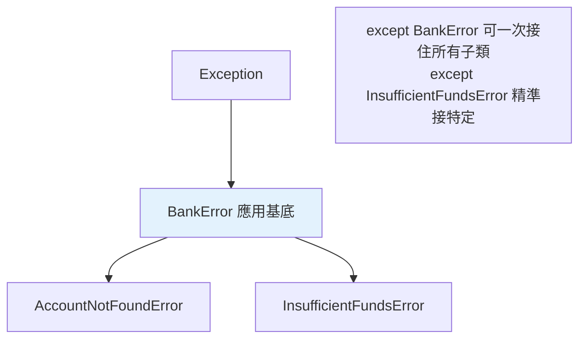

# 自訂例外

> 呼叫方想「只攔付款失敗、放行其他錯誤」，但你程式裡到處 `raise ValueError`——它根本分不出來。這時你需要自訂例外：給領域錯誤一個明確的型別，讓呼叫端接得精準、讓錯誤有清楚語意。

## 💡 白話導讀（建議先讀）

內建警報只有通用款：`ValueError`（值不對）、`KeyError`（鍵不在）⋯⋯
但你的應用有自己的事故類型：「餘額不足」「訂單已關閉」「庫存不夠」——用 `ValueError` 一概而論，接的人分不出是哪種事。

**自訂例外**就是為你的領域**印製專屬警報**。做法簡單到只有一行起跳：

```python
class AppError(Exception): ...          # 我家所有警報的「總開關」

class InsufficientFundsError(AppError): # 具體事故一：餘額不足
    def __init__(self, balance, amount):
        super().__init__(f"餘額 {balance} 不足以支付 {amount}")
        self.balance = balance          # 警報可以夾帶「事故現場資料」
        self.amount = amount
```

兩個設計重點都在上面了：

1. **先建一個「家族基底」**（`AppError`），所有自家例外都繼承它。
   好處是呼叫端有了選擇權：`except InsufficientFundsError:` 精準接一種、或 `except AppError:` **一網打盡你家所有的錯**（但不會誤接別人家的）。
2. **警報能帶附件**：把事故現場的資料（balance、amount）掛在例外物件上,接到的人能拿來做決策或顯示,不用去解析錯誤訊息字串。

一句話:**自訂例外 = 給錯誤取個有意義的名字 + 掛上現場資料**——成本一行,換來整個程式碼庫的錯誤語意清晰。

## Why（為什麼）

內建例外（`ValueError`、`KeyError`）表達的是「通用的錯」。但你的應用有自己的領域錯誤：`InsufficientFundsError`（餘額不足）、`UserNotFoundError`（找不到使用者）、`InvalidConfigError`（設定錯誤）。用內建的 `ValueError` 表達這些會很模糊——呼叫端無法區分「餘額不足」和「其他 ValueError」。**自訂例外**讓錯誤有清楚的語意與型別，呼叫端能精準接住並分別處理。這是設計函式庫/應用錯誤介面的核心。

## Theory（理論：繼承 Exception 建立語意）

自訂例外就是**繼承 `Exception`（或其子類別）的類別**——印製自家專屬警報。三個關鍵設計：

- **繼承 `Exception`**，不是 `BaseException`（那是保留給系統級訊號的，見[例外階層](10-exception-hierarchy.md)）。
- **建立一個「基底例外」代表你的模組/應用**（家族總開關），其他具體例外都繼承它——呼叫端因此能「一次接住你所有的錯」或「精準接特定的」。
- **可攜帶額外資料**（如 `InsufficientFundsError` 帶 `balance`、`amount`）——警報夾帶事故現場資料，供處理時使用。

## Specification（規範：定義自訂例外）

```python
# 最簡單：繼承 Exception，主體 pass
class AppError(Exception):
    """本應用所有例外的基底。"""

class UserNotFoundError(AppError):
    """找不到使用者。"""

class InsufficientFundsError(AppError):
    """餘額不足——攜帶額外資料。"""
    def __init__(self, balance: float, amount: float) -> None:
        self.balance = balance
        self.amount = amount
        super().__init__(f"餘額不足：餘額 {balance}，欲提 {amount}")
```

## Implementation（例外階層、攜帶資料、命名）

### 建立應用的例外階層

好的自訂例外有**階層**：一個基底 + 具體子類。這讓呼叫端能選擇處理粒度：

```python
class OrderError(Exception):
    """訂單相關錯誤的基底。"""

class OutOfStockError(OrderError):
    """庫存不足。"""

class PaymentFailedError(OrderError):
    """付款失敗。"""


# 呼叫端可精準接、或一次接全部
try:
    place_order(...)
except OutOfStockError:
    notify_restock()              # 精準處理某一種
except OrderError:                # 兜底：接住所有訂單相關錯誤
    log.error("訂單失敗")
```

因為 `OutOfStockError` 和 `PaymentFailedError` 都繼承 `OrderError`，`except OrderError` 能一次接住全部——這就是「基底例外」的價值。函式庫慣例都會提供一個頂層例外（如 `requests.RequestException`）。

### 攜帶額外資料

自訂例外可帶結構化資料，讓處理端能程式化地反應（而非解析錯誤訊息字串）：

```text
class ValidationError(Exception):
    def __init__(self, field: str, value: object, reason: str) -> None:
        self.field = field
        self.value = value
        self.reason = reason
        super().__init__(f"欄位 {field!r} 驗證失敗（值 {value!r}）：{reason}")


try:
    validate(...)
except ValidationError as e:
    # 可存取結構化資料，不必解析字串
    return {"error": e.field, "reason": e.reason}
```

記得呼叫 `super().__init__(message)`，讓 `str(e)` 有意義的訊息、`e.args` 正確設定。

### 命名慣例

- **以 `Error` 結尾**（`UserNotFoundError`），符合內建慣例（`ValueError`、`KeyError`）。
- **名稱表達「什麼錯」**，具體有意義。
- **docstring 說明何時拋出**。

### 何時該繼承更具體的內建例外

有時繼承具體的內建例外比繼承 `Exception` 更合適——若你的錯誤「本質上是某種內建錯誤的特例」：

```python
class NegativeValueError(ValueError):    # 它「是一種」ValueError
    """值不該為負。"""
```

這樣 `except ValueError` 也能接住它（因為是子類別），對相容既有處理很有用。但別為了「看起來像」而亂繼承——語意要真的符合 is-a。

## Code Example（可執行的 Python 範例）

```python
# custom_exceptions_demo.py
from __future__ import annotations


class BankError(Exception):
    """銀行操作錯誤的基底。"""


class AccountNotFoundError(BankError):
    """帳戶不存在。"""

    def __init__(self, account_id: int) -> None:
        self.account_id = account_id
        super().__init__(f"帳戶不存在: {account_id}")


class InsufficientFundsError(BankError):
    """餘額不足，攜帶餘額與欲提金額。"""

    def __init__(self, balance: float, amount: float) -> None:
        self.balance = balance
        self.amount = amount
        self.shortfall = amount - balance
        super().__init__(f"餘額不足：餘額 {balance}，欲提 {amount}（差 {self.shortfall}）")


class Bank:
    def __init__(self) -> None:
        self._accounts: dict[int, float] = {1: 100.0, 2: 500.0}

    def withdraw(self, account_id: int, amount: float) -> float:
        if account_id not in self._accounts:
            raise AccountNotFoundError(account_id)
        balance = self._accounts[account_id]
        if amount > balance:
            raise InsufficientFundsError(balance, amount)
        self._accounts[account_id] = balance - amount
        return self._accounts[account_id]


def demo() -> None:
    bank = Bank()
    print(f"提款成功，餘額: {bank.withdraw(1, 30)}")

    # 精準接住不同錯誤
    for acc, amt in [(99, 10), (1, 1000)]:
        try:
            bank.withdraw(acc, amt)
        except AccountNotFoundError as e:
            print(f"帳戶錯誤: {e}（id={e.account_id}）")
        except InsufficientFundsError as e:
            print(f"餘額錯誤: 還差 {e.shortfall}")
        except BankError:              # 兜底：任何銀行錯誤
            print("其他銀行錯誤")


if __name__ == "__main__":
    demo()
```

**預期輸出**：

```pycon
$ python custom_exceptions_demo.py
提款成功，餘額: 70.0
帳戶錯誤: 帳戶不存在: 99（id=99）
餘額錯誤: 還差 900.0
```

## Diagram（圖解：例外階層）



## Best Practice（最佳實踐）

- **為模組/應用建立一個「基底例外」**（繼承 `Exception`），具體例外都繼承它——呼叫端可選擇處理粒度。
- **例外名以 `Error` 結尾、語意清楚**，並寫 docstring 說明何時拋出。
- **攜帶結構化資料**（欄位、值、上下文），讓處理端程式化反應，而非解析訊息字串；記得 `super().__init__(message)`。
- **繼承 `Exception`**（不是 `BaseException`）；只有當「本質是某內建錯誤的特例」才繼承具體內建例外（如 `ValueError`）。
- **函式庫要提供頂層例外**，方便使用者一次接住你的所有錯（如 `requests.RequestException`）。
- **別過度設計**：例外階層要反映真實的錯誤分類，不是為了層次而層次。

## Common Mistakes（常見誤解）

- **繼承 `BaseException`**：那是給 `KeyboardInterrupt`/`SystemExit` 的；自訂例外繼承 `Exception`，否則 `except Exception` 接不到（見 [例外階層](10-exception-hierarchy.md)）。
- **忘了 `super().__init__(message)`**：`str(e)` 沒有訊息、`e.args` 不正確。
- **沒有基底例外**：每個錯誤各自繼承 `Exception`，呼叫端無法「一次接住你所有的錯」。
- **用訊息字串傳遞結構化資訊**：`except ... as e: if "insufficient" in str(e)` 是脆弱反模式；用屬性（`e.shortfall`）。
- **例外名不以 Error 結尾 / 太籠統**：`class Problem` 不如 `class InsufficientFundsError`。
- **亂繼承內建例外**：為了「看起來像」而繼承 `ValueError` 但語意不符，誤導 `except ValueError`。

## Interview Notes（面試重點）

- 知道自訂例外**繼承 `Exception`**（不是 `BaseException`），並以 `Error` 結尾命名。
- **能講「基底例外 + 具體子類」階層的價值**：呼叫端可 `except 基底` 一次接住、或 `except 具體` 精準處理；函式庫慣例提供頂層例外。
- 知道**攜帶結構化資料**（屬性）優於解析訊息字串，且要 `super().__init__(message)`。
- 知道何時繼承具體內建例外（is-a 真的成立時，如 `NegativeValueError(ValueError)`）。
- 知道自訂例外配合 `raise ... from`（見 [例外鏈](05-exception-chaining.md)）串接底層原因。

---

➡️ 下一章：[例外鏈 raise ... from](05-exception-chaining.md)

[⬆️ 回 Part 6 索引](README.md)
