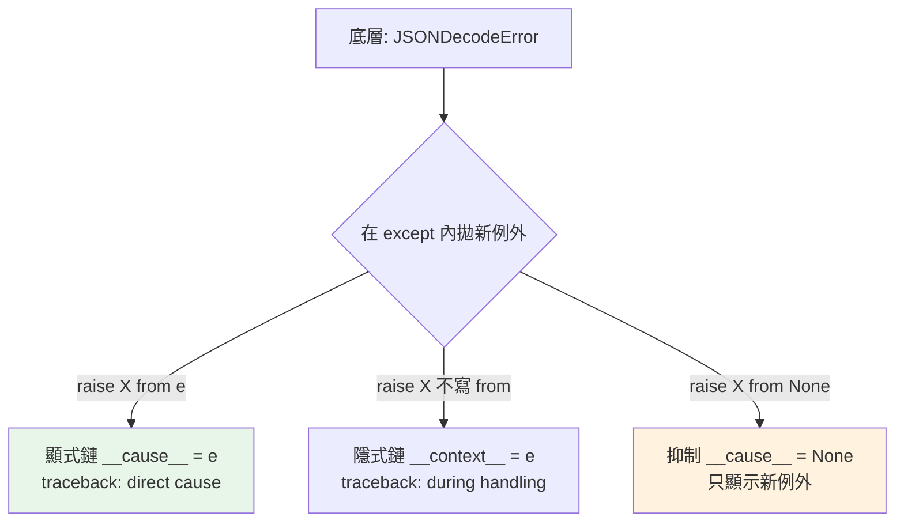

# 例外鏈 raise ... from

> 當你在處理一個例外時拋出另一個，`raise NewError from original` 把「原因」串起來——保留完整的錯誤脈絡，讓 traceback 顯示「因為 A，所以 B」，除錯時追得到根源。

## 💡 白話導讀（建議先讀）

事故調查報告都有一欄「**肇因**」：B 事故是 A 引起的，報告必須寫明因果，否則查案的人只看到 B、永遠不知道根源是 A。

例外也一樣。常見劇情：底層拋了 `ConnectionTimeout`（事故 A），你在 except 裡把它轉成呼叫端聽得懂的 `PaymentError`（事故 B）。
如果 A 的資訊丟了，之後查 log 的人只看到「付款失敗」，**永遠不知道其實是網路逾時**——除錯線索斷頭。

Python 的例外鏈就是那欄「肇因」，有兩種記法：

**1. 顯式（你主動寫）：`raise PaymentError(...) from e`**
正式記載「B 的**直接肇因**是 A」。traceback 會印：
> The above exception was the **direct cause** of the following exception

**2. 隱式（Python 自動）**：在 except 裡拋新例外、沒寫 from——Python 自動註記「處理 A 的**途中**又發生了 B」：
> **During handling** of the above exception, another exception occurred

兩者的差別是**語氣**：`from` 說「我是故意轉換的，因果明確」；沒寫 from 讀起來像「處理時又出了意外」。
所以守則一句話：**故意轉換例外，就寫 `from`**——把因果寫進正式報告，而不是留給讀者猜。

## Why（為什麼）

常見場景：底層拋出技術性例外（`KeyError`、`JSONDecodeError`），你想轉換成領域例外（`ConfigError`）拋給上層——但若直接 `raise ConfigError(...)`，原始的 `KeyError` 資訊就**遺失**了，除錯時看不到「真正的根源」。**例外鏈（exception chaining，PEP 3134）** 用 `raise ... from` 保留原因，traceback 會顯示完整的因果鏈。這是「轉換例外」時保留除錯資訊的正確做法。

## Theory（理論：兩種鏈接）

Python 的例外鏈有兩種——「肇因欄」的兩種記法，反映在 traceback 的不同措辭：

- **隱式鏈（implicit）**：在 `except` 區塊裡拋新例外時，Python **自動**把當前例外設為新例外的 `__context__`。
  traceback 措辭：「During handling of the above exception, another exception occurred」——處理途中又出事。
- **顯式鏈（explicit）**：用 `raise NewError from original`，明確設定 `__cause__`。
  traceback 措辭：「The above exception was the direct cause of the following exception」——正式記載直接肇因。

差別在**意圖**：顯式 `from` 表達「我是**故意**把 A 轉成 B」（因果明確）；隱式則是「處理 A 時**碰巧**又出了 B」。

守則：**轉換例外時，明確用 `from`**。

## Specification（規範：語法）

```python
# 顯式鏈：明確表達「因為 original 所以拋 NewError」
try:
    risky()
except KeyError as e:
    raise ConfigError("設定缺少必要欄位") from e

# 隱式鏈：在 except 內拋新例外，自動串接（不寫 from）
try:
    risky()
except KeyError:
    raise ConfigError("設定錯誤")      # 自動保留 KeyError 於 __context__

# 抑制鏈：明確表示「不要顯示原因」
try:
    risky()
except KeyError:
    raise ConfigError("設定錯誤") from None    # 隱藏底層例外
```

## Implementation（from、__cause__、from None）

### `raise ... from`：明確串接原因

轉換底層例外為領域例外時，用 `from` 保留根源：

```python
import json

class ConfigError(Exception):
    pass

def load_config(text: str) -> dict:
    try:
        return json.loads(text)
    except json.JSONDecodeError as e:
        raise ConfigError("設定檔格式錯誤") from e    # 保留 JSONDecodeError
```

traceback 會顯示兩層：先是 `JSONDecodeError`（根源），然後「The above exception was the direct cause of...」，接著 `ConfigError`。除錯時你能看到**真正的技術原因**（JSON 哪裡壞），而不只是「設定檔格式錯誤」這句抽象訊息。

### `__cause__` 與 `__context__`

鏈接的例外存在屬性裡，可程式化存取：

```python
try:
    load_config("{bad}")
except ConfigError as e:
    print(e)                    # 設定檔格式錯誤
    print(e.__cause__)          # 原始的 JSONDecodeError（from 設定的）
    print(type(e.__cause__))    # <class 'json.JSONDecodeError'>
```

- `__cause__`：`raise ... from X` 設定的**顯式**原因。
- `__context__`：在 except 內拋新例外時**自動**設定的隱式脈絡。

### `from None`：抑制不相干的底層例外

有時底層例外是「實作細節」，對使用者無意義，你想隱藏它——用 `from None`：

```python
def get_setting(config: dict, key: str) -> str:
    try:
        return config[key]
    except KeyError:
        # 底層的 KeyError 對使用者無意義，隱藏它
        raise ConfigError(f"缺少設定: {key}") from None
```

`from None` 讓 traceback 只顯示 `ConfigError`，不顯示「During handling...」那段 KeyError。**謹慎使用**——你可能藏掉了對除錯有用的資訊；只在底層例外真的無關時用。

### 為什麼隱式鏈也重要

即使你忘了寫 `from`，Python 的隱式鏈仍會保留脈絡（`__context__`）——所以在 except 內拋例外時，原始資訊不會完全消失。但**顯式 `from` 表達意圖更清楚**，且 mypy/linter 與讀者都能看出「這是刻意轉換」。慣例：**轉換例外時明確 `from e`**。

## Code Example（可執行的 Python 範例）

```python
# chaining_demo.py
from __future__ import annotations

import json


class ConfigError(Exception):
    """設定相關錯誤。"""


def load_config(text: str) -> dict[str, object]:
    """把底層 JSONDecodeError 轉成領域 ConfigError，保留原因。"""
    try:
        return json.loads(text)
    except json.JSONDecodeError as e:
        raise ConfigError("設定檔不是合法 JSON") from e


def get_required(config: dict[str, object], key: str) -> object:
    """缺 key → 隱藏無意義的底層 KeyError。"""
    try:
        return config[key]
    except KeyError:
        raise ConfigError(f"缺少必要設定: {key}") from None


def demo() -> None:
    # 1. 顯式鏈：可追到根源
    try:
        load_config("{not valid json}")
    except ConfigError as e:
        print(f"領域例外: {e}")
        print(f"根本原因: {type(e.__cause__).__name__}")   # JSONDecodeError

    # 2. from None：隱藏底層
    try:
        get_required({"host": "x"}, "port")
    except ConfigError as e:
        print(f"領域例外: {e}")
        print(f"cause 被抑制: {e.__cause__}")               # None


if __name__ == "__main__":
    demo()
```

**預期輸出**：

```pycon
$ python chaining_demo.py
領域例外: 設定檔不是合法 JSON
根本原因: JSONDecodeError
領域例外: 缺少必要設定: port
cause 被抑制: None
```

## Diagram（圖解：例外鏈）



## Best Practice（最佳實踐）

- **轉換例外時用 `raise NewError from e`**：把底層技術例外轉成領域例外，同時保留根源供除錯。
- **`from None` 只在底層例外真的無關時用**：它會藏掉資訊，別濫用；多數時候保留鏈更有價值。
- **需要程式化存取原因用 `e.__cause__` / `e.__context__`**。
- **配合自訂例外**（見 [自訂例外](04-custom-exceptions.md)）：領域例外 + `from` 底層原因 = 清楚語意 + 可追根源。
- **讓 traceback 說完整故事**：除錯時「因為 A 所以 B」比只看到 B 有用得多。
- **記錄例外時保留鏈**：`log.exception(...)` 會印出完整鏈（見 [logging](../11-stdlib/08-logging.md)）。

## Common Mistakes（常見誤解）

- **轉換例外時漏了 `from e`**：雖然隱式鏈仍保留 `__context__`，但意圖不明確；慣例應明確 `from e`。
- **`raise NewError(str(e))` 想「保留原因」**：只是把訊息塞進字串，遺失了原始例外物件與其 traceback；用 `from e`。
- **濫用 `from None`**：藏掉了對除錯有用的底層資訊，讓根源難追。
- **以為不寫 `from` 就完全遺失原因**：不會，隱式鏈保留 `__context__`；但顯式更好。
- **混淆 `__cause__`（顯式 from）與 `__context__`（隱式）**。
- **鏈接了卻不看 traceback 的完整鏈**：錯過了「真正根源」的資訊。

## Interview Notes（面試重點）

- 說得出**例外鏈**的目的：轉換例外時**保留根本原因**，讓 traceback 顯示完整因果。
- 能區分**顯式鏈（`raise X from e` → `__cause__`，"direct cause"）vs 隱式鏈（在 except 內 raise → `__context__`，"during handling"）**。
- 知道 **`from None` 抑制原因**（謹慎用，會藏資訊）。
- 知道**轉換例外的慣例是明確 `raise X from e`**，且 `raise X(str(e))` 是遺失資訊的反模式。
- 知道可用 `e.__cause__` / `e.__context__` 程式化存取，配合自訂例外做「領域例外 + 底層原因」。

---

➡️ 下一章：[context manager 與 with](06-context-manager.md)

[⬆️ 回 Part 6 索引](README.md)
