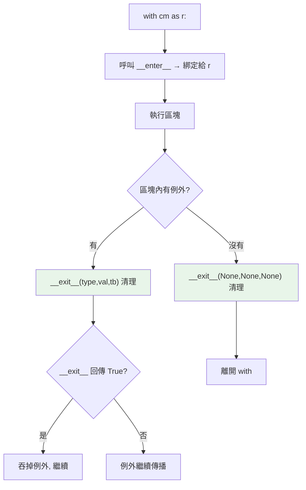

# context manager 與 with

> `with` 保證「用完一定收尾」——開檔一定關、上鎖一定解、連線一定釋放，即使中途發生例外。它背後是 `__enter__`/`__exit__` 協定，是 Python 管理資源的正解。

## 💡 白話導讀（建議先讀）

有一類資源，鐵則是「**借了必還**」：開了的檔案要關、上了的鎖要解、建立的連線要釋放。

麻煩在「必」字——**中途出事也得還**。手寫保證是這樣：

```python
f = open("file.txt")
try:
    data = f.read()      # 就算這行爆炸……
finally:
    f.close()            # ……也保證關檔
```

每借一次都寫一套 try/finally,囉嗦又容易忘。`with` 把這件事變成一行：

```python
with open("file.txt") as f:
    data = f.read()
# 離開區塊的瞬間，檔案已自動關好——正常結束或中途爆炸都一樣
```

`with` 像**自動歸還的圖書館閘門**：進場登記、離場自動歸還——逃生（例外）也會被閘門記到。

它背後不是魔法，是一個協定（[Part 4 的插座](../04-oop/08-dunder-methods.md)又來了）：

- **`__enter__`**：進場時做什麼（取得資源），回傳值就是 `as` 接到的東西。
- **`__exit__`**：離場時做什麼（清理）——**無論正常離開還是例外逃生，都會被呼叫**。

任何物件裝上這兩個插座，就能被 `with` 使用。這章教你讀懂並自己實作它。

## Why（為什麼）

資源需要成對操作：開檔要關檔、上鎖要解鎖、開連線要關連線。若中間出了例外，收尾程式碼可能被跳過，導致資源洩漏、鎖沒解開（死鎖）。手動 `try/finally` 能解決但囉嗦。**context manager + `with`** 把「取得資源 → 使用 → 保證釋放」封裝成一個乾淨的區塊，即使區塊內拋例外也保證收尾。這是 Python 最優雅的設計之一，也是 EAFP 風格資源管理的基礎。

## Theory（理論：with 與 __enter__/__exit__）

`with` 依賴 **context manager 協定**——物件實作兩個 dunder（見[魔術方法](../04-oop/08-dunder-methods.md)），對應「進場登記、離場歸還」：

- **`__enter__(self)`**：進入 `with` 區塊時呼叫，回傳值綁定給 `as` 後的變數。
- **`__exit__(self, exc_type, exc_val, exc_tb)`**：離開區塊時呼叫——**無論正常結束或發生例外**——負責清理。

```python
with open("file.txt") as f:    # __enter__ 回傳 f
    data = f.read()
# 離開區塊 → 自動呼叫 f.__exit__ → 關檔（即使 read 拋例外）
```

本質上，`with` 等價於一個 `try/finally`——但更簡潔，且清理邏輯**封裝在物件裡**（寫一次，處處可用）。

## Specification（規範：with 語法與協定）

```python
# 基本
with resource as r:
    use(r)

# 多個 context manager（等於巢狀）
with open("a") as fa, open("b") as fb:
    ...

# 3.10+ 可用括號跨行
with (
    open("a") as fa,
    open("b") as fb,
):
    ...

# 自訂 context manager
class Managed:
    def __enter__(self) -> "Managed":
        # 取得資源
        return self
    def __exit__(self, exc_type, exc_val, exc_tb) -> bool | None:
        # 清理資源
        return False       # 回傳 falsy → 不吞例外（讓它繼續傳播）
```

## Implementation（等價的 try/finally、__exit__ 的參數、吞例外）

### `with` = 保證執行的 try/finally

```python
# with 寫法
with open("data.txt") as f:
    process(f)

# 等價的 try/finally
f = open("data.txt")
try:
    process(f)
finally:
    f.close()          # 保證關檔
```

即使 `process(f)` 拋例外，`f.close()` 也會被呼叫——`with` 把這個保證封裝起來，且不必手動寫 try/finally。

### `__exit__` 的參數與回傳值

`__exit__` 收到「離開時是否有例外」的資訊：

- 正常離開：三個參數都是 `None`。
- 因例外離開：`exc_type`（例外類別）、`exc_val`（例外物件）、`exc_tb`（traceback）。

`__exit__` 的**回傳值決定是否吞掉例外**：

- 回傳 **falsy（`None`/`False`）→ 例外繼續傳播**（正常情況）。
- 回傳 **`True` → 吞掉例外**（區塊內的例外被抑制，程式繼續）。

```python
class SuppressErrors:
    def __enter__(self):
        return self
    def __exit__(self, exc_type, exc_val, exc_tb):
        if exc_type is not None:
            print(f"抑制了 {exc_type.__name__}")
            return True        # 吞掉例外
        return False

with SuppressErrors():
    raise ValueError("boom")   # 被抑制，程式繼續
print("繼續執行")               # 會執行
```

⚠️ 回傳 `True` 吞例外要**非常謹慎**——多數 context manager 應回傳 falsy 讓例外傳播（清理歸清理、例外歸例外）。

### 自訂 context manager 範例：計時器與資源鎖

```python
import time

class Timer:
    def __enter__(self) -> "Timer":
        self.start = time.perf_counter()
        return self
    def __exit__(self, *args: object) -> None:   # 回傳 None → 不吞例外
        self.elapsed = time.perf_counter() - self.start
        print(f"耗時 {self.elapsed:.4f}s")

with Timer():
    sum(range(1_000_000))     # 離開時印出耗時，即使中途出錯也印
```

`with` 的清理保證讓「計時」「暫時改變狀態再還原」「上鎖解鎖」等都能安全封裝。

### 用 contextlib 更簡單

手寫 `__enter__`/`__exit__` 有時繁瑣，`contextlib.contextmanager` 讓你用 generator 寫 context manager（見 [contextlib](07-contextlib.md)）——下一章詳述。

## Code Example（可執行的 Python 範例）

```python
# context_manager_demo.py
from __future__ import annotations

import time
from types import TracebackType


class Timer:
    """計時的 context manager，離開時印出耗時。"""

    def __enter__(self) -> Timer:
        self.start = time.perf_counter()
        return self

    def __exit__(
        self,
        exc_type: type[BaseException] | None,
        exc_val: BaseException | None,
        exc_tb: TracebackType | None,
    ) -> None:
        self.elapsed = time.perf_counter() - self.start
        # 即使有例外也印（清理照做），回傳 None → 不吞例外
        status = "出錯" if exc_type else "完成"
        print(f"[{status}] 耗時 {self.elapsed:.6f}s")


class Lock:
    """模擬鎖：進入上鎖、離開解鎖（保證解鎖）。"""

    def __init__(self) -> None:
        self.locked = False

    def __enter__(self) -> Lock:
        self.locked = True
        return self

    def __exit__(self, *args: object) -> None:
        self.locked = False        # 即使區塊出錯也解鎖


def demo() -> None:
    # 1. 計時器
    with Timer():
        total = sum(range(500_000))
    print(f"總和: {total}")

    # 2. 保證解鎖（即使出錯）
    lock = Lock()
    try:
        with lock:
            print(f"區塊內 locked={lock.locked}")
            raise RuntimeError("模擬錯誤")
    except RuntimeError:
        pass
    print(f"離開後 locked={lock.locked}（保證解鎖）")


if __name__ == "__main__":
    demo()
```

**預期輸出**：

```pycon
$ python context_manager_demo.py
[完成] 耗時 0.0xxxxxs
總和: 124999750000
區塊內 locked=True
[出錯] ...（若 Timer 包住則印出錯；此例 Lock 未計時）
離開後 locked=False（保證解鎖）
```

（實際耗時數字依機器而異；重點是 `locked` 最後保證為 False。）

## Diagram（圖解：with 的執行）



## Best Practice（最佳實踐）

- **管理成對資源一律用 `with`**：檔案、鎖、連線、交易、暫時狀態——保證釋放，勝過手動 try/finally。
- **`__exit__` 預設回傳 falsy（None/False）讓例外傳播**；只有明確要抑制例外才回 `True`（罕見，謹慎）。
- **`__exit__` 的清理要健壯**：即使有例外也要能正確收尾。
- **多個資源用一個 `with`**（逗號分隔或 3.10+ 括號），別過度巢狀。
- **簡單的 context manager 用 `@contextmanager`**（generator 寫法，見 [contextlib](07-contextlib.md)）。
- **需要「暫時改變再還原」的模式用 context manager**（改設定、切目錄、mock），比手動還原可靠。

## Common Mistakes（常見誤解）

- **不用 `with` 手動開關資源**：`f = open(...); ...; f.close()` 若中間出錯就洩漏；用 `with`。
- **`__exit__` 意外回傳 `True`**：不小心吞掉了所有例外，讓 bug 消失無蹤。多數應回 falsy。
- **以為例外發生時 `__exit__` 不會被呼叫**：會的——這正是 `with` 的價值（清理保證）。
- **`__enter__` 忘了 `return self`（或該回傳的資源）**：`as` 後的變數變成 `None`。
- **在 `__exit__` 裡不處理例外參數就吞掉**：忽略 `exc_type` 卻回傳 True，藏掉錯誤。
- **巢狀太多 `with`**：可用單一 `with a, b, c:` 攤平。

## Interview Notes（面試重點）

- 說得出 `with` 依賴 **context manager 協定 `__enter__`/`__exit__`**，且 `with` 等價於**保證執行的 try/finally**。
- 知道 **`__enter__` 回傳值綁給 `as`**、**`__exit__` 無論正常或例外都會被呼叫**（清理保證）。
- **關鍵考點**：`__exit__` **回傳 `True` 會吞掉例外、回傳 falsy 讓例外傳播**；預設應 falsy。
- 知道 `__exit__` 收到 `(exc_type, exc_val, exc_tb)`，正常離開時皆為 None。
- 知道資源管理**優先用 `with`** 而非手動 try/finally，以及可用 `@contextmanager` 簡化（連結 [contextlib](07-contextlib.md)）。

---

➡️ 下一章：[contextlib](07-contextlib.md)

[⬆️ 回 Part 6 索引](README.md)
