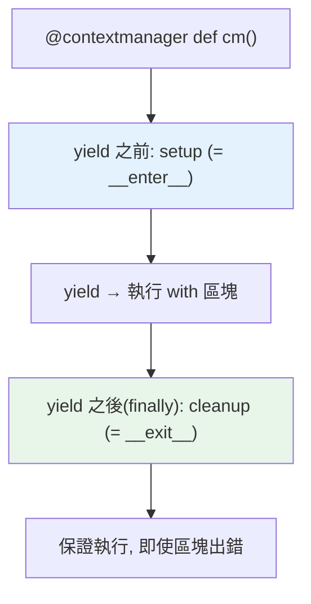

# contextlib

> 手寫 `__enter__`/`__exit__` 一整個類別很囉嗦。`contextlib.contextmanager` 讓你用一個 generator 寫出 context manager——`yield` 之前是 enter、之後是 exit。加上 `suppress`、`closing`、`ExitStack` 等工具，資源管理變得又短又強。

## 💡 白話導讀（建議先讀）

上一章自己實作 context manager 要寫一整個類別（`__init__`、`__enter__`、`__exit__`）——為了「借與還」兩個動作蓋一棟樓，小題大作。

`contextlib` 提供捷徑：**用一個 generator 函式，三行寫完**：

```python
from contextlib import contextmanager

@contextmanager
def open_db():
    conn = connect()      # yield 之前 = 「借」（__enter__ 的工作）
    try:
        yield conn        # yield 本人 = 把資源交給 with 區塊用
    finally:
        conn.close()      # yield 之後 = 「還」（__exit__ 的工作）
```

讀法像一條流水線：**「準備 → yield 交出去 → 收尾」**，從上往下一氣呵成——比類別版的三個方法拼裝直觀得多。

`yield` 是分水嶺：with 區塊執行時，函式**停在 yield 那裡等**；區塊結束（或爆炸），才繼續往下跑清理。
（generator 的暫停機制 [Part 7](../07-iterators-generators/03-generator.md) 詳講，這裡會用即可。）

一個必守的細節已寫在上面：**用 try/finally 包住 yield**——不包的話，with 區塊裡一爆炸，清理程式碼就被跳過了,前功盡棄。

這章還附幾件 contextlib 的現成小工具（`suppress`、`closing`、`ExitStack`），順手好用。

## Why（為什麼）

上一章的 context manager 要寫一整個類別、兩個 dunder。對簡單的「進入做 A、離開做 B」場景太重。`contextlib` 模組提供工具讓 context manager 更好寫：`@contextmanager` 用 generator 一個函式搞定、`suppress` 優雅忽略特定例外、`ExitStack` 動態管理不定數量的資源。這些是日常寫資源管理與清理邏輯的利器。

## Theory（理論：generator 即 context manager）

`@contextlib.contextmanager` 把一個 **generator 函式**（見[生成器](../07-iterators-generators/03-generator.md)）變成 context manager——「準備 → 交出 → 收尾」的流水線：

- **`yield` 之前**的程式碼 ＝ `__enter__`（取得資源）。
- **`yield` 的值** ＝ `__enter__` 的回傳值（綁給 `as`）。
- **`yield` 之後**的程式碼 ＝ `__exit__`（清理）。

必守細節：**用 `try/finally` 包住 `yield`**——才能保證 with 區塊拋例外時，清理仍會執行。

比起寫類別，這個寫法「設定 → yield → 清理」線性讀下來，直觀許多。

## Specification（規範：contextlib 常用工具）

```python
from contextlib import contextmanager, suppress, closing, ExitStack, nullcontext

# @contextmanager：用 generator 寫
@contextmanager
def managed():
    setup()
    try:
        yield resource        # 綁給 as
    finally:
        cleanup()             # 保證執行

# suppress：優雅忽略特定例外
with suppress(FileNotFoundError):
    os.remove("maybe_missing.txt")

# closing：為「有 close() 但非 context manager」的物件補上 with 支援
with closing(urlopen(url)) as page:
    ...

# ExitStack：動態管理不定數量的 context manager
with ExitStack() as stack:
    files = [stack.enter_context(open(f)) for f in filenames]
```

## Implementation（@contextmanager、suppress、ExitStack）

### `@contextmanager`：generator 寫法

對比類別寫法，同樣的 Timer 用 generator 更短：

```python
import time
from contextlib import contextmanager
from collections.abc import Iterator

@contextmanager
def timer() -> Iterator[None]:
    start = time.perf_counter()
    try:
        yield                          # 這裡把控制權交給 with 區塊
    finally:
        print(f"耗時 {time.perf_counter() - start:.4f}s")   # 保證印出

with timer():
    sum(range(1_000_000))
```

`yield` 之前是 setup、`yield` 之後（放 `finally`）是 cleanup。**`try/finally` 包住 `yield` 是關鍵**——確保區塊內拋例外時清理仍執行。若要把資源交給 `as`，就 `yield resource`。

### `suppress`：優雅忽略特定例外

「嘗試做某事，若拋出特定例外就當沒發生」——比 `try/except/pass` 更清楚：

```python
from contextlib import suppress
import os

# ❌ 囉嗦
try:
    os.remove("temp.txt")
except FileNotFoundError:
    pass

# ✅ 清楚表達「忽略檔案不存在」
with suppress(FileNotFoundError):
    os.remove("temp.txt")
```

`suppress` 明確表達「我知道這可能拋 X，故意忽略」。但別濫用——只忽略你**確定無所謂**的特定例外，不要 `suppress(Exception)` 吞一切。

### `ExitStack`：動態管理多個資源

當資源數量在執行期才確定（如開啟一批檔案），無法用固定的 `with a, b, c`。`ExitStack` 動態註冊，離開時逆序全部清理：

```python
from contextlib import ExitStack

def merge_files(paths: list[str]) -> str:
    with ExitStack() as stack:
        files = [stack.enter_context(open(p)) for p in paths]   # 動態開啟
        return "".join(f.read() for f in files)
    # 離開時 stack 自動關閉所有檔案（逆序），即使中途出錯
```

`ExitStack` 也能用 `stack.callback(func)` 註冊任意清理函式、`stack.pop_all()` 轉移所有權——是複雜資源管理的瑞士刀。

### 其他實用工具

- **`closing(thing)`**：把「有 `close()` 但沒實作 context manager 協定」的物件包成可用 `with`。
- **`nullcontext(x)`**：「什麼都不做」的 context manager，用於「有時需要 context manager、有時不需要」的條件情境（避免寫兩份程式）。
- **`redirect_stdout` / `redirect_stderr`**：暫時重導向輸出，測試很好用。

## Code Example（可執行的 Python 範例）

```python
# contextlib_demo.py
from __future__ import annotations

from collections.abc import Iterator
from contextlib import ExitStack, contextmanager, suppress


@contextmanager
def tag(name: str) -> Iterator[None]:
    """用 generator 寫的 context manager：印出開關標籤。"""
    print(f"<{name}>")
    try:
        yield
    finally:
        print(f"</{name}>")


@contextmanager
def temporary_value(container: dict[str, int], key: str, value: int) -> Iterator[None]:
    """暫時改變值，離開時還原（即使出錯）。"""
    original = container.get(key)
    container[key] = value
    try:
        yield
    finally:
        if original is None:
            container.pop(key, None)
        else:
            container[key] = original


def demo() -> None:
    # 1. generator context manager
    with tag("div"):
        with tag("p"):
            print("內容")

    # 2. suppress 忽略特定例外
    data = {"a": 1}
    with suppress(KeyError):
        del data["missing"]         # 不存在也不報錯
    print(f"suppress 後: {data}")

    # 3. 暫時改值後還原
    config = {"mode": 1}
    with temporary_value(config, "mode", 99):
        print(f"區塊內 mode={config['mode']}")
    print(f"離開後 mode={config['mode']}（已還原）")

    # 4. ExitStack 動態管理
    with ExitStack() as stack:
        stack.callback(lambda: print("清理 1"))
        stack.callback(lambda: print("清理 2"))
        print("區塊內")
        # 離開時逆序執行清理（2 先於 1）


if __name__ == "__main__":
    demo()
```

**預期輸出**：

```pycon
$ python contextlib_demo.py
<div>
<p>
內容
</p>
</div>
suppress 後: {'a': 1}
區塊內 mode=99
離開後 mode=1（已還原）
區塊內
清理 2
清理 1
```

## Diagram（圖解：@contextmanager 的 yield）



## Best Practice（最佳實踐）

- **簡單的 context manager 用 `@contextmanager` + generator**：比寫類別短且直觀（setup → yield → cleanup）。
- **`@contextmanager` 一定用 `try/finally` 包住 `yield`**：確保例外時清理仍執行。
- **忽略特定例外用 `suppress`**：比 `try/except/pass` 清楚，但只忽略確定無所謂的特定型別。
- **不定數量的資源用 `ExitStack`**：動態 `enter_context`，離開自動逆序清理。
- **「暫時改變狀態再還原」用 context manager**（改設定、切目錄、mock）——比手動還原可靠。
- **有 `close()` 但非 context manager 的物件用 `closing`**；條件性 context 用 `nullcontext`。

## Common Mistakes（常見誤解）

- **`@contextmanager` 沒用 `try/finally` 包 `yield`**：區塊內拋例外時，`yield` 之後的清理**不會執行**——資源洩漏。務必 `try/finally`。
- **`suppress` 吞太寬**：`suppress(Exception)` 吞掉所有錯，藏 bug；只 suppress 確定無所謂的特定例外。
- **`@contextmanager` 的 generator `yield` 多次**：context manager 的 generator 只能 `yield` 一次，多次會 RuntimeError。
- **忘了 `@contextmanager` 需要 generator**：函式裡沒有 `yield` 會出錯。
- **手動管理多個資源而不用 ExitStack**：數量動態時難處理；ExitStack 專為此設計。
- **回傳型別註記忘了 `Iterator`**：`@contextmanager` 函式回傳 `Iterator[T]`（yield 的型別）。

## Interview Notes（面試重點）

- 說得出 **`@contextmanager` 用 generator 寫 context manager**：`yield` 前是 enter、後（放 `finally`）是 exit，`yield` 的值綁給 `as`。
- **關鍵**：`@contextmanager` 必須用 **`try/finally` 包住 `yield`** 才能保證例外時也清理。
- 知道 **`suppress`**（優雅忽略特定例外、勝過 try/except/pass）、**`ExitStack`**（動態管理不定數量資源）、**`closing`**、**`nullcontext`** 的用途。
- 能對比 **generator 寫法 vs 類別寫法**（前者簡潔、後者可攜狀態/更複雜）。
- 知道 context manager 適合「暫時改變狀態再還原」的模式。

---

➡️ 下一章：[錯誤處理最佳實踐](08-error-handling-best-practices.md)

[⬆️ 回 Part 6 索引](README.md)
