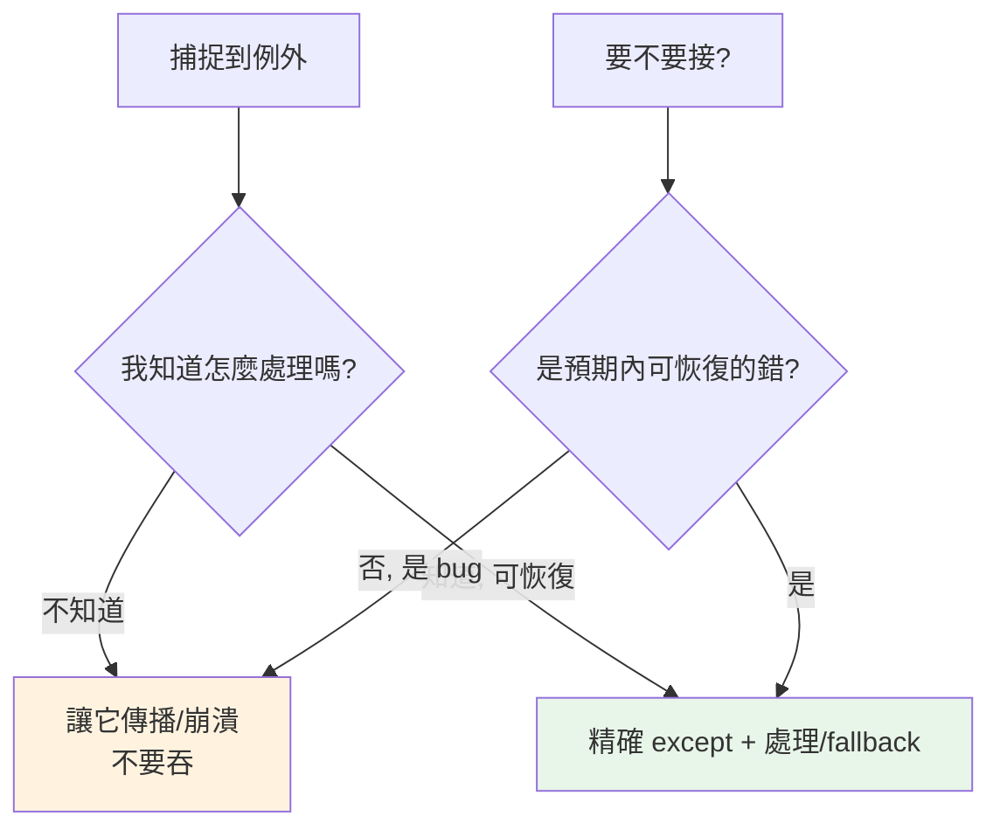

# 錯誤處理最佳實踐

> 好的錯誤處理有幾條鐵律：接精確的例外、絕不吞掉錯誤、在合適層級處理、用 logging 而非 print、讓不該發生的錯崩潰。這章把前面的觀念收斂成可操作的準則。

## Why（為什麼）

錯誤處理寫不好，程式會有兩種病：**太鬆**（裸 `except: pass` 吞掉一切，bug 無聲無息）或**太緊**（每層都 try、過度防禦，程式難讀）。糟糕的錯誤處理讓 bug 難以診斷、讓系統在該失敗時假裝正常。這章整理業界公認的準則，讓你的錯誤處理精準、可診斷、可維護。

## Theory（理論：幾條核心原則）

好的錯誤處理圍繞幾個原則：

1. **精確捕捉**：接你**知道怎麼處理**的特定例外，別接一切。
2. **不吞錯**：捕捉到就要**做點什麼**（處理、記錄、重拋），不是默默忽略。
3. **在對的層級處理**：在「能做出有意義決策」的地方處理，利用傳播機制（見 [例外概論](01-exceptions.md)）。
4. **讓 bug 崩潰**：程式邏輯錯誤不該被接住掩蓋——讓它崩、印 traceback、暴露問題。
5. **記錄，別用 print**：用 logging 保留脈絡（見 [logging](../11-stdlib/08-logging.md)）。

## Specification（規範：好壞對照）

```python
# ❌ 裸 except：接住一切（含 KeyboardInterrupt、SystemExit）
try:
    risky()
except:
    pass

# ❌ 過寬 + 吞掉
try:
    risky()
except Exception:
    pass

# ✅ 精確捕捉 + 有意義處理
try:
    config = load_config(path)
except FileNotFoundError:
    config = default_config()          # 有明確的處理
except json.JSONDecodeError as e:
    log.error("設定格式錯誤: %s", e)
    raise ConfigError("設定損毀") from e
```

## Implementation（各原則詳解）

### 原則一：接精確的例外，不用裸 except

```python
# ❌ 裸 except 連 Ctrl-C（KeyboardInterrupt）都接住 → 程式停不下來
try:
    ...
except:                    # 千萬別
    ...

# ❌ except Exception 太寬：把 TypeError（可能是你的 bug）也吞了
try:
    result = compute(data)
except Exception:
    result = None          # 掩蓋了真正的錯誤

# ✅ 只接你預期且知道怎麼處理的
try:
    result = compute(data)
except ValueError:
    result = None          # 只有 ValueError 才 fallback
```

裸 `except:` 會接住 `BaseException`（含 `KeyboardInterrupt`、`SystemExit`，見 [例外階層](10-exception-hierarchy.md)），害你無法用 Ctrl-C 中斷。永遠指定型別。

### 原則二：不要吞掉例外

```python
# ❌ 最糟的反模式：錯誤消失無蹤
try:
    process()
except Exception:
    pass

# ✅ 至少記錄
try:
    process()
except SpecificError:
    log.exception("處理失敗")    # 記錄含 traceback
    # 然後決定：fallback / 重拋 / 回報
```

捕捉例外後**一定要做點什麼**。真的要忽略特定例外，用 `contextlib.suppress(SpecificError)` 明確表達意圖（見 [contextlib](07-contextlib.md)），而非 `except: pass`。

### 原則三：在對的層級處理

不要每層都 try/except；在「能做出有意義決策」的層級集中處理：

```python
# ❌ 底層每個函式都 try，卻不知道怎麼辦
def read_line(f):
    try:
        return f.readline()
    except Exception:
        return ""          # 底層無法決定怎麼辦，硬吞

# ✅ 底層讓例外傳播，在能決策的上層處理
def read_line(f):
    return f.readline()    # 讓例外自然傳播

def process_file(path):    # 上層知道「檔案讀不了就跳過」
    try:
        with open(path) as f:
            return [read_line(f)]
    except OSError as e:
        log.warning("跳過 %s: %s", path, e)
        return []
```

### 原則四：用 logging 而非 print

```python
import logging
log = logging.getLogger(__name__)

try:
    risky()
except SpecificError:
    log.exception("操作失敗")   # log.exception 自動含 traceback
    raise
```

`print` 除錯錯誤有諸多缺點（無層級、無時間、無法關閉、混在正常輸出）。用 `logging`（見 [logging](../11-stdlib/08-logging.md)）：`log.exception()` 在 except 內自動記錄完整 traceback。

### 原則五：讓 bug 崩潰，別過度防禦

不是所有例外都要接。**程式邏輯的 bug（`TypeError`、`AttributeError` 通常是）該讓它崩潰**——印出 traceback 幫你定位，比默默 fallback 成錯誤狀態好：

```python
# ❌ 過度防禦：掩蓋了 bug
def get_total(items):
    try:
        return sum(item.price for item in items)
    except Exception:
        return 0           # 若 item 沒有 price（bug），你永遠不知道

# ✅ 讓 bug 暴露；只處理「預期的、可恢復的」錯誤
def get_total(items):
    return sum(item.price for item in items)   # bug 會崩潰並顯示原因
```

原則：**捕捉「預期內、可恢復」的錯誤（檔案不存在、網路逾時）；讓「非預期、bug 類」的錯誤崩潰。**

## Code Example（可執行的 Python 範例）

```python
# best_practices_demo.py
from __future__ import annotations

import logging
from contextlib import suppress

logging.basicConfig(level=logging.INFO, format="%(levelname)s: %(message)s")
log = logging.getLogger(__name__)


class ConfigError(Exception):
    pass


def load_setting(config: dict[str, str], key: str, default: str) -> str:
    """精確捕捉 + 有意義的 fallback。"""
    try:
        return config[key]
    except KeyError:
        log.warning("設定缺少 %r，使用預設 %r", key, default)
        return default


def parse_port(text: str) -> int:
    """轉換例外 + 保留原因（見例外鏈章）。"""
    try:
        return int(text)
    except ValueError as e:
        raise ConfigError(f"port 必須是數字: {text!r}") from e


def demo() -> None:
    config = {"host": "localhost"}

    # 精確捕捉 + fallback
    print(f"host: {load_setting(config, 'host', 'default')}")
    print(f"port: {load_setting(config, 'port', '8080')}")

    # suppress 明確忽略
    with suppress(KeyError):
        del config["nonexistent"]
    print("suppress 完成（忽略不存在的 key）")

    # 轉換例外
    try:
        parse_port("abc")
    except ConfigError as e:
        print(f"設定錯誤: {e}（根源: {type(e.__cause__).__name__}）")


if __name__ == "__main__":
    demo()
```

**預期輸出**：

```pycon
$ python best_practices_demo.py
host: localhost
WARNING: 設定缺少 'port'，使用預設 '8080'
port: 8080
suppress 完成（忽略不存在的 key）
設定錯誤: port 必須是數字: 'abc'（根源: ValueError）
```

## Diagram（圖解：錯誤處理決策）



## Best Practice（最佳實踐）

- **接精確的例外型別**（`except FileNotFoundError`），絕不用裸 `except:` 或無腦 `except Exception`。
- **捕捉後要做點什麼**：處理、記錄（`log.exception`）、或重拋；絕不 `except: pass`（要忽略用 `suppress`）。
- **在能做有意義決策的層級處理**，讓底層例外自然傳播。
- **讓 bug 崩潰**：只捕捉「預期內、可恢復」的錯誤；非預期的讓它暴露。
- **用 logging 不用 print**：`log.exception()` 自動含 traceback。
- **轉換例外用 `raise ... from`** 保留根源（見 [例外鏈](05-exception-chaining.md)）。
- **資源清理用 `with`**（見 [context manager](06-context-manager.md)），別靠散落的 try/finally。

## Common Mistakes（常見誤解）

- **裸 `except:`**：接住 `KeyboardInterrupt`/`SystemExit`，Ctrl-C 都停不了。永遠指定型別。
- **`except Exception: pass`**：吞掉一切，最難除錯的反模式；bug 無聲消失。
- **過度防禦**：每層 try、把 bug fallback 成錯誤狀態，掩蓋真正問題。
- **用 print 記錯誤**：無層級、無法關閉、混雜輸出；用 logging。
- **接太寬掩蓋 bug**：`except Exception` 把你的 `TypeError`（真 bug）也吞了。
- **轉換例外漏 `from`**：遺失根源鏈。
- **捕捉自己不該處理的例外**：如在底層接住本該讓上層決策的錯誤。

## Interview Notes（面試重點）

- 能列出核心原則：**精確捕捉、不吞錯、在對的層級處理、讓 bug 崩潰、用 logging**。
- **能說明裸 `except:` 的危害**（接住 `BaseException` 含 `KeyboardInterrupt`/`SystemExit`）與 `except Exception: pass` 的反模式。
- 能講「**捕捉預期內可恢復的錯、讓非預期 bug 崩潰**」的判斷。
- 知道**記錄用 `log.exception()`**（含 traceback）而非 print，忽略用 `suppress` 而非 `except: pass`。
- 知道轉換例外用 `raise ... from`、資源用 `with`。

---

➡️ 下一章：[EAFP vs LBYL](09-eafp-vs-lbyl.md)

[⬆️ 回 Part 6 索引](README.md)
