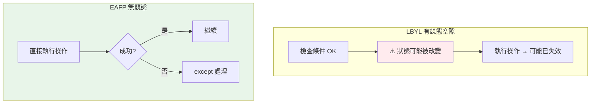

# EAFP vs LBYL

> 「先試了再說，出錯再處理」（EAFP）vs「先檢查條件再做」（LBYL）——這是兩種錯誤處理哲學。Python 偏好 EAFP，不只因為簡潔，更因為它避免了競態條件。理解何時用哪個，是 Pythonic 的核心。

## 💡 白話導讀（建議先讀）

搶一個停車位，兩種策略：

- **LBYL（三思而後行）**：先繞過去**目視確認**車位是空的，再開過去停。
- **EAFP（先斬後奏）**：**直接開過去停**，被佔了再說（處理失敗）。

寫成程式：

```python
# LBYL：先檢查
if key in d:
    value = d[key]

# EAFP：直接做，失敗再處理
try:
    value = d[key]
except KeyError:
    ...
```

**Python 文化明確偏好 EAFP**，兩個理由：

1. **檢查和動手之間，世界可能變了。**
   你目視車位是空的，開過去的三秒內被別人搶了——LBYL 的檢查**保證不了**接下來的操作。
   對檔案（檢查存在 → 開啟前被刪）、多執行緒（檢查 key → 取值前被移除）尤其致命。這叫**競態條件**——EAFP 天生免疫：**動手的那一刻直接面對真實結果**。

2. **少一次重複勞動**：LBYL 常常「檢查一次、操作又隱含檢查一次」;EAFP 一次到位。

但別教條化,LBYL 也有主場：**檢查便宜、失敗昂貴**的場合（發射前檢查參數合法性,總比發射到一半爆炸好）,以及純粹的輸入驗證。

判斷口訣：**操作本身會給你明確失敗訊號 → EAFP;想在「動手前」擋掉明顯不合法的 → LBYL。**

## Why（為什麼）

同一件事有兩種寫法：存取 dict 的 key，你可以「先檢查 key 在不在，在才取」（LBYL）或「直接取，KeyError 再處理」（EAFP）。這不只是風格偏好——**Python 社群明確偏好 EAFP**，而且在多執行緒/檔案系統等場景，LBYL 會有**競態條件**的 bug。這是面試高頻的觀念題，也是判斷「你是否寫 Pythonic 程式」的指標。理解兩者的哲學與取捨，讓你選對做法。

## Theory（理論：兩種哲學）

- **LBYL（Look Before You Leap，三思而後行）**：**先檢查前置條件**，確認 OK 才執行——先繞一圈目視車位。
- **EAFP（Easier to Ask Forgiveness than Permission，先斬後奏）**：**直接執行**，假設會成功，用 `try/except` 處理失敗——直接開過去停。

Python 偏好 EAFP，兩個根據：

1. 例外在 Python 是常態且廉價的機制。
2. **EAFP 免疫競態條件（race condition）**：LBYL 在「檢查通過」與「實際操作」之間，狀態可能已被改變（車位被搶）——檢查保證不了操作。EAFP 動手那一刻直接面對真實結果。

## Specification（規範：兩種寫法對照）

```python
# LBYL：先檢查
if key in my_dict:
    value = my_dict[key]
else:
    value = default

if os.path.exists(path):
    with open(path) as f:      # ⚠️ 檢查後、開檔前，檔案可能被刪！
        data = f.read()

# EAFP：直接做，失敗再處理
try:
    value = my_dict[key]
except KeyError:
    value = default

try:
    with open(path) as f:
        data = f.read()
except FileNotFoundError:
    data = ""
```

## Implementation（為何 Python 偏好 EAFP + 競態條件）

### EAFP 更 Pythonic、常更簡潔

```python
# LBYL：檢查一堆條件
def get_nested(data, keys):
    if isinstance(data, dict) and keys[0] in data:
        inner = data[keys[0]]
        if isinstance(inner, dict) and keys[1] in inner:
            return inner[keys[1]]
    return None

# EAFP：直接嘗試
def get_nested(data, keys):
    try:
        return data[keys[0]][keys[1]]
    except (KeyError, TypeError):
        return None
```

EAFP 版更短、意圖更清楚（「試著取巢狀值，取不到回 None」）。Python 的例外很廉價，這種用法完全正常——別把「用例外」當成壞事。

### 競態條件：LBYL 的致命問題（TOCTOU）

LBYL 在「檢查（Time Of Check）」和「使用（Time Of Use）」之間有空隙，狀態可能改變——這叫 **TOCTOU（Time-Of-Check-To-Time-Of-Use）** race condition：

```python
# ❌ LBYL：有競態條件
if os.path.exists(path):        # 檢查時檔案存在
    # ⚠️ 就在這一瞬間，別的行程/執行緒刪了檔案！
    with open(path) as f:       # 使用時檔案已不存在 → FileNotFoundError
        ...

# ✅ EAFP：原子操作，無競態
try:
    with open(path) as f:       # 直接開，開不了才處理
        ...
except FileNotFoundError:
    ...
```

在多執行緒、多行程、檔案系統、網路等場景，「檢查」和「操作」之間必然有空隙，LBYL 的檢查結果**可能已過時**。EAFP 直接嘗試操作（通常是原子的），從根本避免這個 bug。這是 Python 偏好 EAFP 的**技術性**理由，不只是風格。

### 何時 LBYL 反而更好

EAFP 不是萬能。以下情況 LBYL 更合適：

- **檢查廉價、失敗昂貴或有副作用**：如「操作會修改狀態，失敗後難回復」，先檢查更安全。
- **例外會頻繁發生**：若「失敗」是常態（大部分情況都失敗），滿天飛的例外有效能成本，先檢查更快。
- **簡單的邊界檢查**：`if 0 <= i < len(xs):` 比 try/except IndexError 更清楚直接。
- **對可能為 falsy 的值**：有時 `dict.get(key, default)` 這種「內建的 EAFP 封裝」最好——既不用 try 也無競態。

### 善用「內建的安全存取」

很多 EAFP 場景有現成的簡潔 API，不必自己寫 try：

```python
value = my_dict.get(key, default)        # 取代 try/except KeyError
value = getattr(obj, "attr", default)    # 取代 try/except AttributeError
```

`dict.get`、`getattr`（帶預設）本質是封裝好的 EAFP，最簡潔。

## Code Example（可執行的 Python 範例）

```python
# eafp_lbyl_demo.py
from __future__ import annotations


def get_config_lbyl(config: dict[str, str], key: str) -> str:
    """LBYL：先檢查。"""
    if key in config:
        return config[key]
    return "default"


def get_config_eafp(config: dict[str, str], key: str) -> str:
    """EAFP：直接取，失敗再處理。"""
    try:
        return config[key]
    except KeyError:
        return "default"


def get_nested(data: dict, *keys: str) -> object | None:
    """EAFP 處理巢狀存取——比多層 if 檢查簡潔。"""
    try:
        result: object = data
        for key in keys:
            result = result[key]  # type: ignore[index]
        return result
    except (KeyError, TypeError):
        return None


def demo() -> None:
    config = {"host": "localhost"}

    # 兩種寫法結果相同
    print(f"LBYL host: {get_config_lbyl(config, 'host')}")
    print(f"EAFP port: {get_config_eafp(config, 'port')}")

    # 內建的 EAFP 封裝最簡潔
    print(f"dict.get: {config.get('port', 'default')}")

    # 巢狀存取
    nested = {"a": {"b": {"c": 42}}}
    print(f"取到: {get_nested(nested, 'a', 'b', 'c')}")     # 42
    print(f"取不到: {get_nested(nested, 'a', 'x', 'c')}")   # None


if __name__ == "__main__":
    demo()
```

**預期輸出**：

```pycon
$ python eafp_lbyl_demo.py
LBYL host: localhost
EAFP port: default
dict.get: default
取到: 42
取不到: None
```

## Diagram（圖解：EAFP vs LBYL 的競態）



## Best Practice（最佳實踐）

- **預設偏好 EAFP**：直接嘗試、失敗再處理，更 Pythonic、更簡潔、且避免競態。
- **檔案/網路/共享狀態一定用 EAFP**：LBYL 的「檢查」在這些場景必有 TOCTOU 競態；直接操作 + 處理失敗。
- **善用內建的安全存取**：`dict.get(k, default)`、`getattr(o, name, default)`——封裝好的 EAFP，最簡潔無競態。
- **失敗昂貴/頻繁、或簡單邊界檢查時用 LBYL**：如索引範圍檢查 `if 0 <= i < n`，或「失敗會造成難回復的副作用」時先檢查。
- **接精確的例外**（EAFP 的 except 也要精確，見 [最佳實踐](08-error-handling-best-practices.md)）。
- **別因為「聽說例外慢」就一律避開 EAFP**：例外只有在「拋出時」才有成本，成功路徑幾乎零開銷。

## Common Mistakes（常見誤解）

- **一律用 LBYL（尤其檔案/共享狀態）**：`if exists: open` 有競態，別人可能在空隙刪檔；用 EAFP。
- **以為 EAFP「用例外」是壞習慣**：在 Python 例外廉價、是常態，EAFP 完全正常且被推薦。
- **在該用 `dict.get` 時手寫 try/except**：內建封裝更簡潔。
- **EAFP 卻接太寬的例外**：`except Exception` 掩蓋 bug；接精確型別。
- **無視效能情境**：若失敗是常態（幾乎都拋例外），滿天例外反而慢，此時 LBYL 更好。
- **以為 EAFP 永遠對**：失敗有副作用/難回復時，LBYL 先檢查更安全。

## Interview Notes（面試重點）

- **能定義 EAFP（先做再處理失敗，try/except）與 LBYL（先檢查再做，if）**，並知道 **Python 偏好 EAFP**。
- **關鍵考點**：能說出 EAFP 避免 **TOCTOU 競態條件**（檔案/共享狀態下 LBYL 的檢查結果可能過時），這是技術性理由不只是風格。
- 知道 **`dict.get`/`getattr(默認)` 是內建的 EAFP 封裝**，最簡潔。
- 能說出**何時 LBYL 更好**：失敗頻繁（例外成本）、失敗有難回復副作用、簡單邊界檢查。
- 知道**例外只在拋出時有成本**，成功路徑幾乎零開銷（破除「例外很慢所以避開」的迷思）。

---

➡️ 下一章：[例外階層 exception hierarchy](10-exception-hierarchy.md)

[⬆️ 回 Part 6 索引](README.md)
