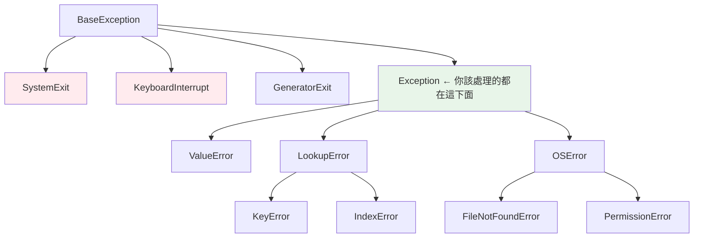

# 例外階層 exception hierarchy

> 為什麼 `except Exception` 攔不住 `Ctrl+C`？因為例外有一棵繼承樹，而 `KeyboardInterrupt` 故意不長在 `Exception` 底下。搞懂這棵樹——以及「`except` 會接住子類別」——你才知道該接什麼、絕不該接什麼。

## 💡 白話導讀（建議先讀）

所有例外組成一棵**家族樹**。看懂這棵樹，`except` 的行為就全部可預測。

最重要的規則一句話：

> **`except 某類別` 會連它的子孫一起接住。**

`except LookupError:` 同時接住 `KeyError` 和 `IndexError`（它們是 LookupError 的孩子）；
`except Exception:` 接住幾乎所有一般錯誤（都是它的後代）。

那為什麼說「幾乎」？這就是本章第二個重點——**有三位特殊人物，刻意不住在 Exception 家裡**：

```text
BaseException（真正的樹根）
├── SystemExit          ← sys.exit()：「程式要正常退出了」
├── KeyboardInterrupt   ← Ctrl-C：「使用者要求停止」
├── GeneratorExit       ← generator 收尾訊號
└── Exception           ← 一般錯誤都住這裡（你該接的都在這下面）
    ├── ValueError、TypeError、KeyError、OSError ⋯⋯
    └── 你的自訂例外
```

為什麼把他們隔開？因為這三個不是「錯誤」,是「**程式該停下來**」的訊號。
如果他們住在 Exception 底下,你寫的 `except Exception:` 就會**把 Ctrl-C 也接住**——使用者狂按 Ctrl-C 程式卻不死,就是這樣來的。

兩條守則帶走：**日常接 Exception 以下的具體類別;永遠不要 `except BaseException`（或裸 except——等價）**。

## Why（為什麼）

`except OSError` 為什麼能接住 `FileNotFoundError`？裸 `except:` 為什麼會害你 Ctrl-C 停不下來？自訂例外該繼承誰？這些問題的答案都在**例外階層**——Python 所有例外構成的繼承樹。理解這棵樹的結構與「捕捉一個類別會連同捕捉其所有子類別」的規則，你才能精準決定捕捉範圍，也才懂為什麼有些例外「不該接」。

## Theory（理論：一棵繼承樹）

Python 所有例外都繼承自 **`BaseException`**（樹根）。全貌：

```text
BaseException                    ← 所有例外的根
├── SystemExit                   ← sys.exit() 觸發
├── KeyboardInterrupt            ← Ctrl-C 觸發
├── GeneratorExit                ← generator 關閉
└── Exception                    ← 「一般」錯誤的基底（你該處理的都在這下面）
    ├── ValueError
    ├── TypeError
    ├── KeyError  ┐
    ├── IndexError┘── LookupError
    ├── ArithmeticError
    │   └── ZeroDivisionError
    ├── OSError
    │   ├── FileNotFoundError
    │   ├── PermissionError
    │   └── ...
    ├── RuntimeError
    └── ...（以及你的自訂例外）
```

**最重要的分野**：`SystemExit`、`KeyboardInterrupt`、`GeneratorExit` **直接掛在 `BaseException` 下，不在 `Exception` 底下**。

這是刻意設計：這三位是「程式該退出/中斷」的**訊號**，不是錯誤——不該被一般的 `except Exception` 接住（否則 Ctrl-C 按不死程式）。

## Specification（規範：捕捉規則）

```python
# except 一個類別 → 連同接住它的所有子類別
try:
    open("x")
except OSError:            # 接住 OSError 及其所有子類別（含 FileNotFoundError）
    ...

# except Exception：接住所有「一般」錯誤，但放過 SystemExit/KeyboardInterrupt
try:
    ...
except Exception:          # 放過 Ctrl-C 和 sys.exit()
    ...

# 裸 except: 或 except BaseException: 接住「一切」（危險）
try:
    ...
except:                    # 連 KeyboardInterrupt/SystemExit 都接 → 別這樣
    ...
```

## Implementation（捕捉子類別、Exception vs BaseException、常見分支）

### 捕捉父類別 = 捕捉所有子類別

這是階層最實用的性質：`except 父類別` 會接住該類別**及其所有子孫**：

```python
try:
    risky_io()
except OSError as e:       # FileNotFoundError、PermissionError... 全接
    print(f"IO 錯誤: {e}")
```

`FileNotFoundError`、`PermissionError`、`ConnectionError` 都是 `OSError` 的子類別，所以 `except OSError` 一網打盡。這也解釋了 [try/except 章](02-try-except.md) 的「具體在前、一般在後」——若 `except OSError` 在前，`FileNotFoundError` 永遠匹配不到。

同理 `except Exception` 接住幾乎所有「一般」錯誤（因為它們都繼承 Exception），`except LookupError` 同時接 `KeyError` 和 `IndexError`（兩者都繼承 LookupError）。

### `Exception` vs `BaseException`：為何裸 except 危險

```python
# ❌ 裸 except / except BaseException：接住 KeyboardInterrupt
while True:
    try:
        do_work()
    except:                # 連 Ctrl-C 都接住 → 迴圈永遠停不了！
        continue

# ✅ except Exception：放過 KeyboardInterrupt/SystemExit
while True:
    try:
        do_work()
    except Exception:      # Ctrl-C 能正常中斷程式
        log.exception("work 失敗")
```

`KeyboardInterrupt`（Ctrl-C）和 `SystemExit`（`sys.exit()`）直接繼承 `BaseException`、**不在 `Exception` 底下**，正是為了讓 `except Exception` 放過它們——你按 Ctrl-C 時，例外不會被「處理一般錯誤」的 except 攔截。裸 `except:` 等於 `except BaseException:`，會接住這些訊號，是危險反模式（見 [最佳實踐](08-error-handling-best-practices.md)）。

**規則**：捕捉一般錯誤用 `except Exception`（絕不用裸 except）；自訂例外繼承 `Exception`（不是 BaseException）。

### 常見的中間分支

知道這些「中間父類別」能一次接住相關的一組：

| 父類別 | 涵蓋 |
|--------|------|
| `LookupError` | `KeyError`、`IndexError` |
| `ArithmeticError` | `ZeroDivisionError`、`OverflowError` |
| `OSError` | `FileNotFoundError`、`PermissionError`、`ConnectionError`、`TimeoutError`… |
| `ValueError` | `UnicodeError`（及其子類） |

### 用 isinstance 檢查關係

```pycon
>>> issubclass(FileNotFoundError, OSError)
True
>>> issubclass(KeyboardInterrupt, Exception)
False                       # 它在 BaseException 底下，不在 Exception 底下！
>>> isinstance(KeyError(), LookupError)
True
```

## Code Example（可執行的 Python 範例）

```python
# hierarchy_demo.py
from __future__ import annotations


def demo() -> None:
    # 1. 捕捉父類別接住子類別
    try:
        raise FileNotFoundError("no file")
    except OSError as e:         # OSError 接住其子類 FileNotFoundError
        print(f"被 OSError 接住: {type(e).__name__}")

    # 2. LookupError 同時涵蓋 KeyError 與 IndexError
    for op in [lambda: {}["k"], lambda: [][0]]:
        try:
            op()
        except LookupError as e:
            print(f"LookupError 接住: {type(e).__name__}")

    # 3. 階層關係查詢
    print(f"FileNotFoundError 是 OSError 子類? {issubclass(FileNotFoundError, OSError)}")
    print(f"KeyboardInterrupt 是 Exception 子類? {issubclass(KeyboardInterrupt, Exception)}")

    # 4. except Exception 放過 SystemExit（示範它不被接住）
    try:
        try:
            raise SystemExit(0)
        except Exception:        # 接不到 SystemExit（它在 BaseException 下）
            print("不會印這行")
    except SystemExit:
        print("SystemExit 需明確捕捉（或讓它退出程式）")


if __name__ == "__main__":
    demo()
```

**預期輸出**：

```pycon
$ python hierarchy_demo.py
被 OSError 接住: FileNotFoundError
LookupError 接住: KeyError
LookupError 接住: IndexError
FileNotFoundError 是 OSError 子類? True
KeyboardInterrupt 是 Exception 子類? False
SystemExit 需明確捕捉（或讓它退出程式）
```

## Diagram（圖解：例外樹的關鍵分野）



> 紅色的三個直接繼承 BaseException，`except Exception` 放過它們（刻意設計）。

## Best Practice（最佳實踐）

- **捕捉一般錯誤用 `except Exception`，絕不用裸 `except:`**（後者接住 KeyboardInterrupt/SystemExit）。
- **自訂例外繼承 `Exception`**（不是 BaseException），否則 `except Exception` 接不到它（見 [自訂例外](04-custom-exceptions.md)）。
- **利用中間父類別一次接住相關的一組**：`except OSError`（各種 IO 錯）、`except LookupError`（KeyError + IndexError）。
- **具體例外放前面、父類別放後面**（因捕捉父類會接住子類，見 [try/except](02-try-except.md)）。
- **`SystemExit`/`KeyboardInterrupt` 通常不該接**：讓程式正常退出/中斷；真要處理（如清理）也要明確捕捉並通常重拋。
- **用 `issubclass`/`isinstance` 理解關係**，別憑記憶。

## Common Mistakes（常見誤解）

- **裸 `except:` 或 `except BaseException`**：接住 Ctrl-C（KeyboardInterrupt）與 sys.exit()（SystemExit），害程式無法中斷/退出。
- **自訂例外繼承 `BaseException`**：`except Exception` 接不到它，行為詭異；該繼承 `Exception`。
- **except 順序把父類別放前面**：`except OSError` 在 `except FileNotFoundError` 前，後者永遠匹配不到。
- **以為 `except Exception` 接住所有東西**：它**放過** SystemExit/KeyboardInterrupt/GeneratorExit（這是好事）。
- **不知道中間父類別**：手動列 `except (KeyError, IndexError)` 而不知可用 `except LookupError`。
- **想「接住一切」而用 BaseException**：幾乎總是錯的;要接一般錯誤用 Exception。

## Interview Notes（面試重點）

- 能畫出/描述例外樹：根是 **`BaseException`**，`Exception` 是「一般錯誤」的基底，而 **`SystemExit`/`KeyboardInterrupt`/`GeneratorExit` 直接繼承 `BaseException`、不在 `Exception` 下**。
- **關鍵考點**：能解釋**為何裸 `except:` 危險**（接住 Ctrl-C/退出訊號），以及 `except Exception` 為何刻意放過它們。
- 知道 **捕捉父類別會接住所有子類別**（`except OSError` 接 `FileNotFoundError`），以及由此推出的「具體在前」規則。
- 知道**自訂例外繼承 `Exception`**。
- 認得常用中間父類別（`OSError`、`LookupError`、`ArithmeticError`）及其涵蓋範圍。

---

➡️ 下一章：[ExceptionGroup 與 except* (3.11)](11-exception-groups.md)

[⬆️ 回 Part 6 索引](README.md)
