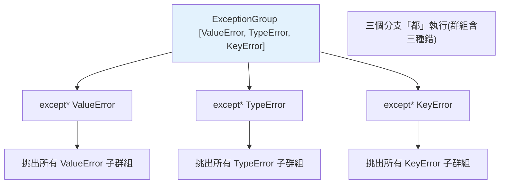

# ExceptionGroup 與 except* (3.11)

> 當「同時發生多個錯誤」時（並發任務、批次驗證），傳統例外一次只能拋一個。Python 3.11 的 `ExceptionGroup` 讓你把多個例外打包一起拋，`except*` 則能選擇性地處理其中某幾類。

## 💡 白話導讀（建議先讀）

傳統例外制度有個限制：**一次只能報一個錯**——像批改考卷只圈第一個錯就把卷子退回。

但有些場景就是會**同時**出現多個獨立的錯誤：

- 並發跑了 10 個任務，3 個失敗——該報哪個？只報第一個，另外兩個的資訊就丟了。
- 表單驗證：email 格式錯「和」密碼太短——使用者想**一次**看到全部問題，不是改一個、送出、又冒下一個。

Python 3.11 的 **`ExceptionGroup`** 解法：**把多個錯誤裝進一個箱子，整箱一起拋**——每個錯誤的型別、訊息、traceback 都完整保留。

接的一端用新語法 **`except*`**（星號），行為像**分科批改**：

```python
try:
    ...
except* ValueError as eg:    # 把箱子裡「所有的 ValueError」挑出來給我
    ...
except* TypeError as eg:     # 「所有的 TypeError」歸我
    ...
```

和普通 except 的關鍵差異：普通 except **只會走一個**分支；`except*` 是按型別**分揀整個箱子**——箱子裡兩種錯都有的話，**兩個 `except*` 都會被觸發**。

什麼時候會遇到？最大宗是 asyncio 的 TaskGroup（並發任務的錯誤天生成群）；自己做批次驗證時也用得上。

## Why（為什麼）

傳統例外機制假設「一次一個錯」——但有些場景會**同時產生多個獨立的錯誤**：`asyncio.TaskGroup` 裡多個任務各自失敗、批次驗證時多個欄位都不合法、平行處理多個項目時好幾個出錯。以前只能拋第一個、丟失其餘。Python **3.11（PEP 654）** 引入 **`ExceptionGroup`**（把多個例外裝在一起）與 **`except*`**（分別處理群組中的不同類型），主要為 asyncio 的結構化並發（見 [asyncio TaskGroup](../09-concurrency/10-asyncio-advanced.md)）而生。

## Theory（理論：把例外裝成群組）

**`ExceptionGroup`** 是一個特殊例外——裝著多個錯誤的箱子：

- 表達「這裡**同時**發生了好幾個獨立的錯誤」。
- 保留每個子例外的完整資訊（型別、訊息、traceback）。

**`except*`**（星號）是搭配的分揀語法。它**不是**「接住一個」，而是：

> 從群組中挑出**所有匹配**該型別的子例外來處理。

一個 `try` 可以有多個 `except*` 各自認領不同型別——且**可能多個 `except*` 都被觸發**（箱子裡有多種錯誤時，分科批改、各自出動）。這是它和普通 `except`（只走一個分支）的本質差異。

## Specification（規範：語法）

```python
# 建立並拋出 ExceptionGroup
raise ExceptionGroup(
    "多個錯誤",                    # 描述訊息
    [ValueError("a"), TypeError("b"), ValueError("c")],   # 子例外列表
)

# except* 處理群組（3.11+）
try:
    do_parallel_work()
except* ValueError as eg:          # 挑出群組中所有 ValueError
    print(f"值錯誤們: {eg.exceptions}")
except* TypeError as eg:           # 挑出所有 TypeError（也會執行！）
    print(f"型別錯誤們: {eg.exceptions}")
```

## Implementation（except* 的行為、與傳統 except 的差異）

### `except*` 可能觸發多個分支

傳統 `except` 只匹配第一個符合的，執行一個分支。`except*` 不同——它從群組中**分別**挑出各型別，所以**多個 `except*` 分支可能都執行**：

```python
try:
    raise ExceptionGroup("errors", [ValueError("v"), TypeError("t")])
except* ValueError as eg:
    print(f"處理 {len(eg.exceptions)} 個 ValueError")   # 執行
except* TypeError as eg:
    print(f"處理 {len(eg.exceptions)} 個 TypeError")    # 也執行！
```

兩個分支都會執行，因為群組裡兩種錯都有。每個 `except*` 拿到的 `eg` 是一個**只含匹配子例外的子群組**（`eg.exceptions` 是那些例外的列表）。

### 巢狀群組

`ExceptionGroup` 可以巢狀（群組裡有群組），`except*` 會遞迴地從整棵樹挑出匹配的例外——這對應複雜的並發結構。

### 主要應用：asyncio TaskGroup

`ExceptionGroup` 的頭號用途是 **`asyncio.TaskGroup`**（3.11+，見 [asyncio 進階](../09-concurrency/10-asyncio-advanced.md)）——當群組裡多個任務失敗，TaskGroup 把所有失敗打包成 `ExceptionGroup` 一起拋，讓你能看到全部錯誤，而非只有第一個：

```python
import asyncio

async def main():
    try:
        async with asyncio.TaskGroup() as tg:
            tg.create_task(task_that_fails_with_value_error())
            tg.create_task(task_that_fails_with_type_error())
    except* ValueError as eg:
        ...     # 處理所有 ValueError
    except* TypeError as eg:
        ...     # 處理所有 TypeError
```

### 傳統 except 也能接 ExceptionGroup（但不推薦）

普通 `except ExceptionGroup` 能接住整個群組（當成單一例外），但這樣就失去了「分別處理不同型別」的能力。處理群組應優先用 `except*`。反過來，**`except*` 不能與傳統 `except` 在同一個 try 混用**（語法限制）。

### 何時該用（別過度）

`ExceptionGroup` 是為「真的會同時發生多個獨立錯誤」設計的——主要是**並發**與**批次處理**。一般的「一次一個錯」場景**不需要**它，用傳統例外即可。別為了用而用。

## Code Example（可執行的 Python 範例）

```python
# exception_groups_demo.py
from __future__ import annotations


def validate_all(data: dict[str, object]) -> None:
    """批次驗證：收集所有錯誤，一起拋（而非拋第一個就停）。"""
    errors: list[Exception] = []

    if not isinstance(data.get("name"), str):
        errors.append(ValueError("name 必須是字串"))
    if not isinstance(data.get("age"), int):
        errors.append(TypeError("age 必須是整數"))
    if data.get("email") is None:
        errors.append(KeyError("email 為必填"))

    if errors:
        raise ExceptionGroup("驗證失敗", errors)


def demo() -> None:
    bad_data = {"name": 123, "age": "old"}   # name、age 都錯，email 缺

    try:
        validate_all(bad_data)
    except* ValueError as eg:
        print(f"值錯誤 ({len(eg.exceptions)}): {[str(e) for e in eg.exceptions]}")
    except* TypeError as eg:
        print(f"型別錯誤 ({len(eg.exceptions)}): {[str(e) for e in eg.exceptions]}")
    except* KeyError as eg:
        print(f"缺欄位 ({len(eg.exceptions)}): {[str(e) for e in eg.exceptions]}")


if __name__ == "__main__":
    demo()
```

**預期輸出**（需 Python 3.11+）：

```pycon
$ python exception_groups_demo.py
值錯誤 (1): ['name 必須是字串']
型別錯誤 (1): ['age 必須是整數']
缺欄位 (1): ["'email 為必填'"]
```

三個 `except*` 分支**都執行了**——因為群組裡三種錯誤都有。這是 `except*` 與傳統 `except`（只執行一個）的根本差異。

## Diagram（圖解：except* 分別挑出）



## Best Practice（最佳實踐）

- **並發/批次場景收集多個錯誤用 `ExceptionGroup`**：讓呼叫端看到**全部**失敗，而非只有第一個。
- **處理群組用 `except*`**：能分別處理不同型別，且知道每種有幾個（`eg.exceptions`）。
- **一般「一次一個錯」的場景不需要它**：用傳統例外即可，別過度使用。
- **搭配 `asyncio.TaskGroup`**：3.11+ 的結構化並發會自動用 ExceptionGroup 打包任務失敗（見 [asyncio 進階](../09-concurrency/10-asyncio-advanced.md)）。
- **注意 `except*` 不能與 `except` 混用**（同一 try 只能全用一種）。
- **需要 3.11+**：舊版可用 backport 套件 `exceptiongroup`。

## Common Mistakes（常見誤解）

- **以為 `except*` 只執行一個分支**：不是——群組裡有幾種型別，對應的 `except*` **都會執行**。
- **`except*` 與傳統 `except` 混用**：語法錯誤，同一個 try 只能全用 `except*` 或全用 `except`。
- **在 3.11 以前用 `except*` 語法**：SyntaxError；用 `exceptiongroup` backport 或傳統做法。
- **為「一次一個錯」硬用 ExceptionGroup**：過度複雜；它是為並發/批次的「多錯並發」設計。
- **忘了群組裡的例外要透過 `eg.exceptions` 取用**：`except* X as eg` 的 `eg` 是子群組，實際例外在 `eg.exceptions`。
- **用傳統 `except ExceptionGroup` 處理**：能接但失去分型別處理的能力，優先 `except*`。

## Interview Notes（面試重點）

- 說得出 **`ExceptionGroup`（3.11 / PEP 654）** 用於「**同時發生多個獨立錯誤**」，把它們打包一起拋，主要為 **asyncio TaskGroup** 的結構化並發而生。
- **關鍵考點**：`except*` 與傳統 `except` 的差異——**`except*` 可能觸發多個分支**（群組裡有幾種型別就觸發幾個），每個拿到只含匹配例外的子群組（`eg.exceptions`）。
- 知道 **`except*` 不能與 `except` 混用**、需要 3.11+。
- 知道它的定位：並發/批次的「多錯並發」，一般場景不需要。
- 知道與 `asyncio.TaskGroup` 的關聯（連結 [asyncio 進階](../09-concurrency/10-asyncio-advanced.md)）。

---

➡️ 下一章：[assert、warnings 與 traceback](12-assert-warnings-traceback.md)

[⬆️ 回 Part 6 索引](README.md)
