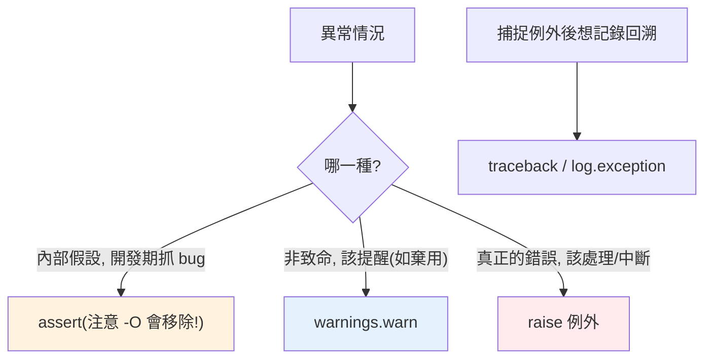

# assert、warnings 與 traceback

> 除了例外，Python 還有幾個相關工具：`assert` 檢查「不該發生」的內部假設、`warnings` 發出「非致命但該注意」的提醒、`traceback` 讓你程式化處理錯誤回溯。用對它們，讓程式更好除錯與維護。

## Why（為什麼）

不是所有「異常情況」都該用例外。有些是「開發時檢查的假設」（用 `assert`）、有些是「還能跑但該提醒」（用 `warnings`，如棄用通知）、有些需要「把 traceback 記錄下來或程式化分析」（用 `traceback` 模組）。這三個工具補足了例外機制的周邊，是寫出可維護、可除錯程式的實用配備，也常被忽略或誤用（尤其 `assert` 的常見陷阱）。

## Theory（理論：三個工具的定位）

- **`assert`**：驗證「**照理說一定成立**」的內部假設。條件為假時拋 `AssertionError`。用於**開發期抓 bug**，不是驗證外部輸入。
- **`warnings`**：發出「**非致命、但該注意**」的訊息（棄用、可疑用法、未來會變）。程式繼續執行，只是提醒。
- **`traceback`**：把例外的回溯資訊**程式化地**取得、格式化、記錄——用於 log、錯誤回報、除錯工具。

## Specification（規範：三者語法）

```python
# assert：條件為假拋 AssertionError
assert condition, "選填的錯誤訊息"
assert x > 0, f"x 應為正，得到 {x}"

# warnings：發出警告
import warnings
warnings.warn("old_func 已棄用，改用 new_func", DeprecationWarning, stacklevel=2)

# traceback：程式化處理回溯
import traceback
try:
    risky()
except Exception:
    traceback.print_exc()              # 印出完整 traceback
    tb_str = traceback.format_exc()    # 取得 traceback 字串
```

## Implementation（assert 陷阱、warnings 種類、traceback 用法）

### `assert` 的重大陷阱：`-O` 會移除它

**最關鍵的一點**：Python 用 `-O`（optimize）旗標執行時，**所有 `assert` 都會被移除**（不執行）。所以：

```python
# ❌ 絕對不要用 assert 做「安全檢查」或「驗證使用者輸入」！
def withdraw(amount):
    assert amount > 0        # ⚠️ python -O 執行時這行消失，檢查失效！

# ✅ 用 assert 檢查「內部不該發生」的假設
def process(data):
    result = transform(data)
    assert result is not None, "transform 不該回 None"   # 開發期抓自己的 bug
    return result.value

# ✅ 驗證外部輸入用明確的 raise
def withdraw(amount):
    if amount <= 0:
        raise ValueError("金額必須為正")   # 永遠執行
```

**規則**：`assert` 只用於「驗證你自己的程式邏輯假設（開發期抓 bug）」，**絕不用於**驗證使用者輸入、安全檢查、或任何在正式環境必須執行的檢查——因為 `-O` 會讓它們消失。這是面試高頻陷阱題。

### `warnings`：非致命的提醒

`warnings` 用於「程式能繼續，但要提醒開發者」的情況。最常見是**棄用通知**：

```python
import warnings

def old_api() -> None:
    warnings.warn(
        "old_api 已棄用，將在 2.0 移除，請改用 new_api",
        DeprecationWarning,
        stacklevel=2,          # 讓警告指向「呼叫者」而非這行
    )
    ...
```

常見警告類別：

| 類別 | 用途 |
|------|------|
| `DeprecationWarning` | 功能將被移除（給開發者） |
| `UserWarning` | 一般使用者警告（預設類別） |
| `RuntimeWarning` | 可疑的執行期行為 |
| `FutureWarning` | 未來行為會改變（給終端使用者） |

`stacklevel=2` 讓警告訊息指向**呼叫棄用函式的地方**，而非棄用函式內部——對使用者更有用。控制警告顯示用 `warnings.filterwarnings()` 或 `-W` 旗標；測試時可用 `-W error` 把警告變成錯誤，提前抓到用了棄用 API 的地方（見 [Python 2 vs 3](../01-getting-started/10-python2-vs-3.md)）。

### `traceback`：程式化處理回溯

當你捕捉例外後想「記錄完整 traceback」或「分析錯誤來源」，用 `traceback` 模組：

```python
import traceback
import logging

log = logging.getLogger(__name__)

try:
    risky()
except Exception:
    # 方式一：直接印
    traceback.print_exc()

    # 方式二：取得字串（存 log、回傳給前端等）
    tb_str = traceback.format_exc()
    log.error("操作失敗:\n%s", tb_str)
```

實務上，**logging 的 `log.exception()`（在 except 內）已自動包含 traceback**（見 [logging](../11-stdlib/08-logging.md)），是記錄錯誤最簡便的方式。`traceback` 模組用於需要更細緻控制（自訂格式、分析 frame）的場景。

### traceback 怎麼讀（由下往上）

```text
Traceback (most recent call last):
  File "app.py", line 10, in main       ← 最外層呼叫
    process()
  File "app.py", line 5, in process     ← 中間
    divide(1, 0)
ZeroDivisionError: division by zero      ← 最底：例外型別與訊息（真正的錯）
```

**由下往上讀**：最底下是例外型別與訊息（真正發生什麼），往上是呼叫鏈（怎麼走到這裡的）。最底部那行是關鍵。

## Code Example（可執行的 Python 範例）

```python
# assert_warnings_traceback_demo.py
from __future__ import annotations

import traceback
import warnings


def deprecated_greet(name: str) -> str:
    """示範棄用警告。"""
    warnings.warn(
        "deprecated_greet 已棄用，請改用 greet",
        DeprecationWarning,
        stacklevel=2,
    )
    return f"Hi {name}"


def normalize(values: list[float]) -> list[float]:
    """assert 檢查內部假設（開發期抓 bug）。"""
    total = sum(values)
    assert total != 0, "normalize 不該收到全為零的輸入"   # 內部假設
    return [v / total for v in values]


def demo() -> None:
    # 1. warnings（預設只顯示一次；這裡明確捕捉展示）
    with warnings.catch_warnings(record=True) as caught:
        warnings.simplefilter("always")
        deprecated_greet("Alice")
        print(f"收到警告: {caught[0].category.__name__}: {caught[0].message}")

    # 2. assert 檢查假設
    print(f"normalize: {normalize([1, 2, 1])}")

    # 3. traceback 程式化處理
    try:
        1 / 0
    except ZeroDivisionError:
        tb = traceback.format_exc()
        print(f"捕捉到 traceback（末行）: {tb.strip().splitlines()[-1]}")


if __name__ == "__main__":
    demo()
```

**預期輸出**：

```pycon
$ python assert_warnings_traceback_demo.py
收到警告: DeprecationWarning: deprecated_greet 已棄用，請改用 greet
normalize: [0.25, 0.5, 0.25]
捕捉到 traceback（末行）: ZeroDivisionError: division by zero
```

## Diagram（圖解：三個工具的定位）



## Best Practice（最佳實踐）

- **`assert` 只用於「內部假設 / 開發期抓 bug」**，絕不用於驗證外部輸入或安全檢查（`-O` 會移除它）；那些用 `raise`。
- **棄用/可疑用法用 `warnings.warn`** + 正確的 `stacklevel`（指向呼叫者）+ 恰當的類別（`DeprecationWarning` 等）。
- **測試/CI 開 `-W error`**（或 filter）把警告當錯誤，提前發現用了棄用 API。
- **記錄錯誤 traceback 優先用 `log.exception()`**（在 except 內，自動含 traceback）；需細緻控制才用 `traceback` 模組。
- **讀 traceback 由下往上**：最底行是真正的例外型別與訊息。
- **assert 訊息要有意義**：`assert x, f"..."` 說明「哪個假設被違反」。

## Common Mistakes（常見誤解）

- **用 `assert` 驗證使用者輸入/做安全檢查**：`python -O` 執行時 assert 全被移除，檢查失效——嚴重安全隱患。用 `raise`。
- **`assert (cond, msg)` 加括號**：`assert` 後接 tuple `(cond, msg)`，而非空 tuple 恆為真 → assert 永遠通過！應寫 `assert cond, msg`（無括號）。
- **`warnings.warn` 沒設 `stacklevel`**：警告指向棄用函式內部而非呼叫處，對使用者沒幫助。
- **忽略 DeprecationWarning**：等到功能真的被移除才發現；測試開 `-W error` 提前處理。
- **用 print 印錯誤而非 logging/traceback**：無法關閉、無層級、混雜輸出。
- **由上往下讀 traceback**：最底行才是真正的錯誤，別只看最上面。

## Interview Notes（面試重點）

- **assert 的陷阱是必考題**：能說出「**`python -O` 會移除所有 assert**，所以 assert 只用於內部假設/開發期抓 bug，絕不用於輸入驗證或安全檢查」，那些用 `raise`。
- 知道 **`assert (cond, msg)` 加括號的陷阱**（變成恆真的 tuple）。
- 知道 **`warnings`** 用於非致命提醒（棄用等）、`stacklevel` 指向呼叫者、可用 `-W error` 在測試把警告變錯誤。
- 知道記錄 traceback 用 **`log.exception()`（自動含 traceback）** 或 `traceback` 模組，且 **traceback 由下往上讀**（最底行是真正的例外）。
- 能區分四者定位：assert（假設）、warnings（提醒）、raise（錯誤）、traceback（記錄回溯）。

---

🎉 **恭喜完成 Part 6！** 你已掌握 Python 的錯誤處理：例外機制與傳播、try/except/else/finally、raise 與例外鏈、自訂例外、context manager 與 contextlib、最佳實踐、EAFP vs LBYL、例外階層、ExceptionGroup、以及 assert/warnings/traceback。
接下來 [Part 7 迭代器與生成器](../07-iterators-generators/README.md) 將進入 iterable/iterator 協定、yield 與惰性求值。

[⬆️ 回 Part 6 索引](README.md)
