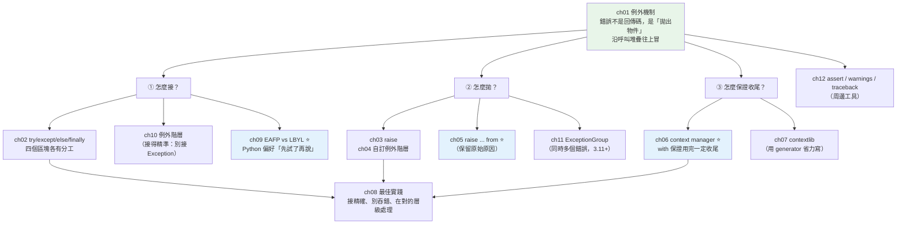

# Part 6 統整：錯誤處理全貌

> 把這 12 章串成一張圖——核心只有一句話：**別讓錯誤靜悄悄地過去，也別讓資源忘記收拾。**

## 🗺️ 知識地圖（這 12 章怎麼串起來）

Part 6 的所有章節，都圍繞著兩個問題：
**「出錯時怎麼辦？」** 和 **「不管有沒有出錯，怎麼保證收尾？」**



**一句話串起來**：

Python 處理錯誤**不用回傳碼，而是「拋出一個物件」**（ch01）——它會沿著呼叫堆疊往上冒，
直到被 `except` 接住，或讓程式終止。這帶來三個問題：

- **怎麼接？** `try/except/else/finally` 四個區塊各有分工（ch02）；
  而**接得精不精準**，取決於你懂不懂[例外階層](10-exception-hierarchy.md)（ch10）。
- **怎麼拋？** 內建例外不夠精確時，定義[自己的例外階層](04-custom-exceptions.md)（ch04）；
  而在處理 A 錯誤時拋出 B 錯誤，一定要用 **`raise B from A`**（ch05）保留原因。
- **怎麼收尾？** `finally` 能保證執行，但**成對的資源管理**該用 **`with`**（ch06）——
  它把「開了一定關」寫進語法裡。

貫穿全 Part 的哲學是 **EAFP**（ch09）：
**「先試了再說，出錯再處理」**，而不是「先檢查一堆條件」——
這不只是簡潔，更避免了「檢查完到執行之間，狀態變了」的**競態條件**。

## ⚡ 速查表（什麼情境用什麼）

| 情境 | 怎麼做 | 章節 |
|------|--------|------|
| 可能出錯的操作 | `try:` … `except 明確的例外型別:` | [ch02](02-try-except.md) |
| **「沒出錯才做」的後續** | `else:`（別把它塞進 `try` 裡——會擴大接錯範圍） | [ch02](02-try-except.md) |
| **無論如何都要做的清理** | `finally:`（或更好：用 `with`） | [ch02](02-try-except.md) |
| 開檔／連線／上鎖（成對的資源） | **`with`**（保證收尾，即使中途爆炸） | [ch06](06-context-manager.md) |
| 想自己寫一個 `with` | **`@contextlib.contextmanager`** + 單一 `yield` | [ch07](07-contextlib.md) |
| 想忽略特定例外 | `with contextlib.suppress(FileNotFoundError):`（取代 `try/except: pass`） | [ch07](07-contextlib.md) |
| 內建例外不夠精確表達領域錯誤 | 自訂例外，**建一個階層**（`OrderError` → `OutOfStock`） | [ch04](04-custom-exceptions.md) |
| **處理 A 錯誤時拋出 B 錯誤** | **`raise B(...) from a`**（保留 `__cause__`，traceback 才完整） | [ch05](05-exception-chaining.md) |
| 接到例外但想繼續往上拋 | 裸 `raise`（保留原始 traceback） | [ch03](03-raise.md) |
| dict 可能沒有這個 key | **EAFP**：`try: d[k] except KeyError:` 或 `d.get(k)` | [ch09](09-eafp-vs-lbyl.md) |
| 並發任務**同時**失敗多個 | `ExceptionGroup` + `except*`（3.11+） | [ch11](11-exception-groups.md) |
| 檢查「不該發生」的內部假設 | `assert`（⚠️ **`-O` 會被移除，別拿來驗證使用者輸入**） | [ch12](12-assert-warnings-traceback.md) |
| 「非致命但該注意」的提醒 | `warnings.warn(...)` | [ch12](12-assert-warnings-traceback.md) |
| **絕對不要做** | `except:` 或 `except Exception: pass`（**吞掉錯誤 = 埋雷**） | [ch08](08-error-handling-best-practices.md) |

## 🔑 核心心智模型（帶得走的幾句話）

- **例外是「拋出物件」，不是「回傳錯誤碼」。** 它會**自動往上冒**，
  所以中間層可以完全不管——這讓「在對的層級處理錯誤」成為可能。
- **EAFP：先試了再說（Python 的哲學）。**
  「先檢查再做」（LBYL）除了囉嗦，還有**競態**：你檢查完檔案存在，
  真正要開的前一刻它被刪了——`try/except` 沒有這個問題，因為**檢查與執行是同一個動作**。
- **`with` ＝ 把 `try/finally` 寫進語法裡。** 「開了一定關、鎖了一定解」——
  即使中途拋例外也成立。任何**成對的 setup/teardown**，都該包成 context manager。
- **`raise B from A` 保留「因為 A，所以 B」。** 不寫 `from`，原始原因就在 traceback 裡斷掉，
  你只會看到 B，永遠查不到根因。
- **接得越精準越好。** `except Exception:` 會連 `KeyboardInterrupt` 以外的**所有錯誤**都吃掉，
  包括你寫錯的 typo（`NameError`）——**bug 被偽裝成「處理過的錯誤」，這比崩潰更可怕**。
- **不該發生的錯，就讓它崩。** 硬撐著跑下去，只會讓資料錯得更深。

## 🛠️ 小實作：一個訂單流程走完 Part 6

這支腳本用一個「下單 → 扣款」的流程，把 Part 6 的核心一次串起來：
**自訂例外階層 → EAFP → context manager 保證收尾 → 例外鏈保留根因**。

```python
# error_handling_demo.py —— Part 6 主線：別讓錯誤靜悄悄，別讓資源忘收拾
from __future__ import annotations

import contextlib
from collections.abc import Iterator


# ── ch04 自訂例外階層：呼叫端可以「接一整類」，也可以「接很精準」──
class OrderError(Exception):
    """領域錯誤的根——呼叫端 except OrderError 就能一次接住所有訂單錯誤。"""


class OutOfStock(OrderError):
    def __init__(self, item: str) -> None:
        self.item = item
        super().__init__(f"庫存不足：{item}")


class PaymentFailed(OrderError):
    pass


# ── ch06 / ch07 context manager：保證「用完一定收尾」，即使中途爆炸 ──
@contextlib.contextmanager
def transaction(name: str) -> Iterator[None]:
    print(f"    ▶ 開始交易 {name}")
    try:
        yield                       # ← 把控制權交給 with 區塊
    except Exception:
        print(f"    ↩ 回滾 {name}")
        raise                       # 裸 raise：往上拋，但保留原始 traceback
    else:
        print(f"    ✔ 提交 {name}")  # 只有「沒出錯」才提交
    finally:
        print(f"    ■ 釋放連線 {name}（finally：無論如何都跑）")


def charge(amount: int) -> None:
    if amount > 1000:
        raise ValueError("刷卡上限 1000")


def place_order(item: str, stock: dict[str, int], amount: int) -> str:
    if stock.get(item, 0) <= 0:
        raise OutOfStock(item)
    try:
        charge(amount)
    except ValueError as exc:
        # ── ch05 例外鏈：把「底層的 ValueError」轉譯成「領域的 PaymentFailed」，
        #     但用 from 保留原因，traceback 才查得到根因。
        raise PaymentFailed(f"付款失敗：{item}") from exc
    return f"訂單成立：{item}"


def demo() -> None:
    stock = {"滑鼠": 1, "鍵盤": 0}

    print("【ch09 EAFP】先試了再說，不先檢查")
    with contextlib.suppress(KeyError):     # 比 try/except: pass 明確
        _ = stock["不存在的商品"]
    print("    contextlib.suppress 只吞這一種例外（明確、不會誤吞別的）")

    print("\n【ch06/ch07 context manager】成功的交易")
    with transaction("A"):
        print(f"    {place_order('滑鼠', stock, 500)}")

    print("\n【ch04 自訂例外階層】庫存不足")
    try:
        place_order("鍵盤", stock, 500)
    except OrderError as exc:               # 接「一整類」領域錯誤
        print(f"    接住 OrderError → {type(exc).__name__}: {exc}")

    print("\n【ch05 例外鏈 raise ... from】+ 交易自動回滾")
    try:
        with transaction("B"):
            place_order("滑鼠", stock, 9999)     # 超過刷卡上限
    except PaymentFailed as exc:
        print(f"    PaymentFailed: {exc}")
        print(f"    __cause__（原始根因）→ {type(exc.__cause__).__name__}: {exc.__cause__}")


if __name__ == "__main__":
    demo()
```

**預期輸出**：

```pycon
$ python error_handling_demo.py
【ch09 EAFP】先試了再說，不先檢查
    contextlib.suppress 只吞這一種例外（明確、不會誤吞別的）

【ch06/ch07 context manager】成功的交易
    ▶ 開始交易 A
    訂單成立：滑鼠
    ✔ 提交 A
    ■ 釋放連線 A（finally：無論如何都跑）

【ch04 自訂例外階層】庫存不足
    接住 OrderError → OutOfStock: 庫存不足：鍵盤

【ch05 例外鏈 raise ... from】+ 交易自動回滾
    ▶ 開始交易 B
    ↩ 回滾 B
    ■ 釋放連線 B（finally：無論如何都跑）
    PaymentFailed: 付款失敗：滑鼠
    __cause__（原始根因）→ ValueError: 刷卡上限 1000
```

**三個值得停下來看的地方**：

1. **交易 B 失敗時，「回滾」和「釋放連線」都自動執行了。**
   你沒有在 `place_order` 裡寫任何清理程式碼——是 `with` 幫你做的。
   這就是 context manager 的價值：**收尾的責任在資源自己身上，不在使用者身上**。

2. **`__cause__` 指回了原始的 `ValueError`。**
   我們對外拋的是領域錯誤 `PaymentFailed`（呼叫端好處理），
   但 `raise ... from exc` 讓「**真正的根因是刷卡上限**」不會遺失。
   少了 `from`，你只會看到「付款失敗」，永遠不知道為什麼。

3. **`except OrderError` 一次接住了 `OutOfStock`。**
   這就是自訂例外**建成階層**的好處：呼叫端可以選擇「接一整類」或「接很精準」。

## ✅ 自測清單（答不出來就回去讀）

- [ ] 例外和「回傳錯誤碼」比，好處是什麼？（[ch01](01-exceptions.md)）
- [ ] `try/except/else/finally` 四個區塊各自什麼時候執行？`else` 存在的意義？（[ch02](02-try-except.md)）
- [ ] `finally` 裡如果有 `return`，會發生什麼事？（[ch02](02-try-except.md)）
- [ ] 為什麼 `except Exception: pass` 是死罪？（[ch08](08-error-handling-best-practices.md)）
- [ ] `raise B from A` 和直接 `raise B` 差在哪？（[ch05](05-exception-chaining.md)）
- [ ] 自訂例外為什麼要「建成階層」而不是各自獨立？（[ch04](04-custom-exceptions.md)）
- [ ] EAFP 和 LBYL 各是什麼？為什麼 Python 偏好 EAFP？（[ch09](09-eafp-vs-lbyl.md)）
- [ ] `with` 背後是哪兩個方法？自己寫一個 context manager 最省力的方式？（[ch06](06-context-manager.md)、[ch07](07-contextlib.md)）
- [ ] `Exception` 和 `BaseException` 差在哪？為什麼不該接 `BaseException`？（[ch10](10-exception-hierarchy.md)）
- [ ] `assert` 為什麼不能用來驗證使用者輸入？（[ch12](12-assert-warnings-traceback.md)）
- [ ] 並發時同時發生多個錯誤，怎麼處理？（[ch11](11-exception-groups.md)）

## 🎯 面試速查

| 考點 | 面試官想聽到什麼 | 章節 |
|------|------------------|------|
| **`try/except/else/finally` 的分工？** | 「`try` 放可能出錯的；`except` 接特定例外；**`else` 是「沒出錯才做」**（把它從 `try` 拿出來，可以避免誤接到後續程式碼的錯）；`finally` **無論如何都執行**（含 `return` 之後），用來清理。」 | [ch02](02-try-except.md) |
| **為什麼不能 `except Exception: pass`？** | 「它會**吞掉所有錯誤**——包括你自己寫錯的 typo（`NameError`）、型別錯誤。Bug 被偽裝成『已處理』，**比直接崩潰更可怕**，因為你永遠不知道它發生了。要接就**接精確的型別**，要不然就讓它崩。」 | [ch08](08-error-handling-best-practices.md) |
| **EAFP vs LBYL？** | 「**EAFP**＝先試了再說、出錯再處理（Python 偏好）；**LBYL**＝先檢查條件再做。EAFP 除了簡潔，還**避免競態**——LBYL 在『檢查完』到『真正執行』之間，狀態可能已經變了（檔案被刪、key 被移除）。」 | [ch09](09-eafp-vs-lbyl.md) |
| **`raise X from Y` 的意義？** | 「建立**例外鏈**：設定 `__cause__`，明確表達『**因為 Y，所以 X**』。常用於**把底層例外轉譯成領域例外**（`sqlite3.IntegrityError` → `UserAlreadyExists`），同時**不遺失根因**。少了 `from`，traceback 就斷了。」 | [ch05](05-exception-chaining.md) |
| **context manager 的原理？** | 「`with` 會呼叫物件的 **`__enter__`**（取得資源）與 **`__exit__`**（釋放資源）——**`__exit__` 保證執行，即使區塊內拋例外**。等同於 `try/finally`，但把責任放在資源自己身上。省力寫法：`@contextlib.contextmanager` + 單一 `yield`。」 | [ch06](06-context-manager.md) |
| **`Exception` vs `BaseException`？** | 「`BaseException` 是根，底下除了 `Exception`，還有 **`KeyboardInterrupt`**（Ctrl+C）、**`SystemExit`**。你**不該接 `BaseException`**——那會讓使用者連 Ctrl+C 都中斷不了程式。自訂例外一律繼承 `Exception`。」 | [ch10](10-exception-hierarchy.md) |
| **`assert` 能用在正式環境嗎？** | 「**不能拿來驗證使用者輸入**——因為 `python -O` 會把所有 `assert` **整個移除**。它只該用於檢查『**不該發生**的內部假設』（開發期的自我檢查）。驗證輸入要用 `if ... raise ValueError`。」 | [ch12](12-assert-warnings-traceback.md) |

---

🎉 **恭喜完成 Part 6！** 你已經知道怎麼讓程式**優雅地面對錯誤**——
接得精準、拋得清楚、收尾可靠。

接下來 [Part 7 迭代器與生成器](../07-iterators-generators/README.md) 換個主題：
**怎麼「一次處理一個」而不是「全部載進記憶體」？**
你會遇到一個老朋友——generator 的 `yield`，
其實和你剛學的 `@contextmanager` 是**同一個機制**的不同用法。

➡️ 下一 Part：[迭代器與生成器 Iterators & Generators](../07-iterators-generators/README.md)

[⬆️ 回 Part 6 索引](README.md)
