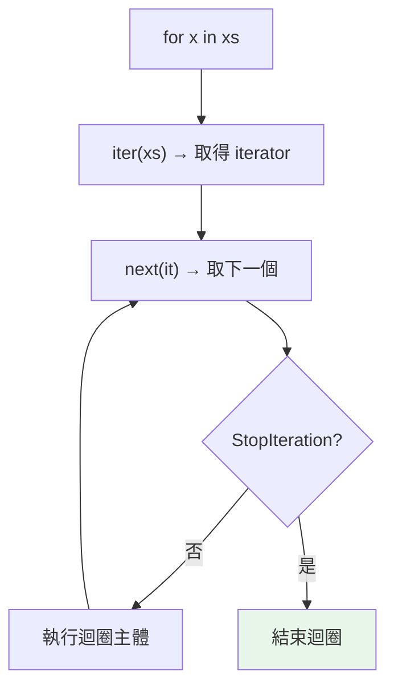

# iterable 與 iterator 協定

> `for x in something` 能運作，是因為 `something` 遵守「迭代協定」。搞懂 iterable（可被遍歷）與 iterator（實際產出元素）的差別，你就理解了 Python 一切迴圈、推導式、`in` 的底層。

## 💡 白話導讀（建議先讀）

[Part 2 說過](../02-fundamentals/06-control-flow.md)：`for` 是「從籃子逐一取物」。這章打開引擎蓋，看「取物」到底怎麼運作。

場景換成**自助餐**，兩個角色分清楚：

- **iterable（可迭代物件）＝菜檯**：擺著菜、可以「開始取餐」的東西——list、str、dict 都是菜檯。
- **iterator（迭代器）＝派給你的服務生**：拿著夾子、**記得夾到第幾道**的人——真正逐一遞菜給你的是他。

`for` 迴圈的內幕就三步：

1. 對菜檯喊 `iter()`——「**派一位服務生來**」。
2. 反覆對服務生喊 `next()`——「**下一道**」。
3. 菜上完了，服務生喊 `StopIteration`——for 安靜收工（你永遠看不到這個例外，for 幫你接了）。

一個超重要的行為差異，用這個畫面秒懂：

- **菜檯（list）可以重複遍歷**——每次 `for` 都派一位**新的**服務生，從頭夾起。
- **服務生本人（iterator、生成器）只能走一輪**——他夾完就下班了，再喊 next 也沒菜。
  （[Part 3 的「點餐券用過作廢」](../03-data-structures/10-builtin-functions.md)，謎底就是：那些函式回傳的是服務生，不是菜檯。）

分清「菜檯 vs 服務生」，這個 Part 的每一章都建立在這對概念上。

## Why（為什麼）

`for` 迴圈、推導式、`in`、`zip`、`map`、拆包（`a, b = ...`）——這些無所不在的操作背後是同一套機制：**迭代協定（iterator protocol）**。理解它能解答很多疑問：為什麼有些東西能遍歷兩次、有些只能一次？為什麼生成器用完就空了？為什麼 `iter()` 和 `next()` 這樣運作？這是理解生成器、惰性求值、乃至整個 Python 資料流的基礎。

## Theory（理論：iterable vs iterator）

兩個容易混淆但關鍵不同的概念（菜檯 vs 服務生）：

- **iterable（可迭代物件）**：能「被遍歷」的東西——實作了 `__iter__()`，呼叫它會回傳一個 iterator。list、tuple、str、dict、set 都是 iterable（菜檯）。
- **iterator（迭代器）**：實際「產出元素」的東西——實作了 `__next__()`（每次回下一個元素）**和** `__iter__()`（回傳自己）。（服務生——記得進度的人。）

關係一句話：**iterable 是「可以要一個 iterator 的東西」，iterator 是「真正逐一吐元素的東西」**。

`for` 迴圈的內幕：先對 iterable 呼叫 `iter()` 拿到 iterator，再反覆呼叫 `next()` 取元素，直到 `StopIteration`。

關鍵行為差異：

- **iterable 可以重複遍歷**——每次 `iter()` 給一個**新** iterator（如 list，每輪派新服務生）。
- **iterator 通常只能遍歷一次**——用完就耗盡（如生成器，服務生下班就沒了）。

## Specification（規範：協定與內建函式）

```python
# iterable：有 __iter__，回傳 iterator
class MyIterable:
    def __iter__(self) -> "MyIterator": ...

# iterator：有 __next__（回下一個，耗盡時 raise StopIteration）+ __iter__（回自己）
class MyIterator:
    def __next__(self): ...
    def __iter__(self): return self

# 內建函式
it = iter(iterable)      # 呼叫 iterable.__iter__()，取得 iterator
x = next(it)             # 呼叫 it.__next__()，取下一個
x = next(it, default)    # 耗盡時回 default 而非 raise StopIteration
```

## Implementation（for 的底層、耗盡、可重複 vs 一次性）

### `for` 迴圈的真面目

`for x in xs:` 其實是這樣運作的：

```python
# for x in xs: process(x)  等價於：
_it = iter(xs)             # 1. 取得 iterator
while True:
    try:
        x = next(_it)      # 2. 反覆取下一個
    except StopIteration:  # 3. 耗盡 → 結束迴圈
        break
    process(x)
```

**`StopIteration` 是「迭代結束」的訊號**——iterator 耗盡時拋出它，`for` 捕捉它並停止。你平常看不到，因為 `for` 幫你處理了。

### 手動迭代

```pycon
>>> nums = [10, 20, 30]
>>> it = iter(nums)          # list（iterable）→ 取得 iterator
>>> next(it)
10
>>> next(it)
20
>>> next(it)
30
>>> next(it)                 # 耗盡 → StopIteration
Traceback (most recent call last):
StopIteration
>>> next(it, "沒了")          # 給預設值避免例外
'沒了'
```

### iterable 可重複、iterator 一次性

這是最重要也最常踩坑的區別：

```pycon
>>> nums = [1, 2, 3]          # list 是 iterable
>>> list(nums)               # 遍歷第一次
[1, 2, 3]
>>> list(nums)               # 可再遍歷（每次 iter() 給新 iterator）
[1, 2, 3]

>>> it = iter(nums)          # it 是 iterator
>>> list(it)                 # 遍歷一次 → 耗盡
[1, 2, 3]
>>> list(it)                 # 再遍歷 → 空的！iterator 用完了
[]
```

`list`（iterable）每次遍歷都從一個新 iterator 開始，所以可重複；`it`（iterator）本身有「進度」，用完就到底了。**生成器是 iterator**，所以生成器「只能用一次」（見 [生成器](03-generator.md)）——這正是此原理的體現。

### iterator 的 `__iter__` 回傳自己

為什麼 iterator 也要有 `__iter__`？因為這讓 iterator 本身也能用在 `for`（`for x in it`）。它的 `__iter__` 回傳 `self`，於是 `iter(it) is it`——這也解釋了「對 iterator 呼叫 iter() 不會重置它」。

## Code Example（可執行的 Python 範例）

```python
# iterable_iterator_demo.py
from __future__ import annotations

from collections.abc import Iterator


class Countdown:
    """iterable：每次 __iter__ 回傳「新的」iterator，故可重複遍歷。"""

    def __init__(self, start: int) -> None:
        self.start = start

    def __iter__(self) -> CountdownIterator:
        return CountdownIterator(self.start)


class CountdownIterator:
    """iterator：有進度、有 __next__、耗盡時 StopIteration。"""

    def __init__(self, start: int) -> None:
        self.current = start

    def __iter__(self) -> CountdownIterator:
        return self                     # iterator 的 __iter__ 回自己

    def __next__(self) -> int:
        if self.current <= 0:
            raise StopIteration          # 迭代結束訊號
        self.current -= 1
        return self.current + 1


def demo() -> None:
    cd = Countdown(3)

    # iterable 可重複遍歷
    print(f"第一次: {list(cd)}")     # [3, 2, 1]
    print(f"第二次: {list(cd)}")     # [3, 2, 1]（新 iterator）

    # 手動迭代 iterator
    it = iter(cd)
    print(f"next: {next(it)}, {next(it)}")  # 3, 2
    print(f"next 帶預設: {next(it)}")        # 1
    print(f"耗盡帶預設: {next(it, '沒了')}")   # 沒了

    # for 也能用在 iterable
    for x in Countdown(2):
        print(f"for: {x}")


if __name__ == "__main__":
    demo()
```

**預期輸出**：

```pycon
$ python iterable_iterator_demo.py
第一次: [3, 2, 1]
第二次: [3, 2, 1]
next: 3, 2
next 帶預設: 1
耗盡帶預設: 沒了
for: 2
for: 1
```

## Diagram（圖解：for 的迭代協定）



## Best Practice（最佳實踐）

- **理解「iterable 可重複、iterator 一次性」**：這解釋了生成器用完就空、以及「為什麼我遍歷第二次是空的」。
- **需要多次遍歷 → 用 iterable（如 list）或每次重新取得來源**；一次性處理 → iterator/生成器省記憶體。
- **用 `next(it, default)` 避免 StopIteration 例外**：取「第一個」或「下一個」時給預設值更安全。
- **自訂可迭代物件時，分清 `__iter__`（回新 iterator）與 iterator 的 `__next__`**（見 [__iter__ 與 __next__](02-iter-next.md)）。
- **別在 `for` 之外手動吞 `StopIteration`**：它是迭代結束訊號，`for`/推導式會處理；自己 next 時才需注意。
- **用 `collections.abc.Iterator`/`Iterable` 做型別註記**（見 [collections.abc](../11-stdlib/16-collections-abc.md)）。

## Common Mistakes（常見誤解）

- **混淆 iterable 與 iterator**：iterable 能「要一個 iterator」（有 `__iter__`）；iterator 才「產出元素」（有 `__next__`）。
- **以為 iterator 能重複遍歷**：用完就耗盡（生成器最常見）；要重複用 list 存起來或重建。
- **對已耗盡的 iterator 再遍歷得空結果卻不解**：這是它的本質，不是 bug。
- **手動 `next()` 沒處理 StopIteration**：耗盡時拋例外；用 `next(it, default)` 或包 try。
- **以為 `iter(iterator)` 會重置它**：不會，iterator 的 `__iter__` 回自己（同一個、同進度）。
- **在 `for` 迴圈裡消耗同一個 iterator 又期待它完整**：巢狀用同一 iterator 會互相影響進度。

## Interview Notes（面試重點）

- **能清楚區分 iterable（有 `__iter__`、可要 iterator、可重複）vs iterator（有 `__next__` + `__iter__` 回自己、產出元素、一次性）**。
- 說得出 **`for` 的底層**：`iter()` 取 iterator → 反覆 `next()` → 捕捉 **`StopIteration`** 結束。
- 知道 **iterator 一次性耗盡** 的特性，並能連結到「生成器只能用一次」。
- 知道 `next(it, default)` 的用法、iterator 的 `__iter__` 回傳自己的意義。
- 知道哪些內建型別是 iterable（list/str/dict/set…），以及用 `collections.abc` 做型別檢查/註記。

---

➡️ 下一章：[__iter__ 與 __next__](02-iter-next.md)

[⬆️ 回 Part 7 索引](README.md)
