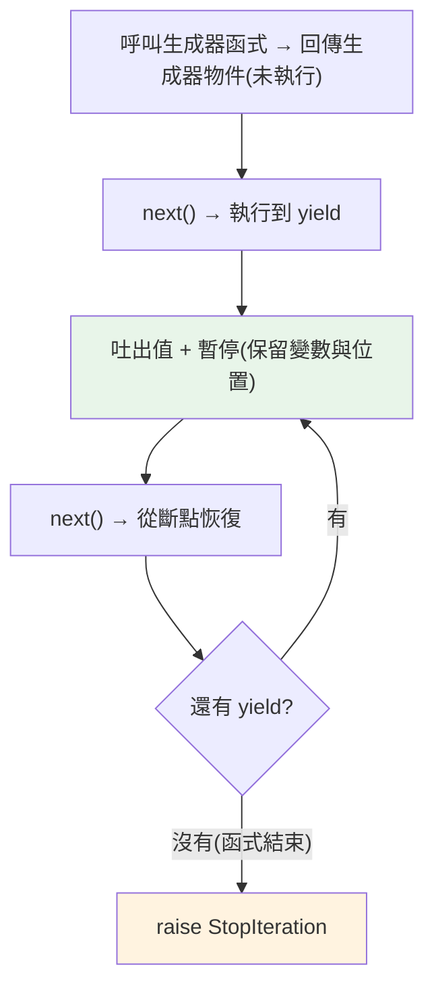

# 生成器 generator 與 yield

> 函式裡只要有 `yield`，它就變成生成器——一個「暫停後能從斷點繼續」的函式。它自動實作了迭代協定，用惰性、省記憶體的方式產出一連串值。這是 Python 最強大的特性之一。

## 💡 白話導讀（建議先讀）

普通函式像**一口氣講完故事的人**：呼叫它，從頭跑到底，交出結果，然後**所有記憶清空走人**。

**生成器**是**說書人**：講到精彩處——「欲知後事如何，且聽下回分解」——**停住**，而且**記得自己講到哪**。下次再來，從斷點接著講。

變身條件簡單到離譜：**函式體裡只要有 `yield`，它就是生成器函式**。

```python
def count_up(n):
    i = 1
    while i <= n:
        yield i        # 「且聽下回分解」——吐出一個值，停在這裡
        i += 1         # 下次從這裡繼續

g = count_up(3)        # ⚠️ 這行「不會執行函式體」——只是請到一位說書人
next(g)                # 1 —— 開講,講到第一個 yield 停住
next(g)                # 2 —— 從斷點繼續,到下個 yield
```

三個要點都在上面了：

1. **呼叫生成器函式不執行內容**——只回傳一個生成器物件（新手最常愣住的點）。
2. **每次 next 推進到下一個 yield**——吐值、暫停、**保留所有區域變數**。
3. 講完了就 `StopIteration`——所以生成器天生是 [iterator（服務生）](01-iterable-iterator.md),可以直接 for。

它換來的能力:**惰性**——一次只產一個值,десять億個數字也不佔記憶體;甚至能表達**無限序列**(說不完的故事,聽多少講多少)。這是 Python 最強大的特性之一,值得慢慢讀。

## Why（為什麼）

上一章手寫 iterator 要一整個類別。生成器讓同樣的事**用一個函式 + `yield`** 完成。更重要的是，生成器是**惰性的**——值「用到才算」，不必一次把全部結果放進記憶體。這讓你能處理無限序列、超大檔案、串流資料，而記憶體幾乎不增加。生成器是 Python 資料處理管線、asyncio、以及無數標準庫功能的基礎，是進階 Python 的分水嶺。

## Theory（理論：可暫停的函式）

普通函式呼叫後「一路跑到底、回傳一個值、狀態消失」。**生成器函式**（函式體含 `yield`）完全不同——它是說書人：

- 呼叫它**不執行函式體**，而是回傳一個**生成器物件**（一個 iterator）。（請到說書人，還沒開講。）
- 每次 `next()`（或 `for`）時，函式體**執行到下一個 `yield`**，吐出值，然後**暫停**——保留所有區域變數與執行位置。（講到「下回分解」停住，記得講到哪。）
- 下次 `next()` 從**暫停處繼續**，直到下一個 `yield` 或函式結束（結束時 raise `StopIteration`）。

關鍵字是**暫停與恢復**：生成器記住「執行到哪、變數是什麼」，能走走停停。

因此它天生是 iterator（自動有 `__iter__`/`__next__`），且**惰性**產值——一次一個，記憶體恆定。

## Specification（規範：生成器語法）

```python
def count_up(n: int):
    i = 0
    while i < n:
        yield i           # 吐出 i，暫停於此
        i += 1

gen = count_up(3)         # 不執行函式體，回傳生成器物件
next(gen)                 # 0（執行到第一個 yield）
next(gen)                 # 1（從斷點繼續到下個 yield）
list(count_up(3))         # [0, 1, 2]（for/list 自動 next 到耗盡）

# 生成器就是 iterator
type(gen)                 # <class 'generator'>
```

## Implementation（暫停恢復、惰性、無限序列、一次性）

### 執行流程：走走停停

```python
def demo_gen():
    print("開始")
    yield 1
    print("繼續到 2")
    yield 2
    print("繼續到 3")
    yield 3
    print("結束")

g = demo_gen()            # 什麼都不印！函式體尚未執行
print(next(g))            # 印「開始」，然後印 1
print(next(g))            # 印「繼續到 2」，然後印 2
```

輸出：

```text
開始
1
繼續到 2
2
```

每次 `next` 才推進到下一個 `yield`——這就是「暫停/恢復」。函式的區域變數（如迴圈計數）在暫停期間**被保留**。

### 惰性：值用到才算

生成器**不預先算出所有值**，而是「要一個算一個」：

```python
def squares(n: int):
    for i in range(n):
        print(f"  計算 {i}²")
        yield i * i

gen = squares(3)          # 還沒計算任何東西
print("取第一個:")
print(next(gen))          # 這時才計算 0²
print("取第二個:")
print(next(gen))          # 這時才計算 1²
```

輸出顯示「計算」訊息**穿插在取值之間**——證明值是惰性產生的。這讓生成器能省記憶體（見 [惰性求值](07-lazy-evaluation.md)）。

### 無限序列

因為惰性，生成器能表示**無限**序列（普通 list 做不到）——只要別一次全取：

```python
def naturals():
    n = 0
    while True:            # 無限迴圈！
        yield n
        n += 1

gen = naturals()
print([next(gen) for _ in range(5)])    # [0, 1, 2, 3, 4]（只取前 5 個）
```

配合 `itertools.islice`（見 [itertools](06-itertools.md)）能安全地「取前 N 個」無限生成器。

### 生成器是 iterator → 一次性

生成器是 iterator（見 [iterable 與 iterator](01-iterable-iterator.md)），所以**只能遍歷一次**，用完就耗盡：

```pycon
>>> gen = (x for x in range(3))
>>> list(gen)
[0, 1, 2]
>>> list(gen)          # 第二次是空的！
[]
```

需要多次用就存成 list，或每次重新建立生成器。

### 用生成器改寫 iterator 類別

還記得 [__iter__](02-iter-next.md) 手寫 iterator 的樣板？生成器讓它消失：

```python
# 手寫 iterator 類別要十幾行；生成器只要：
def number_range(start: int, stop: int):
    while start < stop:
        yield start
        start += 1
```

## Code Example（可執行的 Python 範例）

```python
# generator_demo.py
from __future__ import annotations

from collections.abc import Iterator


def fibonacci(n: int) -> Iterator[int]:
    """惰性產出前 n 個費氏數。"""
    a, b = 0, 1
    for _ in range(n):
        yield a
        a, b = b, a + b


def read_in_chunks(text: str, size: int) -> Iterator[str]:
    """把長字串分塊惰性產出（模擬讀大檔）。"""
    for i in range(0, len(text), size):
        yield text[i : i + size]


def take(gen: Iterator[int], k: int) -> list[int]:
    """從（可能無限的）生成器取前 k 個。"""
    result = []
    for _ in range(k):
        result.append(next(gen))
    return result


def naturals() -> Iterator[int]:
    """無限自然數。"""
    n = 0
    while True:
        yield n
        n += 1


def demo() -> None:
    # 1. 費氏數（惰性）
    print(f"費氏: {list(fibonacci(8))}")

    # 2. 分塊
    print(f"分塊: {list(read_in_chunks('abcdefg', 3))}")

    # 3. 無限生成器 + 只取前幾個
    print(f"前 5 個自然數: {take(naturals(), 5)}")

    # 4. 一次性
    gen = fibonacci(3)
    print(f"第一次: {list(gen)}")
    print(f"第二次: {list(gen)}（耗盡）")


if __name__ == "__main__":
    demo()
```

**預期輸出**：

```pycon
$ python generator_demo.py
費氏: [0, 1, 1, 2, 3, 5, 8, 13]
分塊: ['abc', 'def', 'g']
前 5 個自然數: [0, 1, 2, 3, 4]
第一次: [0, 1, 1]
第二次: []（耗盡）
```

## Diagram（圖解：生成器的暫停與恢復）



## Best Practice（最佳實踐）

- **處理大量/串流/無限資料用生成器**：惰性產值、省記憶體，勝過先建整個 list（見 [惰性求值](07-lazy-evaluation.md)）。
- **自訂可迭代物件的 `__iter__` 用生成器**：取代手寫 iterator 類別（見 [__iter__](02-iter-next.md)）。
- **建資料處理管線**：一連串生成器串接（讀 → 過濾 → 轉換），資料一次一筆流過、記憶體恆定。
- **無限生成器配 `itertools.islice` / `take`**：安全地取有限個（見 [itertools](06-itertools.md)）。
- **記得生成器一次性**：要重複用就 `list()` 存起來或重建生成器。
- **型別註記用 `Iterator[T]`** 或 `Generator[Y, S, R]`（進階，見 [協程](08-generator-as-coroutine.md)）。

## Common Mistakes（常見誤解）

- **以為呼叫生成器函式會執行函式體**：不會，只回傳生成器物件；`next()`/`for` 才推進。
- **對已耗盡的生成器再遍歷得空結果**：生成器一次性；要重複用 list 存或重建。
- **對無限生成器用 `list()`**：`list(naturals())` 會無限迴圈耗盡記憶體；用 `islice`/取前 N 個。
- **想要「重複遍歷」卻用生成器**：那該用 list 或每次重新產生生成器。
- **在生成器裡 `return value` 期待像普通函式**：生成器的 `return` 只是結束迭代（值放進 StopIteration.value，見 [yield from](05-yield-from.md)），不是一般回傳。
- **把「該一次算完」的東西硬做成生成器**：若本來就要全部結果、且量不大，list 更簡單直接。

## Interview Notes（面試重點）

- **能定義生成器**：含 `yield` 的函式，呼叫回傳生成器物件（iterator），`next`/`for` 時**執行到 yield 吐值並暫停**、下次從斷點恢復（保留區域變數）。
- 說得出核心優勢：**惰性求值（值用到才算）+ 省記憶體 + 能表示無限序列**。
- 知道**生成器是 iterator → 只能遍歷一次**（耗盡）。
- 能用生成器**取代手寫 iterator 類別**、建**資料管線**。
- 知道無限生成器要配 `islice`/取前 N 個、避免 `list()` 全取。
- 加分：生成器的 `return` 只結束迭代（值進 `StopIteration.value`），與普通函式不同。

---

➡️ 下一章：[生成器表達式](04-generator-expression.md)

[⬆️ 回 Part 7 索引](README.md)
