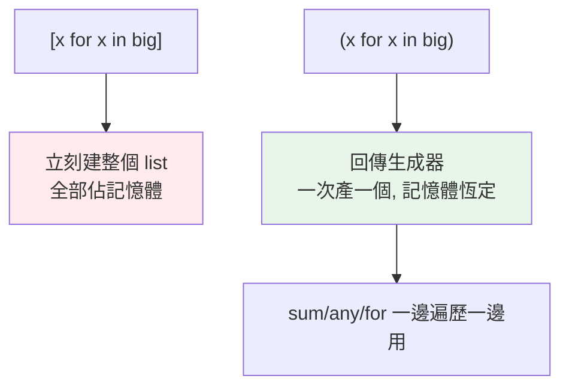

# 生成器表達式

> 生成器表達式是「惰性版的推導式」——把 `[...]` 換成 `(...)`，就從「立刻建整個 list」變成「一次產一個、幾乎不佔記憶體」。餵給 `sum`/`any`/`max` 時尤其省。

## Why（為什麼）

你已經會推導式（見 [推導式](../02-fundamentals/13-comprehensions.md)）——`[x*x for x in range(1000000)]` 會**立刻建出一百萬元素的 list**，佔大量記憶體。但如果你只是要 `sum(...)`，根本不需要那個 list 存在。**生成器表達式**用小括號 `(...)`，惰性產值，記憶體幾乎不增加。這是「推導式惰性化」的簡潔語法，也是寫高效資料處理的常用工具。

## Theory（理論：惰性版推導式）

生成器表達式的語法和推導式幾乎一樣，只差外層括號：

- **`[x for x in it]`** → list 推導式，**立刻**建出整個 list（全部佔記憶體）。
- **`(x for x in it)`** → 生成器表達式，回傳**生成器**，惰性產值（一次一個）。

它是 [生成器](03-generator.md) 的「表達式版」——不必寫 `def`/`yield`，一行就得到一個惰性生成器。本質完全是生成器：一次性、省記憶體、可表示大序列。

## Specification（規範：語法）

```python
# 生成器表達式（小括號）
gen = (x * x for x in range(10))          # <generator object>
gen = (x for x in data if x > 0)          # 可加篩選（同推導式）

# 當「唯一引數」傳給函式時，可省略多餘括號
total = sum(x * x for x in range(10))     # 不必寫 sum((x*x for x in ...))
biggest = max(len(w) for w in words)

# 但和其他引數並列時要保留括號
result = func((x for x in data), other)
```

## Implementation（省記憶體、只遍歷一次、與 list 推導式取捨）

### 記憶體差異：實測

```python
import sys

list_comp = [x for x in range(10000)]        # 立刻建 list
gen_exp = (x for x in range(10000))          # 惰性生成器

print(sys.getsizeof(list_comp))    # ~85176 bytes（整個 list）
print(sys.getsizeof(gen_exp))      # ~200 bytes（只是個生成器物件！）
```

無論序列多大，生成器表達式本身的大小**恆定**（就是一個生成器物件），因為它不儲存元素、只記住「怎麼產生下一個」。這是它省記憶體的原因。

### 餵給聚合函式最省

`sum`/`any`/`all`/`max`/`min`/`join` 這些「一邊遍歷一邊算」的函式，配生成器表達式最理想——不必先建整個 list：

```python
# ❌ 先建千萬元素 list，佔大量記憶體
total = sum([x * x for x in range(10_000_000)])

# ✅ 生成器表達式，逐一產生，記憶體恆定
total = sum(x * x for x in range(10_000_000))

# 其他聚合
has_negative = any(x < 0 for x in numbers)      # 短路：找到第一個就停
all_valid = all(is_valid(x) for x in items)
longest = max((len(line) for line in lines), default=0)
text = "".join(str(x) for x in values)          # join 也吃生成器
```

配 `any`/`all` 還有**短路**加成——`any` 找到第一個真就停，根本不必遍歷完（若用 list 推導式則已全建好，浪費）。

### 一次性：不能重複用

生成器表達式是生成器，**只能遍歷一次**：

```pycon
>>> gen = (x for x in range(3))
>>> list(gen)
[0, 1, 2]
>>> list(gen)          # 空的！已耗盡
[]
>>> sum(gen)           # 也是 0（已耗盡）
0
```

要多次用就用 list 推導式（存起來）或重建生成器表達式。

### 何時用 list 推導式 vs 生成器表達式

| 情況 | 選擇 |
|------|------|
| 只遍歷一次（餵給 sum/any/for/join） | **生成器表達式** `(...)` |
| 大量/串流/可能無限的資料 | **生成器表達式** |
| 需要多次遍歷、索引、`len`、切片 | **list 推導式** `[...]`（要具體 list） |
| 結果小、要當一般 list 用 | **list 推導式** |

準則：**只走一次、或資料大 → 生成器表達式；要當 list 反覆用 → list 推導式。**

## Code Example（可執行的 Python 範例）

```python
# gen_expression_demo.py
from __future__ import annotations

import sys


def demo() -> None:
    # 1. 記憶體差異
    list_comp = [x for x in range(10000)]
    gen_exp = (x for x in range(10000))
    print(f"list 推導式大小: {sys.getsizeof(list_comp)} bytes")
    print(f"生成器表達式大小: {sys.getsizeof(gen_exp)} bytes")

    # 2. 餵給聚合函式（省略多餘括號）
    total = sum(x * x for x in range(100))
    print(f"平方和: {total}")

    # 3. any/all + 短路
    numbers = [2, 4, -1, 6, 8]
    print(f"有負數: {any(x < 0 for x in numbers)}")     # True（短路）
    print(f"全為偶: {all(x % 2 == 0 for x in numbers)}")  # False

    # 4. join 吃生成器
    print("串接: " + ", ".join(str(x) for x in range(5)))

    # 5. 一次性
    gen = (x for x in range(3))
    print(f"第一次: {list(gen)}")
    print(f"第二次: {list(gen)}（耗盡）")


if __name__ == "__main__":
    demo()
```

**預期輸出**（大小數字依平台略有差異）：

```pycon
$ python gen_expression_demo.py
list 推導式大小: 85176 bytes
生成器表達式大小: 200 bytes
平方和: 328350
有負數: True
全為偶: False
串接: 0, 1, 2, 3, 4
第一次: [0, 1, 2]
第二次: []（耗盡）
```

## Diagram（圖解：list 推導式 vs 生成器表達式）



## Best Practice（最佳實踐）

- **餵給 `sum`/`any`/`all`/`max`/`min`/`join` 等聚合用生成器表達式**：省記憶體，且 any/all 有短路加成；當唯一引數時省略多餘括號。
- **大量/串流/可能無限的資料用生成器表達式**：避免一次建出巨大 list。
- **只遍歷一次的中間結果用生成器表達式**；要多次用、索引、取長度的用 list 推導式。
- **串接生成器表達式建管線**：`(f(x) for x in (g(y) for y in data))`——一次一筆流過。
- **記得一次性**：需要重複用就 list 化或重建。
- **可讀性優先**：複雜邏輯別硬塞一行，該用 `def` 生成器（見 [生成器](03-generator.md)）。

## Common Mistakes（常見誤解）

- **對只走一次的資料用 list 推導式**：白白建整個 list 佔記憶體；用生成器表達式。
- **以為 `(x for x in ...)` 是 tuple**：它是**生成器**，不是 tuple；要 tuple 用 `tuple(...)`。
- **重複遍歷生成器表達式**：第二次是空的（耗盡）。
- **對生成器表達式取 `len()` / 索引 / 切片**：生成器不支援；要這些用 list。
- **`sum([x for x in ...])` 多此一舉**：省掉方括號直接 `sum(x for x in ...)` 更省。
- **把無限生成器表達式 `list()`**：無限迴圈；用 `islice`。

## Interview Notes（面試重點）

- 說得出**生成器表達式 `(...)` 是惰性版推導式**：回傳生成器、一次產一個、記憶體恆定；對比 list 推導式 `[...]` 立刻建整個 list。
- 知道**餵給聚合函式（sum/any/all/max/join）最理想**，且當唯一引數可省略括號、any/all 有短路。
- **能對比何時用 list 推導式 vs 生成器表達式**（多次遍歷/需索引 → list；只走一次/資料大 → 生成器）。
- 知道生成器表達式是**一次性**、**不是 tuple**、不支援 len/索引。
- 知道它可串接成資料管線、可表示大/無限序列（配 islice）。

---

➡️ 下一章：[yield from](05-yield-from.md)

[⬆️ 回 Part 7 索引](README.md)
