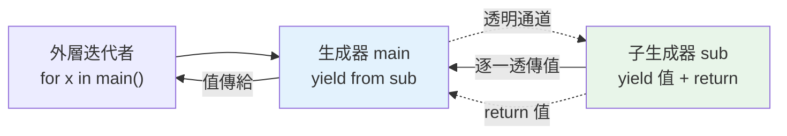

# yield from

> `yield from iterable` 把「一個生成器委派給另一個」——不用寫 `for x in sub: yield x`，一行搞定。它還能扁平化巢狀結構、串接生成器，並在協程中透傳 send/throw。

## 💡 白話導讀（建議先讀）

主持節目時要播來賓的完整發言，兩種做法：

**笨方法——逐句復述**：來賓說一句，你跟著重講一句：

```python
def show():
    for x in guest():      # 來賓的每句話……
        yield x            # ……我復述一遍
```

**聰明做法——把麥克風整段交出去**：

```python
def show():
    yield from guest()     # 「接下來的時間交給來賓」
```

`yield from` 讀作「**以下內容由它代播**」：把子迭代物件的所有值逐一 yield 出去，就像是你自己產出的一樣。

對「單純轉發」而言兩種寫法等價，`yield from` 只是更短。但它多做了一件將來很重要的事：

> **建立「觀眾 ↔ 來賓」的直通通道**——觀眾的提問（`send()`）、抗議（`throw()`）會**穿過主持人直達來賓**,來賓的閉幕詞（return 值）也拿得到。

這個「透明通道」在[生成器當協程用](08-generator-as-coroutine.md)時是關鍵——事實上 `yield from` 正是 `await` 語法的前身。

日常用途先記兩個:**攤平巢狀結構**（遞迴 yield from 子樹）、**串接多個生成器**。

## 🎯 什麼時候會用到

**當你要把「子序列 / 子生成器」的值,透明地攤進外層生成器時。** 場景:

- **攤平巢狀結構**:走訪樹或巢狀 list,遞迴生成器裡用 `yield from 子節點`,比 `for x in 子節點: yield x` 乾淨。
- **串接多個來源**:把幾個生成器接成一條輸出流(`itertools.chain` 內部就是這個概念)。
- **委派**:外層生成器把一段工作完全交給另一個生成器處理(連 `send`/`throw` 也一併代理——這正是舊式 coroutine 的基礎)。

一句話:**看到 `for x in 某可迭代: yield x` 這種樣板,就能改寫成一行 `yield from 某可迭代`。**

## Why（為什麼）

常見需求：一個生成器想「產出另一個可迭代物件的所有值」。手寫是 `for x in sub: yield x`——可行但囉嗦，尤其在委派給子生成器、扁平化巢狀結構、或組合多個生成器時。**`yield from`（PEP 380，3.3+）** 把這個模式縮成一行，還多了幾個手寫做不到的能力（透傳 send/throw、取得子生成器的回傳值）。它是寫「生成器組合」與遞迴生成器的利器。

## Theory（理論：委派給子可迭代物件）

`yield from iterable` 的意思：**把 `iterable` 的所有值逐一 yield 出去**，就像它們是當前生成器產出的一樣——「麥克風交給來賓」。

```python
# 手寫委派（逐句復述）
def gen():
    for x in sub_iterable:
        yield x

# yield from（等價，但更簡潔且更強）
def gen():
    yield from sub_iterable
```

對「單純轉發值」兩者等價。但 `yield from` 額外做了：

> **建立當前生成器與子生成器之間的透明通道**——`send()`、`throw()` 會透傳給子生成器，子生成器的 `return` 值也能被取得（見[協程](08-generator-as-coroutine.md)）。

這個通道在協程場景至關重要——`yield from` 正是 `await` 的前身。

## Specification（規範：語法與用途）

```python
# 委派給任何可迭代物件
def chain_two(a, b):
    yield from a
    yield from b

# 扁平化巢狀
def flatten(nested):
    for item in nested:
        if isinstance(item, list):
            yield from flatten(item)     # 遞迴委派
        else:
            yield item

# 取得子生成器的 return 值
def sub():
    yield 1
    yield 2
    return "done"                        # 生成器的 return 值

def main():
    result = yield from sub()            # result 拿到 "done"
    print(f"子生成器回傳: {result}")
```

## Implementation（串接、扁平化、取得 return 值）

### 串接多個可迭代物件

```python
def concatenate(*iterables):
    for it in iterables:
        yield from it

list(concatenate([1, 2], (3, 4), range(5, 7)))    # [1, 2, 3, 4, 5, 6]
```

比手寫巢狀 for 清楚。（標準庫的 `itertools.chain` 也做同樣的事，見 [itertools](06-itertools.md)。）

### 扁平化巢狀結構（遞迴委派）

`yield from` 讓遞迴生成器變優雅——扁平化任意深度的巢狀 list：

```python
def flatten(nested: list) -> "Iterator":
    for item in nested:
        if isinstance(item, list):
            yield from flatten(item)     # 遞迴：把子結果全轉發上來
        else:
            yield item

list(flatten([1, [2, [3, 4], 5], [6]]))    # [1, 2, 3, 4, 5, 6]
```

`yield from flatten(item)` 把遞迴呼叫產出的所有值透傳出來——手寫要 `for x in flatten(item): yield x`，`yield from` 更簡潔。

### 委派給自訂可迭代物件的 `__iter__`

呼應 [__iter__](02-iter-next.md)——用 `yield from` 讓容器把迭代委派給內部資料：

```python
class Playlist:
    def __init__(self, songs: list[str]) -> None:
        self.songs = songs
    def __iter__(self):
        yield from self.songs            # 委派給內部 list
```

### 取得子生成器的 return 值

生成器的 `return value` 不是「產出值」，而是把 value 放進 `StopIteration.value`。`yield from` 能直接接住它：

```python
def averager():
    total, count = 0, 0
    while True:
        value = yield              # （協程；見下一章）
        if value is None:
            break
        total += value
        count += 1
    return total / count if count else 0     # return 值

def main():
    result = yield from averager()          # result = averager 的 return 值
```

這個「取得子生成器回傳值」的能力，是 `yield from` 在協程/asyncio 前身中的關鍵——`yield from` 曾是 `await` 的前身。

## Code Example（可執行的 Python 範例）

```python
# yield_from_demo.py
from __future__ import annotations

from collections.abc import Iterator


def chain_all(*iterables: Iterator[int] | list[int] | range) -> Iterator[int]:
    """串接多個可迭代物件。"""
    for it in iterables:
        yield from it


def flatten(nested: list) -> Iterator[object]:
    """遞迴扁平化任意深度巢狀 list。"""
    for item in nested:
        if isinstance(item, list):
            yield from flatten(item)
        else:
            yield item


def countdown_then_up(n: int) -> Iterator[int]:
    """組合兩個子生成器。"""
    yield from range(n, 0, -1)      # n..1
    yield from range(0, n + 1)      # 0..n


class Playlist:
    """用 yield from 委派 __iter__ 給內部 list。"""

    def __init__(self, songs: list[str]) -> None:
        self.songs = songs

    def __iter__(self) -> Iterator[str]:
        yield from self.songs


def demo() -> None:
    # 1. 串接
    print(f"串接: {list(chain_all([1, 2], (3, 4), range(5, 7)))}")

    # 2. 扁平化
    print(f"扁平化: {list(flatten([1, [2, [3, 4], 5], [6]]))}")

    # 3. 組合
    print(f"組合: {list(countdown_then_up(3))}")

    # 4. 委派 __iter__
    print(f"播放清單: {list(Playlist(['a', 'b', 'c']))}")


if __name__ == "__main__":
    demo()
```

**預期輸出**：

```pycon
$ python yield_from_demo.py
串接: [1, 2, 3, 4, 5, 6]
扁平化: [1, 2, 3, 4, 5, 6]
組合: [3, 2, 1, 0, 1, 2, 3]
播放清單: ['a', 'b', 'c']
```

## Diagram（圖解：yield from 委派）



## Best Practice（最佳實踐）

- **委派給子可迭代物件用 `yield from`**，取代 `for x in sub: yield x`——更簡潔。
- **遞迴生成器（扁平化、樹走訪）用 `yield from`**：優雅地把子結果透傳上來。
- **組合/串接多個生成器用 `yield from`**（或標準庫 `itertools.chain`，見 [itertools](06-itertools.md)）。
- **自訂 `__iter__` 委派內部資料用 `yield from self._data`**。
- **需要子生成器的 `return` 值時用 `result = yield from sub()`**。
- **協程/透傳 send/throw 用 `yield from`**（見 [協程](08-generator-as-coroutine.md)），這是它超越簡單 for 的地方。

## Common Mistakes（常見誤解）

- **仍手寫 `for x in sub: yield x`**：`yield from sub` 更短且在協程場景更正確（透傳 send/throw）。
- **以為 `yield from` 只是語法糖**：對純值轉發是，但它還透傳 send/throw、接住子生成器 return 值——這些手寫 for 做不到。
- **對非可迭代物件用 `yield from`**：`yield from` 後面要是 iterable（或子生成器）。
- **遞迴扁平化把 str 當可迭代**：`str` 也是 iterable，扁平化時要排除（`isinstance(item, list)` 或明確排除 str/bytes）。
- **混淆生成器的 `return value` 與產出值**：`return value` 放進 `StopIteration.value`，靠 `yield from` 取得，不是被 `yield` 出去。
- **在普通函式（非生成器）用 yield from**：只有生成器函式能用。

## Interview Notes（面試重點）

- 說得出 **`yield from iterable`** 把子可迭代物件的所有值透傳出去，等價於 `for x in it: yield x` 但更簡潔。
- **關鍵加分**：知道 `yield from` 不只是語法糖——它建立**透明通道**，透傳 `send()`/`throw()` 給子生成器、並能取得子生成器的 **`return` 值**（存在 `StopIteration.value`）。
- 能舉用途：**串接生成器、遞迴扁平化、委派 `__iter__`、組合協程**。
- 知道 **`yield from` 是 `await` 的前身**（協程/asyncio 歷史）。
- 知道遞迴扁平化要注意 str 也是 iterable 的陷阱。

---

➡️ 下一章：[itertools](06-itertools.md)

[⬆️ 回 Part 7 索引](README.md)
