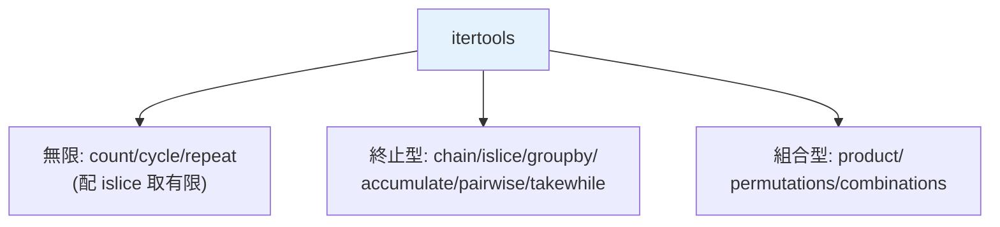

# itertools

> `itertools` 是一整箱高效、惰性的迭代工具——`chain`、`islice`、`groupby`、`product`、`combinations`、`count`、`cycle`…。它們用 C 實作、記憶體恆定，是處理序列與組合問題的標準庫利器。

## Why（為什麼）

很多迭代任務有現成的最佳解，卻常被重造輪子：串接多個序列、取無限生成器的前 N 個、分組、產生排列組合、累加、滑動配對。`itertools` 提供這些工具，全部**惰性（回傳 iterator）**、**用 C 實作（快）**、**記憶體效率高**。會用它們，很多手寫迴圈就消失了，程式更短更快。這也是面試/刷題常用的工具箱。

## Theory（理論：三類迭代工具）

`itertools` 的函式大致分三類：

- **無限迭代器**：`count`（無限計數）、`cycle`（無限循環）、`repeat`（重複）——配 `islice`/`takewhile` 取有限。
- **終止型迭代器**：`chain`（串接）、`islice`（切片）、`compress`、`takewhile`/`dropwhile`、`accumulate`（累加）、`groupby`（分組）、`pairwise`（相鄰配對）、`starmap`、`zip_longest`。
- **組合型迭代器**：`product`（笛卡兒積）、`permutations`（排列）、`combinations`（組合）、`combinations_with_replacement`。

全部回傳惰性 iterator，通常要 `list()` 才看得到內容。

## Specification（規範：常用工具速覽）

```python
import itertools as it

# 串接與切片
it.chain([1, 2], [3, 4])              # 1 2 3 4
it.chain.from_iterable([[1, 2], [3]]) # 1 2 3（攤平一層）
it.islice(gen, 5)                     # 取前 5 個（對無限生成器安全）
it.islice(gen, 2, 8, 2)               # 類似切片 [2:8:2]

# 無限 + 取有限
it.count(10, 2)                       # 10, 12, 14, ...（無限）
it.cycle("AB")                        # A B A B ...（無限）
it.repeat(0, 3)                       # 0 0 0

# 分組與累加
it.groupby(sorted_data, key=...)      # 連續分組（需先排序！）
it.accumulate([1, 2, 3, 4])           # 1 3 6 10（累加和）
it.pairwise([1, 2, 3])                # (1,2) (2,3)（3.10+）

# 組合
it.product([1, 2], ["a", "b"])        # (1,a)(1,b)(2,a)(2,b)
it.permutations([1, 2, 3], 2)         # 排列
it.combinations([1, 2, 3], 2)         # (1,2)(1,3)(2,3)
```

## Implementation（重點工具詳解）

### `islice`：安全地取無限生成器的一段

無限生成器（見 [生成器](03-generator.md)）不能 `list()`，但可以用 `islice` 取有限段：

```python
import itertools as it

def naturals():
    n = 0
    while True:
        yield n
        n += 1

first_five = list(it.islice(naturals(), 5))    # [0, 1, 2, 3, 4]
```

`islice` 惰性地只取需要的個數，是搭配無限生成器的標準工具。

### `chain`：串接多個可迭代物件

```python
list(it.chain([1, 2], (3, 4), range(5, 7)))     # [1, 2, 3, 4, 5, 6]
# 攤平「可迭代的可迭代物件」用 from_iterable
list(it.chain.from_iterable([[1, 2], [3, 4]]))  # [1, 2, 3, 4]
```

`chain` 惰性串接（不建中間 list），比 `a + b + c` 省記憶體，且能串接不同型別的可迭代物件。

### `groupby`：連續分組（陷阱：需先排序）

`groupby` 把**連續相同 key** 的元素分成一組——**只看相鄰**，所以幾乎總是要**先排序**：

```python
import itertools as it

data = [("a", 1), ("b", 2), ("a", 3)]

# ❌ 不排序：'a' 被分成兩組（因為不連續）
for k, g in it.groupby(data, key=lambda x: x[0]):
    print(k, list(g))       # a [...], b [...], a [...] ← 兩個 a！

# ✅ 先排序，讓相同 key 相鄰
data.sort(key=lambda x: x[0])
for k, g in it.groupby(data, key=lambda x: x[0]):
    print(k, list(g))       # a [...兩個...], b [...]
```

**忘記先排序是 `groupby` 最經典的坑**。另一個坑：分組的 `g` 是惰性 iterator，一旦進到下一組就失效——要保留就 `list(g)`。

### 組合工具：product / permutations / combinations

刷題與組合問題的利器：

```python
import itertools as it

# 笛卡兒積（巢狀迴圈的替代）
list(it.product([1, 2], ["a", "b"]))          # [(1,'a'),(1,'b'),(2,'a'),(2,'b')]
list(it.product(range(2), repeat=3))          # 所有 3 位二進位組合

# 排列（順序有關）
list(it.permutations([1, 2, 3], 2))           # (1,2)(1,3)(2,1)(2,3)(3,1)(3,2)

# 組合（順序無關）
list(it.combinations([1, 2, 3], 2))           # (1,2)(1,3)(2,3)
```

`product(..., repeat=n)` 取代多層巢狀迴圈；`combinations`/`permutations` 直接產生組合/排列。

### `accumulate`、`pairwise`、`takewhile`

```python
list(it.accumulate([1, 2, 3, 4]))                    # [1, 3, 6, 10] 累加
list(it.accumulate([1, 2, 3], func=lambda a, b: a * b))  # [1, 2, 6] 累乘
list(it.pairwise([1, 2, 3, 4]))                      # [(1,2),(2,3),(3,4)] 相鄰對（3.10+）
list(it.takewhile(lambda x: x < 3, [1, 2, 3, 1]))    # [1, 2]（遇到不符就停）
```

## Code Example（可執行的 Python 範例）

```python
# itertools_demo.py
from __future__ import annotations

import itertools as it
from collections.abc import Iterator


def naturals() -> Iterator[int]:
    n = 0
    while True:
        yield n
        n += 1


def demo() -> None:
    # 1. islice 取無限生成器
    print(f"前 5 個自然數: {list(it.islice(naturals(), 5))}")

    # 2. chain 串接
    print(f"串接: {list(it.chain([1, 2], (3, 4), range(5, 7)))}")

    # 3. groupby（先排序！）
    words = ["apple", "banana", "avocado", "blueberry", "cherry"]
    words.sort(key=lambda w: w[0])
    grouped = {k: list(g) for k, g in it.groupby(words, key=lambda w: w[0])}
    print(f"依首字母分組: {grouped}")

    # 4. 組合
    print(f"組合 C(3,2): {list(it.combinations([1, 2, 3], 2))}")
    print(f"笛卡兒積: {list(it.product([0, 1], repeat=2))}")

    # 5. accumulate 累加
    print(f"累加和: {list(it.accumulate([1, 2, 3, 4, 5]))}")

    # 6. pairwise 相鄰對
    print(f"相鄰對: {list(it.pairwise([1, 2, 3, 4]))}")


if __name__ == "__main__":
    demo()
```

**預期輸出**：

```pycon
$ python itertools_demo.py
前 5 個自然數: [0, 1, 2, 3, 4]
串接: [1, 2, 3, 4, 5, 6]
依首字母分組: {'a': ['apple', 'avocado'], 'b': ['banana', 'blueberry'], 'c': ['cherry']}
組合 C(3,2): [(1, 2), (1, 3), (2, 3)]
笛卡兒積: [(0, 0), (0, 1), (1, 0), (1, 1)]
累加和: [1, 3, 6, 10, 15]
相鄰對: [(1, 2), (2, 3), (3, 4)]
```

## Diagram（圖解：itertools 三類）



## Best Practice（最佳實踐）

- **取無限生成器的一段用 `islice`**（別 `list()` 無限生成器）。
- **串接多個序列用 `chain`**（惰性、省記憶體，勝過 `+`）；攤平一層用 `chain.from_iterable`。
- **`groupby` 一定先排序**（依同一 key），否則相同 key 不相鄰會分成多組；保留每組用 `list(g)`。
- **組合問題用 `product`/`permutations`/`combinations`** 取代手寫巢狀迴圈與遞迴。
- **累加/相鄰配對用 `accumulate`/`pairwise`**，別手寫。
- **善用惰性**：itertools 全惰性，可串成管線；要看內容才 `list()`。
- **看 `more-itertools`**：社群套件補了更多好用的工具（chunked、windowed 等）。

## Common Mistakes（常見誤解）

- **`groupby` 忘了先排序**：相同 key 不連續 → 被拆成多組。這是最經典的坑。
- **保留 `groupby` 的組 iterator**：進到下一組後前一組的 `g` 失效；要保留立刻 `list(g)`。
- **`list()` 無限生成器/無限 itertools（count/cycle）**：無限迴圈耗盡記憶體；用 `islice`/`takewhile` 限制。
- **忘了 itertools 回傳惰性 iterator**：直接 print 看到 `<itertools... object>`；要 `list()`。
- **混淆 permutations（有序）與 combinations（無序）**：排列 (1,2)≠(2,1)、組合 (1,2)=(2,1)。
- **對已耗盡的 itertools iterator 再用**：一次性，耗盡即空。
- **手寫 chain/accumulate/product 的迴圈**：重造輪子，itertools 更快更清楚。

## Interview Notes（面試重點）

- 認得三類工具：**無限（count/cycle/repeat）、終止型（chain/islice/groupby/accumulate/pairwise）、組合型（product/permutations/combinations）**，並知道全部**惰性、C 實作、省記憶體**。
- **`groupby` 需先排序是高頻考點**：能說明「只分組連續相同 key」以及保留組要 `list(g)`。
- 知道 **`islice` 取無限生成器**、**`chain` 串接**、**`product/permutations/combinations`** 解組合問題。
- 能區分 **permutations（有序）vs combinations（無序）**。
- 知道要 `list()` 才看內容、無限工具要配 islice/takewhile。

---

➡️ 下一章：[惰性求值與記憶體效益](07-lazy-evaluation.md)

[⬆️ 回 Part 7 索引](README.md)
