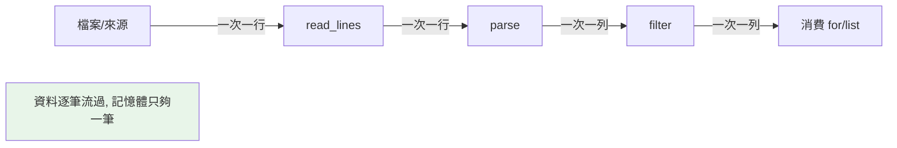

# 惰性求值與記憶體效益

> 惰性求值是「值用到才算」——生成器、range、map/filter/zip 都是惰性的。它讓你能處理比記憶體還大的資料、無限序列、串接零成本的處理管線。理解它，才能寫出記憶體高效的 Python。

## 💡 白話導讀（建議先讀）

這個 Part 反覆出現的「惰性」，這章正式收攏。用便當店比喻兩種生產模式：

- **及早（eager）＝中央工廠**：訂單一來，**立刻做好全部一萬個便當**堆在倉庫。
  好處：隨時取用、可重複拿。代價：倉庫（記憶體）要裝得下全部。
- **惰性（lazy）＝現點現做**：客人到窗口才做**這一個**。
  好處：**幾乎不需要倉庫**——一億個訂單也只佔一個便當的空間;甚至能接「無限量」的單。代價：做過的不留（只能走一遍）、不能挑著拿第 500 個（只能循序）。

對號入座：list、list 推導式是工廠；生成器、`range`、`map`/`filter`/`zip`、itertools 全是現點現做。

惰性真正的殺手鐧是**串管線**：

```python
lines  = open("huge.log")                     # 惰性:一次讀一行
errors = (l for l in lines if "ERROR" in l)   # 惰性:過濾
codes  = (l.split()[2] for l in errors)       # 惰性:取欄位
total  = sum(1 for _ in codes)                # 到這裡才真正開始流動!
```

三站流水線,**中間不蓋任何倉庫**——每一行 log 像在輸送帶上依序通過三站,處理完就丟。
100GB 的檔案,記憶體始終只有「一行」的量。這就是惰性的力量:**大資料處理的唯一可行姿勢**。

選擇口訣:**要重複用、要隨機取 → eager;資料大、只走一遍、要串管線 → lazy。**

## 🎯 什麼時候會用到

惰性(值用到才算)是一種**貫穿性思維**,不是單一 API。你會在這些時候刻意選它:

- **省記憶體**:大資料用 generator / `map` / `filter`,而不是一次 `list` 出來。
- **省計算**:可能用不到的結果延後算(`and`/`or` 短路、只在需要的分支才計算)。
- **無限或極大的序列**:`itertools.count()`、串流——非惰性根本表達不出來。
- **提早結束**:配 `any()` / `next()` / `islice`,**找到就停**,不必算完全部。

但要提防惰性的兩個坑:generator **只能走一次**;以及「延後執行」讓
**例外或副作用在你意想不到的時機才發生**(要 `list()` 那一刻才爆)。

一句話:**資料大、可能不全用、或無限 → 惰性;要重複用、要當場算完 → 及早求值(eager)。**

## Why（為什麼）

前面各章反覆出現「惰性」：生成器惰性產值、生成器表達式省記憶體、itertools 全惰性、`map`/`filter`/`zip`/`range` 也惰性。這章把「惰性求值」這條主線集中講清楚——它為什麼省記憶體、如何處理超大/無限資料、如何串接成零記憶體成本的管線。這是「能處理 GB 級檔案而記憶體只用幾 MB」的關鍵，也是資深工程師與新手的分野。

## Theory（理論：eager vs lazy）

兩種求值時機——中央工廠 vs 現點現做：

- **及早求值（eager）**：**立刻**算出所有結果並存起來。list、list 推導式、`sum([...])`——一次算完、全部佔記憶體（倉庫要夠大）。
- **惰性求值（lazy）**：**用到才算**、一次產一個、不儲存全部。生成器、生成器表達式、`range`、`map`/`filter`/`zip`、itertools——記憶體恆定（只佔「一個便當」）。

核心差異一句話：

> eager 用**空間**換「隨時可重複存取」；lazy 用**「一次性、循序」**換極低記憶體。

處理大於記憶體的資料時，lazy 是**唯一可行**的選擇——而且惰性管線可以層層串接，中間不建任何暫存容器。

## Specification（規範：哪些是惰性的）

| 惰性（lazy） | 及早（eager） |
|--------------|---------------|
| 生成器函式（`yield`） | list 推導式 `[...]` |
| 生成器表達式 `(...)` | `list()`、`dict()`、`set()` |
| `range` | 明確建立的容器 |
| `map`、`filter`、`zip`、`enumerate`、`reversed` | `sorted()`（需全部才能排） |
| `itertools.*` | `sum([...])`（先建 list） |
| 檔案物件逐行迭代 | `f.readlines()` |

**注意**：`sorted`、`len`、`sum(list)` 等需要「看完全部」的操作本質上無法惰性。但 `sum(生成器)`、`max(生成器)` 可以邊遍歷邊算，不必先建 list。

## Implementation（省記憶體、處理大檔、串接管線）

### 記憶體對比：eager vs lazy

```python
import sys

# eager：立刻建千萬元素 list
eager = [x * x for x in range(10_000_000)]      # 佔數百 MB！
print(sys.getsizeof(eager))                     # ~89 MB

# lazy：生成器，記憶體恆定
lazy = (x * x for x in range(10_000_000))
print(sys.getsizeof(lazy))                      # ~200 bytes

# 兩者都能求和，但 lazy 不佔記憶體
print(sum(lazy))                                # 邊產邊加
```

無論資料多大，惰性物件本身大小恆定——它只記住「怎麼產下一個」，不存元素。

### 處理比記憶體還大的檔案

**逐行迭代檔案物件是惰性的**——不會把整個檔案讀進記憶體：

```python
# ❌ eager：整個檔案讀進記憶體（大檔會 OOM）
with open("huge.log") as f:
    lines = f.readlines()             # 全部進記憶體！
    errors = [line for line in lines if "ERROR" in line]

# ✅ lazy：逐行處理，記憶體恆定（能處理 GB 級檔案）
with open("huge.log") as f:
    errors = [line for line in f if "ERROR" in line]   # f 逐行惰性產出
```

`for line in f` 一次讀一行、處理完就丟——所以你能處理遠大於記憶體的檔案。這是惰性最實用的場景之一。

### 串接惰性管線：零中間記憶體

惰性物件可以**串接**成處理管線，資料**一次一筆**流過每個階段，不建任何中間 list：

```python
def read_lines(path):
    with open(path) as f:
        yield from f

def parse(lines):
    for line in lines:
        yield line.strip().split(",")

def filter_valid(rows):
    for row in rows:
        if len(row) == 3:
            yield row

# 串接：資料逐筆流過，記憶體恆定
pipeline = filter_valid(parse(read_lines("data.csv")))
for row in pipeline:                  # 這時才真正開始讀取/處理
    process(row)
```

每個生成器都惰性——整條管線在你開始遍歷前**什麼都沒做**，遍歷時資料一筆一筆流過三個階段。即使檔案有幾百萬行，記憶體只夠一行。這是 Python 資料處理的優雅範式。

### 惰性的代價與注意

- **一次性**：惰性 iterator 用完即耗盡（見 [iterable 與 iterator](01-iterable-iterator.md)），不能重複遍歷。
- **無法索引/取長度**：要 `len`/`[i]`/切片得先 `list()`（就變 eager 了）。
- **副作用時機**：惰性物件在「遍歷時」才執行——若有副作用（print、寫檔），發生時機和你寫的位置不同（見常見錯誤）。
- **除錯較難**：值還沒產生，print 生成器看不到內容。

## Code Example（可執行的 Python 範例）

```python
# lazy_evaluation_demo.py
from __future__ import annotations

import sys
from collections.abc import Iterator


def read_lines(text: str) -> Iterator[str]:
    """模擬逐行讀取（惰性）。"""
    yield from text.splitlines()


def parse_rows(lines: Iterator[str]) -> Iterator[list[str]]:
    """惰性解析每行。"""
    for line in lines:
        yield line.split(",")


def filter_valid(rows: Iterator[list[str]]) -> Iterator[list[str]]:
    """惰性過濾。"""
    for row in rows:
        if len(row) == 3:
            yield row


def demo() -> None:
    # 1. 記憶體對比
    eager = [x * x for x in range(100000)]
    lazy = (x * x for x in range(100000))
    print(f"eager list: {sys.getsizeof(eager)} bytes")
    print(f"lazy gen:   {sys.getsizeof(lazy)} bytes")
    print(f"lazy 求和: {sum(lazy)}")

    # 2. 惰性管線：資料逐筆流過三階段
    data = "a,1,x\nb,2\nc,3,z\nbad\nd,4,w"
    pipeline = filter_valid(parse_rows(read_lines(data)))
    valid_rows = list(pipeline)      # 這時才真正執行整條管線
    print(f"有效列數: {len(valid_rows)}")
    print(f"內容: {valid_rows}")


if __name__ == "__main__":
    demo()
```

**預期輸出**（大小數字依平台略異）：

```pycon
$ python lazy_evaluation_demo.py
eager list: 800984 bytes
lazy gen:   200 bytes
lazy 求和: 333328333350
有效列數: 3
內容: [['a', '1', 'x'], ['c', '3', 'z'], ['d', '4', 'w']]
```

## Diagram（圖解：惰性管線資料流）



## Best Practice（最佳實踐）

- **處理大檔案逐行迭代**（`for line in f`），別 `f.readlines()` 全讀進記憶體。
- **只走一次的資料用惰性**（生成器/生成器表達式/map/filter）；要多次用或索引才 `list()`。
- **串接生成器建處理管線**：讀 → 解析 → 過濾 → 轉換，資料逐筆流過、記憶體恆定。
- **聚合用惰性 + 邊算**：`sum(gen)`、`max(gen)`、`any(gen)`，別先 `list()`。
- **無限序列用生成器 + `islice`/`takewhile`**（見 [itertools](06-itertools.md)）。
- **知道惰性的代價**：一次性、無法索引、副作用在遍歷時發生；需要時明確 `list()` 轉 eager。

## Common Mistakes（常見誤解）

- **`f.readlines()` 讀大檔**：整檔進記憶體，大檔 OOM；逐行迭代。
- **對只走一次的資料建整個 list**：浪費記憶體；用生成器。
- **以為惰性管線「建立時就執行」**：不會——在你開始遍歷（`for`/`list`/`sum`）前什麼都沒發生。
- **重複遍歷惰性物件**：一次性，第二次是空的。
- **對生成器 `len()`/索引/切片**：不支援；要先 `list()`（就變 eager）。
- **忽略副作用時機**：惰性物件的 print/寫檔在「遍歷時」發生，可能不在你以為的位置。
- **無限惰性物件 `list()`**：無限迴圈；用 islice。

## Interview Notes（面試重點）

- **能對比 eager（立刻算、全佔記憶體）vs lazy（用到才算、記憶體恆定）**，並列出哪些是惰性（生成器/range/map/filter/zip/itertools/檔案逐行）。
- **關鍵應用**：能說明**逐行迭代檔案處理超大檔**、**串接生成器建零中間記憶體的管線**。
- 知道**惰性管線在遍歷前不執行**（延遲到消費時）。
- 知道惰性的代價：**一次性、無法索引/取長度、副作用在遍歷時**。
- 知道 `sum(gen)`/`max(gen)` 能邊遍歷邊算、不必先 list；無限序列配 islice。
- 能連結前面章節（生成器、生成器表達式、itertools 都是惰性的體現）。

---

➡️ 下一章：[generator 當協程：send / throw / close](08-generator-as-coroutine.md)

[⬆️ 回 Part 7 索引](README.md)
