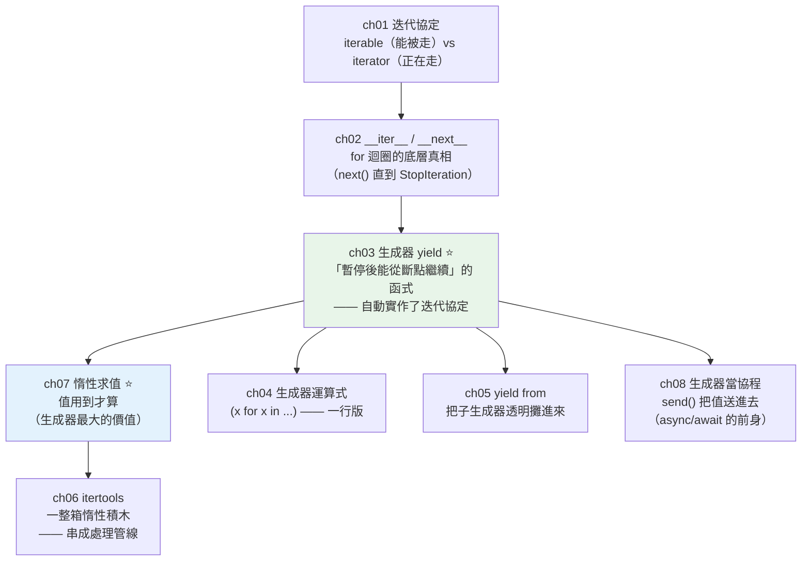

# Part 7 統整：迭代器與生成器全貌

> 把這 8 章串成一張圖——核心只有一個字：**懶**。值用到才算，東西用完就丟。

## 🗺️ 知識地圖（這 8 章怎麼串起來）

Part 7 其實在講一件事：**怎麼「一次處理一個」，而不是「全部載進記憶體」。**



**一句話串起來**：

**`for` 迴圈其實不神奇**（ch01、ch02）——它只是不斷呼叫 `next()`，
直到對方拋出 `StopIteration`。任何實作了這個協定的東西，都能被 `for` 走。

**生成器（ch03）是實作這個協定最省力的方式**——
函式裡只要有 `yield`，它就變成「**能暫停、能從斷點繼續**」的東西。

而生成器真正的價值，是 **[惰性（ch07）](07-lazy-evaluation.md)**：
**值用到才算，沒被要的部分根本不執行**。
這讓你能處理「**比記憶體還大**」的資料（10 GB 的 log、無限的串流）。

其餘章節都是這個核心的延伸：
生成器運算式（ch04，一行版）、`yield from`（ch05，攤平/委派）、
`itertools`（ch06，一整箱惰性積木，可以串成管線）、
以及 `send()` 讓生成器變成雙向的協程（ch08——這正是 **async/await 的前身**）。

## ⚡ 速查表（什麼情境用什麼）

| 情境 | 用什麼 | 章節 |
|------|--------|------|
| **處理大檔案／大資料** | **生成器**（一次一筆，記憶體 O(1)）——**別 `readlines()` 一次全載** | [ch03](03-generator.md) |
| 資料量大，但只需要「前幾筆」 | 生成器 + `itertools.islice`（**沒被取的根本不算**） | [ch06](06-itertools.md)、[ch07](07-lazy-evaluation.md) |
| 一行寫出惰性序列 | 生成器運算式 `(f(x) for x in xs)`（注意是**小括號**） | [ch04](04-generator-expression.md) |
| 「立刻要一份完整清單」 | list 推導式 `[...]`（**及早求值**） | [ch04](04-generator-expression.md) |
| 攤平巢狀結構／走訪樹 | **`yield from`**（取代 `for x in sub: yield x`） | [ch05](05-yield-from.md) |
| 串接多個序列 | `itertools.chain(a, b)`（惰性，勝過 `a + b`） | [ch06](06-itertools.md) |
| 無限序列取一段 | `itertools.islice(itertools.count(1), 10)` | [ch06](06-itertools.md) |
| 相鄰兩兩配對 | `itertools.pairwise(xs)` | [ch06](06-itertools.md) |
| 連續相同者分組 | `itertools.groupby(xs, key)`（⚠️ **必須先排序**） | [ch06](06-itertools.md) |
| 組合／排列 | `itertools.product` / `permutations` / `combinations` | [ch06](06-itertools.md) |
| 要**重複走好幾遍**、要索引、要 `len()` | **用 `list`**——生成器**只能走一次** | [ch03](03-generator.md) |
| 想把值「送進」生成器 | `gen.send(value)`（罕見；現代多改用 async） | [ch08](08-generator-as-coroutine.md) |

## 🔑 核心心智模型（帶得走的幾句話）

- **`for` 迴圈 = 反覆呼叫 `next()`，直到 `StopIteration`。** 沒有魔法。
  懂了這一點，你就能讓**任何自訂物件**支援 `for`（只要實作 `__iter__`/`__next__`）。
- **生成器是「點餐券」，不是「餐點」。** `(x for x in big)` **不做任何事**——
  它只是一張憑證，你 `next()` 一次，廚房才做一份。
  **list 推導式則是「整桌菜先做好」**——下面的小實作會讓你看到兩者相差 **4 萬倍**的記憶體。
- **惰性 = 沒被要的，根本不算。** 這不只省記憶體，也**省計算**：
  處理 100 萬行但只取前 5 筆？那就**只算 5 筆**。
- **生成器只能走一次。** 走完就空了（它不是容器，是「一次性的水流」）。
  要重複用，請 `list()` 它——但那就放棄了惰性。
- **`yield` 是「暫停」，不是「回傳」。** 函式在 `yield` 處**凍結現場**（區域變數全保留），
  下次 `next()` 時**從那一行的下一行繼續**。這個「可暫停的函式」正是
  [async/await](../09-concurrency/08-async-await.md) 的雛形。

## 🛠️ 小實作：100 萬行的處理管線，記憶體卻幾乎不變

```python
# generators_demo.py —— Part 7 主線：懶（值用到才算）
from __future__ import annotations

import itertools
import sys
from collections.abc import Iterator


def read_lines() -> Iterator[str]:
    """ch03 生成器：一次吐一行——不是一次做出 100 萬行。"""
    for i in range(1, 1_000_001):
        yield f"log line {i}"


def parse(lines: Iterator[str]) -> Iterator[int]:
    """ch07 惰性：這一步同樣不會馬上執行，只是「接在管線上」。"""
    for line in lines:
        yield int(line.split()[-1])


def only_even(nums: Iterator[int]) -> Iterator[int]:
    for num in nums:
        if num % 2 == 0:
            yield num


def flatten(nested: list[list[int]]) -> Iterator[int]:
    """ch05 yield from：把子序列透明地攤進來。"""
    for inner in nested:
        yield from inner


def demo() -> None:
    print("【ch01/ch02 迭代協定】for 迴圈其實在做什麼")
    iterator = iter([10, 20])
    print(f"  iter([10,20]) → {type(iterator).__name__}")
    print(f"  next() → {next(iterator)}, next() → {next(iterator)}")
    try:
        next(iterator)
    except StopIteration:
        print("  next() → StopIteration（for 迴圈就是靠這個結束的）")

    print("\n【ch03/ch07 生成器管線】100 萬行，記憶體卻幾乎不變")
    pipeline = only_even(parse(read_lines()))       # 三層管線——此刻「什麼都還沒做」
    first_five = list(itertools.islice(pipeline, 5))
    print(f"  管線物件本身: {sys.getsizeof(pipeline)} bytes（不是 100 萬行！）")
    print(f"  只取前 5 個偶數: {first_five}")
    print("  ← 100 萬行從未同時存在;沒被取的部分「根本沒算」")

    eager = [i for i in range(1_000_000)]           # list 推導式：整桌菜先做好
    lazy = (i for i in range(1_000_000))            # 生成器運算式：只是一張點餐券
    print(f"\n  list 推導式  : {sys.getsizeof(eager):>9,} bytes（東西全做出來了）")
    print(f"  生成器運算式: {sys.getsizeof(lazy):>9,} bytes（只是一張「點餐券」）")

    print("\n【ch05 yield from】攤平巢狀結構")
    print(f"  flatten([[1,2],[3],[4,5]]) → {list(flatten([[1, 2], [3], [4, 5]]))}")

    print("\n【ch06 itertools】惰性積木，可以任意組合")
    print(f"  islice(count(1), 5)  → {list(itertools.islice(itertools.count(1), 5))}")
    print(f"  chain([1,2],[3])     → {list(itertools.chain([1, 2], [3]))}")
    print(f"  pairwise([1,2,3,4])  → {list(itertools.pairwise([1, 2, 3, 4]))}")


if __name__ == "__main__":
    demo()
```

**預期輸出**：

```pycon
$ python generators_demo.py
【ch01/ch02 迭代協定】for 迴圈其實在做什麼
  iter([10,20]) → list_iterator
  next() → 10, next() → 20
  next() → StopIteration（for 迴圈就是靠這個結束的）

【ch03/ch07 生成器管線】100 萬行，記憶體卻幾乎不變
  管線物件本身: 200 bytes（不是 100 萬行！）
  只取前 5 個偶數: [2, 4, 6, 8, 10]
  ← 100 萬行從未同時存在;沒被取的部分「根本沒算」

  list 推導式  : 8,448,728 bytes（東西全做出來了）
  生成器運算式:       192 bytes（只是一張「點餐券」）

【ch05 yield from】攤平巢狀結構
  flatten([[1,2],[3],[4,5]]) → [1, 2, 3, 4, 5]

【ch06 itertools】惰性積木，可以任意組合
  islice(count(1), 5)  → [1, 2, 3, 4, 5]
  chain([1,2],[3])     → [1, 2, 3]
  pairwise([1,2,3,4])  → [(1, 2), (2, 3), (3, 4)]
```

**兩個數字說完整個 Part 7**：

```text
list 推導式  : 8,448,728 bytes   ← 「整桌菜先做好」
生成器運算式:       192 bytes    ← 「只是一張點餐券」
                                    差距約 44,000 倍
```

而那條**三層管線**（`only_even(parse(read_lines()))`）更關鍵：
它宣稱要處理 100 萬行，但當你只 `islice(..., 5)` 取 5 筆時——
**它真的就只算了 5 筆**。剩下的 999,995 行，**從頭到尾沒有被產生過**。

這就是惰性的全部價值：**不只省記憶體，更省計算。**

## ✅ 自測清單（答不出來就回去讀）

- [ ] iterable 和 iterator 差在哪？`list` 是哪一個？（[ch01](01-iterable-iterator.md)）
- [ ] `for x in xs:` 背後實際做了哪幾件事？（[ch02](02-iter-next.md)）
- [ ] 函式裡加了 `yield` 之後，呼叫它會發生什麼事？（提示：不會執行任何一行）（[ch03](03-generator.md)）
- [ ] `[x for x in xs]` 和 `(x for x in xs)` 差在哪？記憶體差多少？（[ch04](04-generator-expression.md)）
- [ ] 生成器可以走第二次嗎？為什麼？（[ch03](03-generator.md)）
- [ ] `yield from` 取代了什麼樣板？除了攤平還有什麼用？（[ch05](05-yield-from.md)）
- [ ] `itertools.groupby` 有什麼經典陷阱？（[ch06](06-itertools.md)）
- [ ] 惰性求值除了省記憶體，還省了什麼？（[ch07](07-lazy-evaluation.md)）
- [ ] 惰性有什麼副作用／要小心什麼？（[ch07](07-lazy-evaluation.md)）
- [ ] `yield` 為什麼說是「暫停」而不是「回傳」？（[ch03](03-generator.md)）

## 🎯 面試速查

| 考點 | 面試官想聽到什麼 | 章節 |
|------|------------------|------|
| **iterable vs iterator？** | 「**iterable** 是『**能**被走的東西』（有 `__iter__`），如 `list`；**iterator** 是『**正在**走的游標』（有 `__next__`，也有 `__iter__`）。`for` 會先對 iterable 呼叫 `iter()` 拿到 iterator，再反覆 `next()` 直到 `StopIteration`。」 | [ch01](01-iterable-iterator.md) |
| **generator 和 list 差在哪？** | 「generator **惰性**（值用到才算、記憶體 O(1)、**只能走一次**）；list **及早求值**（全部算好、佔記憶體、可重複走／索引／`len()`）。處理**大資料或無限序列**必用 generator。」 | [ch03](03-generator.md) |
| **`yield` 到底做了什麼？** | 「它讓函式變成生成器——**在 `yield` 處暫停、保留整個區域狀態**（不是回傳後就結束），下次 `next()` 從**下一行**繼續。這個『**可暫停的函式**』正是 coroutine／async-await 的基礎。」 | [ch03](03-generator.md)、[ch08](08-generator-as-coroutine.md) |
| **generator 的實際好處？** | 「處理**比記憶體還大**的資料（10 GB log 逐行處理）；**串成管線**時，每一步都惰性，**只算真正需要的那幾筆**——`islice(pipeline, 5)` 就真的只算 5 筆。」 | [ch07](07-lazy-evaluation.md) |
| **`yield from` 的用途？** | 「把**子生成器的值透明地攤進來**，取代 `for x in sub: yield x` 的樣板。用於**遞迴走訪樹**、串接多來源；它也會**代理 `send()`/`throw()`**——這是舊式 coroutine 委派的基礎。」 | [ch05](05-yield-from.md) |
| **惰性的坑？** | 「① **只能走一次**（走完就空）；② **例外／副作用會延後發生**——直到你真的去取值那一刻才爆，這讓 debug 的『案發現場』和『寫程式的地方』對不上。」 | [ch07](07-lazy-evaluation.md) |

---

🎉 **恭喜完成 Part 7！** 你已經掌握 Python 最優雅的一招:**懶**——
值用到才算，資料再大也不怕。

接下來 [Part 8 函數式與裝飾器](../08-functional-decorators/README.md) 要把「函式」本身當主角：
既然函式是**一等公民**（可以被傳遞、被回傳），那我們能不能寫一個
「**吃函式、吐函式**」的函式，替它加上快取、計時、重試——而**不動它一行程式碼**？
那就是**裝飾器**。

➡️ 下一 Part：[函數式與裝飾器 Functional & Decorators](../08-functional-decorators/README.md)

[⬆️ 回 Part 7 索引](README.md)
