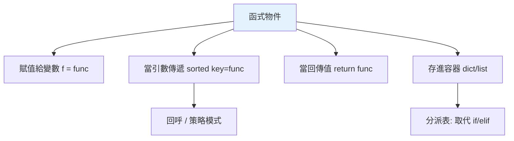

# 一等公民函式

> 在 Python，函式和整數、字串一樣是「值」——可以賦值、傳遞、回傳、存進容器。這個「一等公民」特性是高階函式、回呼、裝飾器、策略模式的共同地基。

## 💡 白話導讀（建議先讀）

[Part 2 講過](../02-fundamentals/08-functions.md)：函式是一張**食譜卡**。這章正式給這個性質一個名字，並展示它開啟的世界。

「**一等公民**」的意思是：函式享有和數字、字串**完全相同**的待遇——

- 可以**賦值**：`f = greet`（把食譜卡再貼一張便利貼）
- 可以**當引數傳**：`sorted(xs, key=len)`（把卡遞給別人）
- 可以**當回傳值**：函式做出函式（[閉包](../02-fundamentals/12-closures.md)的外送員）
- 可以**存進容器**：`{"start": start_fn, "stop": stop_fn}`（卡片歸檔進資料夾）

在很多語言裡函式是「特殊的東西」，要繞道（函式指標、匿名內部類）才能傳遞——Python 裡它**就是普通的值**。

為什麼這章值得單獨存在？因為接下來的一切都站在它上面：

- **高階函式**（下一章）＝收食譜卡或發食譜卡的函式
- **裝飾器**（第 3 章）＝收一張卡、回一張加工過的卡
- **回呼、策略模式**＝把「要做什麼」當參數傳來傳去

一句話：**把「函式可以被當成值搬來搬去」內化成直覺**——這是函數式風格的入場券。

## 🎯 什麼時候會用到

「函式是值」讓一整類寫法成為可能——你其實天天在用:

- **把函式當參數傳(高階函式)**:`sorted(data, key=len)`、`max(items, key=...)`、`map`/`filter`——
  把「怎麼比較、怎麼轉換」當參數傳進去。
- **回呼(callback)**:註冊事件處理器、按鈕點擊、完成通知——傳一個「之後才被呼叫」的函式。
- **用 dict 派發取代長 `if/elif`**:`handlers = {"add": do_add, "del": do_del}; handlers[cmd]()`。
- **策略模式的 Pythonic 版**:與其定義一堆策略類別,傳一個函式就好(見 [設計模式](../16-architecture/06-design-patterns.md))。
- **裝飾器、工廠函式、閉包**——全都建立在「函式能被傳遞與回傳」之上。

一句話:**每當你想把「一段行為」當資料傳來傳去、事後再執行,就是一等函式在發力。**

## Why（為什麼）

很多強大的 Python 模式——`sorted(key=...)`、裝飾器、回呼、事件處理、策略模式——都建立在同一個事實上：**函式是物件，可以像資料一樣操作**。若你還把函式當成「只能定義和呼叫的特殊語法」，就用不出這些模式。理解「函式是一等公民」，是通往函數式風格與裝飾器的第一步，也是本 Part 的地基。

## Theory（理論：函式是物件）

**一等公民（first-class citizen）** 指一個東西享有「值」的所有待遇：

- 賦值給變數。
- 當引數傳給函式。
- 當回傳值。
- 存進資料結構（list、dict⋯⋯）。

在 Python，**函式就是物件**（呼應[一切皆物件](../10-cpython-internals/01-everything-is-object.md)、[函式](../02-fundamentals/08-functions.md)的食譜卡），完全享有這些待遇。

`def greet(): ...` 做的事：建立一個函式物件，綁到名稱 `greet`——`greet` 只是張貼在函式物件上的便利貼，可以像任何變數一樣操作。

## Specification（規範：函式作為值）

```python
def square(x: int) -> int:
    return x * x

# 1. 賦值（不加括號 = 指向函式物件本身）
f = square
f(5)                    # 25

# 2. 當引數傳遞
list(map(square, [1, 2, 3]))     # [1, 4, 9]

# 3. 當回傳值
def get_op(name: str):
    return square if name == "sq" else abs

# 4. 存進容器
ops = {"square": square, "abs": abs}
ops["square"](4)        # 16

# 函式有屬性
square.__name__         # 'square'
square.__doc__          # docstring
```

## Implementation（不加括號、回呼、分派表、屬性）

### `f` vs `f()`：物件 vs 呼叫

最關鍵的區別：**`f` 是函式物件本身、`f()` 是呼叫它**。傳遞函式當值時**不加括號**：

```python
def greet():
    return "hi"

# ✅ 傳函式物件（之後由別人呼叫）
schedule(greet)         # 傳 greet 這個函式

# ❌ 傳呼叫的「結果」
schedule(greet())       # 傳的是 "hi"（字串），不是函式！
```

新手常誤加括號，把「呼叫結果」當「函式」傳出去。回呼、`key=`、`map` 的第一個引數都要傳函式物件（不加括號）。

### 回呼（callback）：把行為當參數

「一等公民」最常見的用途是**把一段行為當參數傳入**，讓呼叫方決定「做什麼」：

```python
def process(items: list, transform) -> list:
    return [transform(item) for item in items]   # transform 是傳進來的函式

process([1, 2, 3], square)          # [1, 4, 9]
process([1, 2, 3], str)             # ['1', '2', '3']
```

`sorted(data, key=len)`、`map(func, it)`、事件處理器都是這個模式——函式作為「可替換的行為」。

### 分派表（dispatch table）：用 dict 取代 if/elif

把函式存進 dict，用 key 選擇要執行哪個——比一長串 `if/elif` 清楚，也易擴充：

```python
def add(a, b): return a + b
def sub(a, b): return a - b
def mul(a, b): return a * b

# 分派表：運算子 → 函式
operations = {"+": add, "-": sub, "*": mul}

def calculate(a: float, op: str, b: float) -> float:
    return operations[op](a, b)      # 查表取函式並呼叫

calculate(3, "+", 4)     # 7
calculate(3, "*", 4)     # 12
```

新增運算只要往 dict 加一筆，不必改 `calculate`——這是「開放封閉原則」的體現，也是策略模式的輕量版（見 [設計模式](../16-architecture/06-design-patterns.md)）。

### 函式的屬性與內省

函式物件帶有中繼資料，可讀取甚至新增：

```pycon
>>> def greet(name):
...     """打招呼。"""
...     return f"Hi {name}"
>>> greet.__name__
'greet'
>>> greet.__doc__
'打招呼。'
>>> greet.calls = 0          # 甚至能加自訂屬性！
>>> greet.calls
0
```

這些屬性在裝飾器（保留原函式名稱，見 [functools 與 wraps](05-functools.md)）與內省工具中很重要。

## Code Example（可執行的 Python 範例）

```python
# first_class_demo.py
from __future__ import annotations

from collections.abc import Callable


def square(x: int) -> int:
    return x * x


def cube(x: int) -> int:
    return x * x * x


def apply_all(value: int, funcs: list[Callable[[int], int]]) -> list[int]:
    """把一串函式套用到同一個值（函式存 list）。"""
    return [f(value) for f in funcs]


def make_operation_table() -> dict[str, Callable[[float, float], float]]:
    """分派表：字串 → 函式。"""
    return {
        "+": lambda a, b: a + b,
        "-": lambda a, b: a - b,
        "*": lambda a, b: a * b,
    }


def demo() -> None:
    # 1. 賦值 + 呼叫
    f = square
    print(f"f(5) = {f(5)}")

    # 2. 函式存 list 並套用
    print(f"套用多個函式: {apply_all(3, [square, cube, abs])}")

    # 3. 分派表取代 if/elif
    ops = make_operation_table()
    print(f"3 + 4 = {ops['+'](3, 4)}")
    print(f"3 * 4 = {ops['*'](3, 4)}")

    # 4. 函式屬性
    print(f"square 的名字: {square.__name__}")


if __name__ == "__main__":
    demo()
```

**預期輸出**：

```pycon
$ python first_class_demo.py
f(5) = 25
套用多個函式: [9, 27, 3]
3 + 4 = 7
3 * 4 = 12
square 的名字: square
```

## Diagram（圖解：函式作為一等公民）



## Best Practice（最佳實踐）

- **把「可替換的行為」設計成函式參數（回呼）**：`sorted(key=...)`、`map`、事件處理——比寫死邏輯靈活。
- **用分派表（dict of 函式）取代一長串 `if/elif`**：清楚、易擴充（加一筆就好）。
- **傳遞函式時不加括號**：`schedule(greet)` 而非 `schedule(greet())`。
- **善用函式屬性/內省**：`__name__`、`__doc__`；裝飾器要保留它們（見 [wraps](05-functools.md)）。
- **簡單的行為參數可用 lambda**（見 [lambda](../02-fundamentals/10-lambda.md)），複雜的用 `def`。
- **理解這是裝飾器的基礎**：裝飾器 = 接收函式、回傳函式（見 [裝飾器基礎](03-decorator-basics.md)）。

## Common Mistakes（常見誤解）

- **傳函式時多加括號**：`callback(f())` 傳的是呼叫結果不是函式；回呼要 `callback(f)`。
- **以為函式不是「值」**：它是物件，可賦值/傳遞/回傳/存容器。
- **用一長串 if/elif 選行為**：分派表更 Pythonic、易維護。
- **忘了函式有屬性**：`__name__`/`__doc__` 可讀，這在裝飾器/除錯時重要。
- **混淆 `f` 與 `f()`**：前者是物件、後者是呼叫結果。
- **在 dict 分派表存了「呼叫結果」而非函式**：`{"+" : add(1,2)}` 存的是 3，不是函式。

## Interview Notes（面試重點）

- 說得出「**函式是一等公民**」的意思：可賦值、傳遞、回傳、存容器——因為函式是物件。
- 知道 **`f`（物件）vs `f()`（呼叫）** 的區別，傳遞函式不加括號。
- 能舉一等公民的應用：**回呼（key=、map）、分派表（取代 if/elif）、策略模式**。
- 知道函式有屬性（`__name__`/`__doc__`），且這是**裝飾器**運作的基礎（裝飾器 = 接收並回傳函式）。
- 能寫出「用 dict 分派表取代 if/elif」的例子。

---

➡️ 下一章：[高階函式 map / filter / reduce](02-higher-order-functions.md)

[⬆️ 回 Part 8 索引](README.md)
