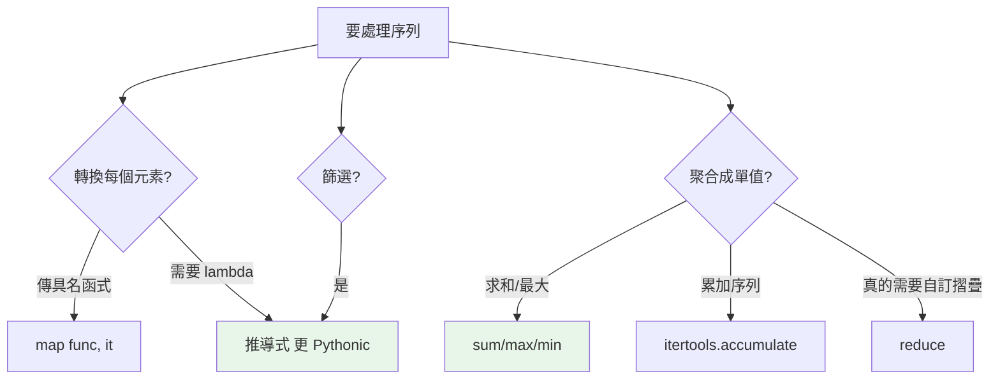

# 高階函式 map / filter / reduce

> 高階函式是「接收或回傳函式」的函式。`map`、`filter`、`reduce` 是函數式三劍客，但在 Python，多數情況推導式比 map/filter 更 Pythonic——知道何時用哪個才是重點。

## 💡 白話導讀（建議先讀）

函式既然是可以遞來遞去的卡片（上一章），自然出現一種函式：**專門收卡片、或發卡片的函式**——這叫**高階函式**。

三個經典的「收卡片」函式，各自對應一種日常操作：

- **`map`（逐個加工）**：「這疊資料，**每一個**都照這張卡處理」——`map(str.upper, words)`。
- **`filter`（篩選）**：「照這張卡檢查，**留下合格的**」——`filter(is_valid, items)`。
- **`reduce`（摺疊）**：「拿這張卡把整疊資料**滾成一個結果**」——累加、累乘。

先給 Python 的立場,免得你學完就誤用：

1. **多數場合,推導式比 map/filter 更 Pythonic**：
   `[x*2 for x in nums]` 比 `list(map(lambda x: x*2, nums))` 好讀——Python 官方也這麼認為（reduce 甚至被「降級」到 functools,不再是內建）。
2. **map/filter 的甜蜜點**：手上**已經有現成函式**時——`map(str.strip, lines)` 乾淨俐落,不用寫 lambda。
3. 別忘了它們回傳的是[點餐券](../07-iterators-generators/07-lazy-evaluation.md)（惰性 iterator）——要看內容得 `list()`,且只能走一輪。

所以這章的重點不是「背三劍客」,而是掌握**「把行為當參數傳」**這個思考方式——它在 `sorted(key=...)`、回呼、事件處理裡無所不在。

## Why（為什麼）

`map`、`filter`、`reduce` 是函數式程式設計的經典工具，處理序列的「轉換、篩選、聚合」。Python 支援它們，但也提供了推導式（見 [推導式](../02-fundamentals/13-comprehensions.md)）作為更 Pythonic 的替代。搞混「什麼時候該用 map/filter、什麼時候該用推導式」會讓程式不夠地道。這章講清楚三者的用法、它們的惰性特性，以及與推導式的取捨。

## Theory（理論：高階函式）

**高階函式（higher-order function）**：「接收函式當參數，或回傳函式」的函式——收卡片或發卡片的函式（建立在[一等公民](01-first-class-functions.md)之上）。三個經典：

- **`map(func, iterable)`**：對每個元素套用 `func`——逐個加工。
- **`filter(func, iterable)`**：保留 `func(x)` 為真的元素——篩選。
- **`reduce(func, iterable)`**：把序列「摺疊」成單一值（累加、累乘⋯⋯）。

兩個 Python 特有的事實：

- `map`/`filter` 是內建且**惰性**（回傳 iterator，見[惰性求值](../07-iterators-generators/07-lazy-evaluation.md)——點餐券）。
- `reduce` 住在 `functools`，**不是內建**——Python 3 刻意「降級」它（多數情況推導式或迴圈更可讀）。

## Specification（規範：三者語法）

```python
from functools import reduce

# map：轉換
map(str.upper, ["a", "b"])           # 'A' 'B'（惰性）
list(map(lambda x: x * 2, [1, 2, 3]))  # [2, 4, 6]
list(map(pow, [2, 3], [3, 2]))        # [8, 9]（多序列：pow(2,3), pow(3,2)）

# filter：篩選
list(filter(lambda x: x > 0, [-1, 2, -3, 4]))   # [2, 4]
list(filter(None, [0, 1, "", "x"]))             # [1, 'x']（過濾 falsy）

# reduce：聚合
reduce(lambda a, b: a + b, [1, 2, 3, 4])        # 10
reduce(lambda a, b: a + b, [1, 2, 3], 100)      # 106（有初始值）
```

## Implementation（map/filter vs 推導式、reduce 的定位）

### map / filter：惰性、可多序列

```pycon
>>> nums = [1, 2, 3, 4]
>>> m = map(lambda x: x * 10, nums)
>>> m                              # 惰性 iterator，還沒算
<map object at 0x...>
>>> list(m)                        # 這時才算
[10, 20, 30, 40]
>>> list(map(max, [1, 5], [3, 2]))  # 多序列：max(1,3), max(5,2)
[3, 5]
```

`map` 惰性（要 `list()` 才看內容）、可接多個序列（平行取用）。`filter(None, it)` 是「過濾掉 falsy」的慣用法。

### map/filter vs 推導式：Python 偏好推導式

多數情況，**推導式比 map/filter + lambda 更 Pythonic**（更好讀）：

```python
# map + lambda
list(map(lambda x: x * 2, nums))
# ✅ 推導式（更清楚）
[x * 2 for x in nums]

# filter + lambda
list(filter(lambda x: x % 2 == 0, nums))
# ✅ 推導式
[x for x in nums if x % 2 == 0]

# map + filter 組合（難讀）
list(map(lambda x: x * 2, filter(lambda x: x % 2 == 0, nums)))
# ✅ 推導式（一目了然）
[x * 2 for x in nums if x % 2 == 0]
```

**準則**：需要 lambda 時，推導式通常更清楚。但 **`map` 傳「現成的具名函式」時很簡潔**（不需 lambda）：`map(str.upper, words)`、`map(int, str_list)`——這時 map 反而比 `[str.upper(w) for w in words]` 稍短。

### reduce：能不用就不用

`reduce` 把序列摺疊成單值，但 Guido 刻意把它從內建移到 `functools`，因為**它常常難讀，且多數用途有更清楚的替代**：

```python
from functools import reduce

# reduce 求和（難讀）
reduce(lambda a, b: a + b, nums)
# ✅ 用內建 sum
sum(nums)

# reduce 求最大（難讀）
reduce(lambda a, b: a if a > b else b, nums)
# ✅ 用內建 max
max(nums)
```

**準則**：求和用 `sum`、最大最小用 `max`/`min`、累加序列用 `itertools.accumulate`（見 [itertools](../07-iterators-generators/06-itertools.md)）。`reduce` 只在「真的需要自訂的摺疊、且沒有現成替代」時用（如把一串 dict 合併、複雜的狀態累積）。

### 惰性帶來的注意

`map`/`filter` 是惰性 iterator，**一次性、要 `list()` 才看內容**（見 [惰性求值](../07-iterators-generators/07-lazy-evaluation.md)）。餵給 `sum`/`any`/`for` 時不必 list，直接用最省。

## Code Example（可執行的 Python 範例）

```python
# higher_order_demo.py
from __future__ import annotations

from functools import reduce


def compose(*funcs):
    """回傳「依序套用多個函式」的新函式（高階函式回傳函式）。"""

    def composed(x):
        for f in reversed(funcs):
            x = f(x)
        return x

    return composed


def demo() -> None:
    nums = [1, 2, 3, 4, 5]

    # 1. map 傳具名函式（簡潔）
    print(f"轉字串: {list(map(str, nums))}")

    # 2. map/filter vs 推導式（結果相同）
    print(f"map+filter: {list(map(lambda x: x * 2, filter(lambda x: x % 2, nums)))}")
    print(f"推導式:    {[x * 2 for x in nums if x % 2]}")

    # 3. reduce vs 內建
    print(f"reduce 求和: {reduce(lambda a, b: a + b, nums)}")
    print(f"sum 求和:    {sum(nums)}")

    # 4. reduce 的合理用途：合併 dict
    dicts = [{"a": 1}, {"b": 2}, {"c": 3}]
    merged = reduce(lambda acc, d: {**acc, **d}, dicts, {})
    print(f"合併 dict: {merged}")

    # 5. 高階函式回傳函式：函式組合
    add_one = lambda x: x + 1
    double = lambda x: x * 2
    pipeline = compose(add_one, double)   # 先 double 再 add_one
    print(f"compose(3): {pipeline(3)}")   # double(3)=6, +1=7


if __name__ == "__main__":
    demo()
```

**預期輸出**：

```pycon
$ python higher_order_demo.py
轉字串: ['1', '2', '3', '4', '5']
map+filter: [2, 6, 10]
推導式:    [2, 6, 10]
reduce 求和: 15
sum 求和:    15
合併 dict: {'a': 1, 'b': 2, 'c': 3}
compose(3): 7
```

## Diagram（圖解：三劍客的選擇）



## Best Practice（最佳實踐）

- **需要 lambda 時優先用推導式**：`[f(x) for x in it if cond]` 比 `map`/`filter` + lambda 清楚。
- **`map` 傳現成具名函式時可用**：`map(int, strings)`、`map(str.upper, words)` 簡潔。
- **聚合優先用內建**：`sum`/`max`/`min`；累加序列用 `itertools.accumulate`。
- **`reduce` 能不用就不用**：只在自訂摺疊且無現成替代時（合併、複雜累積）。
- **善用惰性**：`map`/`filter` 惰性，餵給 `sum`/`any`/`for` 不必先 list。
- **高階函式回傳函式做組合/工廠**：函式組合、`compose`、閉包工廠（連結 [閉包](../02-fundamentals/12-closures.md)）。

## Common Mistakes（常見誤解）

- **用 map/filter + lambda 取代明明更清楚的推導式**：非 Pythonic。
- **忘了 map/filter 是惰性 iterator**：直接 print 看到 `<map object>`；要 `list()`。
- **重複遍歷 map/filter 結果**：一次性，第二次是空的。
- **用 reduce 做 sum/max**：有內建更清楚；reduce 難讀。
- **`reduce` 沒給初始值處理空序列**：空序列無初始值會 `TypeError`；給初始值 `reduce(f, it, initial)`。
- **`filter(None, it)` 的語意誤解**：它過濾掉 **falsy** 值，不是「不過濾」。
- **忘了 `functools.reduce` 要 import**：Python 3 它不是內建。

## Interview Notes（面試重點）

- 定義**高階函式**（接收/回傳函式），舉出 `map`/`filter`/`reduce`/`sorted(key=)`。
- 知道 **`map`/`filter` 惰性、一次性、可多序列**，`reduce` 在 `functools`（Python 3 刻意降級）。
- **能說出「Python 偏好推導式勝過 map/filter + lambda」**，以及 map 傳具名函式時的例外。
- 知道**聚合優先用 `sum`/`max`/`min`/`accumulate`，`reduce` 能不用就不用**。
- 知道 `filter(None, it)` 過濾 falsy、reduce 空序列需初始值。
- 能用高階函式回傳函式做組合/工廠（連結閉包與裝飾器）。

---

➡️ 下一章：[裝飾器 decorator 基礎](03-decorator-basics.md)

[⬆️ 回 Part 8 索引](README.md)
