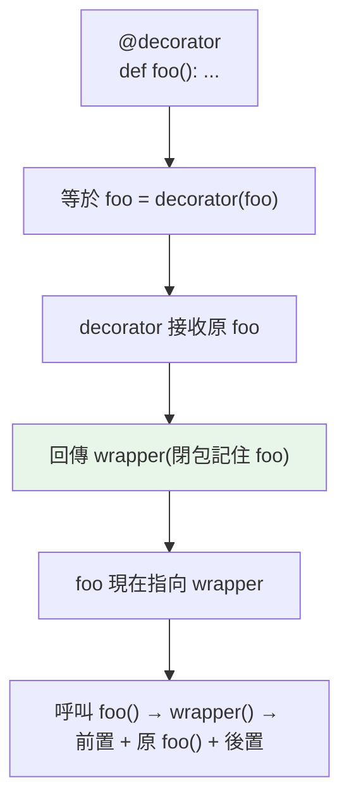

# 裝飾器 decorator 基礎

> 裝飾器是「接收一個函式、回傳一個包裝後的函式」——`@decorator` 只是語法糖。搞懂這個核心，你就能為函式加上日誌、計時、快取、驗證等橫切功能，而不改動函式本身。

## 💡 白話導讀（建議先讀）

裝飾器終於登場。先把「魔法感」拆掉——它只是前面兩塊積木的組合：

> **裝飾器＝一個「收一張函式卡片、回一張加工過的卡片」的函式。**

想像**手機貼膜**：手機（原函式）功能不變,包一層膜（包裝函式）之後——多了防刮功能,但用起來還是那支手機。

```python
def log_calls(func):                  # 收進原函式
    def wrapper(*args, **kwargs):     # 做一個「包了膜」的新函式
        print(f"呼叫 {func.__name__}")   # 膜的功能:先記個 log
        return func(*args, **kwargs)  # 再照常執行原函式
    return wrapper                    # 交出包好膜的版本
```

（眼熟嗎？`wrapper` 記得 `func`——這正是[閉包的外送員](../02-fundamentals/12-closures.md)。）

而 `@` 符號**只是語法糖**,背後就一行等式：

```python
@log_calls
def greet(): ...
# 完全等於:
greet = log_calls(greet)      # 把 greet 換成包過膜的版本
```

**看懂這行等式,裝飾器就沒有祕密了。**

它解決什麼？日誌、計時、快取、權限檢查這些「**很多函式都要、但又不屬於任何函式本體**」的橫切需求——寫一次膜,誰需要就給誰貼,函式本體一行不改。

## 🔗 前端對照

`@decorator` 這個 `@` 語法,前端（尤其 Angular / NestJS）也很常見——概念都是「**包一層、加功能,不改原本的碼**」。
但成熟度與適用範圍差很多:

| | Python decorator | JS / TS decorator |
|---|------------------|-------------------|
| 語言地位 | 穩定的核心語法（很久了） | TC39 stage 3,較新;早期是實驗性 |
| 套用對象 | 函式**和**類別都行 | 主要在 class 與其成員（方法 / 屬性） |
| 本質 | 一個「吃函式、回函式」的普通 callable | 由引擎依規格呼叫的特殊函式 |

一句話:**心智模型一樣**（高階函式包一層）,但 Python 的 decorator 更簡單通用——任何可呼叫物件都能當 decorator,
函式和類別都能裝;之後看 NestJS 的 `@Injectable()` 你會非常好懂。

## Why（為什麼）

你常想為多個函式加上同樣的「附加行為」：記錄呼叫、計時、檢查權限、快取結果、重試。把這些邏輯抄進每個函式又重複又難維護。**裝飾器**讓你把「附加行為」抽成一個包裝器，用 `@decorator` 一行套用——原函式不動、行為卻被增強。這是 Python 最優雅、最常見的元編程模式，Web 框架（`@app.route`）、快取（`@lru_cache`）、測試（`@pytest.fixture`）到處都是。理解它是進階 Python 的門檻。

## Theory（理論：接收函式、回傳函式）

裝飾器的本質：**一個接收函式、回傳（通常是包裝過的）函式的高階函式**——「收卡片、回加工卡片」（建立在[一等公民](01-first-class-functions.md)與[閉包](../02-fundamentals/12-closures.md)之上）。

```python
def decorator(func):          # 接收原函式
    def wrapper(*args, **kwargs):   # 包裝器（閉包，記住 func）
        # 前置行為
        result = func(*args, **kwargs)   # 呼叫原函式
        # 後置行為
        return result
    return wrapper            # 回傳包裝器，取代原函式
```

`@decorator` 語法只是**語法糖**：

> `@decorator` 放在 `def foo` 上面，**完全等於** `foo = decorator(foo)`。

理解這個等式，裝飾器就不神祕了——它就是「把函式換成包過膜的版本」的普通賦值。

## Specification（規範：語法與等價寫法）

```python
# @ 語法
@decorator
def greet():
    return "hi"

# 完全等價於：
def greet():
    return "hi"
greet = decorator(greet)     # 把 greet 換成 decorator(greet) 的回傳值

# 包裝器要用 *args, **kwargs 轉發，才能包裝任意簽章的函式
def decorator(func):
    def wrapper(*args, **kwargs):
        return func(*args, **kwargs)
    return wrapper
```

## Implementation（等價展開、*args轉發、常見用途）

### `@` = 重新賦值

```python
def loud(func):
    def wrapper():
        return func().upper()    # 把結果變大寫
    return wrapper

@loud
def greet():
    return "hello"

# 上面等於：greet = loud(greet)
# 現在 greet 指向 wrapper，呼叫它會執行 loud 加的行為
print(greet())        # HELLO
```

`@loud` 之後，`greet` 這個名稱已經指向 `wrapper`（不是原本的函式）。呼叫 `greet()` 實際跑的是 `wrapper()`，它呼叫原函式再加工。

### `*args, **kwargs`：包裝任意簽章

要讓裝飾器能套用在**任何函式**（不管幾個參數），包裝器必須用 `*args, **kwargs` 接收並轉發（見 [參數](../02-fundamentals/09-parameters-args-kwargs.md)）：

```python
def logged(func):
    def wrapper(*args, **kwargs):        # 接收任意參數
        print(f"呼叫 {func.__name__}({args}, {kwargs})")
        result = func(*args, **kwargs)   # 原樣轉發
        print(f"回傳 {result}")
        return result
    return wrapper

@logged
def add(a, b): return a + b

@logged
def greet(name, greeting="Hi"): return f"{greeting} {name}"

add(2, 3)                    # 兩個都能包裝
greet("Alice", greeting="Hello")
```

沒有 `*args, **kwargs`，裝飾器就只能包裝「特定簽章」的函式，失去通用性。

### 常見用途：計時、快取、驗證

```python
import time
from functools import wraps

def timed(func):
    @wraps(func)                          # 保留原函式資訊（見 wraps 章）
    def wrapper(*args, **kwargs):
        start = time.perf_counter()
        result = func(*args, **kwargs)
        print(f"{func.__name__} 耗時 {time.perf_counter()-start:.4f}s")
        return result
    return wrapper

@timed
def slow_task():
    time.sleep(0.1)
    return "done"
```

同樣的模式可做：快取（記住結果）、驗證（檢查前置條件）、重試（失敗重跑）、權限（檢查登入）——全部「不改動原函式」。

### 一個隱藏問題：包裝器遺失原函式資訊

```pycon
>>> @loud
... def greet(): 
...     """打招呼。"""
...     return "hi"
>>> greet.__name__
'wrapper'              # ❌ 變成 wrapper 了！原本應是 greet
>>> greet.__doc__
None                   # ❌ docstring 也不見了
```

因為 `greet` 現在指向 `wrapper`，原函式的 `__name__`、`__doc__` 都遺失了——這會害除錯、文件、內省。解法是 **`functools.wraps`**（見 [functools 與 wraps](05-functools.md)），下下章詳述。**寫裝飾器一定要加 `@wraps(func)`。**

## Code Example（可執行的 Python 範例）

```python
# decorator_basics_demo.py
from __future__ import annotations

from collections.abc import Callable
from functools import wraps
from typing import Any


def logged(func: Callable[..., Any]) -> Callable[..., Any]:
    """記錄呼叫與回傳（用 *args/**kwargs 轉發任意簽章）。"""

    @wraps(func)
    def wrapper(*args: Any, **kwargs: Any) -> Any:
        arg_str = ", ".join([*map(repr, args), *(f"{k}={v!r}" for k, v in kwargs.items())])
        print(f"→ {func.__name__}({arg_str})")
        result = func(*args, **kwargs)
        print(f"← {result!r}")
        return result

    return wrapper


def count_calls(func: Callable[..., Any]) -> Callable[..., Any]:
    """統計呼叫次數（用函式屬性存狀態）。"""

    @wraps(func)
    def wrapper(*args: Any, **kwargs: Any) -> Any:
        wrapper.calls += 1  # type: ignore[attr-defined]
        return func(*args, **kwargs)

    wrapper.calls = 0  # type: ignore[attr-defined]
    return wrapper


@logged
def add(a: int, b: int) -> int:
    return a + b


@count_calls
def ping() -> str:
    return "pong"


def demo() -> None:
    # 1. logged 裝飾器
    add(2, 3)
    add(10, b=20)

    # 2. count_calls
    ping()
    ping()
    ping()
    print(f"ping 被呼叫 {ping.calls} 次")  # type: ignore[attr-defined]

    # 3. @wraps 保留了原函式名稱
    print(f"add.__name__ = {add.__name__}")   # add（不是 wrapper）


if __name__ == "__main__":
    demo()
```

**預期輸出**：

```pycon
$ python decorator_basics_demo.py
→ add(2, 3)
← 5
→ add(10, b=20)
← 30
ping 被呼叫 3 次
add.__name__ = add
```

## Diagram（圖解：裝飾器展開）



## Best Practice（最佳實踐）

- **裝飾器 = 接收函式、回傳包裝函式**：把橫切關注（日誌、計時、快取、重試、權限）抽成裝飾器，原函式保持乾淨。
- **包裝器一律用 `*args, **kwargs` 轉發**，才能通用地包裝任意簽章。
- **一定加 `@functools.wraps(func)`**：保留原函式的 `__name__`/`__doc__`/簽章（見 [wraps](05-functools.md)）。
- **裝飾器本身要輕**：包裝的邏輯別太重，避免拖慢每次呼叫。
- **保留型別用 `ParamSpec`**（見 [進階泛型](../05-typing/10-advanced-generics.md)），讓被裝飾函式的參數型別不丟失。
- **記住 `@` 是語法糖**：不確定行為時，展開成 `foo = deco(foo)` 來理解。

## Common Mistakes（常見誤解）

- **包裝器沒用 `*args, **kwargs`**：只能包裝特定簽章，套到別的函式就參數錯誤。
- **忘了 `@wraps`**：被裝飾函式的 `__name__` 變成 `wrapper`、docstring 消失，害除錯與文件。
- **包裝器忘了 `return func(...)`**：原函式的回傳值遺失（變成 None）。
- **以為裝飾器會「修改」原函式**：它是**取代**——把名稱綁到 wrapper。
- **裝飾器裡忘了回傳 wrapper**：`return None` → 被裝飾的名稱變 None，呼叫時 `TypeError`。
- **在裝飾器做昂貴的一次性設定卻放進 wrapper**：每次呼叫都重做；一次性設定放 wrapper 外。

## Interview Notes（面試重點）

- **能說出裝飾器的本質**：接收函式、回傳包裝函式的高階函式，`@deco` 是 **`foo = deco(foo)`** 的語法糖，建立在閉包之上。
- 知道**包裝器要用 `*args, **kwargs` 轉發**才能通用。
- **知道要加 `@functools.wraps(func)`** 及原因（否則遺失 `__name__`/`__doc__`/簽章）。
- 能舉裝飾器用途：日誌、計時、快取（lru_cache）、重試、權限、路由註冊。
- 能手寫一個基本裝飾器（含 wraps、args 轉發、return 結果）。
- 加分：知道用 `ParamSpec` 保留被裝飾函式的型別簽章。

---

➡️ 下一章：[帶參數的裝飾器](04-decorator-with-args.md)

[⬆️ 回 Part 8 索引](README.md)
