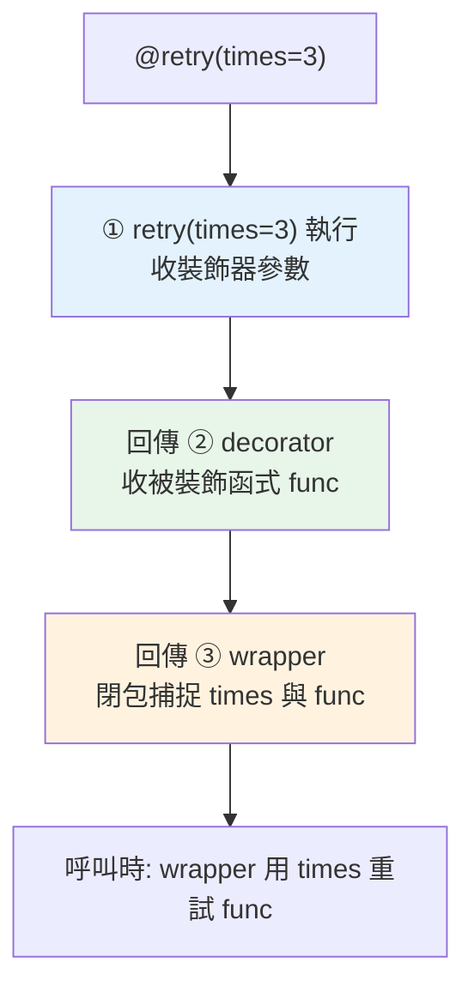

# 帶參數的裝飾器

> `@retry(times=3)` 這種「帶參數」的裝飾器，其實是「三層函式」——外層收裝飾器參數、中層收函式、內層是包裝器。理解這個結構，你就能寫出可設定的裝飾器。

## 💡 白話導讀（建議先讀）

`@retry(times=3)`——裝飾器居然能帶參數？看起來更魔法了，其實只是**多包一層**。

先看關鍵差異：`@log_calls` 沒括號、`@retry(times=3)` **有括號**。
有括號代表：**`retry(times=3)` 這個呼叫會先執行**——它跑完回傳的東西，才是真正拿去裝飾的裝飾器。

用「訂做貼膜」比喻：

- 上一章的 `@log_calls` 是**現成的膜**——直接拿來貼。
- `@retry(times=3)` 是**先向工廠下單**：「給我一張『重試三次』規格的膜」——工廠（`retry`）收到規格（`times=3`），**生產出一張客製膜**（真正的裝飾器），你再拿它來貼。

所以結構是三層，每層各有职责：

```python
def retry(times):                      # 第一層:工廠 —— 收「規格」
    def decorator(func):               # 第二層:膜 —— 收「函式」
        def wrapper(*args, **kwargs):  # 第三層:包裝邏輯（times 和 func 都看得到——閉包）
            for _ in range(times):
                ...
        return wrapper
    return decorator
```

拆成兩步就完全不神祕：

```python
decorator = retry(times=3)   # 步驟一:呼叫工廠,拿到客製膜
fetch = decorator(fetch)     # 步驟二:貼膜（就是上一章的事）
```

口訣：**有括號＝先叫工廠;三層＝規格、函式、邏輯。**

## Why（為什麼）

基本裝飾器 `@deco` 沒有參數。但很多實用裝飾器需要**設定**：`@retry(times=3)`（重試三次）、`@cache(ttl=60)`（快取 60 秒）、`@route("/users")`（路由路徑）、`@rate_limit(per_minute=100)`。這些「帶參數的裝飾器」比基本版多一層——常讓人搞混。這章拆解它的三層結構，讓你能寫出可設定、可重用的裝飾器。

## Theory（理論：多一層的工廠）

回顧：基本裝飾器是「接收函式、回傳包裝函式」。**帶參數的裝飾器**多一層——它是**回傳裝飾器的函式（裝飾器工廠）**。

關鍵在括號：`@retry(times=3)` 有**括號**——表示 `retry(times=3)` **先被呼叫**（向工廠下單），它回傳的東西才是拿來裝飾 `fetch` 的裝飾器（客製膜）。等於：

```python
decorator = retry(times=3)   # 第一步：呼叫工廠，得到裝飾器
fetch = decorator(fetch)     # 第二步：用裝飾器裝飾 fetch
```

所以帶參數的裝飾器是**三層函式**：

> 外層（收裝飾器參數/規格）→ 中層（收被裝飾函式）→ 內層（包裝器，靠閉包同時看得到參數與函式）。

## Specification（規範：三層結構）

```python
def retry(times):                         # ① 外層：收「裝飾器參數」
    def decorator(func):                  # ② 中層：收「被裝飾函式」（真正的裝飾器）
        @wraps(func)
        def wrapper(*args, **kwargs):     # ③ 內層：包裝器
            for _ in range(times):        # 用到外層的參數 times
                try:
                    return func(*args, **kwargs)
                except Exception:
                    continue
            raise RuntimeError("重試耗盡")
        return wrapper
    return decorator                      # ① 回傳中層（裝飾器）

@retry(times=3)
def fetch(): ...
```

## Implementation（三層拆解、閉包捕捉參數、可選參數）

### 三層各司其職

```python
from functools import wraps

def repeat(n):                  # 外層：裝飾器參數 n
    def decorator(func):        # 中層：真正的裝飾器
        @wraps(func)
        def wrapper(*args, **kwargs):    # 內層：包裝器
            results = []
            for _ in range(n):           # 閉包捕捉外層的 n
                results.append(func(*args, **kwargs))
            return results
        return wrapper
    return decorator

@repeat(3)
def roll():
    return "🎲"

roll()      # ['🎲', '🎲', '🎲']（執行三次）
```

三層的資料流：外層的 `n` 被中層、內層透過**閉包**（見 [閉包](../02-fundamentals/12-closures.md)）記住；中層的 `func` 被內層記住。理解「每層捕捉上層的變數」就懂了。

### 帶括號 vs 不帶括號

這是最容易錯的地方：

```python
@repeat(3)          # ✅ 有括號：先呼叫 repeat(3) 得到裝飾器，再裝飾
def foo(): ...

@repeat             # ❌ 沒括號：把 repeat 本身當裝飾器 → func 變成了 3！
def foo(): ...      # 行為完全錯亂
```

**帶參數的裝飾器使用時一定要有括號**（即使不傳參數也要空括號 `@repeat()`，若它設計成帶參數的話）。

### 真實例子：計時器（可設定精度）與重試

```python
import time
from functools import wraps

def timed(precision=4):
    def decorator(func):
        @wraps(func)
        def wrapper(*args, **kwargs):
            start = time.perf_counter()
            result = func(*args, **kwargs)
            elapsed = time.perf_counter() - start
            print(f"{func.__name__} 耗時 {elapsed:.{precision}f}s")
            return result
        return wrapper
    return decorator

@timed(precision=2)
def task(): time.sleep(0.05)
```

### 支援「帶參數或不帶參數」兩用（進階）

有些裝飾器想同時支援 `@deco` 和 `@deco(option=x)`。這需要偵測「第一個參數是不是函式」：

```python
def smart(func=None, *, prefix="LOG"):
    def decorator(f):
        @wraps(f)
        def wrapper(*args, **kwargs):
            print(f"[{prefix}] {f.__name__}")
            return f(*args, **kwargs)
        return wrapper
    if func is None:            # @smart(prefix="X") → func is None
        return decorator
    return decorator(func)      # @smart（無括號）→ func 是被裝飾函式

@smart                          # 無括號
def a(): ...
@smart(prefix="API")            # 有括號帶參數
def b(): ...
```

這個模式較進階，日常多數裝飾器固定「帶參數」或「不帶」即可，不必兩用。

## Code Example（可執行的 Python 範例）

```python
# decorator_with_args_demo.py
from __future__ import annotations

from collections.abc import Callable
from functools import wraps
from typing import Any


def retry(times: int) -> Callable[[Callable[..., Any]], Callable[..., Any]]:
    """帶參數的裝飾器：失敗重試 times 次。"""

    def decorator(func: Callable[..., Any]) -> Callable[..., Any]:
        @wraps(func)
        def wrapper(*args: Any, **kwargs: Any) -> Any:
            last_error: Exception | None = None
            for attempt in range(1, times + 1):
                try:
                    return func(*args, **kwargs)
                except ValueError as e:
                    last_error = e
                    print(f"  第 {attempt} 次失敗: {e}")
            raise RuntimeError(f"重試 {times} 次仍失敗") from last_error

        return wrapper

    return decorator


def repeat(n: int) -> Callable[[Callable[..., Any]], Callable[..., list[Any]]]:
    """執行 n 次並收集結果。"""

    def decorator(func: Callable[..., Any]) -> Callable[..., list[Any]]:
        @wraps(func)
        def wrapper(*args: Any, **kwargs: Any) -> list[Any]:
            return [func(*args, **kwargs) for _ in range(n)]

        return wrapper

    return decorator


# 用可變狀態模擬「前兩次失敗、第三次成功」
_attempts = {"count": 0}


@retry(times=3)
def flaky() -> str:
    _attempts["count"] += 1
    if _attempts["count"] < 3:
        raise ValueError("暫時性錯誤")
    return "成功"


@repeat(3)
def dice() -> int:
    return 4  # 固定值方便測試


def demo() -> None:
    print(f"flaky 結果: {flaky()}")     # 前兩次失敗，第三次成功
    print(f"repeat 結果: {dice()}")      # [4, 4, 4]


if __name__ == "__main__":
    demo()
```

**預期輸出**：

```pycon
$ python decorator_with_args_demo.py
  第 1 次失敗: 暫時性錯誤
  第 2 次失敗: 暫時性錯誤
flaky 結果: 成功
repeat 結果: [4, 4, 4]
```

## Diagram（圖解：三層結構）



## Best Practice（最佳實踐）

- **記住三層結構**：外層收裝飾器參數 → 中層收函式 → 內層包裝；每層閉包捕捉上層變數。
- **中層（真正的裝飾器）也要 `@wraps(func)`**：保留原函式資訊（見 [wraps](05-functools.md)）。
- **使用時記得帶括號** `@retry(times=3)`（即使無參數的帶參數裝飾器也要 `@deco()`）。
- **內層包裝器用 `*args, **kwargs` 轉發**（同基本裝飾器）。
- **參數用關鍵字更清楚**：`@retry(times=3)` 比 `@retry(3)` 易讀。
- **需要「兩用」（帶/不帶參數）時用 `func=None` + keyword-only 模式**，但別過度設計。
- **型別註記較複雜**：裝飾器工廠回傳 `Callable[[Callable], Callable]`；精確保留簽章用 `ParamSpec`（見 [進階泛型](../05-typing/10-advanced-generics.md)）。

## Common Mistakes（常見誤解）

- **帶參數的裝飾器忘了括號**：`@retry`（無括號）會把 `retry` 當基本裝飾器，`func` 被當成 `times` 參數，行為錯亂。要 `@retry(times=3)`。
- **搞混三層**：分不清哪層收參數、哪層收函式；記住「有括號 = 先呼叫工廠」。
- **中層忘了回傳 wrapper、外層忘了回傳 decorator**：任一層漏 return 都會壞（回傳 None）。
- **忘了 `@wraps`**：同基本裝飾器，遺失原函式資訊。
- **內層沒轉發 `*args/**kwargs`**：無法通用。
- **在錯的層做設定**：裝飾器參數（外層）vs 函式呼叫參數（內層）搞混。

## Interview Notes（面試重點）

- **能拆解帶參數裝飾器的三層結構**：外層（裝飾器參數）→ 中層（真正的裝飾器，收函式）→ 內層（包裝器），並說明 `@deco(x)` 是「先呼叫 `deco(x)` 得到裝飾器」。
- 知道 **`@deco(args)` 有括號、`@deco` 無括號** 的關鍵差異與各自的展開。
- 知道**每層透過閉包捕捉上層變數**（連結閉包）。
- 知道**中層也要 `@wraps`**、內層要轉發 `*args/**kwargs`。
- 能舉實例：`@retry`、`@cache(ttl=)`、`@route("/path")`、`@rate_limit`。
- 加分：知道「帶/不帶參數兩用」的 `func=None` 模式與 `ParamSpec` 型別保留。

---

➡️ 下一章：[functools 與 wraps](05-functools.md)

[⬆️ 回 Part 8 索引](README.md)
