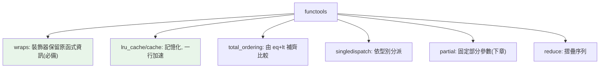

# functools 與 wraps

> `functools` 是函數式工具箱：`wraps`（寫裝飾器必備）、`lru_cache`/`cache`（一行加快取）、`reduce`、`partial`、`singledispatch`、`total_ordering`。這些工具能大幅減少樣板、加速程式。

## 💡 白話導讀（建議先讀）

`functools` 是「函式的五金行」——專賣**操作函式、增強函式**的工具。逛三個必買區：

**必買一：`wraps`——貼膜不蓋名牌。**
[第 3 章](03-decorator-basics.md)的貼膜有個副作用：包完之後，函式的名字變成 `wrapper`、docstring 不見了——**膜把名牌蓋住了**。
`@functools.wraps(func)` 貼在 wrapper 上，把原函式的名牌（`__name__`、`__doc__`、簽章）**轉印到膜上**。
守則：**寫裝飾器,一律加 wraps**——不加,除錯和文件工具全部被誤導。

**必買二：`lru_cache`——一行加快取。**

```python
@lru_cache(maxsize=None)
def fib(n): ...
```

它幫函式配一本**帳本**：同樣的輸入來過,直接翻帳本給答案,不重算。
費氏數列從指數時間變線性——**一行裝飾器的事**。
（前提:函式是「純」的——同輸入必同輸出;參數要可 hash。）

**必買三：`singledispatch`——依型別分流。**
「這個函式,遇到 int 這樣做、遇到 list 那樣做」——不用寫一串 isinstance,註冊分流即可。

其他貨架上還有:`reduce`（[上章](02-higher-order-functions.md)講過）、`partial`（[下章](06-partial.md)專講）、`total_ordering`（寫一個比較方法送你全套）、`cached_property`。這章逐一上手。

## Why（為什麼）

`functools` 模組是「處理函式的函式」集合。其中 `wraps` 是寫裝飾器的必備（沒它裝飾器會遺失原函式資訊）、`lru_cache` 能一行讓昂貴函式加上快取（面試常考）、`total_ordering` 省去手寫一堆比較方法、`singledispatch` 實現函式的「依型別分派」。會用這些，你的程式更短、更快、更專業。這章聚焦 `wraps` 與 `lru_cache` 等最實用的成員（`partial` 見 [下一章](06-partial.md)、`reduce` 見 [高階函式](02-higher-order-functions.md)）。

## Theory（理論：functools 的定位）

`functools` 提供「操作或增強函式」的工具——函式的五金行。貨架總覽：

- **`wraps`**：裝飾器必備——把原函式的中繼資料（`__name__`/`__doc__`/簽章）複製到包裝器（名牌轉印到膜上）。
- **`lru_cache` / `cache`**：記憶化（memoization）——快取函式結果，重複輸入直接回快取（幫函式配帳本）。
- **`reduce`**：摺疊序列（見[高階函式](02-higher-order-functions.md)）。
- **`partial`**：固定部分參數（見 [partial](06-partial.md)）。
- **`singledispatch`**：依第一參數的型別分派到不同實作。
- **`total_ordering`**：由 `__eq__` + 一個比較方法自動補齊其餘比較。
- **`cached_property`**：快取的計算屬性（見 [property](../04-oop/06-property.md)）。

## Specification（規範：常用成員）

```python
from functools import wraps, lru_cache, cache, reduce, singledispatch, total_ordering

# wraps：裝飾器保留原函式資訊
def deco(func):
    @wraps(func)
    def wrapper(*args, **kwargs):
        return func(*args, **kwargs)
    return wrapper

# lru_cache / cache：記憶化
@lru_cache(maxsize=128)
def fib(n): ...

@cache                 # = lru_cache(maxsize=None)，無上限（3.9+）
def expensive(x): ...

# total_ordering：補齊比較方法
@total_ordering
class Version:
    def __eq__(self, other): ...
    def __lt__(self, other): ...
    # __le__, __gt__, __ge__ 自動產生

# singledispatch：依型別分派
@singledispatch
def process(arg): ...
@process.register
def _(arg: int): ...
```

## Implementation（wraps、lru_cache、total_ordering、singledispatch）

### `wraps`：裝飾器的必備

如 [裝飾器基礎](03-decorator-basics.md) 所述，不加 `wraps` 的裝飾器會讓被裝飾函式「失去身分」：

```python
from functools import wraps

def without_wraps(func):
    def wrapper(*args, **kwargs):
        return func(*args, **kwargs)
    return wrapper

def with_wraps(func):
    @wraps(func)                       # 複製 func 的中繼資料到 wrapper
    def wrapper(*args, **kwargs):
        return func(*args, **kwargs)
    return wrapper

@without_wraps
def a():
    """A 的說明。"""

@with_wraps
def b():
    """B 的說明。"""

print(a.__name__, a.__doc__)     # wrapper None ← 遺失！
print(b.__name__, b.__doc__)     # b 'B 的說明。' ← 保留
```

`@wraps(func)` 把 `func` 的 `__name__`、`__doc__`、`__module__`、`__qualname__`、`__wrapped__` 等複製到 wrapper。**寫裝飾器永遠加它**，否則除錯、文件、內省、其他依賴 `__name__` 的工具都會壞。

### `lru_cache` / `cache`：記憶化一行搞定

`lru_cache` 快取函式的回傳值——**相同引數不重算，直接回快取**。對遞迴、昂貴計算效果驚人：

```python
from functools import lru_cache

@lru_cache(maxsize=None)
def fib(n: int) -> int:
    if n < 2:
        return n
    return fib(n - 1) + fib(n - 2)

fib(100)        # 瞬間完成！沒快取的話是指數級呼叫、算不動
```

沒快取的費氏遞迴是 O(2ⁿ)（重複計算爆炸）；加了 `@lru_cache` 每個 `n` 只算一次，變 O(n)。**這是「一行大幅加速」的經典案例**。

- `maxsize=128`（預設）：最多快取 128 筆，超過用 LRU（最近最少使用）淘汰。
- `maxsize=None` 或 `@cache`（3.9+）：無上限。
- **限制**：被快取函式的**引數必須 hashable**（見 [hashable](../03-data-structures/07-hashable.md)）——因為要當快取 key；list/dict 引數不行。
- **陷阱**：快取「純函式」才安全——有副作用或依賴外部可變狀態的函式加快取會出錯（回傳過時結果）。
- `fib.cache_info()` 看命中率、`fib.cache_clear()` 清快取。

### `total_ordering`：省去手寫比較

想讓自訂類別支援 `< <= > >= == !=`，手寫六個方法很煩。`@total_ordering` 讓你只寫 `__eq__` + 一個（如 `__lt__`），其餘自動補齊：

```python
from functools import total_ordering

@total_ordering
class Temperature:
    def __init__(self, celsius: float) -> None:
        self.celsius = celsius
    def __eq__(self, other: object) -> bool:
        if not isinstance(other, Temperature):
            return NotImplemented
        return self.celsius == other.celsius
    def __lt__(self, other: "Temperature") -> bool:
        return self.celsius < other.celsius
    # __le__, __gt__, __ge__ 由 total_ordering 自動產生

Temperature(20) < Temperature(30)     # True
Temperature(20) >= Temperature(10)    # True（自動來的）
sorted([Temperature(30), Temperature(10)])   # 可排序
```

（注意：`@dataclass(order=True)` 也能自動產生比較，見 [dataclass](../04-oop/09-dataclass.md)；`total_ordering` 用於非 dataclass 或需自訂比較邏輯時。）

### `singledispatch`：依型別分派

`@singledispatch` 讓一個函式**依第一個引數的型別**選擇不同實作——類似「函式版的方法多載」：

```python
from functools import singledispatch

@singledispatch
def describe(arg: object) -> str:
    return f"未知型別: {arg}"

@describe.register
def _(arg: int) -> str:
    return f"整數 {arg}"

@describe.register
def _(arg: list) -> str:
    return f"清單，{len(arg)} 個元素"

describe(42)          # '整數 42'
describe([1, 2, 3])   # '清單，3 個元素'
describe("hi")        # '未知型別: hi'（fallback）
```

比一長串 `if isinstance(...)` 清楚，且可分散註冊（不同模組各自 register）。

## Code Example（可執行的 Python 範例）

```python
# functools_demo.py
from __future__ import annotations

from functools import lru_cache, singledispatch, total_ordering, wraps
from typing import Any


def logged(func: Any) -> Any:
    @wraps(func)  # 保留原函式資訊
    def wrapper(*args: Any, **kwargs: Any) -> Any:
        return func(*args, **kwargs)

    return wrapper


@lru_cache(maxsize=None)
def fib(n: int) -> int:
    if n < 2:
        return n
    return fib(n - 1) + fib(n - 2)


@total_ordering
class Version:
    def __init__(self, major: int, minor: int) -> None:
        self.major = major
        self.minor = minor

    def __eq__(self, other: object) -> bool:
        if not isinstance(other, Version):
            return NotImplemented
        return (self.major, self.minor) == (other.major, other.minor)

    def __lt__(self, other: Version) -> bool:
        return (self.major, self.minor) < (other.major, other.minor)

    def __repr__(self) -> str:
        return f"v{self.major}.{self.minor}"


@singledispatch
def to_json(arg: object) -> str:
    return f'"{arg}"'


@to_json.register
def _(arg: int) -> str:
    return str(arg)


@to_json.register
def _(arg: bool) -> str:  # bool 要放在 int 前面被檢查（註冊順序無關，型別優先）
    return "true" if arg else "false"


@logged
def greet(name: str) -> str:
    """打招呼。"""
    return f"Hi {name}"


def demo() -> None:
    # 1. lru_cache 讓費氏瞬間完成
    print(f"fib(50) = {fib(50)}")
    print(f"快取資訊: {fib.cache_info()}")

    # 2. total_ordering：只寫 eq + lt，其餘自動
    versions = [Version(2, 0), Version(1, 5), Version(1, 10)]
    print(f"排序: {sorted(versions)}")
    print(f"1.5 >= 1.10? {Version(1, 5) >= Version(1, 10)}")  # False（10 > 5）

    # 3. singledispatch
    print(f"to_json(42) = {to_json(42)}")
    print(f"to_json(True) = {to_json(True)}")
    print(f"to_json('hi') = {to_json('hi')}")

    # 4. wraps 保留名稱
    print(f"greet.__name__ = {greet.__name__}, doc = {greet.__doc__}")


if __name__ == "__main__":
    demo()
```

**預期輸出**：

```pycon
$ python functools_demo.py
fib(50) = 12586269025
快取資訊: CacheInfo(hits=48, misses=51, maxsize=None, currsize=51)
排序: [v1.5, v1.10, v2.0]
1.5 >= 1.10? False
to_json(42) = 42
to_json(True) = true
to_json('hi') = "hi"
greet.__name__ = greet, doc = 打招呼。
```

## Diagram（圖解：functools 工具箱）



## Best Practice（最佳實踐）

- **寫裝飾器一律 `@wraps(func)`**：保留 `__name__`/`__doc__`/簽章，不可省。
- **昂貴的純函式加 `@lru_cache`/`@cache`**：一行大幅加速（遞迴、重複查詢）；記得引數要 hashable、函式要純（無副作用）。
- **設 `maxsize` 控制快取記憶體**：無界快取（`maxsize=None`）長期執行可能吃記憶體；有界用 LRU 淘汰。
- **自訂類別要全套比較用 `@total_ordering`**（非 dataclass 時）或 `@dataclass(order=True)`。
- **「依型別分派」用 `@singledispatch`** 取代一長串 `isinstance`。
- **監控快取用 `cache_info()`**、需要清除用 `cache_clear()`。

## Common Mistakes（常見誤解）

- **寫裝飾器忘了 `@wraps`**：遺失原函式資訊（最常見）。
- **對「不純」的函式加 `lru_cache`**：有副作用或依賴外部可變狀態 → 回傳過時/錯誤的快取結果。
- **`lru_cache` 的函式引數不可 hashable**：傳 list/dict 會 `TypeError`；引數要 hashable。
- **無界 `lru_cache` 造成記憶體洩漏**：長期執行 + 大量不同引數 → 快取無限成長；設 `maxsize`。
- **`total_ordering` 忘了定義 `__eq__`**：它需要 `__eq__` + 一個排序方法才能補齊。
- **`singledispatch` 依「第一個引數」分派**：只看第一參數型別；方法要用 `singledispatchmethod`。
- **快取了會變的資料**：快取假設「相同輸入→相同輸出」，資料會變就不該快取（或要能失效）。

## Interview Notes（面試重點）

- **`wraps` 必考**：知道它保留原函式的 `__name__`/`__doc__`/簽章，寫裝飾器不可省。
- **`lru_cache`/`cache` 高頻考**：能說出它是記憶化、讓費氏遞迴從 O(2ⁿ) 變 O(n)，以及**限制（引數需 hashable、函式需純、maxsize 控記憶體）**。
- 知道 **`total_ordering`**（由 eq + 一個比較補齊全套）、**`singledispatch`**（依第一參數型別分派）。
- 知道 `cache_info()`/`cache_clear()` 監控與清除快取。
- 能說出「快取只適合純函式」的原因。

---

➡️ 下一章：[partial 與偏函式](06-partial.md)

[⬆️ 回 Part 8 索引](README.md)
